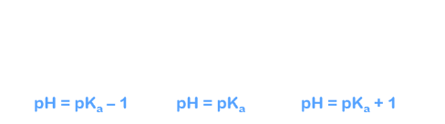
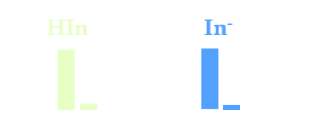
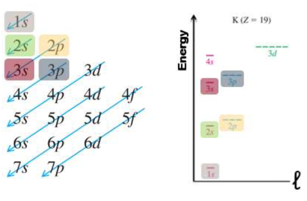

- Chemical Equations
  id:: 65739563-6438-4f0b-a60a-b5ef28dac2cf
	- Moles
	- Atomic Measurements
	- Percent Composition
	- Chemical Formulae
	- Chemical Equations
	- Stoichiometry
	- Chemical Solutions
	- Chemical Dilutions
	- Ionic Equations
	- Precipitation Reactions
	- Redox Reactions
	- Kinetic Molecular Theory
	- Root Mean Square Speed
- Gases
	- Measurement
	- Boyle's Law
	- Charles Law
	- Avagadros Law
	- Ideal Gas Law
	- Dalton's Law of Partial Pressures
	- Water Vapour Pressure
	- Partial Pressure
	- Molar Fractions
	- Non-Ideal Gases
- Energy
	- Internal Energy
	- Heat
	- Work
- Thermodynamics
	- First Law of Thermodynamics
	- Enthalpy
	- Energy Diagrams
	- Calorimetry
	- Hess' Law
- Equilbrium
	- Chemical Equilibrium
	- ICE Tables
	- Le Chatelier's Principle
- Acids and Bases
	- Arrhenius
	- Bronsted-Lowry
	- Lewis
	- Polyprotic Acids
- Salt Hydrolysis
	- Hydrolysis Rules
	- Buffer Solutions
- ## [[Acid Buffers]]
	- Buffer Solutions:
		- Acidic =  HA & A$^-$
			- High [HA] and [A$^-$]
			- [HA] $\approx$ [A$^-$]
			- if no HA:
				- {:height 430, :width 395}
				-
		- Basic = B & HB$^+$
			- high [B] and [HB$^+$]
			- [B] $\approx$ [HB$^+$]
			- if no B:
				- {:height 470, :width 400}
		- How to maintain the pH?
			- Neutralize external sources of acid or base
			  logseq.order-list-type:: number
			- Maintain a rougly constant ratio of [HA]/[A$^-$]
			  logseq.order-list-type:: number
		- **Ionization:**
			- {:height 107, :width 460}
		- **Hydrolysis:**
			- {:height 94, :width 462}
		- Water is always a reactant $\rightarrow$ Equilibria!
		- Buffers protect against externally added H$_3$O$^+$ or OH$^-$ via **neutralization** reactions
			- **Acidic Buffers:**
				- 
			- **Basic Buffer:**
				- 
			- Water is a product $\rightarrow$ Not Equilibria!
		- **Neutralizations** have the general formula:
			- acid + base $\rightarrow$ salt + water
		- the "driving force" is the formation of water
		- 
		- 
		- 
		- 
		- **Buffer capacity:**
			- A good buffer system contains relatively large mole amounts of a weak acid and its conjugate base (or vice-versa) so that it can buffer large amounts of external acid/base added to the buffer system
				- Ex. If H$_3$O$^+$ is added, it will react with the buffer base, if OH$^-$ is added, it will react with the buffer acid
			- 
		- **Buffer range:**
			- The buffer target pH range is determined by the **ratio** of the concentrations of the acid and conjugate base
				- 
			- 
			- 
			- 
			- There are two general criteria to ensure validity of the Henderson Hassleback Equation:
				- $$0.1 < \frac{[\text{A}^-]}{[\text{HA}]} < 10$$
					- Roughly equal ratio of acid and base
				- $$[A] > 100 \times K_a \text{ and } [HA] \times K_a$$
					- Large amounts of acid and base
	- 
	- 
	- 
	- 
	- 
	- 
	- 
	-
	-
	- 
	- 
	-
	- 
	-
- ## Acid Base Titrations
	- **Neutralizations** have the general formula:
		- acid + base $\rightarrow$ salt + water
	- the "driving force" is the formation of water
	- **A titration:**
		- A solution of known, precise concentration (the standard solution) is gradually added to a solution of unknown concentration
	- **The equivalence point:**
		- The point at which the reaction is completed; for an acid-base neutralization this occurs when moles of acid = moles of base
	- **The indicator:** signals the **endpoint** (immediately after the equivalence point), usually by changing colour
	- ? mol titrant added:
		- $$C_{\text{titrant}} \times V_{\text{titrant added}}$$
	- mol titrant added = mol sample
		- $$?C_{\text{sample}} = \frac{\text{mol sample}}{V_\text{sample}}$$
	- Example:
	  background-color:: blue
		- 
		  collapsed:: true
			-
			-
	- 
		- 
		- 
		- 
		- 
		- 
	- Colour of these substances depends on the pH:
		- 
		- > 90% acid form = appears to be the **acid colour**
		- > 90% base form = appears to be the **base colour**
		- Intermediate colour is seen in between these two states
		- Complete colour change occurs over $\approx$ 2 pH units
		- 
		-
	- {:height 376, :width 749}
- ## [[Solubility]]
	- So far, we have only dealt with **soluble** ionic compounds
	- **Slightly soluble** ionic compounds only dissolve *partially* in solution
	- An equilibrium is established between the **solids** and the **ions**:
		- 
		- At equilibrium, no more AgCl dissolves and the solution is **saturated**
	- **Solubility,** $s \rightarrow$ amount of solute that dissolves per litre of saturated solution
	- Example:
	  background-color:: blue
		- 
		- 
	- $K_{sp}$ is *related* to the solubility, but sometimes we can't compare the solubilities of two different compounds based solely on $K_{sp}
	- 
	- Examples:
	  background-color:: blue
		- 
		- 
		- 
	- **Precipitation Reaction** occurs when two aqueous salt solutions are mixed and a precipitate formed
		- $$AB(aq) + XY(aq) \rightarrow AY(s) + XB(aq)$$
		- not really an equilbrium
	- How can we predict when a precipitate forms?
		- By knowing the solubilities of inorganic compounds
	- Two categories
		- soluble
		- sparingly (or slightly) soluble
	- Q again has the same formula as $K_{sp}$, but the values used are the initial concentrations, not necessary those at equilibrium
		- If $Q < K_{sp}$, the solution is **unsaturated**
			- more solid can be dissolved until $Q = K_{sp}$
		- If $Q = K_{sp}$, the solution is **saturated**
			- the system is at equilibrium
		- If $Q > K_{sp}$, the solution is **supersaturated**
			- there will be precipitation of solid until $Q = K_{sp}$
	- 
	- 
	- 
	- pH can also affect the solubilities of some compounds
	- Consider the following:
		- 
	- Determine the acid/base nature of the sparingly soluble salt:
		- 
	- 
	- 
	- 
	-
- ## Chemical Kinetics
	- 
	- 
	- We can use $\Delta H$ and $K$ to determine $\Delta G$ that tells us if a reaction is a product or reactant favoured (direction of reaction)
	- 
	- But $\Delta G$ gives us **no information on how** reaction goes from reactants to products (mechanism of reaction)
	- 
	- 
	- **Kinetics:**
		- The study of **reaction rates** and **mechanisms**
		- The rate of reaction describes how the concentration of a reactant or product changes with time, in $m/s$
		- 
		- Rate $\infin$ collision frequency & energy
			- Physical state of reactants
			  logseq.order-list-type:: number
			- Temperature of reactants
			  logseq.order-list-type:: number
			- Concentrations off reactants
			  logseq.order-list-type:: number
		- 
	- 
	- 
	- 
	- 
	- 
	- For the general reaction:
		- aA + bB $\rightarrow$ cC + dD
		- 
		- $x$ and $y$ must be **determined experimentally**
			- result of the mechanics (how the reactants into products)
		- $x$ and $y$ can be positive, negative, or fractional values
		- 
			- the **reactant reaction order** is said to be
				- "x order with respect to A" and "y order with respect to B"
			- the **overall reaction order** is said to be
				- "x + y" order overall
	- the **value** of rate constant k, (not $K_{eq}$) depends on:
		- The reaction
		  logseq.order-list-type:: number
		- The temperature
		  logseq.order-list-type:: number
	- 
	- The **unit** of k depends on the overall order of the reaction
	- 
	- 
	- **Catalyst =** Molecule or species that is consumed in one step of the mechanism but reformed in another
		- Catalysts do not appear in the overall reation
	- **Role:** Speed up reactions by altering the mechanism to lower the $E_a$ barrier
		- 
		-
	- 
	- The catalyst does not affect the difference in energy between the reactants and products
		- No effect on $\Delta H$
	- The catalyst also increases the rate of the reverse reaction
		- No effect on $K_{eq}$ adding a catalyst only gets the reaction to the equilbrium point *faster*
	- 
	-
	- Effect of Activation E
		- 
	- Effect of Temperature
		- 
	- Arrhenius demonstrated that many rate constants vary with temperature and $E_a$ according to the **Arrehenius equation**
		- 
	- It is possible to determine the activation energy from two rate constant $k_1$ and $k_2$, measured at two temperatures, $T_1$ and $T_2$
		- 
	- Subtracting the first equation from the second gives the 2-point Arrhenius equation:
		- 
	- 
	- Method of Initial Rates 
	  logseq.order-list-type:: number
		- Good for slow reactions
		  logseq.order-list-type:: number
		- **Method of Initial Rates**
			- Multiple experiment trials are conducted varying only one reactant concentration
			- The initial rate of each trial is measured
			- The reaction order of each reactant is determined algebraically by comparing reactant concentration change to reaction rate change
		- 
		- 
		- 
		-
	- Graphical method
	  logseq.order-list-type:: number
		- Good for fast reactions
		  logseq.order-list-type:: number
		- The concentration of a single reactant is tracked experimentally across multiple time points
		- The reaction order of the only reactant (and k) is determined by the shape of the graph with the assistance of equation modelling software where useful\
		- 
		- **Rate Law:**
			- Allows us to determine the **rate** of the reaction at any point in the reaction
		- **The Integrated Rate Law:**
			- Linear equation that links the concentration of a reactant at any point in time ([A]$_t$) to the initial concentration ([A]$_o$)k and the time elapsed (t)
		- 
		- 
		- 
		- 
		- 
		- 
		-
	- Isolation Experiments
	  logseq.order-list-type:: number
		- Good for intermediate or complex reactions
		  logseq.order-list-type:: number
- ## [[Quantum Theory]]
	- Quantum Numbers
		- Each orbital is a function of 3 quantum numbers : $n, L, m_L$ and $m_s$
			- $n \rightarrow$ principal quantum number
				- $1,2,3,4...$
				- Energy and size of the orbital
			- $L \rightarrow$ angular momentum quantum number
				- $0$ to $n-1$
				- Shape of the orbital, number of nodes
			- $m_L \rightarrow$ magnetic quantum number
				- $-L$ to $+L$
				- Number and orientation of the orbitals in the subshell
			- $m_s \rightarrow$ spin quantum number
				- $-\frac{1}{2}$ to $+\frac{1}{2}$
				- "spin" of an electron
		- When $n = 1$, then $L = 0$  and $m_L = 0$
			- Therefore in $n =1$ there is 1 type of subshell that and that subshell has a single orbital $m_L$ has a single value $\rightarrow$ 1 orbital
			- This subshell is labelled $s$
			- Each shell has 1 orbtial labelled $s$ and it is **spherical** in shape
			- 
		- When $n = 2$, then $L = 0$ and $1$
			-
			- Therefore in $n =2$ there are 2 types of orbitals $\rightarrow$ 2 subshells
			- For $L = 0$   $m_L = 0$
				- This is a $s$ subshell
			- For $L = 1$   $m_L = -1,0,+1$
				- This is a $p$ subshell with **3 orbitals**
			- 
	- Quantum Theory
		- **Frequency** $v$
			- Number of waves passing a given point per second
		- **Wavelength** $\lambda$
			- Distance between two successive crests of troughs
		- **Speed** $c = v \times \lambda$
		- Planck Equation
			- $\Delta E= hv  = \frac{hc}{\lambda}$
			- $h = 6.626 \times 10^{-34} J \cdot s$
			- Light with short $\lambda$ (long $v$) has a long $E$
			- Light with long $\lambda$ (small $v$) has a small $E$
		- Bohr Model
			- When an atom absorbs energy, an electron jumps from the ground state to an excited state (ex. $n = 1 \rightarrow n = 2$)
			- When the electron returns to the ground state, it emits the excess energy in the form of heat or light (ex. $n =2 \rightarrow n=1$)
			- $$\Delta E = hv = R_H (1/n^2_i - 1/n^2_f)$$
				- $R_H = 2.18 \times 10^{-18}$
			- If $n_f > n_i$ $\Delta E$ is positive $\rightarrow$ **Absorption**
			- If $n_f < n_i$ $\Delta E$ is negative $\rightarrow$ **Emission**
		- 
		- 
	- **Aufbau Principle**
		- Work from lowest energy orbitals to highest
		- Assign electrons starting at the lowest energy level and move upwards
		- 
	- **Pauli Exclusion Principle**
		- No two electrons may have all four quantum numbers alike (i.e. max 2 $e^-$ per orbital)
		- 
	- **Hund's Rule**
		- Fill degenerate orbitals one electron at a time, with parallel spins
		- 
		-
- 
- 
- 
- The orbital energy order becomes less reliable as atomic numbers increases sometimes, certain configurations are more stable than others
- Two notable exceptions to remember
	- 
	- 
	- 
	- All electrons are paired = diamagnetic
	- At least 1 **unpaired** electron is paramagnetic
	- **Magnetic studies** can be used to determine $e^-$ configurations
		- 
	- Ti$^{2+}$ interacts with a magnetic field, so it can't be diamagnetic