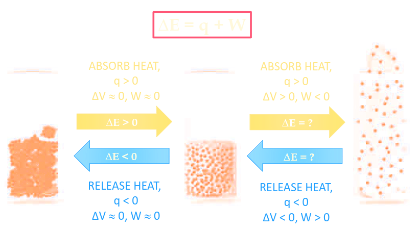
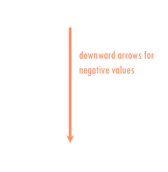
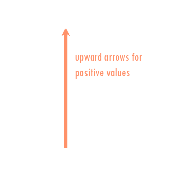
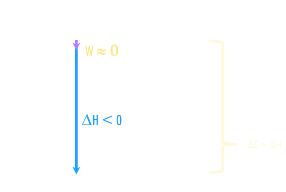
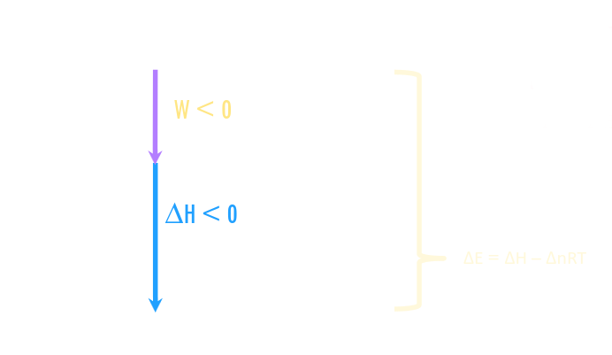
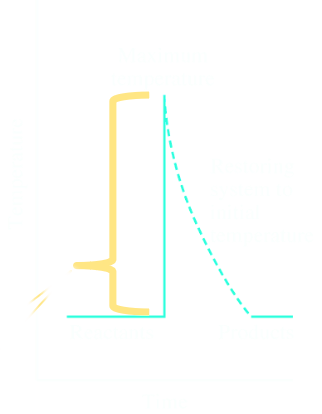
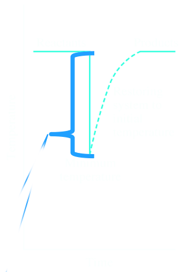
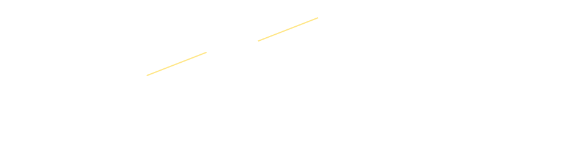
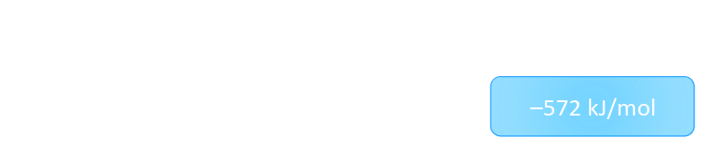
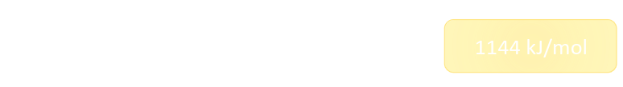

- Energy
	- $W_{sys} = -P_{ext}\Delta V = \text{zero }J$
- Thermodynamics
	- Laws of Thermodynamics
		- The ^^first law of thermodynamics^^ states a system contains only internal energy
		- Transfers of heat or work are only observed during a change in the system ($\Delta U$)
			- $\Delta E_{universe} = \Delta E_{sys} + \Delta E_{surr} = 0$
			- $\Delta E_{sys} = - \Delta E_{surr}$
			- $\Delta E = q + w$
		- "Energy is neither created nor destroyed, only transferred"
		- Reactions with **NO GASES**
		  logseq.order-list-type:: number
			- No gases $\rightarrow$ expansion or contraction is negligible
			  logseq.order-list-type:: number
				- $\Delta V \approx 0$
				  logseq.order-list-type:: number
				- $\therefore W = -P\Delta V \approx 0$
				  logseq.order-list-type:: number
				- $\Delta E \approx \Delta H$
				  logseq.order-list-type:: number
		- Reactions **WITH GASES**
		  logseq.order-list-type:: number
			- $\Delta E = q + w$
			- $\Delta E = \Delta H - P\Delta V$
			- $PV = nRT$
			- At a constant $P$ and $T$: $\Delta V \propto \Delta n_{gas}$
			- $P\Delta V = \Delta n_{gas} RT$
				- $\Delta n_{gas} = n_{products} - n_{reactants}$
			- Reactions where $\Delta n_{gas} = 0$
			  logseq.order-list-type:: number
				- ($n_{\text{reactant gases}} - n_{\text{product gases}}$)
				- $-P\Delta V = \Delta n_{gas} RT = 0$
				  logseq.order-list-type:: number
				- $\therefore \Delta E = \Delta H$
			- Reactions where $\Delta n_{gas} \ne 0$
			  logseq.order-list-type:: number
				- $-P\Delta V = -\Delta n_{gas} RT \ne 0$
				- $\Delta E = \Delta H-\Delta n_{gas} RT$
				  logseq.order-list-type:: number
		- 
	- Enthalpy
		- Most chemical reactions and processes are carried out under constant pressure conditions:
			- $\Delta U = q + W = q_p - P \Delta V$
		- Enthalpy ($H$) is the amount of heat transferred under **constant pressure**
			- $\Delta H = q_p$
		- Exothermic is when $q_{system} < 0$ and heat is being released
		- Endothermic is when $q_{system} > 0$ and heat is being absorbed
		- $\Delta H = q_p$ = Heat transferred under *constant pressure conditions*
		- We can't measure absolute values of enthalpy we can only measure when heat is being **gained** or **lost**
		- Measure the enthalpy change under **standard conditions**
	- Energy Diagrams
		- $\Delta E = E_2 - E_1$
		- $\Delta E$ is negative = system losing energy {:height 274, :width 234}
		- $\Delta E$ is positive = system gaining energy {:height 256, :width 216}
		- Reactions with **NO GASES**, constant $P$
		  logseq.order-list-type:: number
			- $A(aq) \rightarrow B(aq)$
				- {:height 279, :width 347}
			- $\Delta V \approx 0$
			- $\Delta E = \Delta H - P \Delta V$
		- Reactions with **gases**, where $\Delta n_{gas} = 0$
		  logseq.order-list-type:: number
			- $A(g) \rightarrow B(g)$
			- $\Delta V = 0$
			- $\Delta E = \Delta H - P \Delta V$
		- Reactions with **gases**, where $\Delta n_{gas} \ne 0$
		  logseq.order-list-type:: number
			- $A(g) \rightarrow 2B(g)$
				- {:height 316, :width 467}
			- $\Delta V > 0$
			- $\Delta E = \Delta H - P \Delta V$
	- Calorimetry
		- $q_{system} = -q_{surroundings}$
		- $q =$ quantity of heat transferred, in J
		- $q = mc\Delta T$ or $C\Delta T$
			- Object or substance is changing temperature
			- $m$ is mass of substance
			- $\Delta T$ is change in temperature in $\degree C$ or $K = T_2 - T_1$
			- **Specfic Heat Capacity** $C$
				- The quantity of heat necessary to increase the temperature of **one gram** of that substance by **one degree** (Kelvin or Celcius)
				- UNIT = $J g^{-1} \degree C^{-1}$ or $J g^{-1} K^{-1}$
			- **Heat Capacity** $C$
				- The quantity of heat neccessary to increase the temperature of that object by  by **one degree** (Kelvin or Celcius)
				- UNIT = $J \degree C^{-1}$ or $J K^{-1}$
		- $q = n \Delta H$
			- System undergoing a chemical or physical process
		- **Calorimeter**
			- Isolated system in which one measures $\Delta T$ during a chemical reaction/process
			- For many reactions, (i.e. endothermic or mildly exothermic reactions), **constant pressure conditions** suffice:
				- $q_{system} = - q_{surroundings}$
				- $q_{reaction} = -( q_{H_2O} + q_{calorimeter})$
				- $q_{reaction}\approx -(q{H_2O})$
				- $q_{cal}$ must be determined in advance using a standard reaction
			- $\Delta T_{surr} > 0$ Exothermic reactions
				- {:height 324, :width 220}
			- $\Delta T_{surr} < 0$ Endothermic reaction
				- {:height 344, :width 233}
		- Since the heat is being transferred under constant pressure conditions we use $q$ to determine $\Delta H$, the [molar] enthalpy of a process
		- Quantity of heat transferred during a process is usually expressed in $J/mol$ or $kJ/mol$ under constant $P$
		- Used for **strongly exothermic** reactions  (like combustions) the reaction is carried out inside a ^^bomb calorimeter^^
		- $q_{H_2O} = m_{H_2O}C_{H_2O}\Delta T$
		- $q_{bomb} = C_{bomb}\Delta T$
	- Hess' Law
		- **The net** $\Delta H$ is the sum of  $\Delta H$ values of the individual steps
		- {:height 128, :width 495}
		- This is an example of Hess' Law
		- ^^**SIGN:**^^ If a reaction is **reversed** $\Delta H$ is also **reversed**
		  logseq.order-list-type:: number
			- {:height 97, :width 437}
		- ^^**MAGNITUDE:**^^The **magnitude** of $\Delta H$ is proportional to the **amount** of substance
		  logseq.order-list-type:: number
			- {:height 66, :width 477}
- Chemical Equilibrium
	- Rate of reactions
		- So far considered chemical reactions as having only one direction
		- At a certain point, however, **all reactions are reversible** the products may react to give back the reactants
		- When the speed of forward and reverse are equal, and so the concentration of the reactants and products remain constant, equilbrium
			- rate of forward reaction = rate of reverse reaction
		- ^^**Physical Equilbrium:**^^ consists of a single substance
		- ^^**Chemical Equilbrium:**^^ involves two or more substances
		- For an equilibrium we write $A \rightleftarrows B$
			- As the reaction progresses
				- [A] decreases to a constant
				- [B] increases from zero to a constant
				- When [A] and [B] are constant, equilibrium is acheived
		- ^^**Dynamic Equilibrium:**^^ $A$ is still reacting to form $B$ while $B$ is still reacting to form $A$
			- At the equilibrium point. the reaction continues forwards and backwards
	- Equilibrium conditions
		- $RXTS \rightleftarrows PDTS$ $K = \frac{[PDTS]}{[RXTS]}$
			- **very small K**
				- very little product, mostly reactant
				- "LITTLE TO NO REACTION"
			- **very large K**
				- mostly product, very little reactant
				- "REACTION GOES TO COMPLETION"
			- **intermediate K**
				- significant amounts of reactant and product
			- $aA + bB \rightleftarrows cC + dD$
				- $$K = \frac{(a_D)^c(a_D)^d}{(a_A)^a(a_B)^b}$$
				- Where $a$ = activity
					- $a_x = 1$ for a solid or liquid
					- $a_x = P_x$ for a gas (in **bar**)
					- $a_x = [X]$ (in mol/L, or M) for a solute
				- K is the equilibrium constant in pressure units (sometimes $K_p$)
			- The equilibrium point can be approached various ways:
				- Begin with **only reactants** present
				  logseq.order-list-type:: number
				- Begin with **only products** present
				  logseq.order-list-type:: number
				- Begin with **reactants and products**
				  logseq.order-list-type:: number
	- Reaction quotient
		- The **reaction quotient**, $Q$ is the value obtained when reactant activities at a given point are used in the equilibrium constant expression
			- If $Q > K$, there is an excess of products so some must react to reform reactants and therefore the reaction proceeds to the **left**
			- If $Q<K$, there is an excess of reactants so some must react to form products and therefore the reaction proceeds to the **right**
			- If $Q = K$, the reaction is **at equilibrium** (no net change in quantities)
	- Le Chatelier's Principle
		- When a system at equilibrium is subjected to a change in temperature, pressure, or concentration of a reacting species, the system responds by attaining a new equilibrium that partially offsets the impact of the change
			- Qualitative Predicition of Effect of a Disturbance on the Equilibrium
			- Reactants $\rightleftarrows$ Products
				- If we increase the concentration of a **reactant**
					- Equilibrium is shifted towards the ^^products^^ $\rightarrow$
				- If we increase the concentration of a **product**
					- Equilibrium is shifted towards the ^^reactants^^ $\leftarrow$
			- $x$ mol of gas $\rightleftarrows$ $y$ mol of gas, where $x > y$
			- If the pressure is increased(e.g. by *decreasing* $V$):
				- Equilibrium shifts to the <<$y$>> side
			- If the pressure is decreased(e.g. by *increasing* $V$):
				- Equilibrium shifts to the <<$x$>> side
			- Changing concentration, $P$ or $V$ has no effect on value of $K$
			- However, **the value of K is temperature-dependant**
				- For an ^^endothermic^^ reaction, heat is a "**reactant**"
					- $A +$ heat $\leftrightarrows B$
					- If temperature is increased:
						- Equilibrium is shifted towards the ^^products^^ $\rightarrow$
					- If temperature is decreased:
						- Equilibrium is shifted towards the ^^reactants^^ $\leftarrow$
				- For an ^^exothermic^^ reaction, heat is a "**product**"
					- $A +\leftrightarrows B +$ heat
					- If temperature is increased:
						- Equilibrium is shifted towards the ^^reactants^^ $\leftarrow$
					- If temperature is decreased:
						- Equilibrium is shifted towards the ^^products^^ $\rightarrow$
				- In $K_{eq} = -\frac{\Delta H \degree}{R} \cdot \frac{1}{T} + \frac{\Delta S \degree}{R}$ where
					- $R = 8.3145 J/mol \cdot K$
					- $\Delta H \degree$ is enthalpy change
					- $\Delta S \degree$ is entropy change
- Acids and Bases
	- Bronsted-Lowry
		- **The Theory:**
			- Acid-Base reaction = transfer of proton (H+) from species to another
			- **Acids:** proton ^^donors^^
			- **Bases:** proton ^^acceptors^^
		- **Flaws in Theory:**
			- Not all acidic components lose H$^+$ or have H in structure
	- Lewis
		- **The Theory:**
			- Acid-Base reaction = transfer of pair of e- from species to another
			- **Acids:** electron pair ^^acceptors^^
			- **Bases: electron pair ^^donors^^
	- Arrhenius
		- **The Theory:**
			- **Acids:** contain and ^^release H+^^ when dissolved
			- **Bases:** contain and ^^release OH-^^ when dissolved
		- **Flaws in Theory:**
			- some bases do not contain any OH$^-$
			- assumed the solvent has no effect
	- Salt Hydrolysis
	- Percent Ionization
	- Polyprotic Acids
- Salt Hydrolysis
	- Hydrolysis rules
	- Buffer solutions
	-
	-