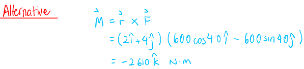

- #[[S2: Force Systems]] #GNG1105
- ## [[Moment]]
	- A ^^moment^^ is a tendency of a force to rotate (**or rotate**) a body about an axis
		- {:height 240, :width 340}
		- 
	- The ^^**right-hand rule**^^:
		- Position your right hand such that your fingers point in the same direction as the force
		  logseq.order-list-type:: number
		- Orient your hand such that the point you are computing the moment about is on the same side as your palm
		  logseq.order-list-type:: number
			- Your hand is positioned such that the moment arm $d$ intersects the middle of your palm
		- Close your fingers to make a fist and extend your thumb straight up
		  logseq.order-list-type:: number
			- From the figure at right, imagine closing your fist around line $O-O$, and your thumb would point in the direction of the moment vector
			- Curling your fingers about this line would represent the rotation of the moment about the axis
		- 
	- For 2-D problems, a simpler representation can be used:
		- 
	- ^^**Scalar Development**^^
		- $M = Fd$
	- ^^**Vector Development**^^
		- $\vec{M} = \vec{r} \times \vec{F}$
	- ### Varignon's Theorem
		- The moment of a force about any point is equal to the sum of the moments of the components of the force about the same point
		- ^^**Vector**^^
			- $\vec{R} = \vec{P} + \vec{Q}$
			- $\vec{M_O} =  \vec{r} \times \vec{R} = \vec{r} \times (\vec{P} + \vec{Q}) = \vec{r} \times \vec{P} + \vec{r} \times \vec{Q}$
			- 
		- ^^**Scalar**^^
			- $M_O = Rd = -pP + qQ$
			- 
	- Example:
	  background-color:: blue
		- Calculate the magnitude of the moment about the base point $O$ of the 600N
			- 
		- 
		- 
		- 
- ## [[Couple]]
	- A ^^couple^^ is a moment produced by two equal opposite, and non-collinear forces
	- 
	- A couple is a ^^free vector^^
		- Not attached to any particular point
	- $M_O = F (a+d) - Fa = Fd$
		- $\therefore$ Position of $O$ does not matter
	- The actual magnitude and direction of the forces producing a couple are not relevant
		- 
	- Any force acting at a particular location can be replaced by an **equivalent** acting at a different location **and a couple** (^^Force-Couple System^^)
		- 
	- Example:
	  background-color:: blue
		- The rigid structural member is subjected to a couple consisting of the 100N forces. Replace this couple by an equivalent couple consisting of the two forces $P$ and $-P$, each of which has a magnitude of 400. Determine the proper angle $\theta$
			- 
	- ## [[Resultants]]
		- The ^^resultant^^ of a system of forces is the simplest force combination which can replace the original forces to produce the same effect on the rigid body
		- When the resultant is equal to zero, the body is in ^^equilibrium^^
			- 