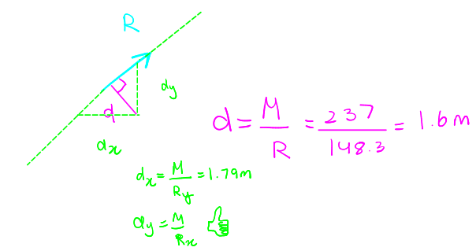

- #[[S2: Force Systems]] #GNG1105
- ## [[Resultants]]
	- Finding the resultant and its line of action:
		- Move all the forces to a convenient reference point
		  logseq.order-list-type:: number
			- Remember to include a couple for each force to ensure that the net tendency to **translate** and **rotate** is equivalent
			- 
		- Add all the forces to find the **resultant force** and add all couples to find the **resultant couple**
		  logseq.order-list-type:: number
			- This will reduce the system of forces to an **equivalent force-couple system**
		- Find the line of action of the single force that produces the same moment about point $O$
		  logseq.order-list-type:: number
			- 
	- Example:
		- Determine the resultant of the four forces and one couple which act on the plate shown
			- 
			- 
			- 
- ## [[Rectangular Components (3-D)]]
	- $F_x = F cos \theta_x$
	- $F_y = F cos \theta_y$
	- $F_z = F cos \theta_z$
	- $F=\sqrt{F_x^2 + F_y^2 + F_z^2}$
	- $\vec{F} = F_x\hat{i} + F_y\hat{j} + F_z\hat{k}$
	- $\vec{F} = F(\hat{i}cos\theta_x + \hat{j}cos\theta_y + \hat{k}cos\theta_z)$ - Unit vector in the direction of the force
		- 
	- $$\vec{F} = F\vec{n}_f = F(cos\theta_x \hat{i} + cos\theta_y \hat{j} + cos\theta_z \hat{k})$$
	- $$\vec{F} = F\vec{n}_f = F\frac{\vec{AB}}{AB} = F\frac{(x_2 - x_1)\hat{i} + (y_2 - y_1)\hat{j} + (z_2 - z_1)\hat{k}}{\sqrt{(x_2 - x_1)^2 + (y_2 - y_1)^2 + (z_2 - z_1)^2}}$$
	- $\vec{AB}$ is a position vector
	- $AB$ is a scalar magnitude (distance)
	- $(x_2 - x_1)\hat{i} + (y_2 - y_1)\hat{j} + (z_2 - z_1)\hat{k}$ is the rectangular component of position vector from A to B
	- 
	- Example:
		- A force $\vec{F}$ with a magnitude of 100N is applied at the origin $O$ of the axes $x,y,z$ as shown. The line of action of $\vec{F}$ passes through the a point $A$ whose coordinates are 3m, 4m and 5m. Determine the $x, y$ and $z$ scalar components of $F$
			- 
- ## [[Moment and Couple]]
	- Moment in three dimensions
		- Operate identically to moments in two dimensions
		- More complicated to visualize
		- 
	- ^^**Scalar Approach:**^^ $M_O = Fd$
		- More difficult to accomplish
		- Lacks sign information
	- ^^**Vector Approach:**^^ $\vec{M_O} = \vec{r} \times \vec{F}$
		- Easy to compute
		- Sign information is included automatically
	- Direction and sense of the moment:
		- Established by right hand rule
		- Perpendicular to plane containing $\vec{r}$ and $\vec{F}$
		- 
			- $\hat{i} \times \hat{j} = \hat{k}$
			- $\hat{j} \times \hat{k} = \hat{i}$
			- $\hat{k} \times \hat{i} = \hat{j}$
			- $\hat{j} \times \hat{i} = \hat{-k}$
			- $\hat{k} \times \hat{j} = \hat{-i}$
			- $\hat{i} \times \hat{k} = \hat{i-j}$
			- $\hat{i} \times \hat{i} = \hat{j} \times \hat{j} = \hat{k} \times \hat{k} = 0$
		- 
	- Calculating cross products via determinant:
		- $$\vec{P} \times \vec{Q} = \begin{vmatrix} \hat{i} & \hat{j} & \hat{k}  \\ P_x & P_y & P_z\\ Q_x & Q_y &Q_z\end{vmatrix}$$
	- $\vec{P} \times \vec{Q} = (P_x\hat{i} + P_y\hat{j} + P_z\hat{k} ) + (Q_x\hat{i} + Q_y\hat{j} + Q_z\hat{k} )$
		- $= (P_yQ_z - P_zQ_y)\hat{i} + (P_zQ_x - P_xQ_z)\hat{j} + (P_zQ_y - P_yQ_x)\hat{k}$
	- $|\vec{P} \times \vec{Q}| = PQ sin \theta$
	- 
		-
		-