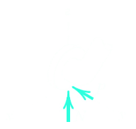

- #[[S3: Equilibrium]] #GNG1105
- ## [[Equilibrium Conditions (3-D)]]
	- ### Force Balance $\sum F = 0$
		- $\sum F_x = 0$
		- $\sum F_y = 0$
		- $\sum F_z = 0$
	- 6 equations; Up to 6 unknowns
	- ### Moment Balance $\sum M = 0$
		- $\sum M_x = 0$
		- $\sum M_y = 0$
		- $\sum M_z = 0$
	- ### ^^**Type of Contact and Force Origin**^^
		- Member in contact with smooth surface, or ball-supported member
			- 
			- Force must be normal to the surface and directed toward the member
				- 
				-
		- Member in contact with rough surface
			- 
			- The possiblity exists for a force $F$ tangent to the surface (friction force) to act on the member, as well as a normal force $N$
				- 
		- Roller or wheel support with lateral constraint
			- 
			- A lateral force $P$ exerted by the guide on the wheel can exist, in addition to the normal force $N$
				- 
		- Ball and socket joint
			- 
			- A ball and socket joint free to about the centre of the ball can support a force $R$ with all three components
				- 
		- Fixed connection (embedded or welded)
			- 
			- In addition to three components of force, a fixed connection can cause support a couple $M$ represented by its three components
				- 
		- Thrust-bearing support
			- 
			- Thrust bearing is capable of supporting axial force $R_y$ as well as radial forces $R_x$ and $R_z$
			- Couples $M_x$, and $M_z$ must, in some cases be assumed zero in order to provided statical determinacy
				- 
	- ### Complete Fixity (Adequate Constraints)
		- Statically determinant $\rightarrow$ 6 unknowns
			- {:height 346, :width 358}
	- ### Excessive Fixity (Redundant Constraints)
		- Statically indeterminant $\rightarrow$ 7 unknowns
			- {:height 284, :width 315}
	- ### Incomplete Fixity (Partial Constraints)
		- No Moment Resistance about Line $AE$
			- {:height 289, :width 321}
		- No Force Resistance along $y$-axis
			- {:height 274, :width 326}
	- Example:
		- The uniform 7m steel shaft has a mass of 200kg and is supported by a ball-and-socket joint at $A$ in the horizontal floor. The ball end $B$ rests against the smooth vertical walls as shown. Compute the forces exerted by the walls and the floor on the ends of the shaft
			- {:height 381, :width 361}
			- {:height 299, :width 699}
			- {:height 193, :width 430}
		- A 200-N force is applied to the handle of the hoist in the direction shown. The bearing $A$ supports the thrust (force in the direction of the shaft axis), while bearing $B$ supports only radial load (load normal to the shaft axis). Determine the mass $m$ which can be supported and the total radial force exterted on the shaft by each bearing. Assume neither bearing to be capable of supporting a moment about a line normal to the shaft axis
		- {:height 407, :width 347}
		- 
		-
-