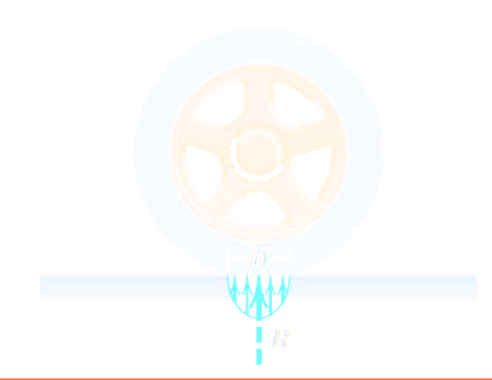
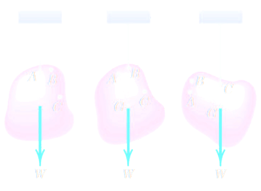
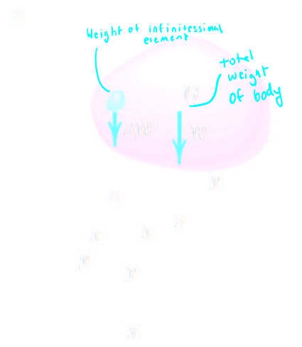
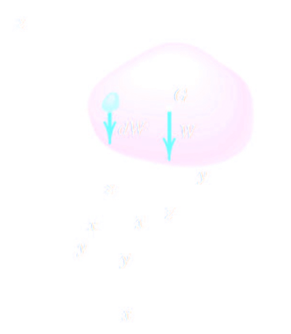
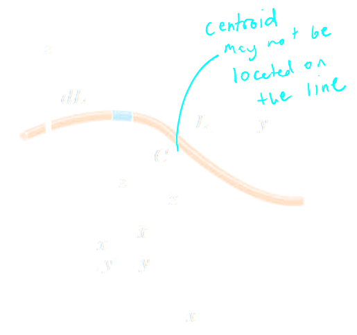
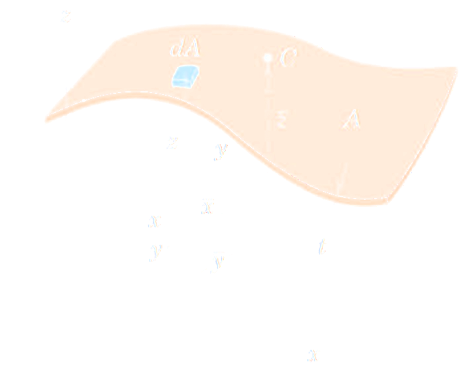
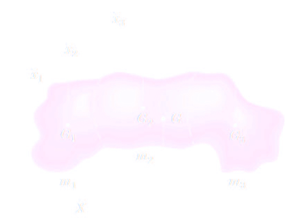
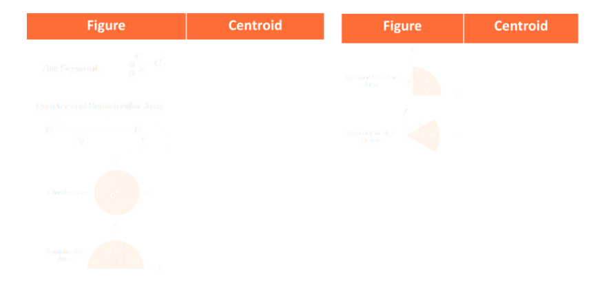
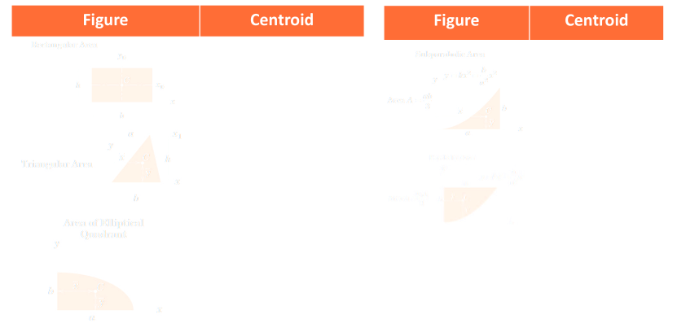

- #[[S5: Distributed Forces]] #GNG1105
- ## [[Introduction]]
	- We have considered forces to ^^concentrated^^ along a line of action
	- In reality, forces are ^^distributed^^ over a larger contact area
	- 
- ## [[Centre of Mass]]
	- {:height 261, :width 396}
	- Centre of mass does not change regardless of orientation
	- 
	- $\bar{x} W = \int x dW$
	- Sum of moments from each element is equal to the movement from the sum of forces
	- Coordinates of centre of gravity of mass
		- $$\bar{x} = \frac{\int x dW}{W}$$ $$\bar{y} = \frac{\int y dW}{W}$$ $$\bar{z} = \frac{\int z dW}{W}$$
	- Substitute $W = mg$ (^^constant^^) and $dW = gdm$ (^^centre of mass^^)
		- $$\bar{x} = \frac{\int x dm}{m}$$ $$\bar{y} = \frac{\int y dm}{m}$$ $$\bar{z} = \frac{\int z dm}{m}$$
	- Substitute $m = pV$ and $dm = p dV$
		- $$\bar{x} = \frac{\int xp dV}{p dV}$$ $$\bar{y} = \frac{\int yp dV}{p dV}$$ $$\bar{z} = \frac{\int zp dV}{p dV}$$
	- 
- ## [[Centroids]]
	- When the destiny of an object is uniform, its centre of mass coincides with its geometric ^^centroid^^
	- We will look at centroids of lines (uniform cross-sectional area $V = A_{xs}L ) and 2-D areas (uniform thickness $V = At$) only
	- $$\bar{x} = \frac{\int xp dL}{L}$$ $$\bar{y} = \frac{\int yp dL}{L}$$ $$\bar{z} = \frac{\int zp dL}{L}$$
	- 
	- $$\bar{x} = \frac{\int xp dA}{A}$$ $$\bar{y} = \frac{\int yp dA}{A}$$ $$\bar{z} = \frac{\int zp dA}{A}$$
	- 
- ## [[Composite Bodies and Figures]]
	- $$\bar{X} = \frac{\sum{m\bar{x}}}{\sum{m}}$$ $$\bar{Y} = \frac{\sum{m\bar{y}}}{\sum{m}}$$ $$\bar{Y} = \frac{\sum{m\bar{y}}}{\sum{m}}$$
	- 
	- 
	- 
	-