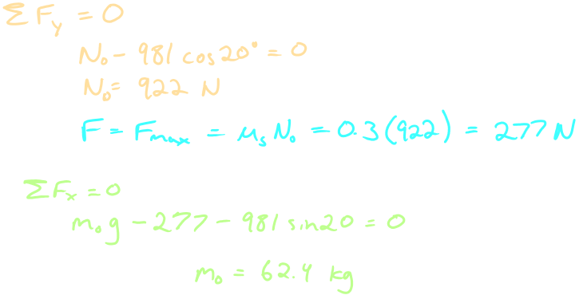

- #[[S6: Friction]] #GNG1105
- ## [[Dry Friction]]
	- Mechanisms of dry friction
		- 
	- Regions of significance
		- Static friction range
			- $P = F < F_{max}$
		- Impending motion
			- $P = F=  F_{max} = \mu_sN$
				- $\mu_s$ is the coefficient of static friction
		- Kinetic friction
			- $P > F = F_k < F_{max}$
				- $F_k = \mu_k N$
					- $\mu_k$ is the coefficient of kinetic friction
			- 
	- Friction angles
		- Static friction angle, $\phi_s$
			- $$\tan \phi_s = \frac{F_{max}}{N} = \mu_s$$
		- Kinetic friction angle, $\phi_k$
			- $$\tan \phi_k = \frac{F_{k}}{N} = \mu_k$$
		- If $\phi = \phi_s \rightarrow$ motion is impending
	- Types of friction problems
		- Type 1: Impending motion
			- Body is on the verge of slipping
			- Equilibrium holds for the body
			- $F = F_{max} = \mu_s N$
		- Type 2: Relative Motion Exists
			- Body is slipping
			- Equilibrium does not hold in the direction of the slip
			- $F = F_k  = \mu_k N$
		- Type 3: Unknown - body may or may not be slipping
			- Assume equilibrium
			- Solve for the fricton force $F$
			- Check the assumption for equilibrium
			- Body is in equilbrium:
				- If $F < F_{max} \rightarrow$ OK
				- $F = F_{max} \rightarrow$ OK
			- Assumption is invalid $F = F_k$ (body is in motion)
				- $F > F_{max}$
	- Example:
	  background-color:: blue
		- Determine the maximum angle $\theta$ which the adjustable incline may have with the horizontal before the block of mass $m$ begins to slip. The coefficient of static friction between the block and the inclined surface is $mu_s$
			- 
			- 
		- Determine the range of values which the mass $m_0$ may have so that the 100-kg block shown int he figure will neither start moving up the plane nor slip down the plane. The coefficient of static friction for the contact surface is 0.30
			- 
			- 
			- 
		- Determine the magnitude and direction of the friction force acting on the 100-kg block shown, if first, $P = 500N$ and, second, $P = 100N$. The coefficient of static friction is 0.20 and the coefficient of kinetic friction is 0.17. The forces are applied with the block initially at rest
			- 
			- 
			- 
			- 
- ## [[Wedges]]
	- A **wedge** is one of the simplest and most useful machines, used to raise or lower heavy objects
	- Wedges depend on ^^friction^^ to function
	- 
	- 
	- Example:
		- The horizontal position of the 500-kg rectangular block of concrete is adjusted by the 5$\degree$ wedge under the action of the force **P**. If the coefficient of static friction for both wedge surfaces is 0.30 and if the coefficient of static friction between the block and the horizontal surface is 0.60, determine the least force *P* required to move the block
			- 
			- 
			- 
- ## [[Screws]]
	- **Screws** are used for fastening or transmitting motion
	- The friction developed in the threads determines the action of the screw
	- $\sum F_y = 0 \rightarrow W = R\cos(\alpha + \phi_s)$
	- $\sum M = 0 \rightarrow M = R_x r$
		- = $Rr\sin(\alpha + \phi_s)$
	- $= Wr\tan(\alpha + \phi_s)$
	- 
	- $\alpha < \phi_s$
		- 
	- $\alpha > \phi_s$
		- 
	- Example:
		- The single-threaded screw of the vise has a mean diameter of 1 in. and has 5 square threads per inch. The coefficient of static friction in the threads is 0.20. A 60-lb pull applied normal to the handle at $A$ produces a clamping force of 1000lb between the jaws of the vise. a) Determine the frictional moment $M_B$, devolved at $B$ due to the thrust of the screw against the body of the jaw b) Determine the force $Q$ applied normal to the handle at $A$ required to loose the vise.
			- 
			- 
			- 
			- 
			-