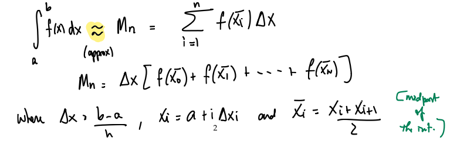
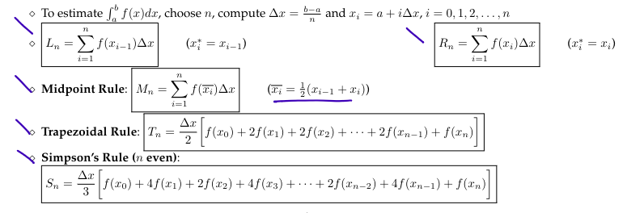

- Functions, Domain, Range, Vertical Line Test, Transformations, Symmetry, Polynomials, Radicals, Rational Functions, Absolute Value
- Composition, Inverse, Exponential functions, Logarithmic functions, Trig functions, Inverse Trig functions
- Tangents, secants, velocity limits, limit laws
- Continuity, limits at infinity, Intermediate Value Theorem
- Derivatives, rates of change, the derivative of a function
- Rules of differentiation, powers, constant multiples, sums, polynomials, exponential functions, product rule, quotient rule
- Differentiation Rules, Trig functions, Chain rule
- Implicit Differentiation, Inverse trig derivatives, Derivatives of Logs, Logarithmic Differentiation
- Related Rates, Linear Approximation
- Antiderivative Areas
- Areas using rectangles, Riemann sums, Definite Integrals, FTC, Net Change Theorem
- Substitution
- Integration by Parts, Trigonometric integrals
- Trigonometric substitution
- Integrating rational functions, partial fractions, integration strategy
- Approximate integration
- **Max/Min Values**
- **Mean Value Theorem**
- Shapes of Graphs, Indeterminate forms, L'Hopital Rule
- **Curve sketching**
- **Optimization**
- {{embed ((6552fed0-2adb-4912-b0f3-2d1d7e858c53))}}
- $$$$
- Suppose $|f''(x)| \le K_2$ for $a \le x \le b$ and we estimate $\int_a^b f(x) \ dx$
	- Then,
		- $$\text{|error using Tn|} \le \frac{K_2(b-a)^3}{12n^2} \text{ and |error using Mn|} \le \frac{K_2(b-a)^3}{24n^2}$$
		- $$\text{|error using Sn|} \le \frac{K_2(b-a)^5}{180n^4}$$
- ### Riemann Sum:
	- 
	- 
	-