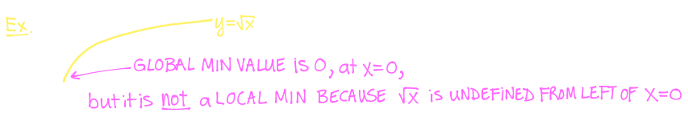

## [[Approximate Integration]]
	- **Recall:**
		- If $f$ is integrable on the interval  on $[a,b]$, then the definite integral $\int_a^b f(x) \ dx$ is the net area between $f(x)$ and the $x$-axis
			- 
		- We started approximating such areas using Riemann Sums
			- {:height 140, :width 548}
		- If the limit exists and is independent of our choice of sample points $x_i^* \in [x_{i-1}, x_i]$, then
			- 
		- FTC 2 gave us an "easy" way to evaluate definite integrals without using the limit of the Riemann sum
			- 
			- but, FTC 2 requires us to know an antiderivative of the integrand
	- ### ^^Riemann Sums^^
		- To approximate a definite integral $\int_a^b f(x) \ dx$ using a Riemann sum:
			- Choose $n$ (the number of rectangles)
			- Subdivide the interval $[a, b]$ into $n$ subintervals of equal width
				- $$\Delta x = \frac{b-a}{n}$$
				- 
				- For $i = 0, 1, 2,..., n$
				- $$x_i = a + i \Delta x$$
			- Choose a **sample point** $x_i^* \in [x_{i-1}, x_i]$ in the $i$th subinterval
			- Typical sample points:
				- 
	- ### ^^Midpoint Rule^^
		- $$\int_a^b f(x) \ dx \approx \text{Mn} = \sum_{i=1}^n f(\overline{x}_i \Delta x $$
			- $$\rightarrow \text{Mn} = \Delta x [f(\overline{x}_1) + f(\overline{x}_2) + ... f(\overline{x}_n) ]$$
			- where:
				- $$\Delta x = \frac{b-a}{n}$$
				- $$x_i = a + i \Delta x$$
				- $$\overline{x}_i = \frac{x_{i-1} + x_i}{2} $$
					- $=$ midpoint of $i$th subinterval
	- ### ^^Trapezoid Rule^^
		- Lets use trapezoids instead of rectangles:
			- 
		- Area of $i$th trapezoid is:
			- $$ \frac{1}{2} (f(x_{i-1}) + f(x_i)) \Delta x $$
		- Approximation using $n$ trapezoids of equal width $\Delta x = \frac{b -a}{n}$
			- $$\int_a^b f(x) \ dx \approx \text{Tn} = \sum_{i=1}^n \frac{1}{2} [f(x_{i-1}) + f(x_i) ]\Delta x$$
			- $$\Rightarrow \text{Tn} = \frac{\Delta x}{2} [f(x_0) + 2f(x_1) + 2f(x_2) + ... + 2f(x_{n-1}) + f(x_n)]$$
	- ### ^^Error Bounds^^
		- Suppose $|f''(x)| \le K_2$ for $a \le x \le b$ and we estimate $\int_a^b f(x) \ dx$
			- Then,
				- $$\text{|error using Tn|} \le \frac{K_2(b-a)^3}{12n^2} \text{ and |error using Mn|} \le \frac{K_2(b-a)^3}{24n^2}$$
			- The actual error might be smaller than these bounds
			- If we know a bound of $f''(x)$ for $a \le x \le b$, then this knowledge gives us a worst-case scenario error bound
			- This allows us to choose $n$ sufficiently large to guarantee that the error is no worse than $\frac{K_2(b-a)^3}{12n^2}$ or $\frac{K_2(b-a)^3}{24n^2}$, respectively
			- Notice that the error bound of $T_n$ is twice the error bound of $M_n$ (so typically we have better guarantees from the Midpoint rule)
	- Example:
		- Use $T_5$, then $M_5$ to approximate $\int_1^2 \frac{1}{x} dx$
			- 
		- How large should $n$ be in order to guarantee that the error using $T_n$ and $M_n$ to estimate $\int_1^2 \frac{1}{x} dx$, respectively is within 0.0001?
			- 
	- ^^**Simpson's Rule**^^
		- 
		- ^^**Error Bound**^^
			- Suppose that $|f^{(4)}(x) \le K_4$ for $a \le x \le b$. Then:
				- 
		- Example:
			- Compute $S_6$ to approximate $\int_1^2 \frac{1}{x} dx$, then determine the smallest $n$ neede in order to guarantee that $S_n$ is within 0.0001 of the exact value of $\int_1^2 \frac{1}{x} dx$
				- 
- ## [[Min/Max Values]]
	- A function $y = f(x)$ has...
		- an **Absolute/Global Maximum at** $x = c$ if $f(c) \ge f(x)$ for all $x$ in domain of $f$
		- an **Absolute/Global Minimum at** $x= c$ if $f(c) \le f(x)$ for all $x$ in domain of $f$
	- The value $f(c)$ is called either the **Global Maximum Value** or **Global Minimum Value** of $f$
	- The min/max values of $f$ are called **extreme values**
	- A function $f$ can attain global max/min values at many numbers
		- 
	- Some functions do not have max and /or min values
		- 
	- ^^**Local vs. Global Extreme Values**^^
		- A function $y = f(x)$ has
			- a **Local Maximum at** $x=c$ if $f(c) \ge f(x)$ for all $x$ "near" $c$ (in an open interval on either side of $c$)
			- a **Local Minimum at** $x=c$ if $f(c) \le f(x)$ for all $x$ "near" $c$ (in an open interval on either side of $c$)
		- Some local max/min are also absolute extreme points
			- {:height 133, :width 594}
		- Not every local max/min is an absolute max/min
			- 
		- Not every absolute max/min is a local max/min
			- 
	- ^^**Theorem 18.1 - Extreme Value Theorem**^^
		- If $y = f(x)$ is continuous on the closed interval $[a,b]$, then restricted to the interval $[a,b], f$ has an absolute maximum and an absolute minimum on $[a.b]$
		- **Note:** If $f$ is not continuous on $[a,b]$, then the Extreme Value Theorem **is not applicable**
			- Even if $f$ is continuous, if the interval is not closed, then the Extreme Value Theorem **is not applicable**
			- 
	- The Extreme Value Theorem tells us of a situation in which absolute extreme values must exist, but it does not tell us how to find them
	- For that we need Fermat's Theorem
	- ^^**Theorem 18.2 - Fermat's Theorem**^^
		- If $f(x)$ has a local min or max at $x = c$, and if $f'(c)$ exists, then $f'(c) =0$
			- 
		- A number $x$ is called a **critical number** of a function $f(x)$ if either
			- $x$ is in the domain of $f$ and $f'(x) = 0$ (Type 1)
			- or $x$ is in the domain of $f$ but $x$ is **not** in the domain of $f$ (Type 2)
		- Graphically, these two types of critical numbers correspond to numbers $x$ such that
			- $f(x)$ has a horizontal tangent at $x$ (Type 1)
			- $f(x)$ has a corner, jump discontinuity, or vertical tangent line at $x$ (Type 2)
		- Example:
		  background-color:: blue
			- Find all the critical numbers of $h(x) = x^{2/3}(x-2)^2$
				- 
	- ^^**The Closed Interval Method**^^
		- Follow these steps to find the absolute extrema of a **continuous function** $f(x)$ on a closed interval $[a,b]$
			- Find the critical numbers of $f$
			  logseq.order-list-type:: number
			- For each critical number $c$ such that $c \in [a,b]$, compute its value $f(c)$
			  logseq.order-list-type:: number
			- For the endpoints $x = a$ and $x = b$ of $[a,b]$, compute its values $f(a)$ and $f(b)$
			  logseq.order-list-type:: number
			- The absolute maximum value of $f$ on $[a,b]$ is the largest value computed in steps 2 and 3
			  logseq.order-list-type:: number
			- The absolute minimum value of $f$ on $[a,b]$ is the smallest value computed in steps 2 and 3
			  logseq.order-list-type:: number
		- Example
		  background-color:: blue
			- Find the absolute/global extreme points of $h(x) = x^{2/3}(x-2)^2 on the closed interval $[-1,1]$. **Note:** $h(x)$ is continuous on $[-1,1]$
				- 
			- After an antibiotic tablet is taken, the concentration of the antibiotic in the bloodstream is modelled by the function $C(t) = 8(e^{-0.4t}-e^{-0.6t})$ where time $t$ is measured in hours and $C$ is measured in $\mu g/mL$. What is the maximum concentration of the antibiotic during the first 12 hours?
				- 
			- Find the absolute maximum and absolute minimum of $f(x) = \sin(x) \cos(x)$ on the interval $[-\pi, \pi]$
				- 
	- ^^**Theorem 18.7 - Mean Value Theorem**^^
		- If $f(x)$ is continuous and on the closed interval $[a,b]$, and differentiable on the open interval $(a,b)$, then there exists a number $c \in (a,b)$ such that:
			- 
		- Example:
		  background-color:: blue
			- Consider $f(x) = x^3$ on the closed interval $[0,1]$. Calculate the slope of the secant line joining the endpoints of this interval. What does the Mean Value Theorem guarantee? Verify that it holds for this particular function
				- 
			- Try to find the critical numbers of $f(x) = \sin(x)\ln(x)$
				- 
			- Using the Mean Value Theorem, explain why $f(x) = \sin(x)\ln(x) has at least one critical number on the interval $[1, \pi]$
				- 
	- ^^**Theorem 18.11 - Rolle's Theorem**^^
		- If $f(x)$ is continuous on the closed interval $[a,b]$ differentiable on $[a,b]$, and $f(a) = f(b)$, then there exists a number $c \in (a,b)$ such that $f'(c) = 0$
			- Rolle's Theorem can be viewed as a special case of the Mean Value Theorem
				- 
				-
-