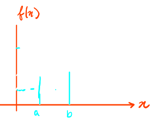
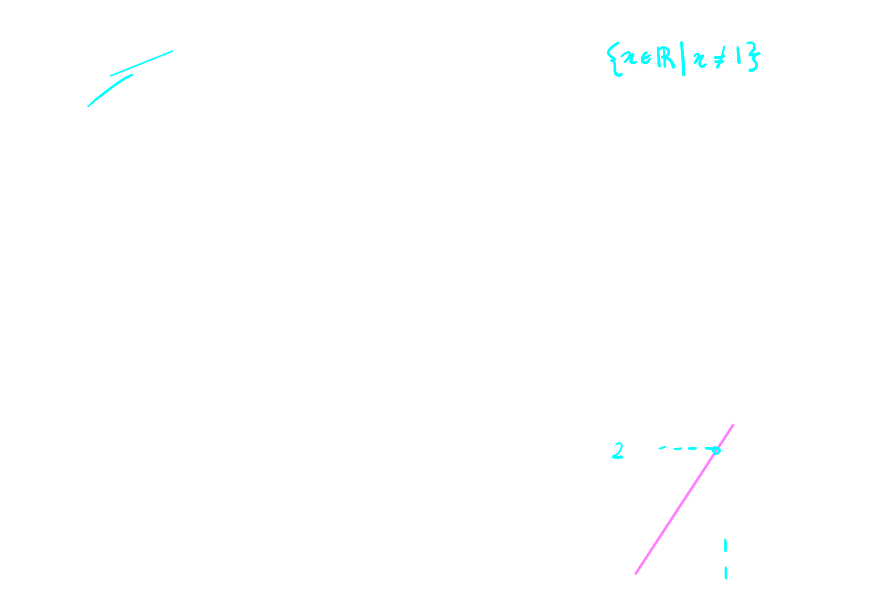
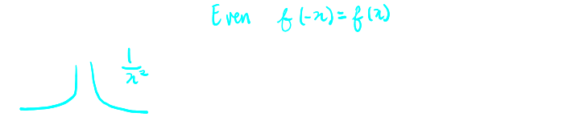
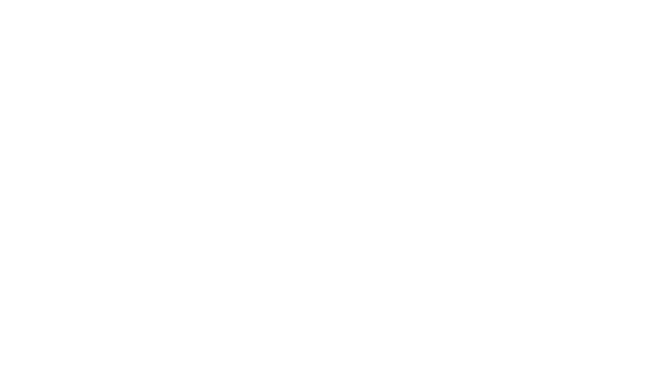
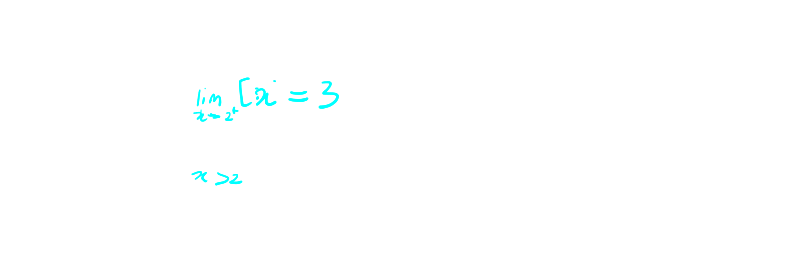
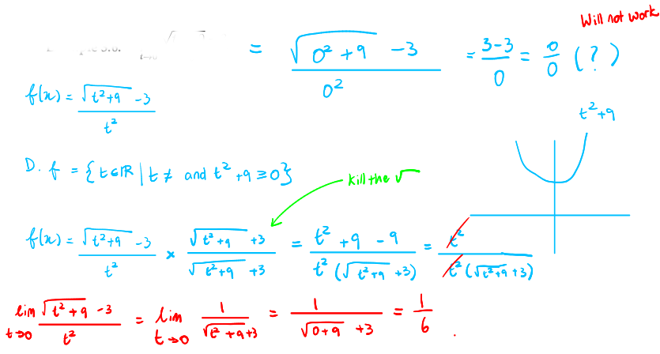

## [[Secants, Tangents, and Limits]] #MAT1320
	- ### Slope of A Secant - Average Rate of Change Interval
		- Let $f$ be a function that is ^^continuous^^ on an interval $[a,b]$
			- Then, find slope of $(a, f(a))$ and $(b, f(b))$
			- {:height 231, :width 239}
			- $$\frac{f(b)-f(a)}{b-a}$$
			- $$\frac{f(a+h) - f(a) }{ (a+h)-a} = \frac{f(a+h) - f(a)}{L}$$
	- ### Slope of Tangent - Instantaneous Rate of Change at a Point
		- ^^**Test**^^
			- We want the **instantaneous rate of change** of $f(x)$ at a point $x=a$
			- In this case, the ^^interval^^ we are interested in is $[a,a]$
				- We only care what happens when $x$ is exactly equal to $a$
			- The formula for the average rate of change of $f$ on the interval $[a,a]$ does not work: we get the **indeterminate form** $\frac{0}{0}$
			- if $x \in [a,a]$,
				- $$\frac{f(a)- f(a)}{0}  = \frac{0}{0}$$
				- # ☹️
		- ^^**So...**^^
			- If $h>0$, then we can calculate the average of change over the interval $[a, a+h]$, even when $h$ is extremely tiny
			- $$\frac{f(a+h) - f(a)}{h}$$
			- $h$ is not zero, and can be as small as chose
		- So $h$ can **approach** 0 written $h \rightarrow 0$ without ever actually equalling zero
		- If the rate of change of $f$ over the interval $[a, a+h]$ **approaching** a particular number, then the number is called the **instantaneous rate of change of** $f$ **at** $x = a$
	- ### Limits: The Intuitive Defintion
		- Suppose $f(x)$ is defined when $x$ is ^^near^^ a number $a$ (this means that $f$ is defined on s some open interval that contains the number $a$, except possibly at $a$ itself; $a$ might not be in the domain of $f$, but at all other points in the neighbourhood of this open interval, $f$ is defined)
			- If we can make the values $f(x)$ arbitrarily close to a unique real number $L$ by restricting $x$ (on either side of $a$) to be sufficiently close enough to $a$, then
				- Definition:
				- $\lim_{x\to a} f(x) = L$
				- $L$ is a  real number (not a defined) (not $-\infty$ or $\infty$)
		- We can guarantee that $f(x)$ get arbitrarily close to a unique real number L as long as we make sure that $x$ is close enough to $a$ (without actually letting $x$ equal $a$)
		- If there is no such unique real number $L$, then limit of $f(x)$ as $x$ approaches $a$ **does not exist (DNE)**
		- Example
		  background-color:: blue
			- Consider the rational function $f(x) = \frac{2x^2 - 2x}{x-1} and the limit of $\lim_{x\to 1} f(x)$
			- 
			-
	- ### Reasons Why Some Limits Do Not Exist
		- Example
		  background-color:: blue
			- $\lim_{x\to 0} \frac{1}{x^2}$
				- {:height 159, :width 617}
		- ^^**Infinite Limits (Vertical Asymptotes)**^^
			- Let $f$ be a function defined on both sides of $a$, except possibly at $a$ itself
			- Then
				- $\lim_{x\to a} f(x)  = +\infty$
				- means that the values of $f(x)$ grow arbitrarily large as $x$ approaches $a$
			- **Graphically** : $f$ has  **vertical asymptote** as $x$ approaches $a$
			- Same idea for $\lim_{x\to a} f(x) = - \infty$
			- ^^**Note:**^^
				- Since $\infty$ is **not** a real number $L \in \mathbb{R}$, infinite limits **DNE**
					- We write $\lim_{x\to a} f(x) = - \infty$ and $\lim_{x\to a} f(x) = \infty$
					- because it tells us for short which way the Vertical Asymptote goes
		- Example:
		  background-color:: blue
			- $$\lim_{x\to 0} sin\frac{\pi}{x}$$
			- 
			-
		- For all $x \in \mathbb{R}$, **the ceiling function** $[x]$ is defined as $[x]=min\{n\in\mathbb{R}: x\le n\}$
		- 
		- Since $[x]$ approaches **different real numbers as** $x\to2$ **from either side**, this limit **DNE**
	- ### One-Sided Limits
		- As $x \to a$, the values of $f(x)$ may behave differently from one side that the other
		- For some functions, a $x\to a$ only makes sense if $x$ approaches $a$ from one side
			- $\lim_{x\to 0^+} \sqrt{x} =0$
			- D: $= [0, +\infty$[
		- To distinguish from which side $x$ approaches $a$, we use the following notation from **one-sided limits**:
			- $\lim_{x\to a^-} f(x)$ ^^**LHL**^^
			- $\lim_{x\to a^+} f(x)$ ^^**RHL**^^
		- By definition:
			- $\lim_{x\to a} f(x) = L$ if and only if both $\lim_{x\to a^-1} f(x) = L$ and $\lim_{x\to a^+} f(x) = L$ or else its a **DNE**
	- ### Evaluating Limits
		- ^^**Numerically**^^
			- Guessing by plugging in nearby values of $x$
		- ^^**Graphically**^^
			- Eyeballing the limit by looking at the graph
		- ^^**Using  the Limit Laws**^^
			- Let $k$ be a constant real number, and suppose that the limits $\lim_{x\to a} f(x)$ and $\lim_{x\to a} g(x)$ both exist
			- Then,
				- $$\lim_{x\to a} [f(x) \pm g(x)] = [\lim_{x\to a} f(x)] \pm [\lim_{x\to a} g(x)]$$
				- $$\lim_{x\to a} [kf(x)] = k[\lim_{x\to a} f(x)] $$
				- $$\lim_{x\to a} [f(x) \pm g(x)] = [\lim_{x\to a} f(x)] \cdot [\lim_{x\to a} g(x)]$$
				- $$\lim_{x\to a} [\frac{f(x)}{g(x)}] = \frac{[\lim_{x\to a} f(x)]}{[\lim_{x\to a} g(x)]}$$ **if** $\lim_{x\to a} g(x) \ne 0$
		- ^^**Using Direct Substitution**^^
			- If $f$ is a polynomial or a rational function and $a$ is in the domain of $f$, then
				- $$\lim_{x\to a} f(x) = f(a)$$
		- ^^**Using Algebric Tricks**^^
			- If $f(x) = g(x)$ everywhere except when $x=a$, then
				- $$\lim_{x\to a} f(x) = \lim_{x\to a} g(x)$$ provided the limit exists
			- The above observation allows us to use **algebric tricks** to evaluate limits
				- Factoring and cancelling common factors
				- Rationalizing the numerator and denominator
				- Dividing all terms by a common expression
				- Adding/substracting fractional expressions on a common denominator
			- Example
			  background-color:: blue
				- $$\lim_{t\to 0} \frac{\sqrt{t^2 + 9} -3}{t^2}$$
				- 
				-
-