## [[Derivatives]] #MAT1320
	- ### Definition of the Derivative at a Point - Slope of a Tangent
		- The **slope of the secant** passing through the points $(a,f(a)$ and  $(a+h, f(a+h)$ is
			- 
		- Our goal is for developing skills with limits was to take the limit as $h \rightarrow 0$
		- Provided the limit exists, the **derivative of a function** $f$ **at a number** $a$, denoted $f'(a)$ is
			- $$f'(a) = \lim_{h \rightarrow 0}  \frac{f(a+h) - f(a)}{h}$$
		- Example
		  background-color:: blue
			- Find the equation of the tangent line to the graph $f(x) = \sqrt{x +3}$ at the point $x=1$
				- 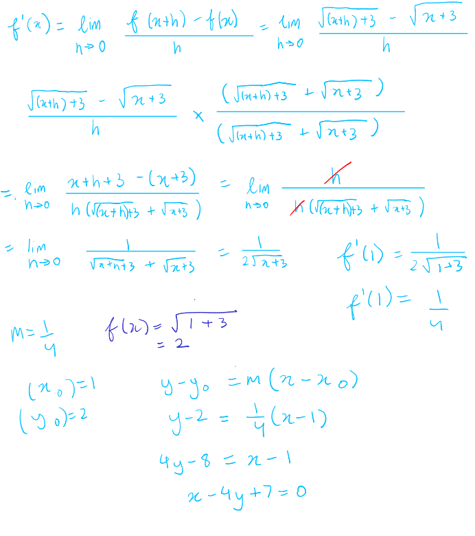
	- ### Instantaneous Rate of Change
		- If $f$ is ^^continuous^^ on the interval [$a,b$], the **average rate of change of** $f$ **on** [$a,b$] is
			- $$\frac{f(b)-f(a)}{b-a} = \frac{\Delta y}{\Delta x}$$
		- The **instantaneous rate of change of** $f$ **at** $x = a$ is
			- 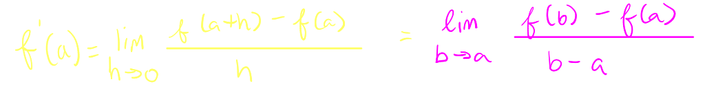
	- ### The Derivative as a Function
		- The derivative $f(x)$, denoted $f'(x)$, is the function
			- The domain of $f'(x)$ is the set of all $x$ in the domain of $f$, for which the above limit exists
			- The domain of $f'$ can be smaller than the domain of $f$
			- As a function of $x$, we can regard the value of $f'(x)$ geometrically as the slope of the tangent line of $f$ at $x$
	- ### Other Notation for the Derivative
		- For $y= f(x)$, here are several equivalent notations for the derivative $f'(x)$
			- $$f'(x) = y'$$
			- $$\frac{dy}{dx}$$
			- $$\frac{df(x)}{dx}$$
			- $$\frac{d[f(x)]}{dx}$$
			- $$Dxf(x)$$
	- ### Differentiability
		- A function is **differentiable** at $a$ if (the limit) $f'(a)$ exists
		- $f$ is **differentiable on an open interval** $I$ if $f'(a)$ exists for all $a \in I$
		- Example:
		  background-color:: blue
			- Where is the function $f(x) =|x|$ differentiable?
				- 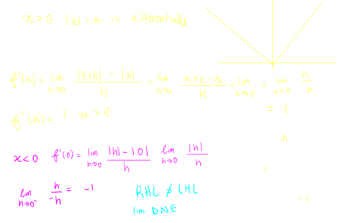
		- #### If $f$ is differentiable at $a$, the $f$ is continuous at $a$
			- Being differentiable is much stronger than being continuous
			- If $f'(a)$ exists then $f$ is continuous in $a$
		- The converse of that theorem is false
			- $|x|$ is continuous $\forall x \in \mathbb{R}$ but not differentiable in $x = 0$
		- #### Additionally, if a function is not continuous, it is also not differentiable
	- ### How can functions fail to be Differentiable?
		- 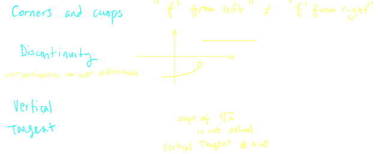
	- ### Higher-Order Derivatives
		- Let $y=f(x)$ be a function
		- In each case, the preceding derivative exists we can iterate to take **higher-order derivatives**
			- 1st derivative of $f$ : $f'(x) , y' , \frac{dy}{dx}$
			- 2nd derivative of $f$ : $f''(x) , y'' , \frac{d^2y}{dx^2}$ (Derivative of $f'$)
			- 3rd derivative of $f$ : $f'''(x) , y''' , \frac{d^3y}{dx^3}$ (Derivative of $f''$)
			- 4th derivative of $f$ : $f''''(x) , y'''' , \frac{d^4y}{dx^4}$ (Derivative of $f'''$)
			- $n$th derivative of $f$ : $f^n(x) , y^n , \frac{d^ny}{dx^n}$ (Derivative of $f^{n-1}$)
	- **Basic Rules:**
		- Constants
			- Let $c \in \mathbb{R}$
				- 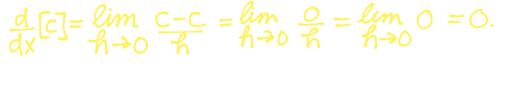{:height 128, :width 446}
			- $\frac{d}{dx}[c] = 0$
		- Powers
			- $n = 0$
				- 
			- $n = 1$
				- 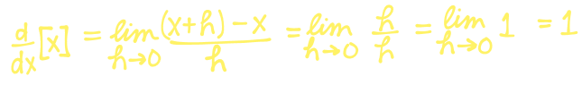{:height 81, :width 492}
				- $\frac{d}{dx}[x] = 1$
			- $n=2$
				- 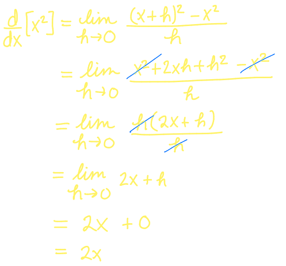{:height 368, :width 388}
				- $\frac{d}{dx}[x^2] = 2x$
			- $n=3$
				- 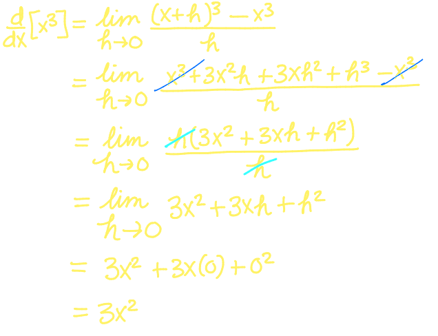{:height 348, :width 415}
				- $\frac{d}{dx}[x^3] = 3x^2$
- ## [[Differentiation]] #MAT1320
	- $n \in \mathbb{N}$
		- 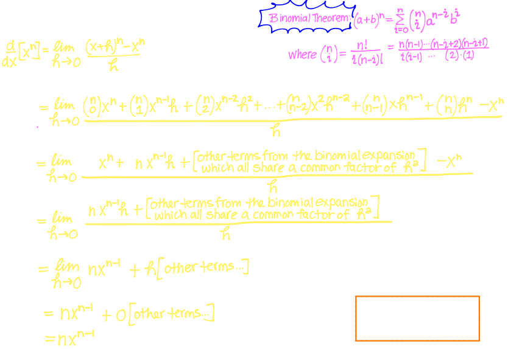
	- **Power Rule**
		- $$\frac{d}{dx} [x^n] = nx^{n-1}$$
	- **Constant Multiples**
		- Let $k \in \mathbb{R}$
			- 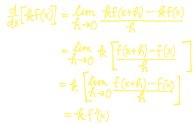
			- $\frac{d}{dx} [kf(x)] = k \cdot f'(x)$
	- **Sums and Differences**
		- $$\frac{d}{dx} [f(x) \pm g(x)] = f'(x) \pm g'(x)$$
		- 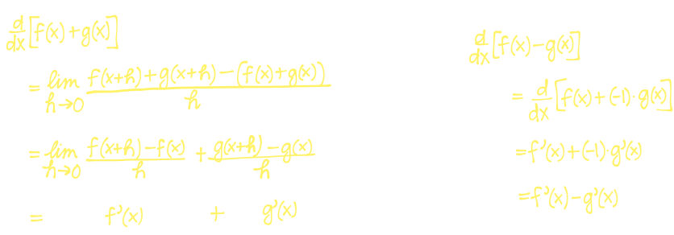
	- Example:
	  background-color:: blue
		- Find the first and second derivatives of each of the following functions
		- $g(x) = 2x^3+-\sqrt{x}-5$
			- 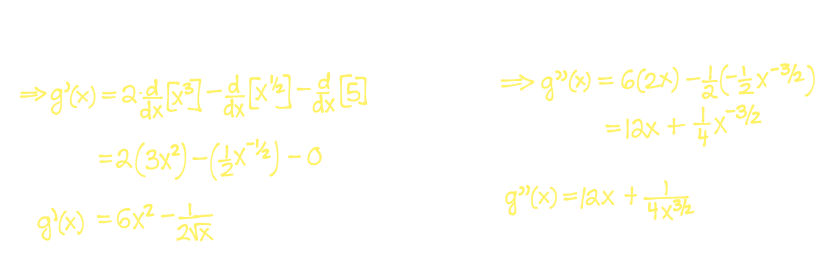
		- $f(x) = \frac{\pi + \sqrt{x}^3 - x^8}{x^{4/3}}$
			- 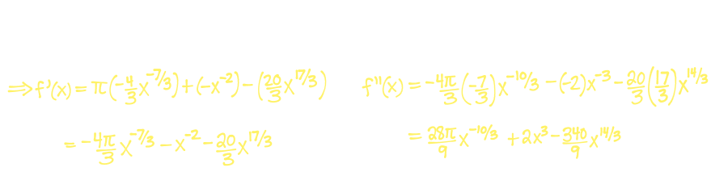
	- ### Derivatives of Exponential Functions
		- Let $f(x) = b^x$ for some base $b > 0, b \ne 1$ Then
			- $$\frac{d}{dx} f(x) = \lim_{h \rightarrow 0} \frac{b^{x+h} - b^x}{h} =  \lim_{h \rightarrow 0} b^x( \frac{b^h-1}{h}) = b^x (\lim_{h \rightarrow 0}\frac{b^{0+h}-b^0}{h} = b^x(f'(0))$$
		- $\therefore$ the rate of change of any exponential function $f(x) = b^x$ is proportional by a factor of $f'(0)$ to the function $f(x) = b^x$ itself
			- 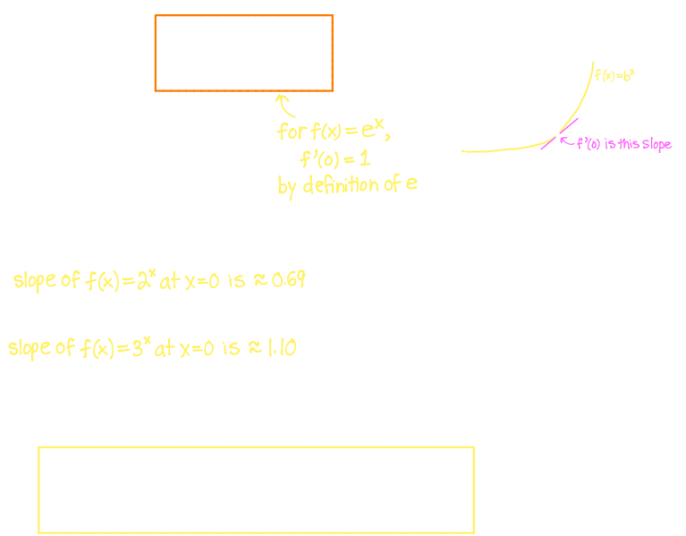
	-
	- **Derivative of the Natural Exponential Function**
		- $$\frac{d}{dx} [e^x] = e^x$$
	- Example:
		- Find the derivative of $h(t) = e^{t-1}$
			- 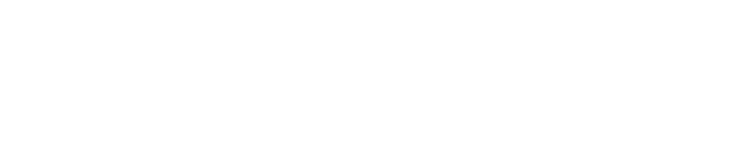
	- ### The Product Rule
		- 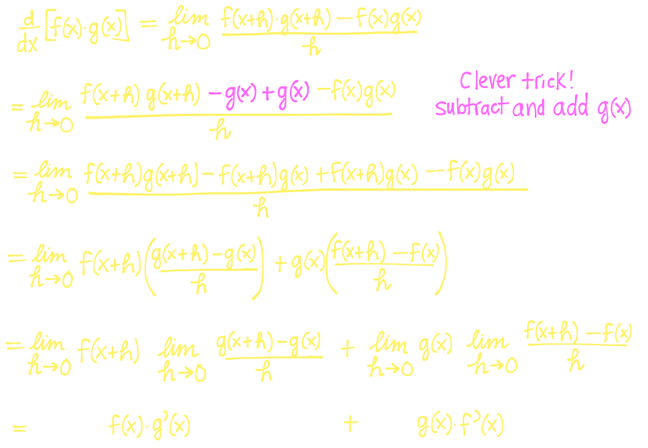
		- $$\frac{d}{dx} [f(x) \cdot g(x)] = f'(x)g(x) + f(x)g'(x)$$
	- Example:
	  background-color:: blue
		- Find the derivative of $y = (2e^x + x^2) \sqrt{x}$. What is $y'(4)$
			- 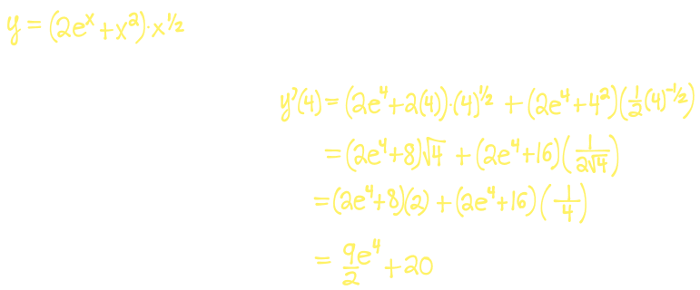
			-