## [[Trig Integrals and Trig Substitution]] #MAT1320
	- ### Common Strategies for Trig Integrals
		- $\int \sin^m(x)\cos^ndx$
			- 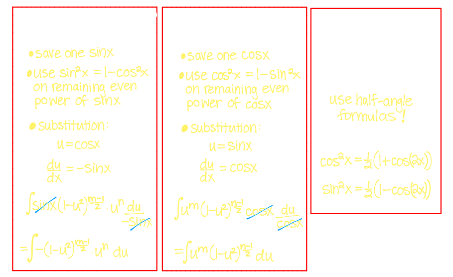
		- Example
		  background-color:: blue
			- $$\int_{\pi/6}^{\pi/3} \cos^3(x) dx$$
			- 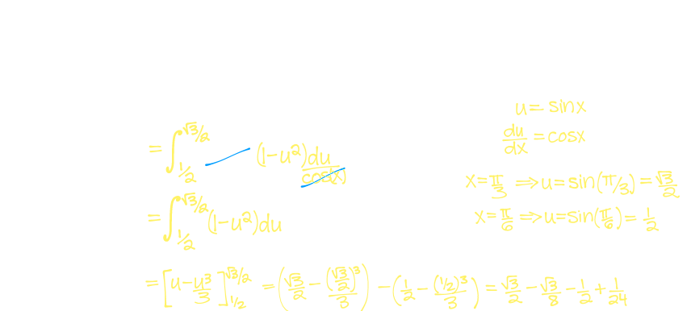
	- $$\ln(x) \ dx = x \ln x -x + C$$
	- $$\tan x \ dx = \ln |\sec x| +C$$
	- $$\int \sec x \ dx = \ln |\sec x + \tan x| + C$$
		- Example
			- $$\int \tan^3(x) \ dx$$
			- 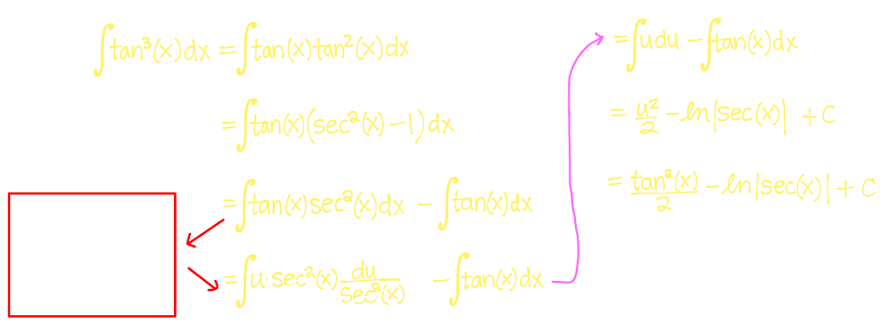
			- 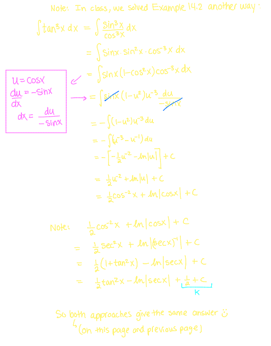
	- ### Trig Substitution
		- $$\int_{-1}^{1} \sqrt{1-x^2} \ dx$$
			- 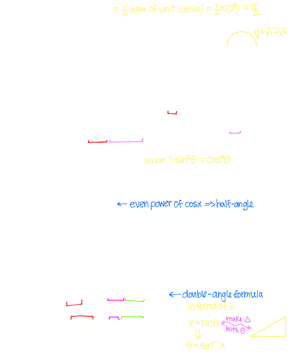
		- **General Strategy for Trig Substitution**
			- ^^Expression^^ $\implies$  **Identity**  $\implies$ Subsitution
			  id:: 6553032e-7841-4bed-b05b-1a838d89d3aa
				- $\sqrt{1-x^2}  \implies 1- \sin^2\theta = \cos^2\theta  \implies x = \sin\theta$
				  id:: 65530357-1acd-4298-b0f2-9c45298aaba0
				- $\sqrt{1+x^2}  \implies 1 + \tan^2\theta = \sec^2\theta  \implies x = \tan \theta$
				  id:: 655303c1-a35a-47a5-995a-482fd9f934b6
				- $\sqrt{x^2-1}  \implies  \sec^2\theta -1 = \tan^2\theta  \implies x = \sec\theta$
				  id:: 65530405-a476-47bf-9825-e5e074ef8649
			- Example:
				- $$\int \frac{1}{(4-x^2)^{3/2}} \ dx$$
					- 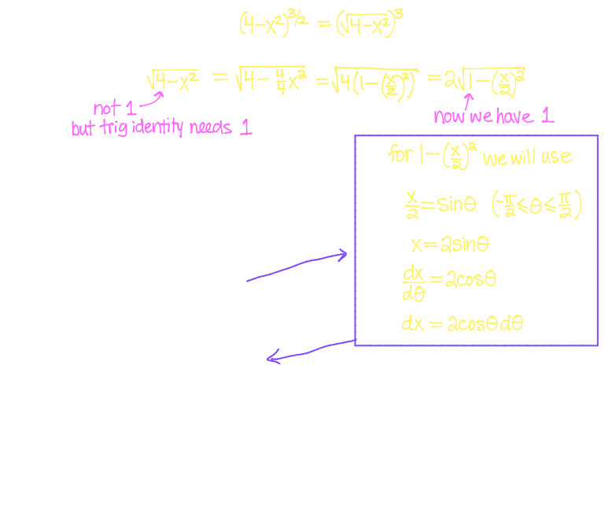
					- 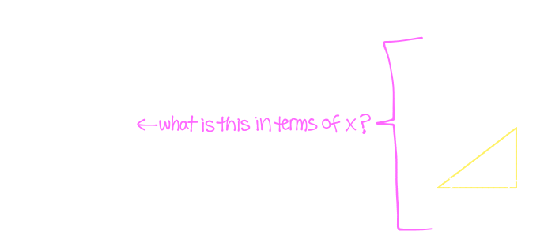
				- $$\int \frac{x}{x^2+4} \ dx$$
					- 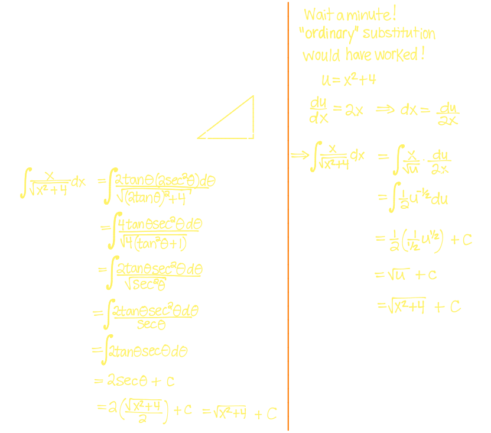
				- $$\int \frac{1}{2x^2 +8x +6} \ dx$$
					- 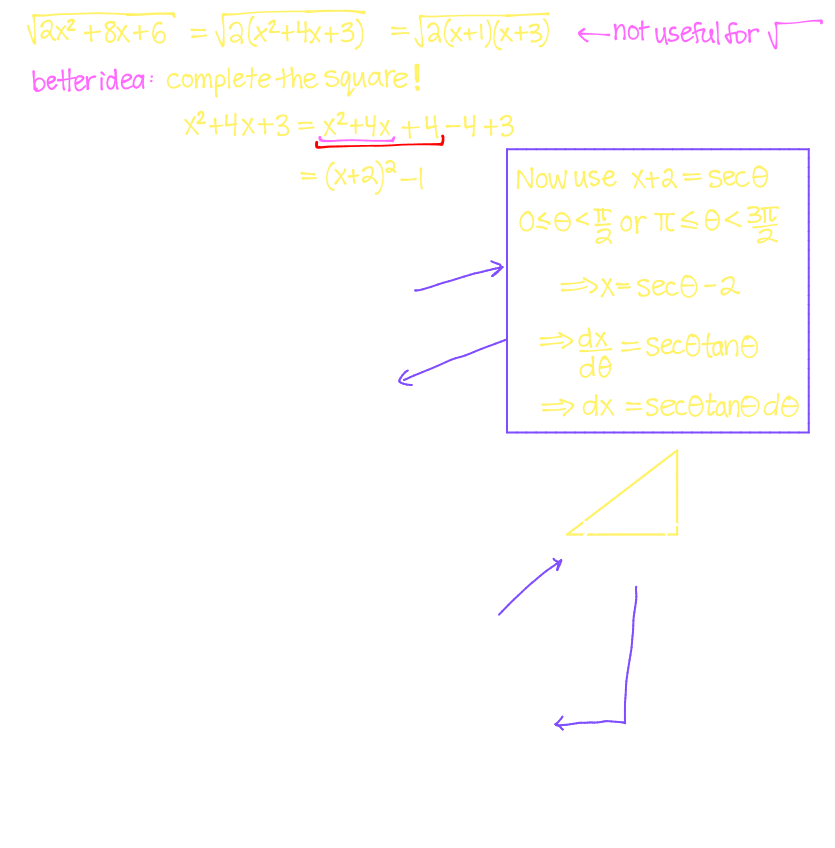
- ## [[Integrals of Rational Functions & Partial Fractions]]
	- ### Strategies for Integrating Rational Functions
		- **Recall:** a **Rational function** is of the form $f(x) \frac{N(x)}{D(x)}$ where the numerator $N(x)$ and the denominator $D(x)$ are both polynomials
	- ### Partial Fractions
		- Now we can consider a new way of expressing a rational function $\frac{N(x)}{D(x)}$ as a sum of simpler fractions
		- Before we can use this idea, we must, if necessary, reduce the integrand into a ^^proper^^ rational function, meaning one whose numerator $N(x)$ and denominator $D(x)$ satisfy
			- $$\text{deg}(N) < \text{deg}(D) $$
		- If $\text{deg}(N) < \text{deg}(D)$. the $\frac{N(x)}{D(x)}$ is called an **improper rational function**
		- We can use long division to turn any improper rational function into one that is proper
		- Example:
			- $$\int \frac{1}{x^2-1}$$
				- 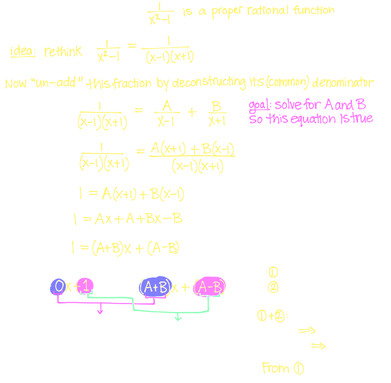
				- 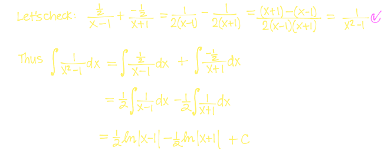
			- $$\int \frac{2x+3}{x^2+5x+6}$$
				- 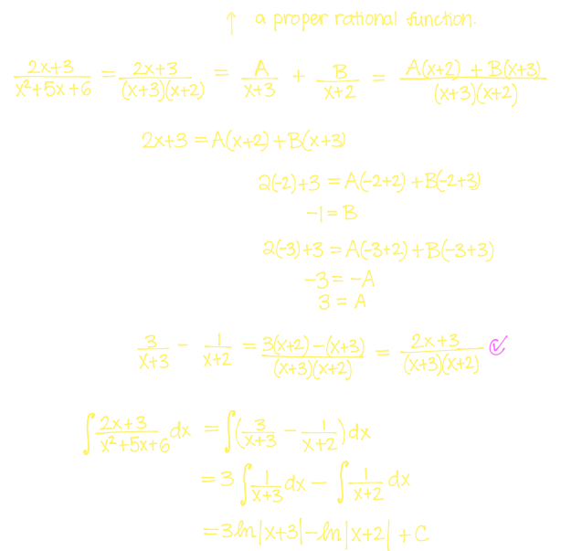
			- $$\int \frac{2x^3 - 4x^2 + 10x +1}{x^2 - 2x+5}$$
			-
				- 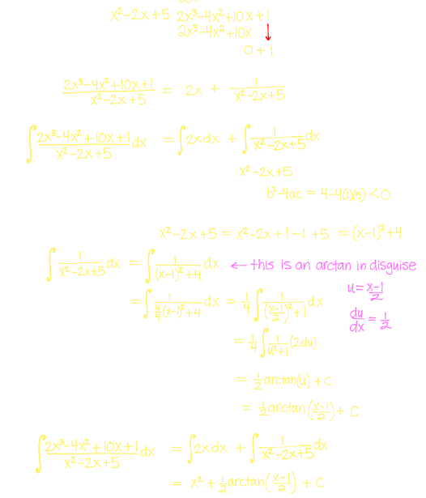{:height 623, :width 526}
	- ### Partial Fractions with Repeated Factors
		- Once you have used long division to obtain a proper rational function, you need to factor its denominator $D(x)$
		- Every polynomial can be factored into a product of **linear factors** (of the form $ax+b$) and **irreducible quadratic factors** (of the form $ax^2+bx+c$ where $b^2-4ac < 0$)
			- For each distinct **linear factor** of the denominator $D(x)$ - which may be a repeated factor (say, to the power $r$)
				- $$(ax+b)^r$$
			- the partial fraction decomposition will have $r$ terms corresponding to the factor $(ax+b)^r$:
				- $$\frac{A_1}{ax+b} + \frac{A_2}{(ax+b)^2}+... + \frac{A_r}{(ax+b)^r}$$
			- For each distinct **irreducible quadratic factor** of the denominator $D(x)$ - which may be repeated
				- $$(ax^2+bx+c)^r (\text{where } b^2-4ac < 0)$$
			- the partial fraction decomposition will have $r$ terms corresponding to the factor $(ax^2+bx+c)^r$
				- $$\frac{A_1}{ax^2+bx+c} + \frac{A_2}{(ax^2+bx+c)^2}+... + \frac{A_r}{(ax^2+bx+c)^r}$$
		- Example:
			- $$\int_2^3 \frac{2x+1}{x(x-1)^2}$$
				- 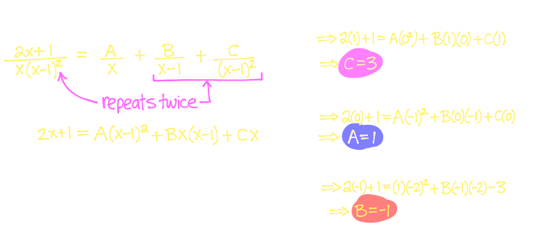
			- 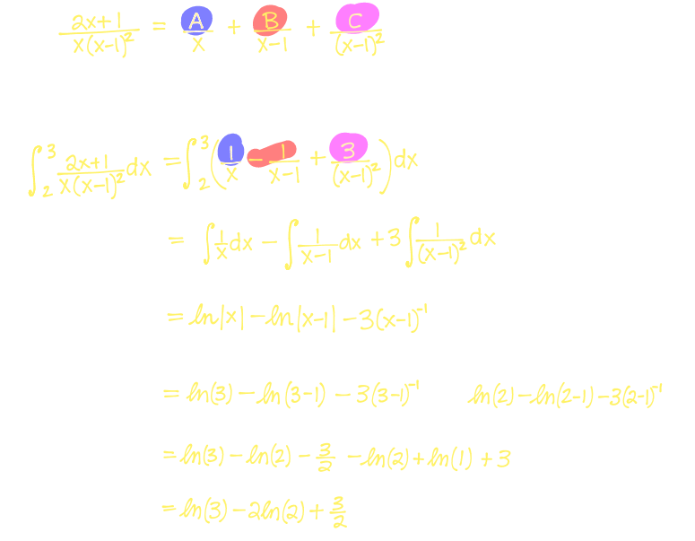
		- 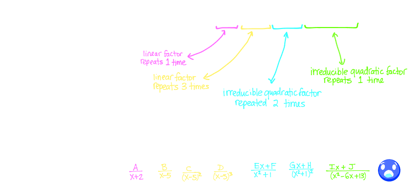
			- 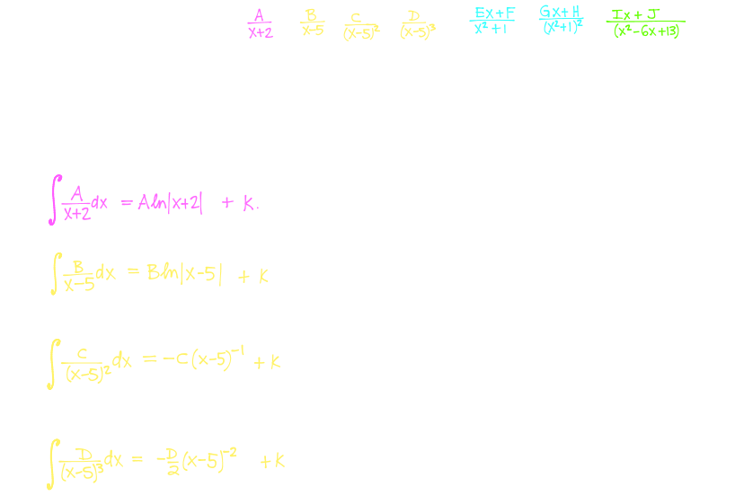
			- 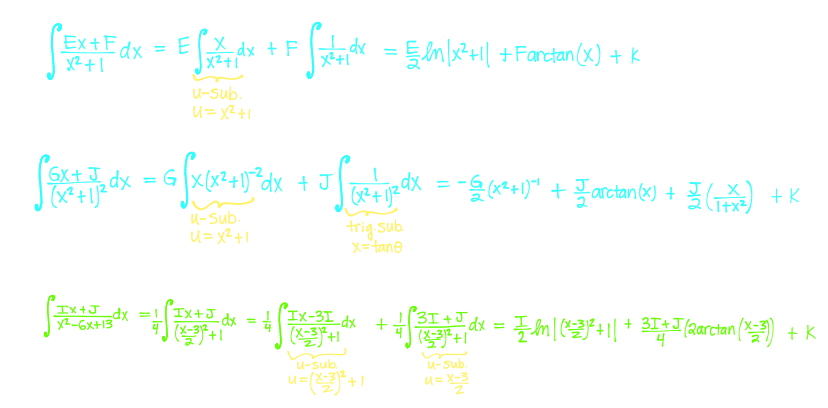
		- $$\int \frac{x^2+2x+1}{(x^2+1)^2}$$
			- 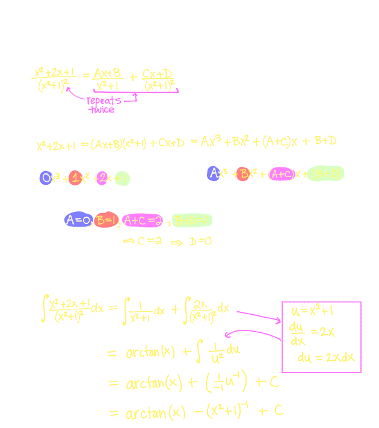