## [[Chapter 19: Orthogonality]] #MAT1341
	- ^^**Orthogonal Projection**^^
		- Let $W \subseteq \mathbb{R^n}$ as subspace
			- The orthogonal projection of $\vec{v} \in \mathbb{R^n}$ onto $W$, denoted by $\text{proj}_w(\vec{v})$, is a vector in $\mathbb{R^n}$ such that
				- $\text{proj}_w(\vec{v}) \in W$
				  logseq.order-list-type:: number
				- $\vec{v} - \text{proj}_w(\vec{v}) \perp W$ (i.e. the difference is orthogonal to every vector of $W$)
				  logseq.order-list-type:: number
				- 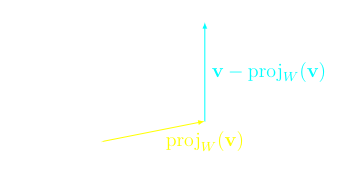
				- In the special case $W$ is a plane in $\mathbb{R^3}$, $\vec{v} - \text{proj}_w(\vec{v})$ is a normal to the plane
		- If $\{\vec{w}_1, ..., \vec{w}_m\}$ is an ^^orthogonal basis^^ of $W$, then
			- $$\text{proj}_w(\vec{v}) = \text{proj}_{w_1}(\vec{v}) + ... +   \text{proj}_{w_m}(\vec{v}) $$
			- Indeed $\text{proj}_{w_i}(\vec{v}) \in W  \ \forall  \ i$
				- So $\sum_{i=1}^m \text{proj}_{w_i}(\vec{v}) \in W$ since $W$ is closed under addition
			- For the second property it is enough to check:
				- $$\vec{v} - \text{proj}_{w_i}(\vec{v}) \perp W_i  \forall i \\ (\vec{v} - \sum_{i=1}^m \text{proj}_{w_i}(\vec{v})) \cdot W_i \\ = (\vec{v} - \text{proj}_{w_i}(\vec{v})) \cdot W_i  -  \sum_{i=1}^m \text{proj}_{w_i}(\vec{v}) \cdot W_i $$
				- $(\vec{v} - \text{proj}_{w_i}(\vec{v})) \cdot W_i = 0$ by the definition of $\text{proj}_{w_i}(\vec{v})$
				- $\sum_{i=1}^m \text{proj}_{w_i}(\vec{v}) \cdot W_i = 0$ because $\{\vec{w}_1, ..., \vec{w}_m\}$ is an orthogonal basis
		- **Warning**, the basis has to be ^^orthogonal^^!
			- Otherwise, the formula does not work
		- Example:
		  background-color:: blue
			- Consider $W = \text{span}\{(0,1,-2,1), (0,0,1,2), (0,-5,-2,1)\}$. Check this is an orthogonal basis. Find $\text{proj}_{w}(\vec{v})$ where $\vec{v} = (1,1,1,1)$
				- 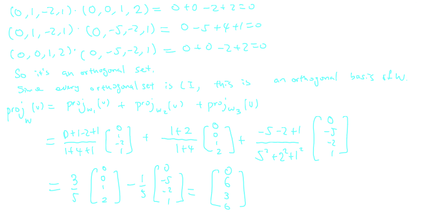
	- ^^**Theorem 19.3.3 - The Best Approximation Theorem**^^
		- Let $W$ be a subspace of $\mathbb{R^n}$ and let $\vec{v} \in \mathbb{R^n}$
		- Then $\text{proj}_{w}(\vec{v})$ is the best approximation to $\vec{v}$ by vectors of $W$, meaning that it's the vector in $W$ whose distance to $\vec{v}$ is the smallest
			- This distance is the smallest between $\vec{u}$ and vector in $W$
				- 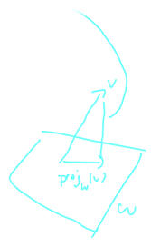
				- It minimizes $||\vec{v} - \vec{u}||, \vec{u} \in W$
				- When $\vec{u} = \text{proj}_{w}(\vec{u})$, this is the smallest
			-
		- This turns out that given any subspace of $\mathbb{R^n}$, we may always find an orthogonal basis
		- In fact, given any basis $\{u_1, ... u_m\}$ we can convert it to an orthogonal one by the **Gram-Schmidt Algorithm**
			- $\vec{w}_1 = \vec{u}_1$
			- $\vec{w}_2 = \vec{u}_2 - \text{proj}_{w_1}(\vec{u}_2)$
			- $\vec{w}_3 = \vec{u}_3 - \text{proj}_{w_1}(\vec{u}_3) - \text{proj}_{w_2}(\vec{u}_3)$
			- ...
			- $\vec{w}_m  = \vec{u}_m - \text{proj}_{w_1}(\vec{u}_m) - \text{proj}_{w_2}(\vec{u}_m) - ... - \text{proj}_{w_{m-1}}(\vec{u}_m)$
		- Example:
		  background-color:: blue
			- Perform the Gram-Schmidt algorithm on the set:
				- $$\{(1,1,1,1), (6,0,0,2), (-1,-1,2,4)\}$$
					- 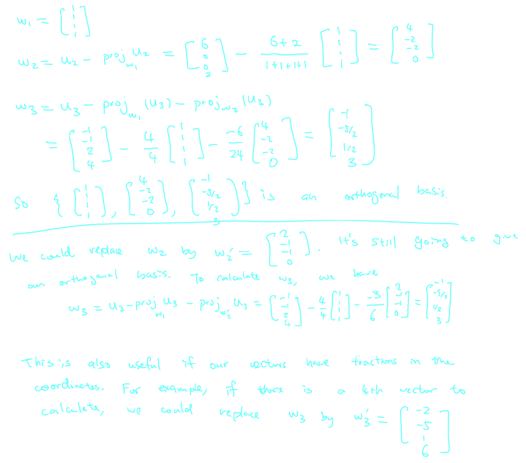
			- Let $W = \text{Null})(A)$, where $A = \begin{bmatrix} 1 & 1 & 1 & 0 \\ 2& 1 & 0&1\end{bmatrix}$
				- Find $\text{proj}_{w}(\vec{u})$, where $\vec{u} = \begin{bmatrix} 0 \\ -1 \\ 1 \\ 1 \end{bmatrix}$
					- 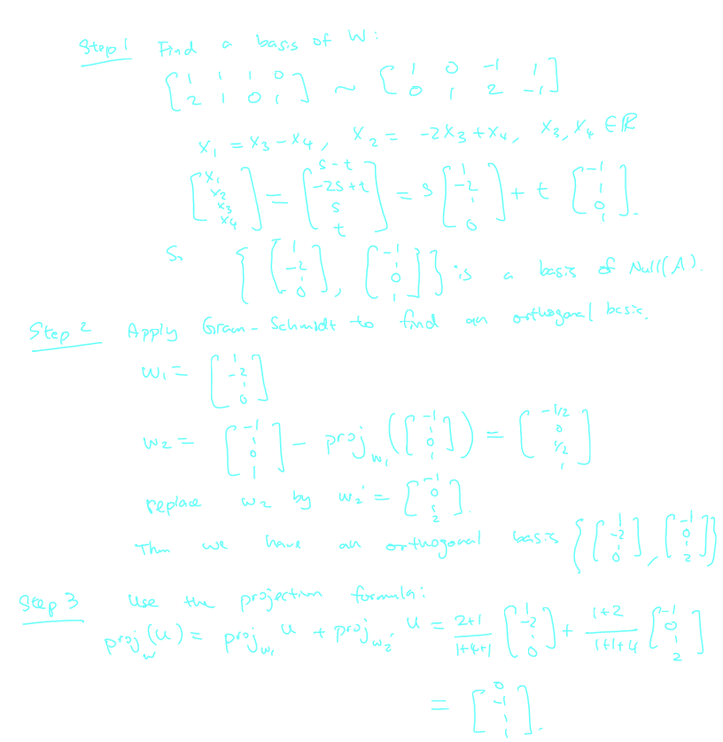
- ## [[Chapter 20: Orthogonal Complements]] #MAT1341
	- ^^**Definition 20.1.1**^^
		- Let $U$ be a subspace of $\mathbb{R^n}$
		- The *orthogonal complement* of $U$ is the set, denoted $U^\perp$ and defined by
			- $$U^\perp = \{\vec{v} \in \mathbb{R^n} | \vec{u} \cdot \vec{v}  = 0 \forall \vec{u} \in U\}$$
		- If $U$ is a plane in $\mathbb{R^3}$, then $U^\perp$ gives the normal vectors of the plane
			- 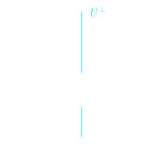
	- ^^**Theorem 20.1.5 - Properties of the Orthogonal Complement**^^
		- Let $U$ be a subspace of $\mathbb{R^n}$
			- $U^\perp$ is a subspace of $\mathbb{R^n}$$
			  logseq.order-list-type:: number
				- $U^\perp = \{\vec{v} \in \mathbb{R^n} | \vec{u} \cdot \vec{v}  = 0 \forall \vec{u} \in U\}$ by definition
					- If $\vec{u} \in U$, then $\vec{u} \cdot \vec{0} = 0$
						- $\vec{0} \in U^\perp$
					- Suppose $\vec{v}_1, \vec{v}_2 \in U^\perp$, then $\vec{v}_1 \cdot \vec{u} = 0$ and $\vec{v}_2 \cdot \vec{u} = 0$ for any  $\vec{u} \in U$
						- $(\vec{v}_1 + \vec{v}_2) \cdot \vec{u} = \vec{v}_1 \cdot \vec{u} + \vec{v}_2 \cdot u = 0 + 0 = 0$
							- $\vec{v}_1 + \vec{v}_2 \in U^\perp$
					- Suppose $\vec{v} \in U^\perp$ and $c \in \mathbb{R}$,
						- Then $(c\vec{v}) \cdot \vec{u} = c (\vec{v} \cdot \vec{u}) = c 0 = 0$     $\forall \vec{u} \in U$
							- $c\vec{u} \in U^\perp$
						- Therefore by the subspace test, $U^\perp$ is a subspace of $\mathbb{R^n}$
			- $(U^\perp)^\perp = U$
			  logseq.order-list-type:: number
				- If $\vec{v} \in U^\perp$, $\vec{u} \in U$ , then $u \cdot v = 0$ by definition
				- So $u$ is orthogonal to any element of $U^\perp$
					- $\vec{u} \in (U^\perp)^\perp$
			- $\text{dim}(U) + \text{dim}(U^\perp) = n$
			  logseq.order-list-type:: number
				- An element in $U^\perp$ is also in the null space of $A$ where the rows of $A$ are a basis of $U$
				- If $U = \text{span}\{\vec{v}_1, ... \vec{v}_m\}$ and $\vec{v} \in U^\perp$, then $\vec{v}_i \cdot \vec{v} = 0 \ \forall i$
					- $$\Leftrightarrow \begin{bmatrix} \vec{v}_1^T \\ \vec{v}_2^T \\ ... \\ \vec{v}_m^T\end{bmatrix} \vec{v} = 0$$
				- By the rank-nullity theorem, $\text{rank}(A) + \text{dim Null}(A) = n \Rightarrow \text{dim} U + \text{dim} U^\perp = n$
		- Example:
		  background-color:: blue
			- Consider $W = \{(x,y,z,w) \in \mathbb{R^4}| x-y-w = 0\}$. Find $W^\perp$
				- 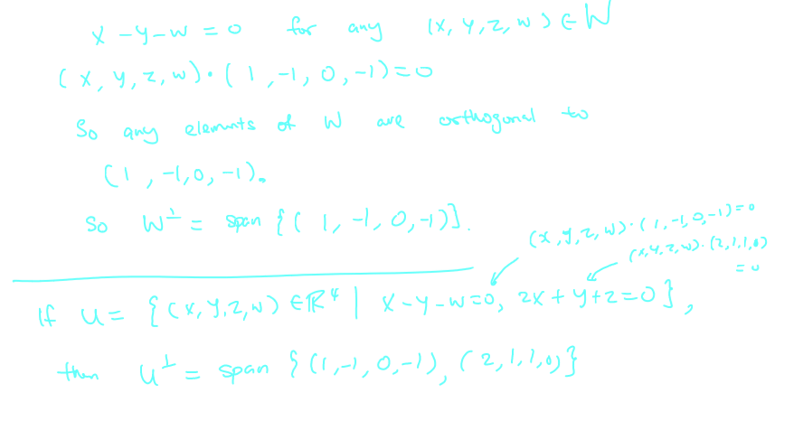
	- To find $U^\perp$ is the same as finding $\text{Null}(A^\perp)$ where the columns of $A$ are basis elements of $U$
	- In other words, given $U = \text{span}\{\vec{u}_1, ..., \vec{u}_m\}$, we form a matrix whose rows are $\vec{u}_1, ..., \vec{u}_m$, then the null space of this matrix is $U^\perp$
		- 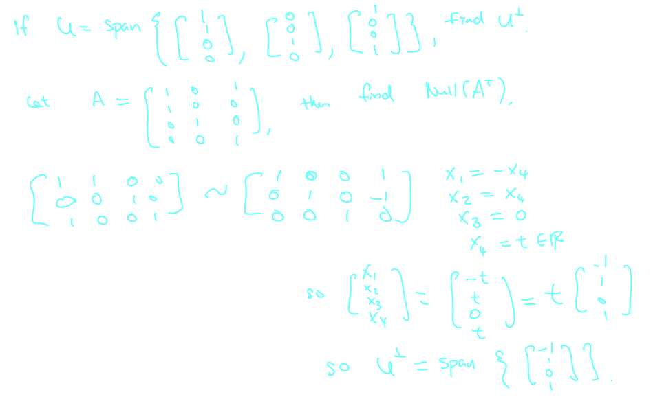
	- ^^**Orthogonal Projection - an encore**^^
		- Suppose we want to find $\text{proj}_{w}(\vec{u})$ where $W = \text{Col}(A)$, $A = [\vec{v}_1 \ ... \ \vec{v}_m]$
			- $$\text{proj}_{w_2}(\vec{u}_m) = \sum_{i=1}^m c_i \vec{v}_i = A \begin{bmatrix}c_1 \\ ... \\ c_m \end{bmatrix}$$
		- In the previous chapter, we use **Gram-Schmidt** to find an to find an orthogonal basis of $W$, then use the projection formula to find $\text{proj}_{w}(\vec{u})$
		- We can find $c_i$ by solving $A^T A\vec{x} = A^T \vec{v}$
		- This allow us to find $\text{proj}_{w}(\vec{u})$ using the projection formula
			- 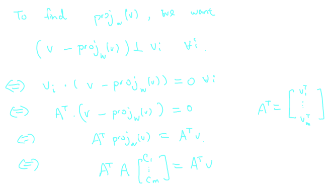
		- Example:
		  background-color:: blue
			- Find $\text{proj}_{w}(\vec{u})$, where $W = \text{span} \begin{Bmatrix} \begin{bmatrix} 1 \\ -2 \\ 1 \\ 0 \end{bmatrix}, \begin{bmatrix} -1 \\ 1 \\ 0 \\ 1 \end{bmatrix} \end{Bmatrix}$ and $\vec{u} = \begin{bmatrix} 2 \\ 1 \\ 0 \\ -1 \end{bmatrix}$
				- 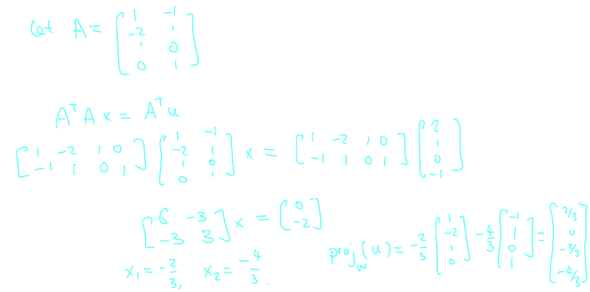
	- ^^**Application - Least Squares Method**^^
		- 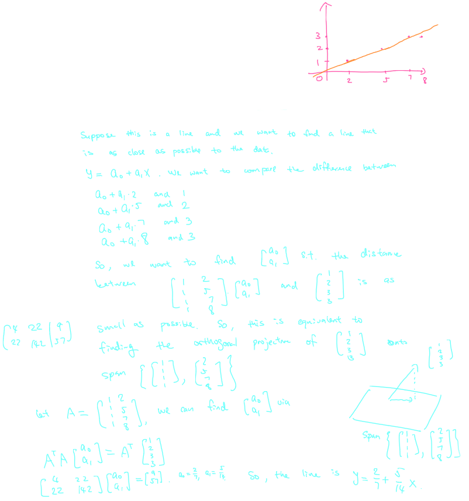
- ## [[Chapter 21: Determinants]] #MAT1341
	- If $A$ is an $1 \times 1$ matrix, $A = [a]$, we define $\text{det}(A) = a$
	- If $A$ is an $2 \times 2$ matrix, $A = \begin{bmatrix} a & b \\ c & d\end{bmatrix}$, we define $\text{def}(A) = ad - bc$
		- All matrices in order to define the determinant
	- ^^**Definition 21.1.1**^^
		- If $A =[a_{ij}]$ is an $n \times n$ matrix, we define $\text{det}(A)$ by expansion in the first row:
			- $$\text{def}(A) = a_{11}\text{def}(A) - a_{12}\text{def}(A_{12}) + ... + (-1)^{n+1}$$
		- where $A_{ij}$ is the $(n-1) \times (n-1) matrix obtained from $A$ after deleting the $i$-th row and the $j$-th column
		- Note that sometimes we write $|A| = \text{det}(A)$
	- Example:
	  background-color:: blue
		- Calculate $\text{det}(A)$ where:
			- $$A = \begin{bmatrix} 1 & 3 & 5 \\ 2 & 1 & 1 \\ 3 & 4 & 2\end{bmatrix}$$
			- 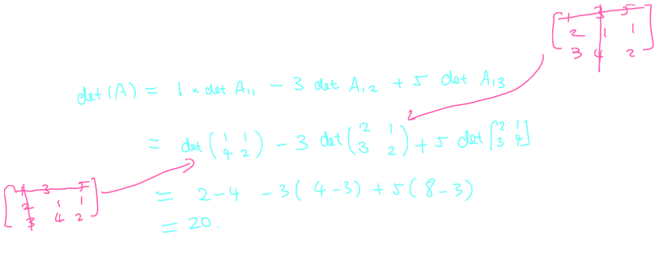
	- In fact, we can obtain the same answer by expanding in the 2nd row and the 3rd row
	- ^^**Theorem 21.2.1**^^
		- Let $A = [a_{ij}]$. Then the determinant can be calculated via the co-factor expansion along row $i$, for any $i$:
			- $$\text{det}(A) = (-1)^{i+1}a_{i1} + (-1)^{i+2}a_{i2}\text{det}(A_{i2})+ ... + (-1)^{i+n}a_{in}\text{det}(A_{in})$$
		- and similarly, the determinant equals the co-factor expansion along column $j$, for any $j$:
			- $$\text{det}(A) = (-1)^{1+j}a_{1j} + (-1)^{2+j}a_{2j}\text{det}(A_{2j})+ ... + (-1)^{n+j}a_{nj}\text{det}(A_{nj})$$
		- Example:
		  background-color:: blue
			- Find $\text{det}(A)$ by expanding in the 2nd and 3rd row where
				- $$A=\begin{bmatrix}1 & 3 & 5 \\ 2 & 1 & 1 \\ 3 & 4 & 2 \end{bmatrix}$$
					- 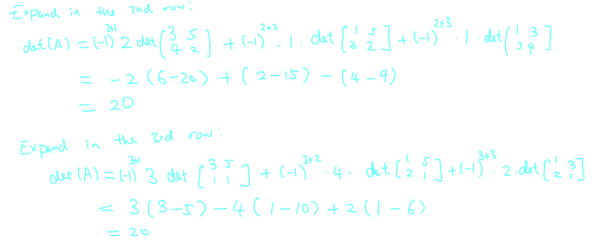
			- Find $\text{det}(A)$ by expanding in the 2nd column where
				- $$A=\begin{bmatrix}2 & 0 & 5 \\ 1 & 7 & 2 \\ 3 & 0 & -1 \end{bmatrix}$$
					- 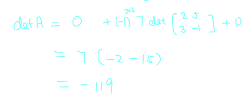
			- Find $\text{det}(A)$ where
				- $$A=\begin{bmatrix}5 & 3 & -2 & 1 \\ 0 & 1 & 15 & -7 \\ 0 & 0 & 2 & 11 \\ 0 & 0 & 0 & -5 \end{bmatrix}$$
					- 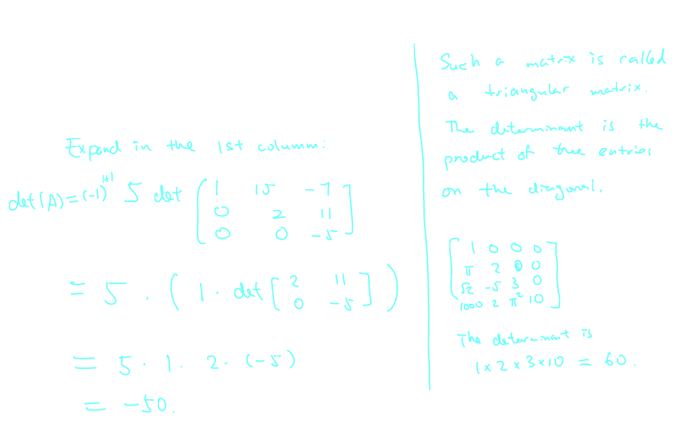
	- When one of the columns or rows is 0, then the determinant is 0
		- $$\text{det} \begin{bmatrix}1 & 2 & 3 & 4 \\ -1 & -1 & 2 & 7 \\ 0 & 0 & 0 & 0 \\ 1 & 2 & 5 & 6\end{bmatrix} = 0$$
	- ^^**Theorem 21.2.1**^^
		- Let $A$ be an $n \times n$ matrix and suppose $B$ is obtained from $A$ via an elementary row operation. Then
			- If the row operation is *interchanging two rows* then $\text{det}(B) = - \text{det}(A)$
			  logseq.order-list-type:: number
			- If the row operation is *multiplying a row of*$A$ *by a scalar* $r \ne 0$ then $\text{det}(B) = r\text{det}(A)$
			  logseq.order-list-type:: number
			- If the row operation is *adding a multiple of one row to another* then $\det(B) = \det(A)$
			  logseq.order-list-type:: number
		- Example:
		  background-color:: blue
			- Calculate $\det(A)$ where:
				- $$A=\begin{bmatrix}1 & -3 & 2 & -4 \\ -4 & 12 & -4 & 5\\ 2 & -5 & 4 & -3 \\ -3 & 10 & -1 & 7 \end{bmatrix}$$
				- 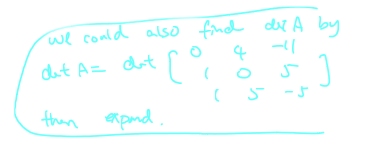
				- 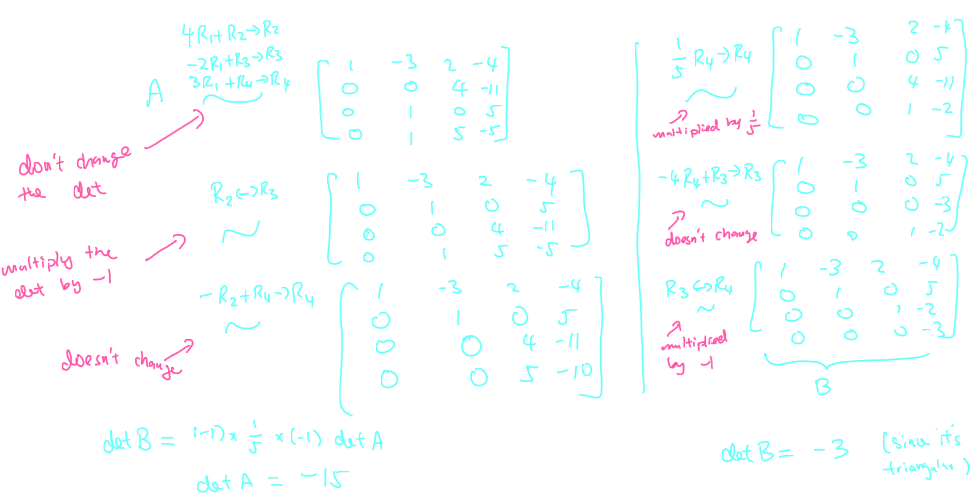
			-
	- ^^**More useful facts:**^^
		- If a row or a column has a common factor, we can pull it out 
		  logseq.order-list-type:: number
			- $$\det = \begin{bmatrix}ka & kb & kc \\ d & e & f \\ g & h & i \end{bmatrix} = k \cdot \det \begin{bmatrix}a & b & c \\ d & e & f \\g & h & i\end{bmatrix}$$
		- $\det(kA) = k^n \det(A)$ where $A$ is $n \times n$
		  logseq.order-list-type:: number
			- $$\det \begin{bmatrix} ka & kb \\ kc & kd\end{bmatrix} = k^2 \cdot \det \begin{bmatrix} a & b \\ c & d\end{bmatrix}$$
		- A matrix is invertible if and only if $\det(A) \ne 0$ [The RREF of $A$ is triangular, with non-zero entries on the diagonal.]
		  logseq.order-list-type:: number
		- $\det(A) = 0$ if and only if the rows or the columns are LD [The RREF of $A$ would have a zero row]
		  logseq.order-list-type:: number
		- $\det(AB) = \det(A) \det(B)
		  logseq.order-list-type:: number
		- If $A$ is invertible,
		  logseq.order-list-type:: number
			- $$AA^{-1} = I_n \Rightarrow (\det A)(\det A^{-1}) = 1 \Rightarrow 1 \Rightarrow \det A^{-1} = \frac{1}{\det A}$$
		- $\det(A^T) = \det(A)$
		  logseq.order-list-type:: number
- ## [[Chapter 22: Eigenvalues and Eigenvectors]]
	- ^^**Definition 22.1.1**^^
		- Let $A$ be a square matrix of dimension $n \times n$. An ^^eigenvector^^ of $A$ is a *nonzero* vector $\vec{v} \in \mathbb{R^n}$ such that:
			- $$A\vec{v} = \lambda \vec{v}$$
		- then $\vec{v}$ is called an **eigenvector** of $A$ and $\lambda$ is its corresponding ^^eigenvalue^^
			- $\lambda$ is a scalar
		- Example:
			- Let $A = \begin{bmatrix}1 & 6\\ 5 & 2 \end{bmatrix}$ , $\vec{v} = \begin{bmatrix}6\\ -5 \end{bmatrix}$. Show that $\vec{v}$ is an eigenvector of $A$. What is it's eigenvalue?
				- 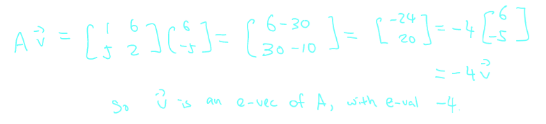
			- Let $A = \begin{bmatrix}1 & 6\\ 5 & 2 \end{bmatrix}$ , $\vec{u} = \begin{bmatrix}3\\ -2 \end{bmatrix}$. Is $\vec{u}$ a eigenvector of $A$?
				- 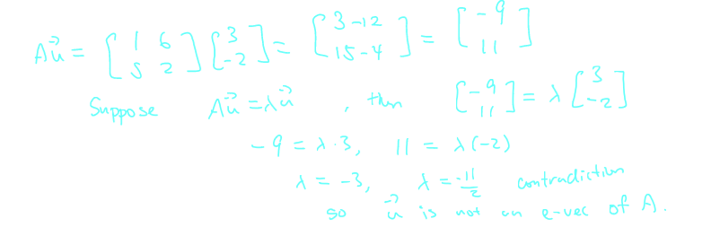
			- **Remark:** Eigenvalue can be zero
			- Let $A = \begin{bmatrix}1 & -1\\ -1 & 1 \end{bmatrix}$ , $\vec{v} = \begin{bmatrix}1\\ 1 \end{bmatrix}$
				- 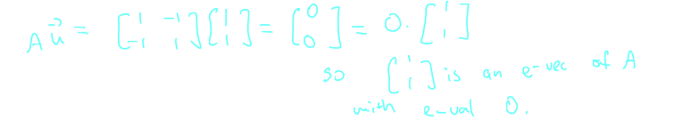
-