## [[Chapter 22: Eigenvalues and Eigenvectors]] #MAT1341
	- If $\text{Null}(A) \ne \{0\}$, then every nonzero element in $\text{Null}(A)$ is an eigenvector with eigenvalue 0
		- If $\vec{v} \in \text{Null}(A)$, then $A\vec{v} = \vec{0} = 0 \cdot \vec{v}$
		- If $\text{Null}(A) = \{0\}$, then 0 is not an eigenvalue
	- Example:
	  background-color:: blue
		- Let $A = \begin{bmatrix} 1 & 6 \\ 5 & 2\end{bmatrix}$. Find all eigenvectors of $A$ whose eigenvalue is 7
			- 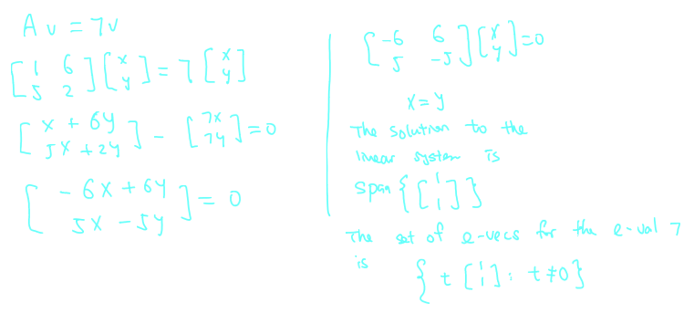
	- **How to find eigenvalues of a matrix** $A$ **?**
		- If $\lambda$ is an eigenvalue of $A$, then $\exists \vec{u} \ne 0$ such that
			- $$A\vec{u} - \lambda \vec{u} =0$$
			- $$(A - \lambda I)\vec{u} =0$$
		- $\text{Null}(A - \lambda I) \ne \{0\}$
		- This is equivalent to $A - \lambda I$ in not invertible
		- This in turn is equivalent to $\text{det}(A - \lambda I) = 0$
			- 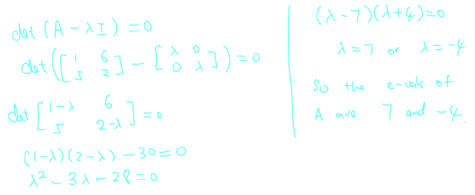
	- ^^**Definition 22.2.1**^^
		- The polynomial $\text{det}(A - \lambda I_n)$ is called the ^^characteristic polynomial^^ of $A$
			- ($\lambda$ is an unknown)
			- The zeroes of the characteristic polynomial of $A$ give us the eigenvalues of $A$
			- The degree of this polynomial is equal to $n$
			- In particular, $A$ has at most $n$ eigenvalues
			- It is possible for the characteristic polynomial to have a repeated root
		- Example:
		  background-color:: blue
			- Find all the eigenvalues of $A = \begin{bmatrix} 1 & -1 \\ 0 & 1 \end{bmatrix}$
				- 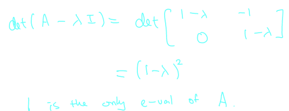
		- The exponent of an eigenvalue in the characteristic polynomial is called the **algebraic multiplicity**
		- In the example above, 1 has algebraic multiplicity equal to 2
		- Example:
			- Find all the eigenvalues of $A = \begin{bmatrix} 4 & -1  & 6\\ 2 & 1 & 6 \\2 & -1 & 8 \end{bmatrix}$
				- 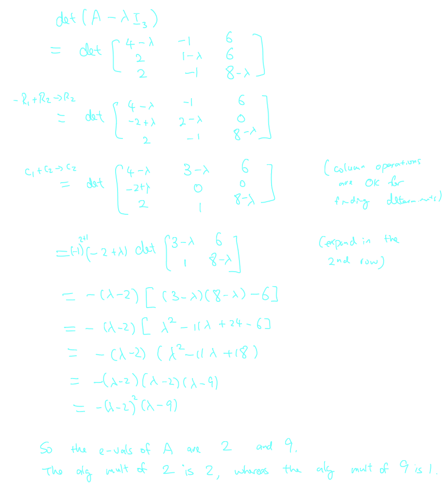
	- **Given an eigenvalue, how to find eigenvectors?**
	- ^^**Definition 22.3.1**^^
		- Let $\lambda$ be an eigenvalue of $A$
			- Then the subspace (any null space is always a subspace)
				- $$E_{\lambda} = \text{Null}(A - \lambda I) = \{\vec{u} \in \mathbb{R^n} | A \vec{u} = \lambda \vec{u}\}$$
			- is called the $\lambda$-eigenspace of $A$
			- Its *nonzero* elements are eigenvectors of $A$ corresponding to eigenvalue $\lambda$
		- The dimension of $E_\lambda$ is called the ^^geometric multiplicity^^ of $\lambda$
		- **Fact:** geometric multiplicity $\le$ algebraic multiplicity
		- Example:
			- Let $A = \begin{bmatrix} 1 & -1 \\ 0 & 1 \end{bmatrix}$. Find $E_1$
				- 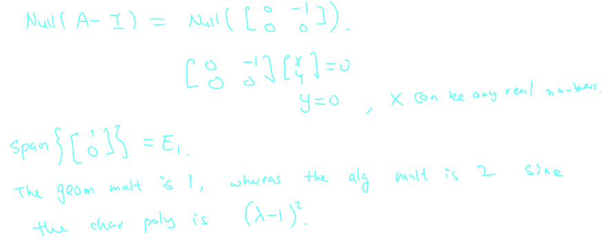
			- Find a basis for each eigenspace of $A = \begin{bmatrix} 4 & -1  & 6\\ 2 & 1 & 6 \\2 & -1 & 8 \end{bmatrix}$
				- 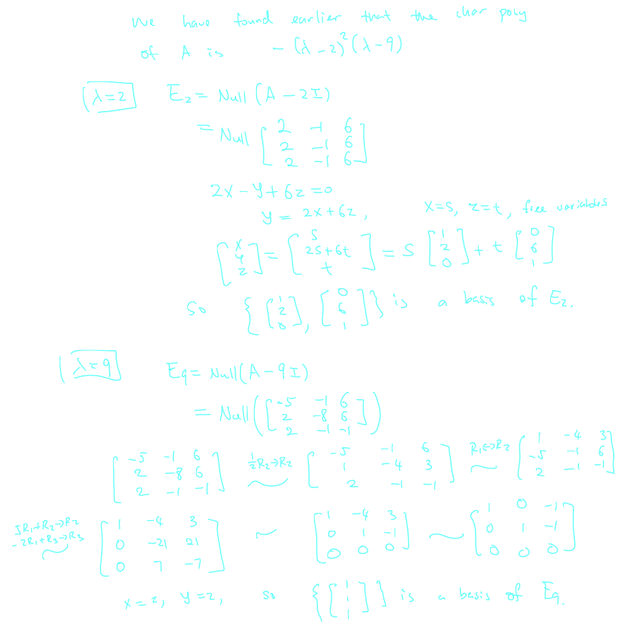
		- **Fact:** For each eigenvalue, $E_\lambda \ne \{0\}$, so $\exists$ at least one eigenvector, $\text{dim} E_\lambda \ge 1$
		- If $\lambda_1, \lambda_2,..., \lambda_k$ are ^^distinct eigenvalues^^ ($\lambda_i \ne \lambda_j$ if $i \ne j$) of $A$, and $\vec{u}_i$ are eigenvectors associated to $\lambda_i$, $i = 1,...,k$, then $\{\vec{u}_1,..., \vec{u}_k\}$ is a LI set
			- $A \vec{u}_i = \lambda_i \vec{u}_i$
			- We prove this for $k = 2$
			- Suppose $\vec{u}_1$ and $\vec{u}_2$ are eigenvectors for $\lambda_1$ and $\lambda_2$ with $\lambda_1 \ne \lambda_2$
			- Suppose $c_1\vec{u}_1 + c_2\vec{u}_2 = 0$ (Eqn 1) for some $c_1, c_2 \in \mathbb{R}$
			- Multiply both sides by $A$:
				- $A(c_1\vec{u}_1 + c_2\vec{u}_2 ) = A0$
				- $c_1 A \vec{u}_1 + c_2 A \vec{u}_2 = 0$
				- $c_1 \lambda_1 \vec{u}_1 + c_2 \lambda_2 \vec{u}_2 = 0$ (Eqn 2)
			- Eqn (1) : $c_1\vec{u}_1 = - c_2\vec{u}_2$
				- Substitute this in Eqn (2):
					- $\lambda_1(-c_2 \vec{u}_2) + c_2 \lambda_2 \vec{u}_2 = 0$
					- $(- \lambda_1 + \lambda_2)c_2 \vec{u}_2 = 0$
			- But $\lambda_1 \ne \lambda_2$, so $c_2\vec{u}_2 = 0$
				- $u_2$ is an eigenvector, so $\vec{u}_2 \ne 0$
					- $\Rightarrow c_2 = 0$
				- So $c_1 \vec{u}_1 = 0$ and $c_1 = 0$
					- $\Rightarrow \{u_1, u_2\}$ is LI
- ## [[Chapter 23: Diagonalizability]] #MAT1341
	- ^^**Definition 22.4.2**^^
		- The $n \times n$ matrix $A$ said to be ^^diagonalizable^^ over the reals if there is a basis of $\mathbb{R^n}$ consisting entirely of eigenvectors of $A$
		- Such a basis is called an *eigen-basis*
		- **Remark:** If $A$ has $n$ distinct values, then the corresponding eigenvectors are LI $\Rightarrow$ we have an eigen-basis of $\mathbb{R^n}$
			- 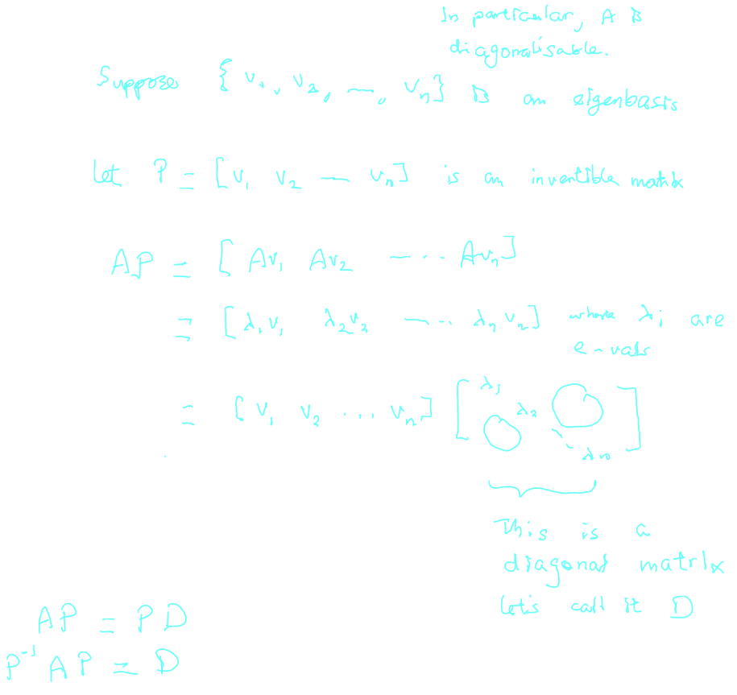
		- Example:
			- $$A = \begin{bmatrix} 3 & 6 & -8 \\ 0 & 0 & 6 \\ 0 & 0 & 2 \end{bmatrix}$$
				- 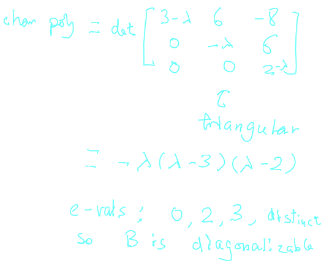
			- $$A = \begin{bmatrix} 1 & -1 \\ 0 & 1 \end{bmatrix}$$
				- 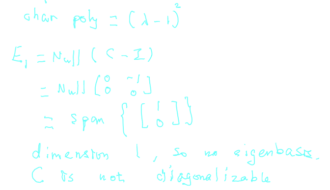
				-
			- $$A = \begin{bmatrix} 4 & 1 & -1 \\ 2 & 5 & -2 \\ 1 & 1 & 2 \end{bmatrix}$$
				- 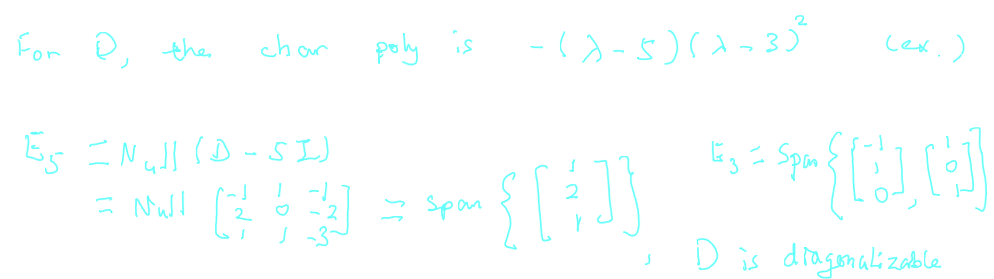
			- Find $A = \begin{bmatrix} 4 & 2 \\ 3 & -1 \end{bmatrix}$. Find $A^{2017}$
				- 
					- 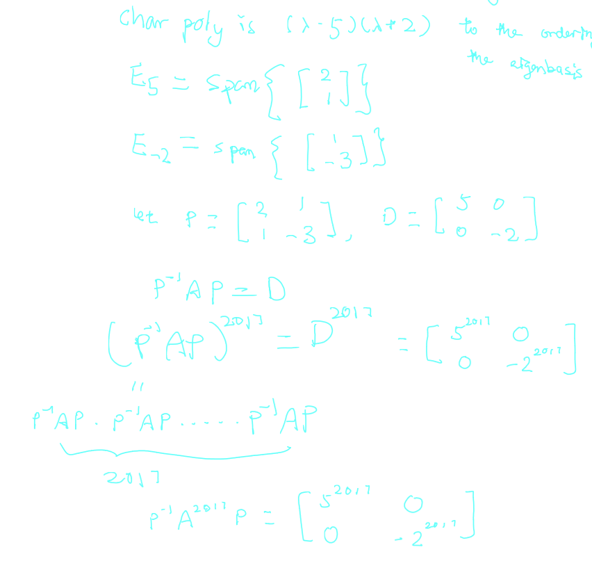
					- 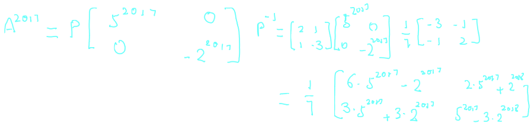
		- **Remark:** Complex number: $x^2 + 1 = 0$ does not have a solution in $\mathbb{R}$
			- We define $i$ to be a solution to this equation, where $i^2 = -1$
			- Example:
				- Are the following matricies diagonalizable?
					- $$A = \begin{bmatrix}0 & -1 \\ 1 & 0 \end{bmatrix}, B = \begin{bmatrix}1 & 1 \\ -1 & 1\end{bmatrix}$$
						- 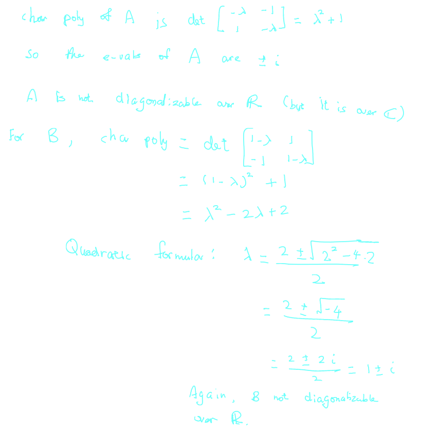
- ## [[Chapter 24: Linear Transformations]]
	- ^^**Definition 24.0.1**^^
		- Let $U$ and $V$ be vector spaces
		- A ^^linear transformation^^ $T$ from $U$ to $V$ (written $T:U \rightarrow V$) is a map such that
			- $T(\vec{x} + \vec{y}) = T(\vec{x}) + T(\vec{y}) \forall \vec{x}, \vec{y} \in U$
			  logseq.order-list-type:: number
			- $T(c\vec{x}) = cT(\vec{x}) \forall c \in \mathbb{R}$ and $\forall \vec{x} \in U$
			  logseq.order-list-type:: number
		- In other words, addition and multiplication by scalar are preserved under $T$
		- We always have $T(\vec{0}) = \vec{0}$
			- 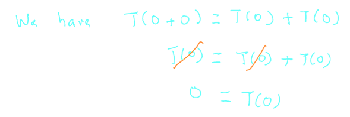
		- Example:
			- Let $A$ be an $m \times n$ matrix. Define the map: $T_A: \mathbb{R^n} \rightarrow \mathbb{R^m}$ by $T_A(\vec{u}) = A\vec{u}$
				- 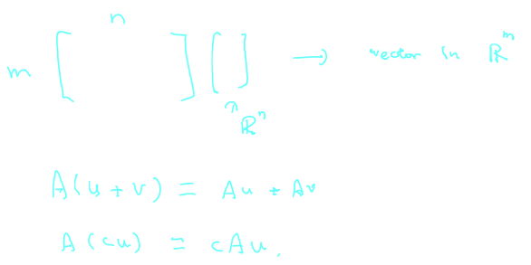
			- Show that the map $T: \mathbb{R^2} \rightarrow \mathbb{R^2}$ given by $T(x,y) = (x+1, xy)$ is not a linear transformation
				- 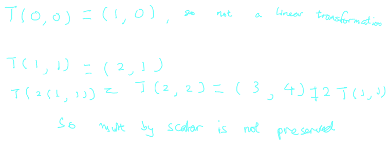
				-
	-
	-
	-