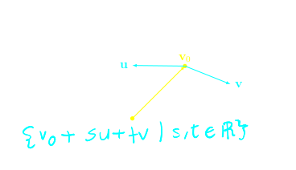

## [[Chapter 2: Vector Geometry]] (CONT.) #MAT1341
	- ### Orthogonal projection
		- Let u be a ^^non-zero^^ vector in $\mathbb{R^n}$
		- If $v$ is a vector in $\mathbb{R^n}$, we define the orthogonal projection of $v$ onto $u$ denoted by:
			- $$proj_u(v)$$
		- is the unique vector which satisfies
			- $proj_u(v)$ is parallel to $u$
			- $v-proj_u(v) \perp u$ (is orthogonal to $u$)
			- {:height 224, :width 303}
		- We see $v$ as a sum
			- 
		- Using either trigonometry or just solving directly from the above two conditions we get
			- $$proj_u(v) = \frac{v\cdot u}{|u^2|}u$$
			- Proof:
			  background-color:: blue
				- {:height 295, :width 488}
		- Example:
		  background-color:: blue
			- If $u = (1,2), v = (3,-1). Find $proj_u(v)$ and $proj_v(u)$
				- {:height 428, :width 265}
- ## [[Chapter 3: Lines and Planes]] #MAT1341
	- ### Parametric Equations
		- In $\mathbb{R^n}$ we can describe a line using parametric equations
		- A line going through the tip of $v_0$ such that $d$ is a vector parallel to the direction of L can be described as the set:
		- {:height 124, :width 490}
		- Any point on this line L can be written as $v_0 + t\textbf{d}$ where $$t \in \mathbb{R}$$
		- 
			- Example
			  background-color:: blue
				- Find the parametric equation of the line in $R^2$ passing through $P=(1,2)$ and $Q = (3, -2)$
				- 
		- A line in $\mathbb{R^2}$ can be described by a Cartesian equation as well
			- 
			- Example
			  background-color:: blue
				- Find the intersection of $L_1 = \{(1,2) + t(-1,1))| t \in \mathbb{R}\}$ and $L_2: y = 2x -1$
				- 
		- In $\mathbb{R^2}$, two distinct line, they are either parallel or have an intersection
			- 
		- In $\mathbb{R^3}$, two distinct can be ^^parallel^^ to each other, or they can have an ^^intersection^^, or they are ^^skewed^^ (they are not parallel and lie on two planes)
			- {:height 252, :width 243}
			- Example
			  background-color:: blue
			  collapsed:: true
				- 
		- A plane $\mathbb{R^3}$ has the **Cartesian equation** of the form
			- $$ax + by + cz = d$$
			- Where $a, b, c, d \in \mathbb{R}$
			- 
		- There is a vector in $\mathbb{R^3}$ that is $\perp$ to the plane
		- Called the **normal vector** of the plane, and passes through $v_0$
		- Given another point $\textbf{v} = (x,y,z)$ then $v - v_0 \in n$ We have
			- $(v - v_0) \cdot n = 0$
			- $v\cdot n - v_0 \cdot n = 0$
			- $v\cdot n = v_0 \cdot n$
		- So if $\textbf{n} = (a,b,c)$, then
			- $(x,y,z) \cdot (a,b,c)=v_0 \cdot n$
			- $ax + by + cz = v_0 \cdot n$
			- $\therefore$ Given $v_0$ and $n$ we can find the equation for a plane
			- Example
			  background-color:: blue
			  collapsed:: true
				- Find the Cartesian of the plane passes $v_0 =(0,1,0)$ with normal vector $n=(-1,2,2)$
				- 
				-
		- Suppose we are given a point $v_0$ in the plane and two vectors $u$ and $v$ that are parallel to the plane
			- The we can describe the plane parametrically
			- 
				- $u$ and $v$ should not be parallel to each other
			- Example
			  background-color:: blue
				- Find the parametric equation for the plane $2x+y-z=5$
				- 
			-
	- ### Cross Products
	  collapsed:: true
		- Given $\textbf{u} = (a,b,c)$ and $\textbf{v}=(x,y,z)$ in $\mathbb{R^3}$, the **cross product** of u and v is denoted by
		  id:: 64ff3c51-edb3-413a-8eff-3fcdf25b0dc2
			- $$u \times v = \begin{vmatrix} \hat{i} & \hat{j} &\hat{k} \\ a & b & c \\ x & y & z \end{vmatrix} =  \hat{i}(bz-cy) - \hat{j}(az -cx) + \hat{k}(ay-bx)$$
			- $\; \; \quad \qquad \qquad \qquad \qquad \qquad \qquad = (bz-cy, cx -az, ay-bx)$
-
-