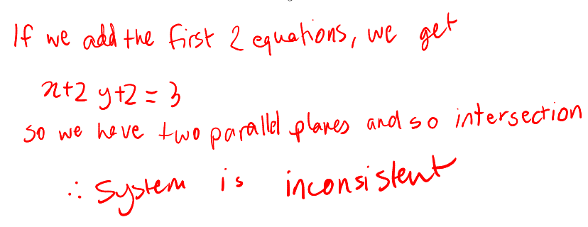
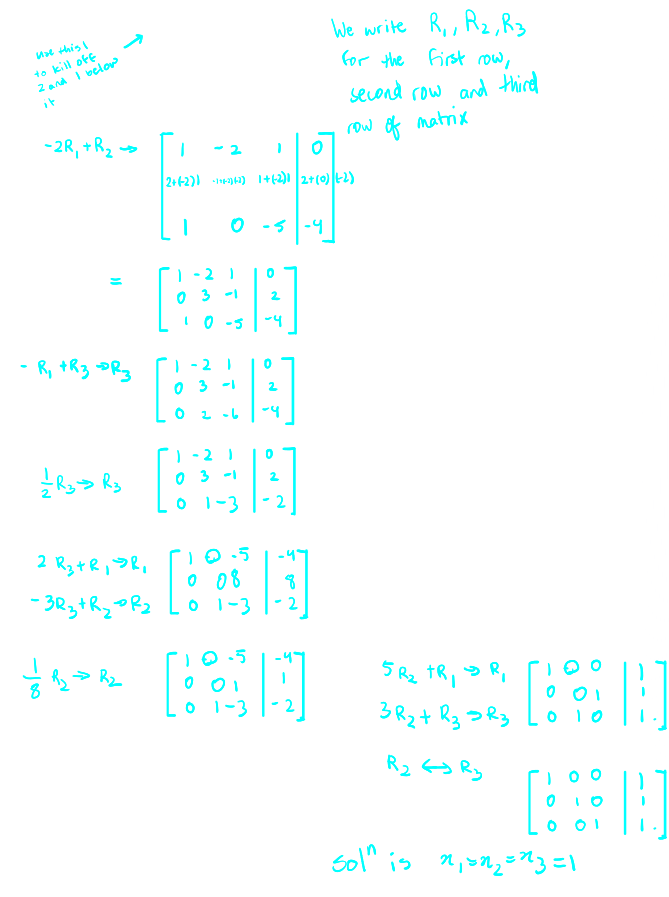
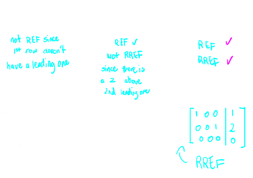
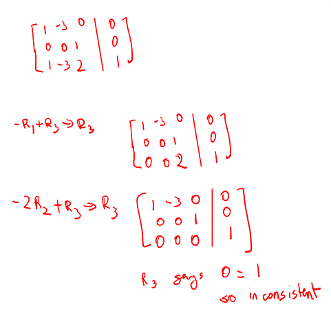

## [[Chapter 11: Solving systems of Linear Equations]] #MAT1341
	- A ^^**linear equation**^^ is an equation of the form
		- $a_1x_1 + a_2x_2 + ... + a_nx_n = b$
	- Here, $a_i$ and $b$ are scalars (real numbers), $x_i$ are **unknowns** or **variables** or **in-determinants**
		- $2x+3y = 1$
		- this is a linear equation with ^^2^^ unknowns
	- A **linear system** is a collection of **linear equation**
		- $x_1 - x_2 + x_3 = 4$ (1)
		- $2x_2 - x_3 = 1$ (2)
		- is a linear system with ^^2^^ equations and ^^3^^ unknowns
	- A **solution** to a linear is a solution to **all** equations of the system simultaneously
	- Notice that, $(4,0,0)$ is a solution to equation (1), but not (2), so this is not a solution to the system
	- ^^**Definition (11.1.2)**^^
		- A **general solution** to a linear system is the set of all solutions
	- ^^**Definition (11.1.6)**^^
		- A **linear system** is *consistent* if there exists at least one solution
		- Otherwise, the system is *inconsistent*
		- Example:
		  background-color:: blue
			- Determine if the following system is consistent:
				- $x+y =1$
				- $y+z = 2$
				- $x+2y+z=-1$
				- {:height 276, :width 556}
				-
		- ^^**Definition (11.1.7)**^^
			- A **linear system** is *homogeneous* if all the the constant terms are 0
			- Otherwise the system is *inhomogenous*
			- Example:
			  background-color:: blue
				- $x + 2y  = 0$
				- $2y+z = 0$
				- Yes: the system is *homogenous*
		- ^^**Fact**^^
			- Homogeneous linear systems are always consistent
				- Since $(0,0..., 0)$ is always a solution
		- ^^**Theorem (11.1.9)**^^
			- If a linear system is consistent, then it admit either
				- a unique solution
				- infinitely many solution
		- We will see why this is true by learning how to solve linear systems systematically
		- This method is called **gaussian elimination** (or **elementary row operators**)
			- We first put the coefficients of a linear system in **an augmented matrix**, which is a rectangular grid that looks like this:
			- $\begin{matrix} 2x+y = 3 \\ x- y=5 \end{matrix} \rightarrow \begin{bmatrix} 2& 1 & | 3 \\ 1 & -1 & | 5 \end{bmatrix}$
		- We can carry out the following operations on an augmented matrix
			- Add a multiple of one row to another
			  logseq.order-list-type:: number
			- Exchange two rows
			  logseq.order-list-type:: number
			- Multiply a row by a nonzero scalar
			  logseq.order-list-type:: number
			- Example:
			  background-color:: blue
				- Perform the elementary row operations to the following augmented matrix and find the solution
					- id:: 6503408b-81a3-407b-b417-2cb5b781c724
					  \begin{bmatrix} 1& -2&  1 &| 0 \\ 2 & -1 & 1&| 5 \\1&0&-5 & \ \quad |-4\end{bmatrix}
					- {:height 833, :width 512}
		- ^^**Definition (11.3.1)**^^
			- A matrix is in **row echelon form** or $REF$ if
				- All zero rows (if any) are at the bottom
				  logseq.order-list-type:: number
				- The first nonzero entry in each row is a 1 (called a **leading one** or a **pivot**)
				  logseq.order-list-type:: number
				- Each leading 1 is to the right of the leading 1s in the rows above
				  logseq.order-list-type:: number
			- A matrix is in **reduced row echelon** for of $RREF$ if it is in $REF$ and pivot is the only nonzero entry in its column
			- Example:
			  background-color:: blue
				- Determine if the following matricies are in $REF$. How about $RREF$?
					- 
		- ^^**Theorem (12.04)**^^
			- Any matrix can be turned into $RREF$ via elementary row operations
			- Furthermore, the $RREF$ we get is unique
			- Example:
			  background-color:: blue
				- Find the general solution to the linear system with following augmented matrix
					- \begin{bmatrix} 1& -3&  0 &| 0 \\ 0 & 0 & 1 &| 0 \\0&0&0 & |0 \end{bmatrix}
						- its $RREF$
						- $R_1$ says $x_1 - 3x_2=0$
						- $R2$ says $x_3 = 0$
						- $x_2$ can be a parameter $t\in \mathbb{R}$
						- Then general solution is {$x_1 = 3t, x_2 = t, x_3 = 0| t\in \mathbb{R}$}
						- $x_1 = 3x_2, x_3$ can be anything
						- {$x_1 = 3s, x_2 = s, x_3 = t |s,t \in \mathbb{R}$}
			- Whenever we have a system given by augmented matrix in $RREF$ and there is a variable that gives a column that **contains no leading 1**, then this **variable** will give us a **parameter** in the general solution
			- In particular, this system gives infinitely many solutions
			- Example:
			  background-color:: blue
				- Show that the following system is inconsistent
					- $$\begin{bmatrix} 1& -3&  0 &| 0 \\ 0 & 0 & 1 &| 0 \\1&-3&2 & |0 \end{bmatrix}$$
						- This is a homogeneous system
						- {:height 473, :width 481}
						-
-