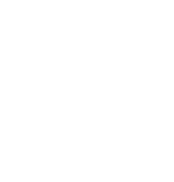

## [[Chapter 11: Solving systems of Linear Equations]] #MAT1341
	- Example:
		- Solve the following linear systems:
			- $$\begin{bmatrix} 0& 1&  0 & -2&| \quad \, 6 \\ 0 & 0 & 0 & 1 &| -4 \\ 1 & 2 & 3 & 0 & |-3 \\\ 1 & -2 & 3 & 0 & | \quad \, 5\end{bmatrix}$$
				- {:height 747, :width 658}
- ## [[Chapter 12: Solving systems of Linear Equations, continued]] #MAT1341
	- ^^**Definition (12.0.1)**^^
		- We say that two linear systems are *equivalent* if they have the same general solution
	- **Fact:**  Every matrix is is row equivalent in RREF
	- ^^**Definition (12.0.3)**^^
		- Two matrices $A$ is *row equivalent* to $B$, written $A\sim B$ if $B$ can be obtained from $A$ by elementary row operations
		- Start with a linear system
			- Do row operations on the augmented matrix
			- We get a row equivalent matrix by doing so
			- That gives another system that is equivalent to the original system
	- ^^**Definition (12.4.1)**^^
		- The ^^*rank*^^ of a matrix $A$, denoted by rank ($A$) is the number of leading 1 (pivots) in any REF of $A$
	- **Remark:** In the Gaussian Algorithm, the passage from the REF to the RREF does not change the number of leading ones
		- $$B =\begin{bmatrix} 1& 0&  3 & 0&| \quad \, 6 \\ 0 & 1 & 0 & 0 &| -2 \\ 0 & 0 & 0 & 1 & |-4 \\\ 0 & 0 & 0 & 0 & | \quad \, 0\end{bmatrix}$$
			- Then we have rank$(B) = 3$
		- If we have a linear system described by an augmented matrix:
			- $B = [A$ (a matrix)|$b$ (a column vector)]
		- We always have rank$(B) \ge$  rank$(A)$
			- This is because $A$ is inside $B$, so all pivots of $A$ are also pivots $B$
		- If rank$(B) >$  rank$(A)$ then the system is inconsistent
			- Example:
				- 
				- If rank$(B) =$ rank$(B)$, then the system is consistent
					- No pivot in the last column so we won't get 0 = 1
				- However, there are two subcases:
					- If rank$(A) =$ # of unknowns, then we have a unique solution
						- 
					- If rank$(A) <$ # of unknowns, then we have a infinitely many solutions
						- 
- ## [[Chapter 13: Applications of Solving Linear Systems]] #MAT1341
	- ### Traffic flow network of one-way street
		- The diagram below represent the flow of traffic (in cars per hour) along each street, and the intersections are labeled, $A, B, C$ and $D$
		- The arrow indicate the direction of the flow of traffic
		- The variables $x_1, x_2, x_3, x_4$ represent the (unknown) level of traffic on certain streets
			- 
			- Notice that the variables are traffic flows on internal street, $x_i$ = # cars per hours
			- {:height 714, :width 636}
		- 
	- ### Solving systems with Parameters
		- Example:
		  background-color:: blue
			- For what values of $a$ (a parameter) does the system with the following augmented matrix have a unique solution
				- $$\begin{bmatrix} a & 2 & 2 & | -2 \\ 1 & 1 & 3 & |\quad \, a \\ 2 & a & a &| \quad \, 2\end{bmatrix}$$
				- 
	- ### Solving Vector Equations
		- Example:
		  background-color:: blue
			- What are all the vectors in $\mathbb{R^3}$ that are a linear of combination of $\{(1,2,1),(3,4,4),(2,6,1)\}$
				- 
- ## [[Chapter 14: Matrices]] #MAT1341
	- A matrix can be thought of as:
		- A table of numbers
		- The augmented matrix of linear system
		- A collection of column vectors
	- ^^**Definition:**^^
		- A matrix with $m$ rows and $n$ columns is called an $m$ by $n$ matrix, it has size $m times n$
			- 
			- You can add matrices component-wise if they have the same size
				- $$\begin{bmatrix}1&2\\3&4\end{bmatrix} + \begin{bmatrix}1&2\\3&4\end{bmatrix} = \begin{bmatrix}2&4\\6&8\end{bmatrix} \qquad \text{but} \begin{bmatrix}1&2\\3&4\end{bmatrix} + \begin{bmatrix}5\\6\end{bmatrix} \text{is not allowed}$$
			- You can multiply a matrix by a scale $(k \in \mathbb{R})$
				- $$2\begin{bmatrix}1&2&3\\4&5&6\end{bmatrix} = \begin{bmatrix}2&4&6\\8&10&12\end{bmatrix}$$
			- You have a zero matrix (or null matrix) in every size
				- $$0_{2\times3} = \begin{bmatrix}0&0&0\\0&&0\end{bmatrix}  \qquad 0_{1\times2} = \begin{bmatrix}0&0\end{bmatrix} $$
	- ^^**Matrix Transpose:**^^
		- If $A$ is $m \times n$ then the "$A$-transpose" $A^T$ is $n \times m$, and the rows of $A$ are the columns of $A^T$
			- $$A_{2 \times 3} = \begin{bmatrix}1&2&3\\4&5&6\end{bmatrix} \qquad A_{3 \times 2}^T = \begin{bmatrix}1 & 4\\ 2&5 \\3&6\end{bmatrix}$$
		- Note that transpose operation on matrices satisfies:
			- $(A + B)^T = A^T + B^T$
			- $(kA)^T = kA^T, k \in \mathbb{R}$
			- $(A^T)^T = A
			- If $\vec{u}$ is a column vector in $R^n$
				- Its a $n \times 1$ matrix
				- So $\vec{u}^T$ is a row vector or a $1 \times n$ matrix
	- ^^**Definition (14.1.2)**^^
		- If $A$ is an $m \times \textbf{n}$ matrix and $B$ is an $\textbf{n} \times p$ matrix, then their *product* $AB$ is the $m \times p$ matrix whose $(\hat{i}, \hat{j})$ entry is the dot product of the $\hat{i}$th row of $A$ and the $\hat{j}$th column of $B$
		- 
		-