## [[Chapter 14: Matrices]] #MAT1341
	- Example:
	  background-color:: blue
		- Find the matrix of the following matrices:
			- 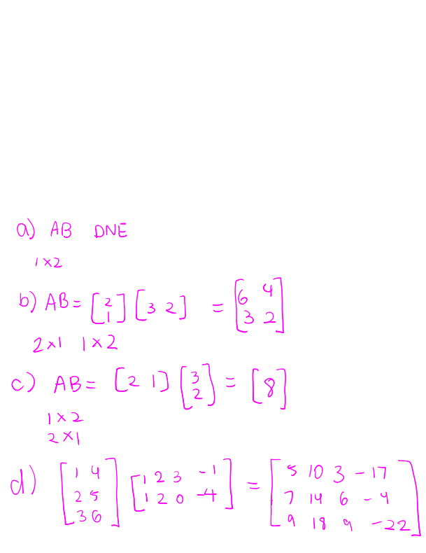
	- We can express a linear system as a matrix equation
		- $$x + 2y + z  = 1 \\ 4x + 5y + 6z = 2 \\ 7x+8y+9y = 3$$
			- $$\begin{bmatrix} 1 & 2 & 1 \\ 4 & 5 & 6 \\ 7&8&9\end{bmatrix} = \begin{bmatrix} x \\ y \\ z \end{bmatrix} = \begin{bmatrix} 1 \\ 2\\ 3 \end{bmatrix}$$
		- is equivalent to $A\vec{x} = \vec{b}$ where $A = \begin{bmatrix} 1 & 2 & 1 \\ 4 & 5 & 6 \\ 7&8&9\end{bmatrix}$, $\vec{x} = \begin{bmatrix} x \\ y \\ z \end{bmatrix}$ and $\vec{b} = \begin{bmatrix} 1\\ 2 \\ 3\end{bmatrix}$
		- The augmented matrix of the system is $\begin{bmatrix} A|\vec{b} \end{bmatrix}$:
			- \begin{bmatrix} 1 & 2 & 1 & | 1 \\ 4 & 5 & 6 & | 2 \\ 7&8&9 & | 3\end{bmatrix}
	- We can express a linear combination as a matrix multiplication:
		- $$c_1\vec{u_1} + c_2\vec{u_2} + ...+c_n\vec{u_n} = \begin{bmatrix} \vec{u_1} & \vec{u_2} & ... & \vec{u_n} \end{bmatrix} \begin{bmatrix} c_1 \\ ... \\ c_n\end{bmatrix}$$
		- Example
		  background-color:: blue
			- 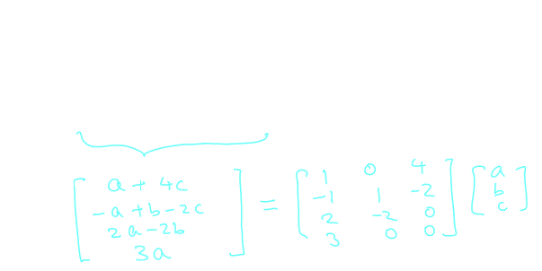
	- There are some ways in which matrix multiplication is **different** from number multiplication:
		- Is $AB = BA$?
			- 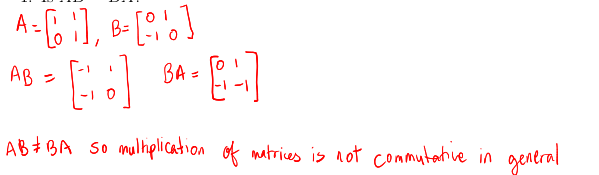
		- If $AB = 0$, must $A$ or $B$ be a zero matrix?
			- 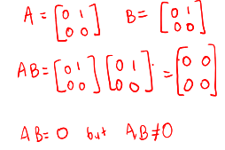
			-
		- If $AB = AC$, can we cancel $A$ to get $B=C$
			- 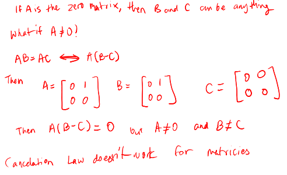
	- Set $I_k = k \times k$ (the square matrix) with 1s on diagonal and 0s elsewhere
		- $$I_1\begin{bmatrix} 1 \end{bmatrix} \qquad I_2 = \begin{bmatrix} 1 & 0 \\ 0 & 1\end{bmatrix} \qquad I_3 = \begin{bmatrix} 1 & 0 & 0 \\ 0 & 1 & 0\\ 0 & 0 & 1\end{bmatrix} \qquad I_4 = \begin{bmatrix} 1 & 0 & 0 & 0 \\ 0 & 1 & 0 & 0 \\ 0 & 0 & 1 & 0 \\ 0 & 0 & 0 & 1 \end{bmatrix}$$
		- called the ^^**identity matrix**^^ of size $k$
	- Example:
		- Find the matrix product of $AI_3$, where $A = \begin{bmatrix} 1 & 2 & 3 \\ 4 & 5& 6 \end{bmatrix}$
			- 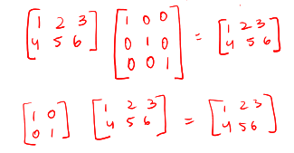
	- ^^**Theorem (14.3.1 - Properties of Matrix Product)**^^
		- $(AB)C = A(BC)$ (Associative)
		  logseq.order-list-type:: number
		- $A(B+C) = AB + AC$ (Distributivity on the right)
		  logseq.order-list-type:: number
		- $(B+C)A= BA + CA$ (Distributivity on the left )
		  logseq.order-list-type:: number
		- $k(AB) = (kA)B = A(kB)$ (Scalar Multiplication)
		  logseq.order-list-type:: number
		- $(AB)^T = B^T A^T$ (**NOTE** the reversal of order!)
		  logseq.order-list-type:: number
			- Suppose $A$ is $m \times n$ and $B$ is $n \times p$
			- $AB$ is $m \times p$
			- Then $(AB)^T = p \times m$ where
				- $B^T$ is $p \times n$
				- $A^T$ is $n \times m$
	- Examples:
	  background-color:: blue
		- $(A + B)(C-D)$
			- $AC + AD = BC + BD$
		- $(A+B)(A-B)$
			- $A^2 - AB + BA - B^2$
	- ^^**Definition**^^
		- If a matrix has a size $m \times m$, we say that it is a *square matrix*
		- Given a square matrix and a positive integer $n$, we define $A^n = A \ ... \  A$
	- Examples:
	  background-color:: blue
		- Let $A = \begin{bmatrix} 1 & 2 \\ 0 & 1 \end{bmatrix}$ and $B  = \begin{bmatrix} -1 & 0 \\ 0 & 1 \end{bmatrix}$. Calculate $A^{2023}$ and $B^{2023}$
			- 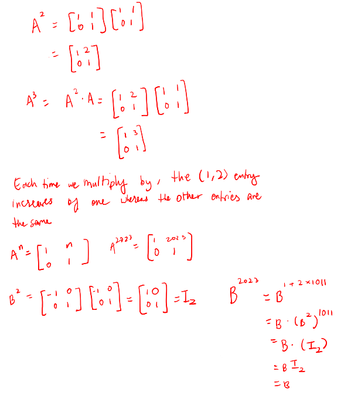
			-
			-
		- 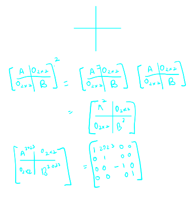
- ## [[Chapter 4: Vector Spaces]] #MAT1341
	- ^^**Definition (4.2.1)**^^
		- Any set $V$ satisfying the following 10 axioms (rules) is called a *vector space*
	- ### Closure
		- 1. We have an ^^addition^^ on $V$ such that given $\vec{x},\vec{y}, \in V$, we have $\vec{x}+\vec{y} \in V$
		- 2. There is ^^multiplication by scale^^ such that given $\vec{x} \in V$ and $c \in \mathbb{R}$, we have $c\vec{x} \in \mathbb{R}$
	- ### Existence
		- 3. There is ^^zero vector^^ (or  a neutral element, or an additive identity), denoted by $\vec{0}$ such that $\vec{0} + \vec{x} = \vec{x} + \vec{0} = \vec{x}$, $\forall , x \in \mathbb{R}$
		- $\forall \vec{x} \in V$, $\exists - \vec{x} \in V$ such that $\vec{x} + (- \vec{x}) = (-\vec{x}) + \vec{x} = 0$
			- $-x$ is called the additive ^^inverse^^ of $\vec{x}$
	- ### Arithmetic Properties
		- #### For any $\hat{u}, \hat{v}, \hat{w} \in \mathbb{R^n}$
			- 5. $\vec{u} + \vec{v} = \vec{v} + \vec{u}$
			- 6. $\vec{u} + (\vec{v} + \vec{w}) = (\vec{u} + \vec{v}) = \vec{w}$
			- 7. $c(\vec{u} + \vec{v}) = c\vec{u} + c\vec{v}$
			- 8. $(c+d)\vec{u} =c\vec{u} + d\vec{u}$
			- 9. $c(d\vec{u}) = (cd)\vec{u}$
			- 10. $1\vec{u} = \vec{u}$
	- Example:
	  background-color:: blue
		- 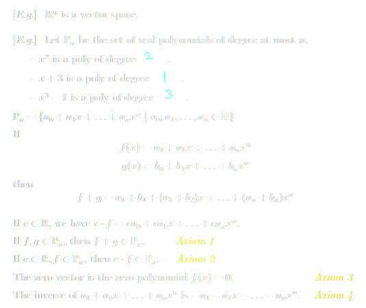{:height 458, :width 535}
		- Let $S = \{x \in \mathbb{R} | x \ge 0\}$ Is $S$ a vector space?
			- 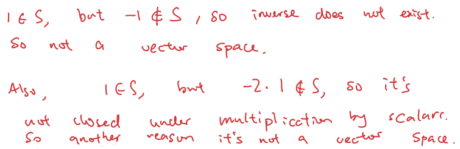
		- The line $y=2x+1$ in $\mathbb{R}^2$. Is this a vector space?
			- 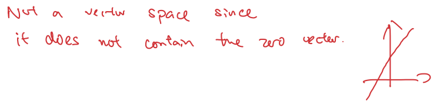{:height 165, :width 688}
		- What about the line $L:y=kx$, where $k$ is a scalar?
			- 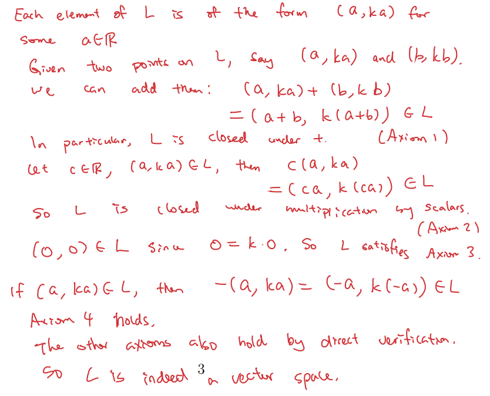
	- The set $V = {0} \subset \mathbb{R}^n$, with operations given by the rule $0 + 0 = 0$, and $c\cdot 0 = 0$ is a vector space
		- This is called the ^^zero vector space^^ or the ^^trivial vector space^^
			- 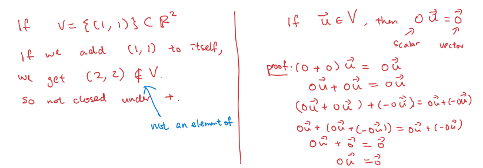
			- ^^**Warning:**^^ The ^^zero vector^^ (not necessarily in $\mathbb{R}$) is $V$ is not always the same as the ^^zero scalar^^(an element of $\mathbb{R}$; In $R^n$ the zero vector is $\vec{0} = [0,...0]$
		- Example:
		  background-color:: blue
			- $M_{m,n}(\mathbb{R}$) the set of all $m \times n$ matrices is a vector space, for any integers $m, n \ge 1$
				- 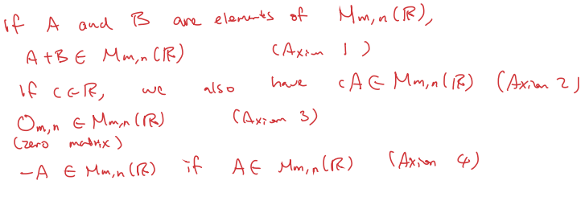{:height 234, :width 658}
			- Let $a < b$ be real numbers. The set of continuous funcitons $f: [a,b] \rightarrow \mathbb{R}$ is a vector space
				- 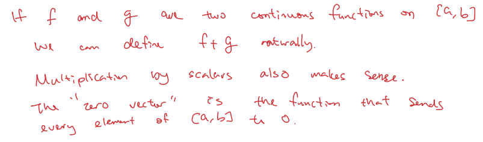
- ## [[Chapter 5: Subspaces]] #MAT1341
	- ^^**Definition (5.1.2)**^^
		- Suppose $V$ is  vector space
		- We say that a subset $W \subseteq V$ is a *subspace* if $W$ is also a vector space under the same operations on $V$
		- $0 \ne W \subseteq V$
			- (1) $0\in W$
			- (2) $W$ is closed under addition
			- (3) $W$ is closed under scalar multiplication
		- ^^**Theorem (5.1.4 - Subspace Test)**^^
			- If $V$ is a vector space and $W \subseteq V$, when $W$ is a subspace of $V$ if and only if the following 3 conditions hold:
				- $0 \in W$
				  logseq.order-list-type:: number
				- $\forall \vec{u}, \vec{v} \in W$, $\vec{u} + \vec{v} \in W$ ($W$ is closed under addition)
				  logseq.order-list-type:: number
				- $\forall c \in \mathbb{R}, \forall \vec{u} \in W$, we have $c\vec{u} \in W$($W$ is closed under multiplication by scalars)
				  logseq.order-list-type:: number
		- Example:
		  background-color:: blue
			- Is $S = \{(x,y) \in \mathbb{R}^2| x^2 + y^2 = 1\}$ a subspace of $\mathbb{R^2}$?
				- 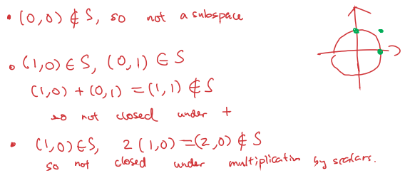
			- 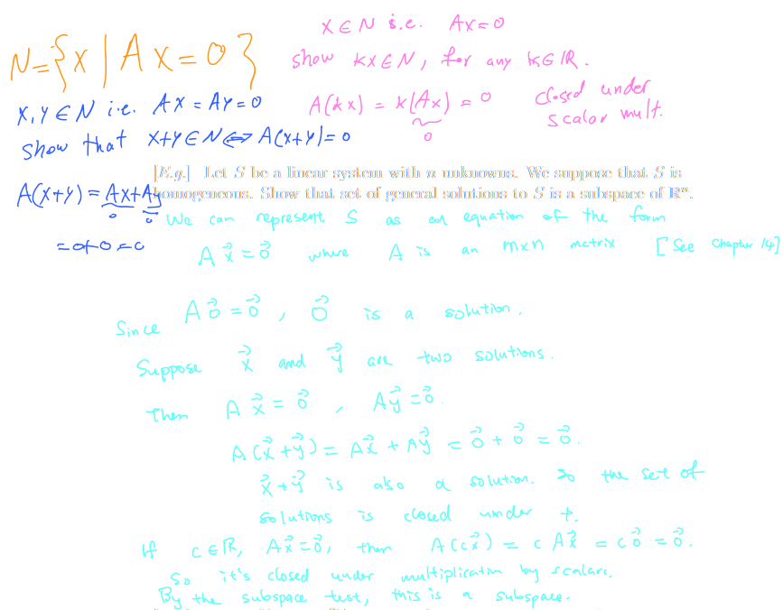{:height 596, :width 699}
			- Is $L = \{(x,y \in R^2)| x-3y=1\}$ closed under addition?
				- 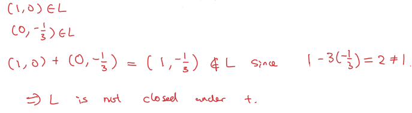{:height 141, :width 482}
			- Let $F(\mathbb{R})$ be the set of the continuous function on $\mathbb{R}$. Is the set $T = \{ f \in  F(\mathbb{R})| f(1) =2\}$ closed under multiplication by scalar?
				- 
			- 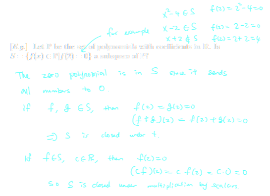
- ## [[Chapter 6: The Span of Vectors]] #MAT1341
	- If $v_1, v_2, ... v_k$ are $k$ elements in a vector space $V$, a linear combination of these elements is of the form:
		- $c_1\vec{v}_1 + c_2\vec{v}_2+...+c_k\vec{v}_k$
		- where $c_i$ are scalar
		- We say that $w$ is a linear combination of $\vec{v}_1,  \vec{v}_2, ... \vec{v}_k$ if you can find $c_1, c_2, ... c_k \in \mathbb{R}$ such that $W =c_1\vec{v}_1 + c_2\vec{v}_2+...+c_k\vec{v}_k$
	- Example:
	  background-color:: blue
		- $\begin{bmatrix}1 \\ 3  \end{bmatrix} = 1 \cdot \hat{i} + 3 \cdot \hat{j}$ is a linear combination of $\hat{i}$ and $\hat{j}$
			- $\begin{bmatrix} x \\ y \\ z \end{bmatrix} = x\hat{i} + y\hat{j} + z\hat{k}$
	- Note that a linear combination may be written as $A = \begin{bmatrix} c_1 \\ ... \\c_k \end{bmatrix}$
		- $A = [\vec{v}_1 ... \vec{v}_2]$
		- $AW = [\vec{v}_1 ... \vec{v}_2]\begin{bmatrix} c_1 \\ ... \\c_k \end{bmatrix} = c_1\vec{v}_1  + c_2\vec{v}_2 + ... + c_k\vec{v}_k$
	- 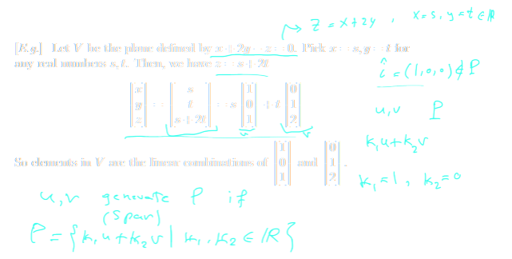
	- ^^**Definition (6.3.1)**^^
		- We write span {$\vec{v}_1, ..., \vec{v}_k$} for the set of *all* linear combinations of $v_1, ..., v_k$
		- $W \subseteq V$, if $w = \text{span}\{\vec{v}_1, ..., \vec{v}_k\}$ then we that $w$ is spanned by $S =\{\vec{v}_1, ..., \vec{v}_k\}$
		- Show that $\text{span} \begin{Bmatrix}\begin{bmatrix}1\\3\\2 \end{bmatrix} ,  \begin{bmatrix}1\\-1\\0 \end{bmatrix} \end{Bmatrix}$ is a plane and find its cartesian equation
			- 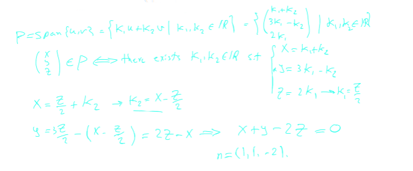
	- ^^**Definition (6.5.3)**^^
		- Given a $n \times n$ matrix $A$, define the *trace* of a matrix to be the sum of the entries on the diagonal
		- If $A = \begin{bmatrix} a & b \\ c & d \end{bmatrix}$, then the trace of $A$ is $a + d$, denoted $tr(A)$
		- Example:
		  background-color:: blue
			- Let $S = \{A \in M_{2,2} | tr(A) = 0 \}$. Find the set of matrices so that $S$ is spanned by this set
			- 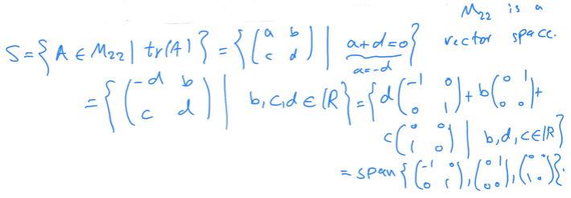
		- Let the set $S = \{ A \in M_{2,2}, A^T = -A\}$, show that $S = \text{span}\begin{bmatrix}0 & 1\\-1&0 \end{bmatrix}$
			- 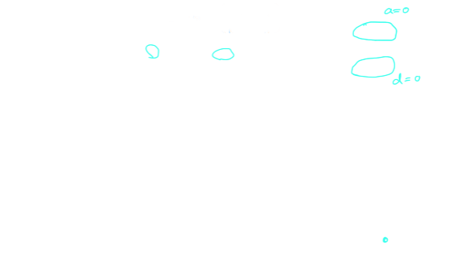
	- ^^**Theorem (6.4.1) aka THE BIG THEOREM**^^
		- Let $V$ be a vector space
		- if $\{\vec{v}_1,..., \vec{v}_k\} \subset V$, define $U = \text{span}\{\vec{v}_1,...,\vec{v}_k\}$
		- Then,
			- (1)  $U$ is *always* a subspace of $V$
			- (2)  If $W$ is any subspace of $V$ which contains all the vectors $vec{v}_1,..., \vec{v}_k$ then in fact $U \subseteq W$
			- 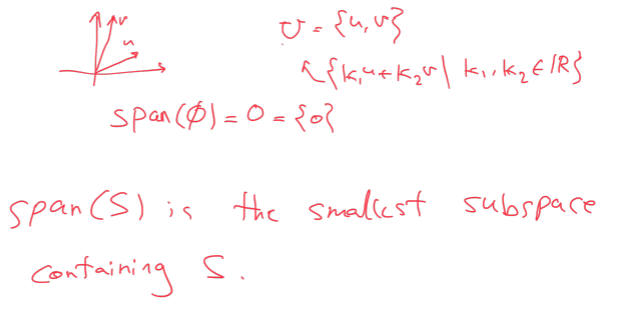
		- Example:
			- Show that $(0,1,1)$ and $(1,0,1)$ belong to $\text{span}\{(1,1,2,)(-1,1,0)\}$
				- 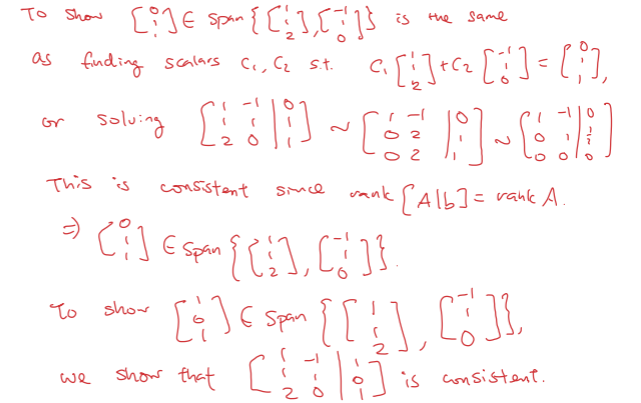
			- Show that $\text{span}\{(0,1,1,)(1,0,1)\} = \text{span}\{(1,1,2,)(-1,1,0)\}$
				- 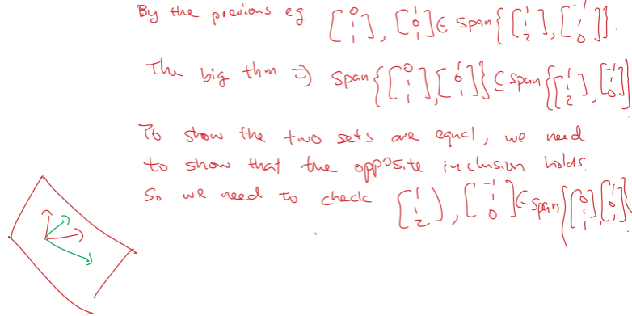
	- $\mathbb{P}^n$ = {polynomials of degree at most n}
	- An element of $\mathbb{P}_3$ is of the form $a_0 + a_1x+ a_2x^2+a_3x^3$ where $a_0, a_1, a_2, a_3 \in \mathbb{R}$ so its a linear combination of $1, x , x^2, x^3$. $\mathbb{P}_3 = \text{span} \{1, x , x^2, x^3\}$
	- In $\mathbb{P}_n$, we need $n+1$ elements in the spanning set
	- Example:
		- Find a spanning set for $U = \{f(x) \in \mathbb{P}_2 | f(3) = 0\}$
			- 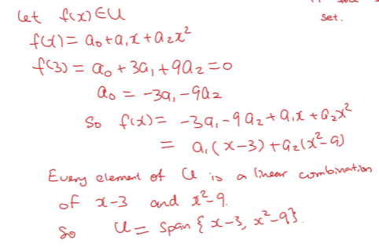
			-
	-
-