## [[Chapter 9: Basis and Dimensions]] #MAT1341
	- ^^**Theorem 9.1.1**^^
		- Let $V$ be a vector space, let $S = \{\vec{u}_1,..., \vec{u}_m\}$ and $T = \{\vec{v}_1,...,\vec{v}_k\}$ be sets of element $V$. Suppose that $V$ is spanned $S$, and $T$ is linearly independent. Then $k\le m$
		- Equivalently: if $V$ has a subset of $m$ linearly independent vectors, then any spanning set has at least $m$ vectors.
		- **Slogan:** independent $\le$ span
		- Example:
		  background-color:: blue
			- We know that $\mathbb{R}^3$ is spanned by 3 vectors, for example: $(1,0,0),(0,1,0),(0,0,1)$. So any set in $\mathbb{R}^3$ with 4 or more vectors is LD
				- If we have a LI set, there can be at most 4 elements
	- ^^**Theorem 9.2.1**^^
		- A set $\{\vec{u}_1,..., \vec{u}_m\}$ of vectors in $U$ is called a ^^basis^^ of $U$ if $\{\vec{u}_1,..., \vec{u}_m\}$ ^^span^^ $U$, and $\{\vec{u}_1,..., \vec{u}_m\}$ in ^^linearly independent^^
		- In particular, every element of $U$ is a linear combination of $\vec{u}_1,... \vec{u}_m$. Futhermore the expression is unique in the following sense:
			- 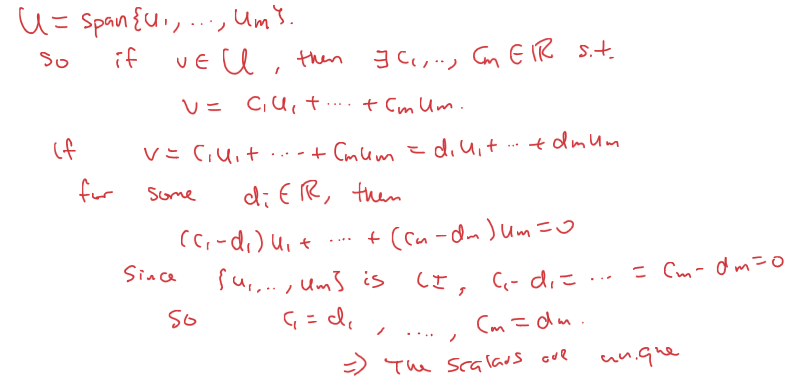
	- ^^**Theorem 9.2.7**^^
		- If $\{\vec{u}_1,..., \vec{u}_m\}$ and $\{\vec{v}_1,..., \vec{v}_m\}$ are two bases for a vector space $V$, then $m = k$
			- 
	- ^^**Definition 9.3.1**^^
		- If $V$ has a finite basis ${\vec{v}_1, ... \vec{v}_n}$, the the dimension of $V$ is $n$, the number of vectors in this basis. We write:
			- $$dim(V) = n$$
		- and also can say that V is *finite-dimensional*. If $V$ doesn't have a finite basis, then $V$ is *infinite dimensional*
		- If we have a LI set, there can be at most 4 elements
		- Example:
		  background-color:: blue
			- Let $V = \{A \in M_{2,2} | tr(A) = 0\}$. What is $dim(V)$?
				- 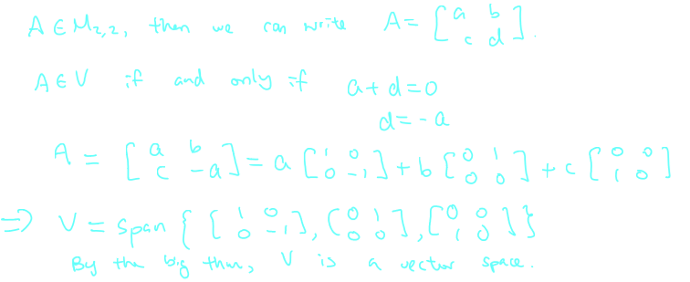
			- Consider $Ax = \vec{0}$ that gives the RREF:
				- $\begin{bmatrix} 1 & 2 & 0 & 1  & | &0 \\0 & 0 & 1 & -1 & | & 0 \\0 & 0 & 0 & 0 & | & 0  \end{bmatrix}$
					- 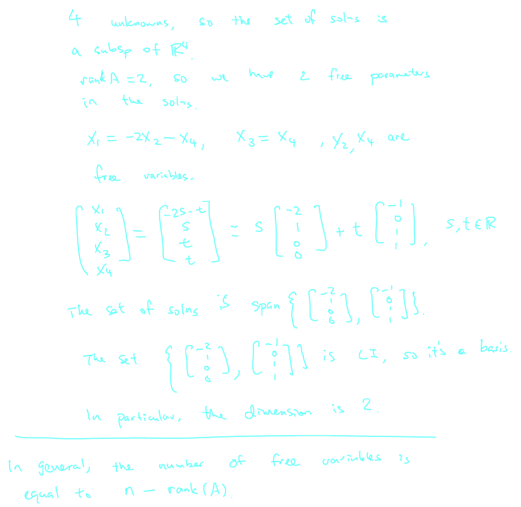
- ## [[Chapter 10: Dimension Theorems]] #MAT1341
	- ^^**Recall:**^^"Independent" \le Dimensions(# of elements in a basis, LI +Spanning)\le "Spanning"
	- ^^**Theorem 10.2.1:**^^
		- Let $V$ be a vector space and suppose that we know that $dim(V) = n$. Then:
			- Any LI set $\{\vec{v}_1,...,\vec{v}_n\}$ of $n$ vectors in $V$ is a basis of $V$
			  logseq.order-list-type:: number
			- Any spanning set $\{\vec{v}_1,..., \vec{v}_n\}$ of $V$ consisting of exactly $n$ is a basis of $V$
			  logseq.order-list-type:: number
		- This theorem says that if we have $n$ elements in an $n$-dimensional space that is either LI or spanning, then it's automatically a basis
			- 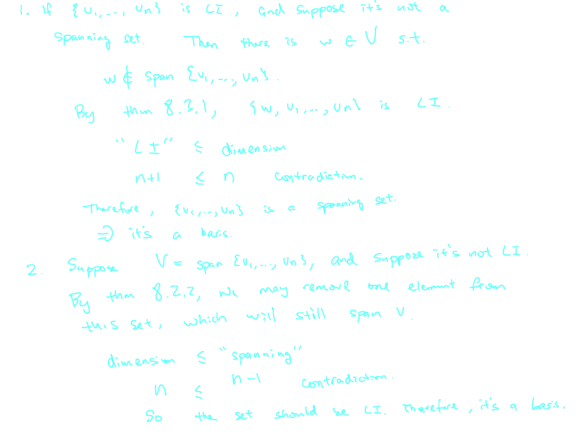
		- Example:
		  background-color:: blue
			- Show that $\{(1,0,0), (0,1,1), (0,0,2)\}$ is a basis of $\mathbb{R}^3$
				- 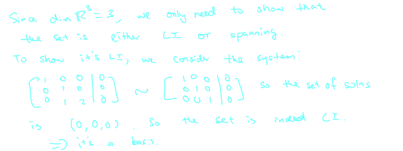
			- Show that $\{(2,1,0),(-3,0,1)\}$ is a basis for a $U = \{(x,y,z) | x-2y+3z = 0\}$
				- 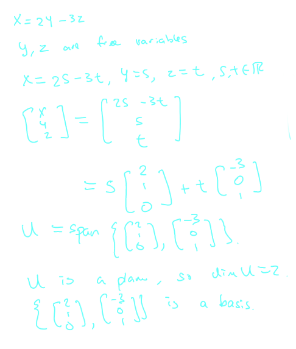
				- 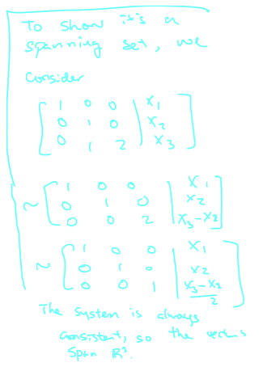
				-
	- ^^**Theorem 10.3.1**^^
		- Suppose that $dim(V) = n$ and that $W$ is a subspace of $V$. Then:
			- $0\le dim(W) \le dim(V)$
			  logseq.order-list-type:: number
			- $dim(W) = dim(V)$ if and only $W=V$
			  logseq.order-list-type:: number
			- $dim(W) = 0$ if and only if $W = \{0\}$
			  logseq.order-list-type:: number
		- 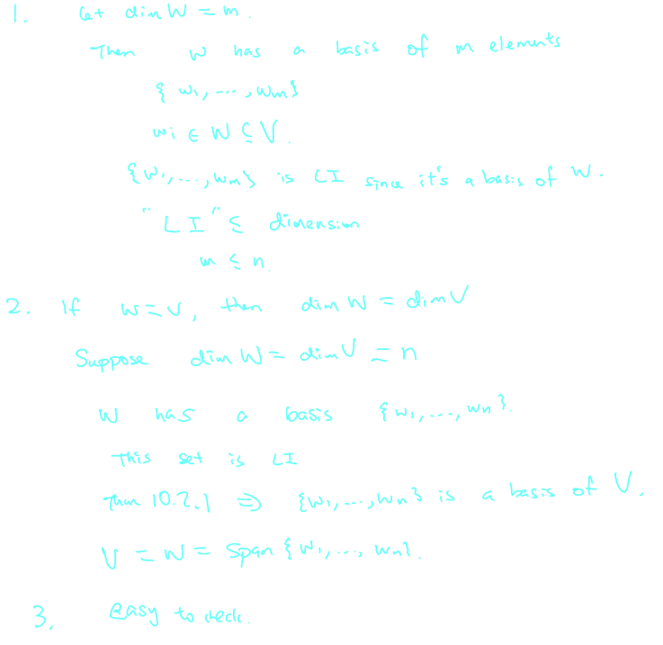
	- Inside $\mathbb{R}^3$, the dimension of a subspace can be $0,1,2$ or $3$
		- 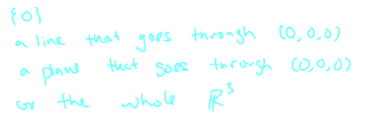
- ## [[Chapter 14: Matrices]] #MAT1341
	- We have a linear system in $n$ unknowns, we can express the system as a matrix equation:
		- $A\vec{x}= \vec{B}$, where $\vec{x} = \begin{bmatrix} \vec{x}_1 \\ ... \\ \vec{x}_n\end{bmatrix} \in \mathbb{R}^n, b \in \mathbb{R}^m$
	- A is an $m \cdot n$. Here $m$ is the number of equations in the system
	- We also write $A = [c_1,..., c_n]$, where $c_i's$ are column vector
	- The system is consistent if and only if $\vec{b} \in span\{c_1,..., c_n\}$
		- 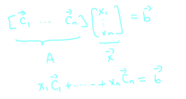
	- Example:
	  background-color:: blue
		- Consider
			- $$A = \begin{bmatrix}1 & -1 & 3 \\ 2 & 0 & 4\\2 & 0 & 5\end{bmatrix},  \vec{b} = \begin{bmatrix}2\\4\\5\end{bmatrix}$$
				- 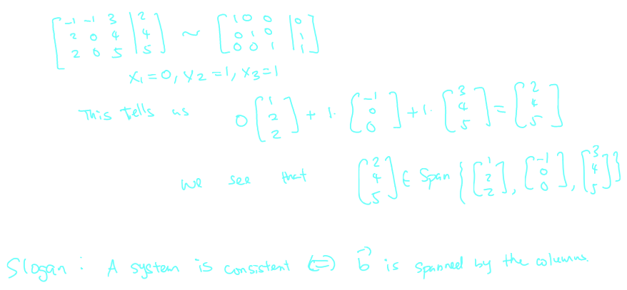
	- ^^**Definition 14.5.1**^^
		- Suppose $A$ is a matrix of dimension $m \cdot n$. We set $Col(A)$ to the subspace in $\mathbb{R}^m$ generated by the columns of $A$. We call this the ^^column space^^ of $A$
		- ^^*Fact:*^^ $A\vec{x} = \vec{b}$ is consistent if and only if $\vec{b} \in Col(A)$
		- ^^*Fact:*^^ $Col(A) = \mathbb{R}^m$ if and only $\vec{b} \in \mathbb{R}^m$
			- 
		- What should the rank of $A$ be in this case?
			- 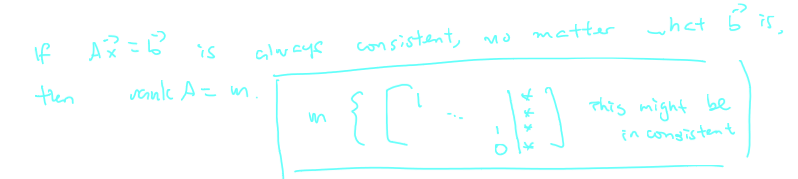
		- ^^*Fact:*^^ When the matrix is of dimension $n \cdot n$, i.e. this is a square matrix, then $Col(A) = \mathbb{R}^n$ if and only if the RREF of $A$ is of the form
			- 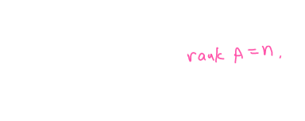
		- In this case $A\vec{x} =\vec{b}$ has a unique solution for any $\vec{b}$