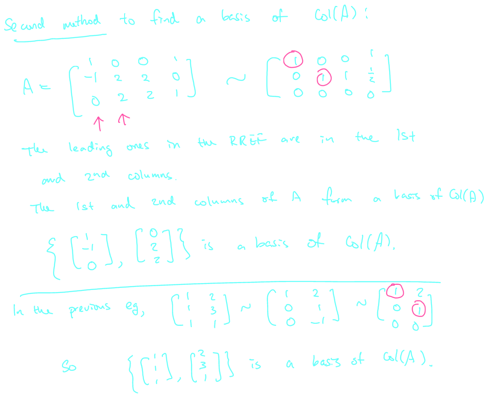

## [[Chapter 15: Vector Spaces associated to Matrices]] #MAT1341
	- ^^**Definition 15.1.1**^^
		- Let $A$ be a $m \times n$ matrix
		- The *column space of* $A$
			- is $\text{Col}(A) = \text{span}\{\vec{c}_1, \vec{c}_2, ... \vec{c}_n\}$
		- where $\{\vec{c}_1, \vec{c}_2, ... \vec{c}_n\}$ are the columns of $A$, viewed as vectors in $\mathbb{R^n}$
	- ^^**Definition 15.1.2**^^
		- The *row space* of a $A$ is
			- $\text{Row}(A) = \text{span}\{\vec{r}_1, \vec{r}_2, ... \vec{r}_n\}$
		- where $\{\vec{r}_1, \vec{r}_2, ... \vec{r}_n\}$ are the rows of $A$, viewed as vectors in $\mathbb{R^n}$
	- The big theorem says that $\text{Row}(A)$ and $\text{Col}(A)$ are subspaces
	- Example:
		- Consider a matrix is of dimension $2 \times 3$
			- $A = \begin{bmatrix} 1 & 3 & -1 \\ 2 & 3 & 0 \end{bmatrix}$
			- {:height 154, :width 499}
	- ^^**Definition 15.1.3**^^
		- We define the ^^null space^^ of $A$ to be the set of vectors in $\mathbb{R^n}$ such that $A\vec{x} = \vec{0}$. We write $\text{Null}(A)$
	- Null space of $A$ is the set of solutions to the homogeneous system $A\vec{x} = \vec{0}$
	- To find $\text{Null}(A)$, we use Gaussian elimination to solve $A\vec{x} = \vec{0}$
	- The set of solutions is given by
		- $$\{t_1\vec{v}_1 + t_2\vec{v}_2 + ... t_r\vec{v}_r| t_1 , t_2, ..., t_r \in \mathbb{R}\} = \text{span} \{\vec{v}_1, ..., \vec{v}_m\}$$
			- This also tells us $\text{Null}(A)$ is a subspace
	- Here $t_i$'s are parameters and they correspond to the columns in the RREF without a pivot
	- This gives the **dimension** of $\text{Null}(A)$
	- Example:
	  background-color:: blue
		- $A = \begin{bmatrix} 1 & 2 & 3 & -3 \\  0 & 1 & 1 & -2 \\ 1 & 0 & 1 & 1 \end{bmatrix}$ ~ $\begin{bmatrix} 1 & 0 & 1 & 1 \\  0 & 1 & 1 & -2 \\ 0 & 0 & 0 & 0 \end{bmatrix}$
		- {:height 342, :width 694}
		-
	- ^^**Corollary 15.2.3 - Rank-Nullity Theorem**^^
		- The dimension of the null space of $A$ is equal to the number of non-leading variables of A
			- That is,
				- $\text{dimNull}(A) + \text{dimCol}(A) = n$
				- $\text{dimNull}(A) + \text{rank}(A) = n$
			- where $n$ is number of columns in $A$
	- ^^**Theorem 15.3.2**^^
		- Suppose $A\vec{x} = \vec{b}$ is a consistent linear system
		- Suppose $\vec{x} = \vec{v}_0$ is a solution to the system
		- Then the general solution to $A\vec{x} = \vec{b}$ is given by
			- $$\{\vec{v}_0 + \vec{v}|\vec{v} \in \text{Null}(A)\}$$
			- 
		- Example:
		  background-color:: blue
			- Give the general solution to the system $A\vec{x} = \vec{b}$ where
				- $$A = \begin{bmatrix}1 & 2 & 3 & -3 \\ 0 & 1 & 1 & -2 \\1 & 0 & 1 & 1 \end{bmatrix}, \vec{v}_0 = \begin{bmatrix} 1\\1\\1\\1 \end{bmatrix}, \vec{b} = \begin{bmatrix} 3 \\ 0 \\3 \end{bmatrix}$$
					- 
	- ^^**Theorem 15.4.1**^^
		- Let $A$ be an $m \times n$ matrix and $\vec{x} \in \mathbb{R^n}$
		- The following statements are equivalent for a system with matrix equation $A\vec{x} = \vec{b}$
			- $A\vec{x} = \vec{b}$ is consistent for all $\vec{b} \in \mathbb{R^m}$
			  logseq.order-list-type:: number
			- $\text{rank}(A) = m$
			  logseq.order-list-type:: number
			- There are no zero rows in the RREF of $A$
			  logseq.order-list-type:: number
			- Every $\vec{b} \in \mathbb{R^m}$ is a linear combination of the columns of $A$
			  logseq.order-list-type:: number
			- $\text{Col}(A) = \mathbb{R^m}$
			  logseq.order-list-type:: number
			- $\text{dim(Col(A))} =m$
			  logseq.order-list-type:: number
		- Consistency for all $\vec{b} \in \mathbb{R^m}$
		- 
		- Example:
		  background-color:: blue
			- Consider
				- $$A = \begin{bmatrix}1 & 0 & 2 & 0 \\ 0 & 1 & 3 & 0 \\0 & 0 & 0 & 1  \end{bmatrix}$$
					- 
	- ^^**Theorem 15.5.1**^^
		- Let $A$ be an $m \times n$ matrix and $\vec{b} \in \mathbb{R^n}$
		- The following statements are equivalent for a system with matrix equation $A\vec{x} = \vec{b}$
			- $A\vec{x} = \vec{b}$ has a unique solution
			  logseq.order-list-type:: number
			- Every variable corresponds to a pivot
			  logseq.order-list-type:: number
			- The associated homogeneous system $A\vec{x} = \vec{0}$
			  logseq.order-list-type:: number
			- The columns of $A$ are linearly independent
			  logseq.order-list-type:: number
			- $\text{rank}(A) = n$
			  logseq.order-list-type:: number
			- $\text{dim(Col(A))} =n$
			  logseq.order-list-type:: number
			- $\text{Null}(A) = \{0\}$
			  logseq.order-list-type:: number
		- Fix a $\vec{b}$ and suppose $A\vec{x} = \vec{b}$ is consistent
		- We want to see when the solution is unique
		- 
		  id:: 655199a1-98a3-4c30-b19f-5d0fc2d8f158
		- Example:
			- Let $W = \text{span}\{(1,1,2)\}$ Find a  matrix $A$ such that $W = \text{Null}(A)$
				- 
			- Let $W = \text{span}\{(1,0,,0,1), (1,1,1,0),(2,1,-1,1)\} \subseteq \mathbb{R^4}$. Find a matrix $A$ such that $W = \text{Null}(A)$
				- {:height 425, :width 658}
- ## [[Chapter 16: The Row and Column Space Algorithms]] #MAT1341
	- Given a matrix $A$, we want to find bases for $\text{Row}(A)$ and $\text{Col}(A)$
	- ^^**Idea**^^
		- $\text{span} \{ \vec{r}_1, \vec{r}_2\} = \text{span} \{ \vec{r}_2, \vec{r}_1 \}$
		- $\text{span} \{ c\vec{r} \} = \text{span} \{ \vec{r}\}$
			- If $c$ is a non-zero scalar
		- $\text{span} \{ \vec{u}, \vec{v}+ c\vec{u}\} = \text{span} \{ \vec{u}, \vec{v}\}$ by the big theorem
	- ^^**Proposition 16.1.1**^^
		- If $A$ and $B$ are row equivalent (one can obtain $A$ from $B$ via elementary row operations), then $\text{Row}(A) = \text{Row}(B)$
		- The rows in an REF are linearly indepedent
		- So to find a basis of $\text{Row}(A)$, we can apply Gaussian elimination to get a row equivalent matrix which is in REF
		- The rows will be a basis of $\text{Row}(A)$
		- Example:
		  background-color:: blue
			- Find a basis of $\text{Row}(A)$, where
				- $$A = \begin{bmatrix}1 & 0 & 0 & 1 \\-1 & 2 & 2 & 0 \\ 0 & 2 & 2 & 1 \end{bmatrix}$$
				- 
	- As soon as the number of rows is the rank of the matrix, we get a basis, so it is not necessary to go all way to RREF
	- We can use the fact that $\text{Col}(A) = \text{Row}(A^T)$
	- Example:
	  background-color:: blue
		- Find a basis of $\text{Col}(A)$ where
			- $$A = \begin{bmatrix} 1 & 2 \\ 1 & 3 \\1 & 1\end{bmatrix}$$
			- 
		- Sometimes we would like to find a basis of $\text{Col}(A)$ consisting of the columns in the original matrix
		- Find a basis of $\text{Col}(A) whose elements are columns of $A$ where
			- $$A = \begin{bmatrix} 1 & 0 & 0 & 1 \\ -1 & 2 &2 & 0 \\0 & 2 & 2 & 1\end{bmatrix}$$
			- 
		- Let $W = \text{span} \{(1,0,1,1), (0,1,0,0), (1,1,1,1), (0,0,0,1)\}$. Find a basis of $W$ consisting of a subset of the given spanning set
			- 
		- Find a basis for $\text{Row}(A)$ and $\text{Col}(A)$
			- $$A = \begin{bmatrix} 1 & 0 & 1 & 1 \\ 2 & -1 & 1 & 3 \\3 & -1 & 2 & 7 \\ 0 & 1 & 1 & 0\end{bmatrix}$$
			- 
	- ^^**Corollary 16.2.3**^^
		- For any matrix $A$ with transpose matrix $A^T$:
			- $\text{dimRow}(A) = \text{dimCol}(A) = \text{dimCol}(A^T) = \text{rank}(A) = \text{dimRow}(A^T)$
		- are all equal to $\text{rank}(A)$
- ## [[Chapter 17: Bases for Finite Dimensional Vector Spaces]]
	- We would like to find bases of more general finite dimensional vector spaces, not just subspaces of $\mathbb{R^n}$
	- Example:
	  background-color:: blue
		- Find a basis for the subspace $W$ of $\mathbb{P_3}$ spanned by $\{3 + x + 4x^2 + 2x^3, 2 + 4x + 6x^2 + 8x^3, 1 + 3x + 4x^2 + 6x^3, -1 + 2x + x^2 + 4x^3\}$
			- 
		- Find a basis of the subspace $M_{2,2}$ spanned by the following set:
			- $\begin{Bmatrix} \begin{bmatrix} 1 & 1 \\ 1 & 1 \end{bmatrix}, \begin{bmatrix} 1 & 1 \\ 0 & 1 \end{bmatrix}, \begin{bmatrix} 1 & 1 \\ -1 & 1 \end{bmatrix}, \begin{bmatrix} 1 & 0 \\ 0 & -1 \end{bmatrix}, \begin{bmatrix} 2 & 1 \\ 0 & 0 \end{bmatrix}\end{Bmatrix}$
				- 
		- Consider $\{(1,2,3,1), (1,2,3,2)\}$
			- Prove that it's a LI set (this spans a 2-dimensional subspace in \mathbb{R^4})
			- Extend it to a basis of $\mathbb{R^4}$
				- {:height 590, :width 658}
	- We conclude with the following theorem which combines everything we need to know about vector spaces associated to a square matrix
	- ^^**Theorem 17.3.1**^^
		- Let $A$ be an $n \times n$ matrix
		- The following are equivalent:
			- $\text{rank}(A) = n$
			  logseq.order-list-type:: number
			- $\text{rank}(A^T) = n$
			  logseq.order-list-type:: number
			- Every linear system $A\vec{x} = \vec{b}$ has a unique solution
			  logseq.order-list-type:: number
			- The RREF of $A$ is $I_n$
			  logseq.order-list-type:: number
			- $\text{Null}(A) = \{0\}$
			  logseq.order-list-type:: number
			- $\text{Col}(A) = \mathbb{R^n}$
			  logseq.order-list-type:: number
			- $\text{Row}(A) = \mathbb{R^n}$
			  logseq.order-list-type:: number
			- The columns of $A$ are LI
			  logseq.order-list-type:: number
			- The rows of $A$ are LI
			  logseq.order-list-type:: number
			- The columns of $A$ form a basis of $\mathbb{R^n}$
			  logseq.order-list-type:: number
			- The rows of $A$ form a basis of $\mathbb{R^n}$
			  logseq.order-list-type:: number