## [[Chapter 18: Matrix Inverses]] #MAT1341
	- We have seen previously that is helpful to consider an equation of the form $A\vec{x}=\vec{b}$ in several different ways. We about looking at it in a purely algebraic way?
	- Consider:
		- $ax = b, a \in \mathbb{R}, b \in \mathbb{R}$
	- If $a \ne 0$, we have $x=b/a$, or $x=a^{-1}b$. We would like to do something with matrices
	- We can solve $A\vec{x}=\vec{b}$ via $x = A^{-1}\vec{b}$
	- ^^**Definition 18.1.1**^^
		- If $A$ is an $n \times n$ matrix and $B$ is an $n \times n$ matrix such that
			- $AB = BA = I_n$
		- then $B$ is called an *inverse* of $A$ and we write $B = A^{-1}$
		- In this case $A$ is called *invertible*
	- Recall that given an $n \times n$ matrix $M$, we have
		- $M \cdot I_n = I_n \cdot M = M$
	- Unlike real numbers, a nonzero matrix is not necessarily invertible
	- Example:
	  background-color:: blue
		- The matrix $A = \begin{bmatrix} 1 & 1 \\ 1& 1 \end{bmatrix}$ is not invertible
			- 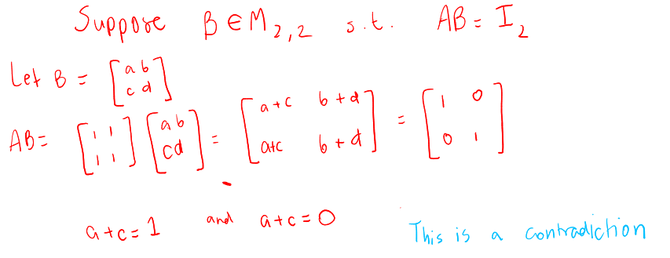{:height 273, :width 688}{:height 273, :width 688}
	- ^^**Lemma 18.2.1**^^
		- Let $A = \begin{bmatrix} a & b \\ c& d \end{bmatrix}$. Then $A$ is ^^invertible if and only if^^ $ad - bc \ne 0$. When $ad - bc \ne 0$ $(det(A)\ne0)$
			- $$A^{-1}=\frac{1}{ad-bc} \begin{bmatrix} d & -b \\ -c & a \end{bmatrix}$$
		- If $ad - bc = 0$ then $A$ is not invertible
		- $ad-bc$ is called the **determinant** of $A$
		- 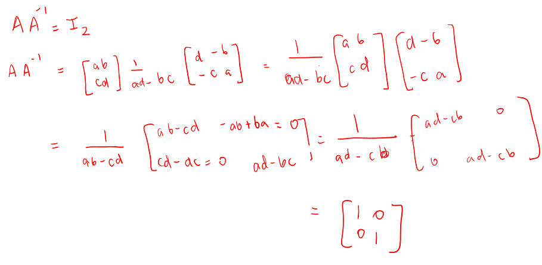
		- Example:
		  background-color:: blue
			- Find the inverse matrix of $A = \begin{bmatrix} 2 & 1 \\ 1& 1 \end{bmatrix}$
				- 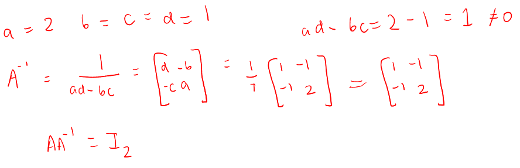
	- ^^**Theorem**^^ (Uniqueness of Inverse Matrix)
		- If $B$ and $C$ are both inverses of an $n \times n$ matrix $A$, then $B=C$
			- 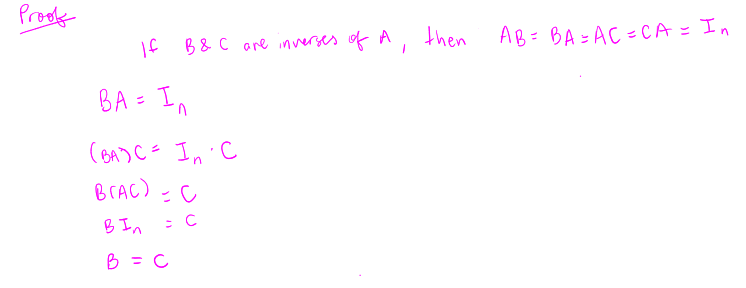
		- Example:
		  background-color:: blue
			- Solve the linear system $\begin{cases} 3x - 2y = 1  \\ 5x - 2y = 2\end{cases}$ by finding the inverse of a $2 \times 2$ matrix
				- 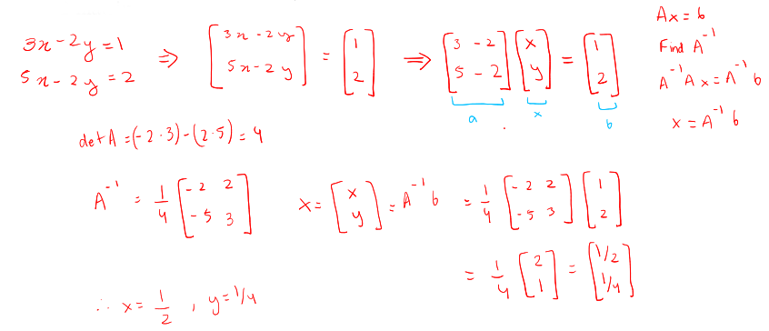
				-
	- ^^**Proposition 18.3.1 - Algebraic properties of the inverse**^^
		- Suppose $A$ is an ^^invertible square matrix^^
			- A^{-1} is invertible with $(A^{-1})^{-1} = A$
			  logseq.order-list-type:: number
			- If $k \ge 1$ is an integer, then $A^k$ is invertible with $(A^k)^{-1} = (A^{-1})^{k}$
			  logseq.order-list-type:: number
			- $A^T$ is invertible, $(A^T)^{-1} = (A^{-1})^T$
			  logseq.order-list-type:: number
			- If $k \in \mathbb{R}$, with $k \ne 0$, the $kA$ is invertible with $(kA)^{-1} = \frac{1}{k}A^{-1}$
			  logseq.order-list-type:: number
			- If $A$ and $B$ are invertible, then $AB$ is also invertible, with $(AB)^{-1} = B^{-1}A^{-1}$
			  logseq.order-list-type:: number
			- $(AB)^{-1}=B^{-1}A^{-1}$
		- 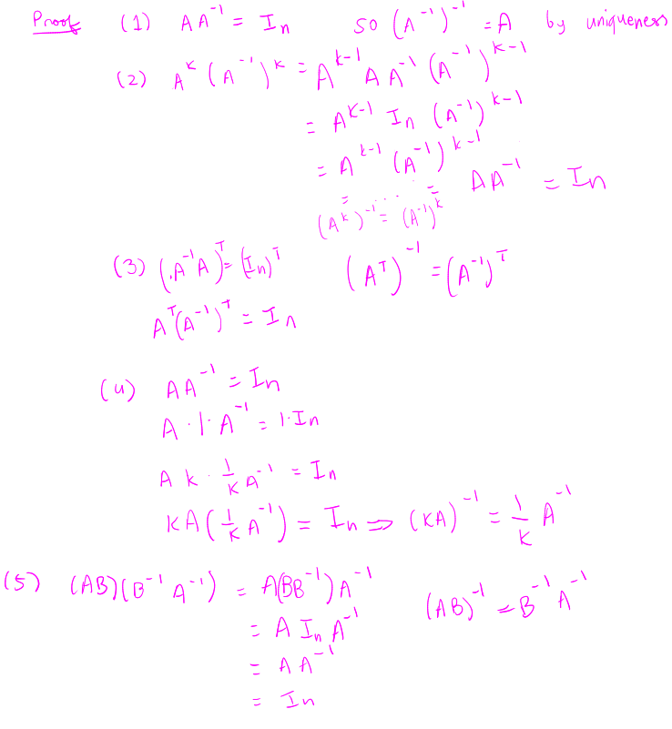
		- Example:
		  background-color:: blue
			- Simplify $(A^T B)^{-1}A^T$
				- 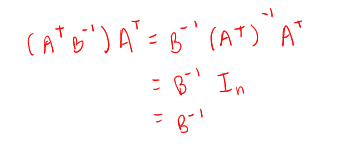
				-
	- If $A$ and $B$ are $n \times n$ matrices such that $AB$ is ^^invertible^^, the $A$ and $B$ are both invertible
		- 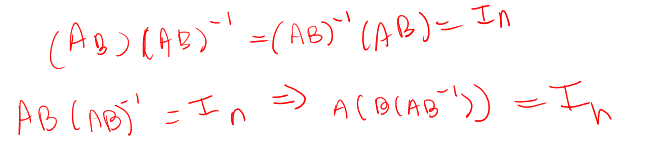
	- How to find $A^{-1}$ if it is larger than $2 \times 2$?
	- Find $B$ such that $AB = I_n$. We can separate $B$ into $n$ columns
		- $B = [\vec{v}_1 \ \vec{v}_2 \ ... \ \vec{v}_m]$
	- So we want
		- $$A\vec{v}_1 = \begin{bmatrix}1 \\ 0\\ 0 \\ ... \\ 0 \end{bmatrix}, A\vec{v}_2 = \begin{bmatrix}0 \\ 1\\ 0 \\ ... \\ 0 \end{bmatrix}, ..., A\vec{v}_n = \begin{bmatrix}0\\ 0 \\ ... \\ 0 \\ 1 \end{bmatrix}$$
		- We can solve these equations simultaneously apply Gaussian elimination $[A|I_n]$
	- Example:
	  background-color:: blue
		- Use this method to find the inverse of $A = \begin{bmatrix}2 & 1 \\ 1&1 \end{bmatrix}$ and $B = \begin{bmatrix}1 & 2 & 3 \\ 2&5&6 \\3 & 6 & 5  \end{bmatrix}$
			- 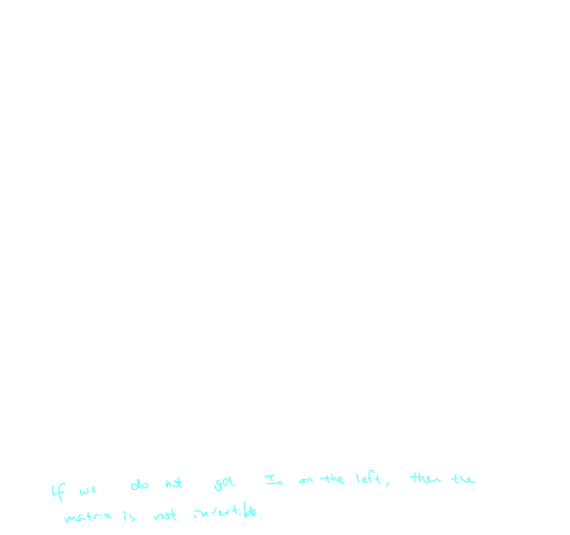
			- 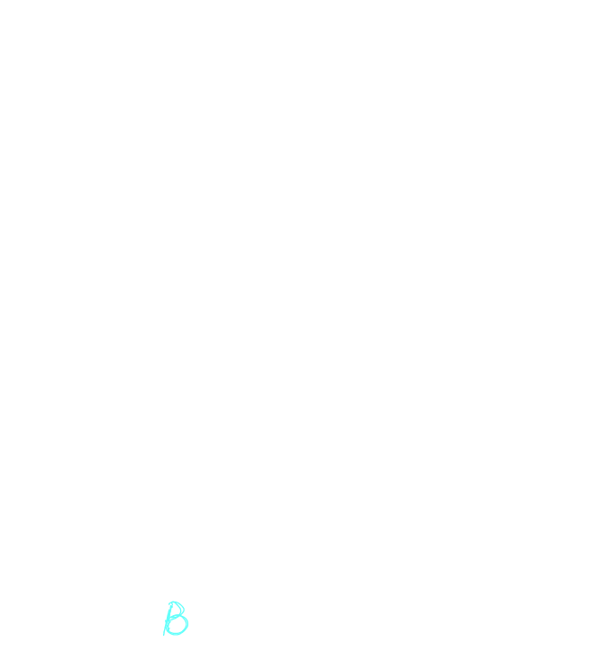
	- ^^**Lemma 18.4.2 - One-sided inverses are two-sided inverses**^^
		- If $A$ and $B$ are $n \times n$ matrices such that $AB = I_n$, then $BA = I_n$
			- $AB = I_n$ then $\begin{bmatrix} 1 \\ 0 \\ ... \\ 0 \end{bmatrix} \begin{bmatrix} 0 \\ 1 \\ ... \\ 0 \end{bmatrix} \begin{bmatrix} 0 \\ ... \\ 0 \\ 1  \end{bmatrix} \in \text{col}(A)$
			- where $B = [\vec{c_1} , \vec{c_2},  ... , \vec{c_n}]$
			- $\text{col}(A) = \mathbb{R^n}$, so $\text{rank}(A)=n$
			- ^^Claim:^^ $\text{rank}(B)$ is also $n$
				- Suppose $\text{rank}(B) < n$, then $\text{dum Null}(B) > 0$ by the rank-nullity theorem
					- Then $\exists \vec{x} \ne \vec{0}$ with $B\vec{x} = \vec{0}$
						- $AB \vec{x} = I_n\vec{x}$
						- $A \vec{0} = \vec{x}$
						- $\vec{0} = \vec{x}$ contradiction
				- Therefore  $\text{rank}(B)$ = $n$
					- [$B|I_n$] will have a solution
					- $\exists C$ such that $BC = I_n$
						- $A\cdot BC = AB \cdot C$
						- $AI_n = I_n \cdot C$
						- $A=C$
					- But $BC = I_n$, so $BA = I_n$
		- To find the inverse of $A$, its enough to find $B$
			- such that $AB = I_n$
			- Then, $BA = I_n$ is automatically [$A|I_n$]~[$I_n|A^{-1}$]
	- ^^**Theorem 18.6.1 - Invertible Matrix Theorem**^^
		- Let $A$ be an $n \times n$ invertible matrix
		- Then the following statements are equivalent:
			- $\text{rank}(A) = n$
			  logseq.order-list-type:: number
			- $A\vec{x} = \vec{b}$ has a unique solution $\forall \vec{b} \in \mathbb{R^n}$
			  logseq.order-list-type:: number
			- $\text{Null}(A) = \{0\}$
			  logseq.order-list-type:: number
			- $\text{Col}(A) = \mathbb{R^n}$
			  logseq.order-list-type:: number
			- The columns of $A$ are linearly independent
			  logseq.order-list-type:: number
			- $\text{rank}(A^T) = n$
			  logseq.order-list-type:: number
			- $\text{Row}(A) = \mathbb{R^n}$
			  logseq.order-list-type:: number
			- The rows of $A$ are linearly independent
			  logseq.order-list-type:: number
			- 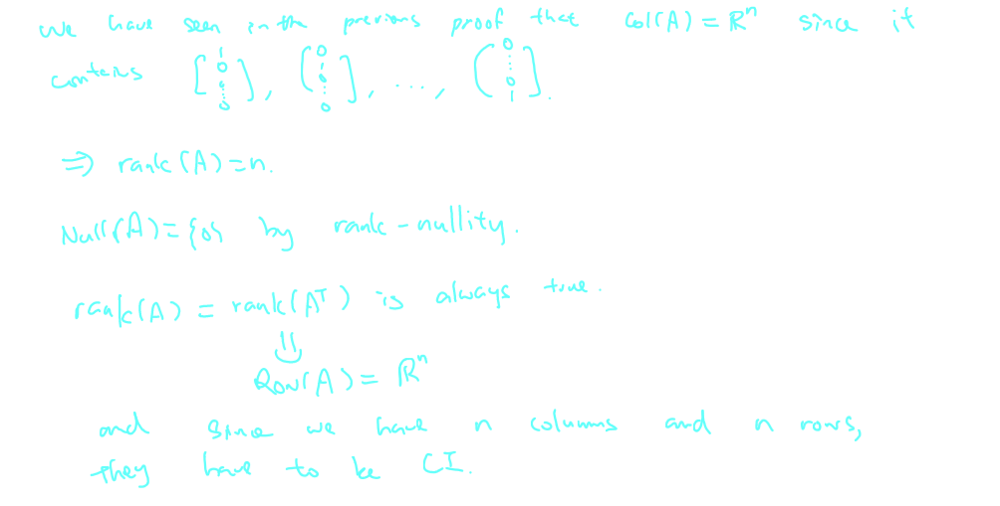
		- Example:
		  background-color:: blue
			- Show that $A = \begin{bmatrix} 1 & 1 \\ 1 & 1\end{bmatrix}, B = \begin{bmatrix} 0 & 2 & 1\\ 0 & 2 & 3\\0 & 2 & 5\end{bmatrix}$ and $C = \begin{bmatrix} 2 & 1 & 3 \\ 3 & 1 & 4\\ -1 & 1 & 0 \end{bmatrix}$
				- 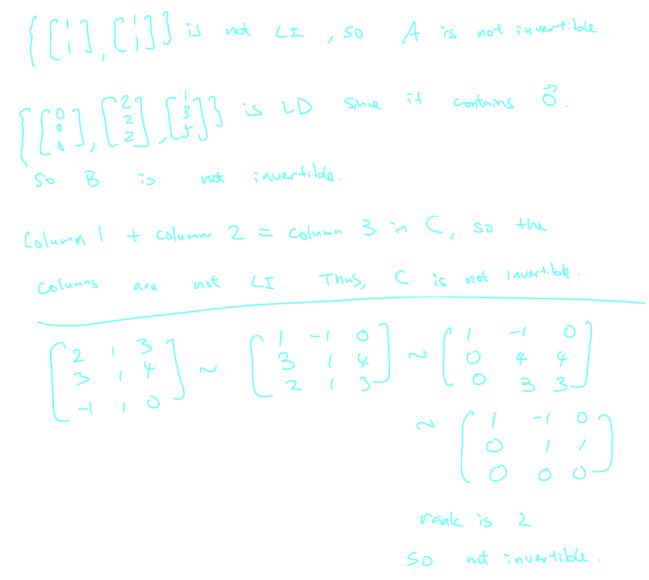
		-
- ## [[Chapter 19: Orthogonality]] #MAT1341
	- ^^**Recall**^^
		- If $\vec{u} = (\vec{u}_1, ..., \vec{v}_n), \vec{v} = (\vec{v}_1, ..., \vec{v}_n) \in \mathbb{R}$, we defined the dot product
			- $$\vec{u} \cdot \vec{v} = \sum^n_{i=1}\vec{u}_i\vec{v}_i$$
		- We say that $\vec{u}$ and $\vec{v}$ are *orthogonal* if $\vec{u} \cdot \vec{v} = 0$ write $\vec{u} \perp \vec{v}$
	- ^^**Definition 19.2.1**^^
		- A set of vector {$\vec{v}_1,..., \vec{v}_m$} $\subseteq \mathbb{R^n}$ is called *orthogonal* if
			- $$\vec{v}_i \cdot \vec{v}_j = 0$$
		- for all $1 \le i < j \le m$, and $\vec{v}_i \ne 0$ for all $1\le i \le m$
		- That is every pair of vectors is orthogonal and no vector is zero
	- Example:
	  background-color:: blue
		- Is {$\vec{e}_1, \vec{e}_2, ..., \vec{e}_1$}$\subseteq \mathbb{R^n}$ an orthogonal set?
			- 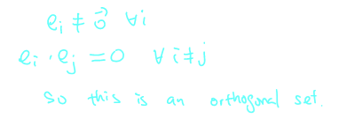
		- Is $\{(1,0,0), (0,1,0), (0,1,1)\}$ an orthogonal set?
			- 
	- ^^**Definition**^^
		- A set of vectors $\{\vec{v}_1, ... \vec{v}_m\} \subseteq \mathbb{R^n}$ is called ^^*orthonormal*^^ if
			- $$ ||\vec{v}_i|| = 1, \forall \text{ and } \vec{v}_i \perp \vec{v}_j, \forall i \ne j$$
	- If $\{\vec{v}_1, ..., \vec{v}_m\}$ is orthogonal, then $\{\frac{\vec{v}_1}{||\vec{v}_1||}, ... \frac{\vec{v}_1}{||\vec{v}_1||} \}$ is orthonormal
	- Example:
	  background-color:: blue
		- $\{(1,1), (1, -1)\}$ is orthogonal, but not orthonormal
			- 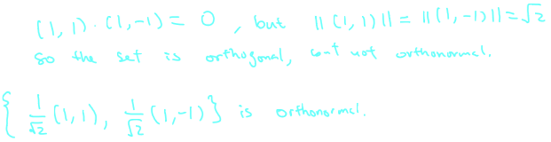
	- ^^**Theorem 19.2.4**^^
		- Any orthogonal set of vectors is linearly indepedent
			- 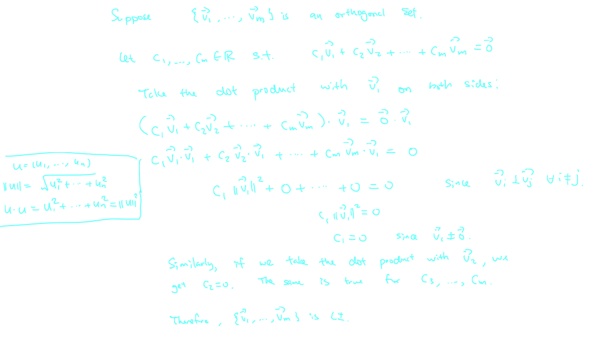
	- ^^**Definition**^^
		- Let $W$ be a subspace of $R^n$
		- We say that ^^a basis is orthogonal^^ (respectively ^^orthonormal^^) if it consists of a set of orthogonal (respectively orthonormal) basis
		- 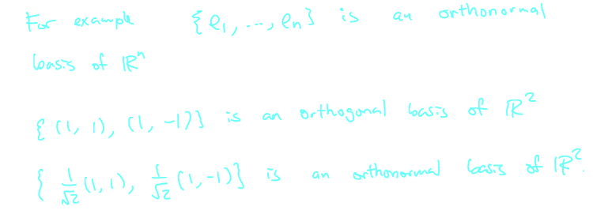{:height 267, :width 718}
	- ^^**Theorem 19.2.5**^^
		- Suppose $\{\vec{w}_1, ...,  \vec{w}_m\}$ is an orthogonal basis for a subspace of $W$ of $\mathbb{R^n}$
		- Then, any vector $\vec{w} \in W$ can be written as
			- $$\vec{w} = (\frac{\vec{w}\cdot \vec{w}_1}{||w_2||^2})\vec{w}_1 + (\frac{\vec{w}\cdot \vec{w}_2}{||w_2||^2})\vec{w}_2 + ... (\frac{\vec{w}\cdot \vec{w}_m}{||w_m||^2})\vec{w}_m$$
			- $$=\text{proj}_{\vec{w}_1}(w) + \text{proj}_{\vec{w}_2}(w) + ...+ \text{proj}_{\vec{w}_m}(w)$$
		- Given any basis we can express an element in the subspace as a linear combination of the basis
		- When the basis is orthogonal, we can find the linear combination by orthogonal projection
		- 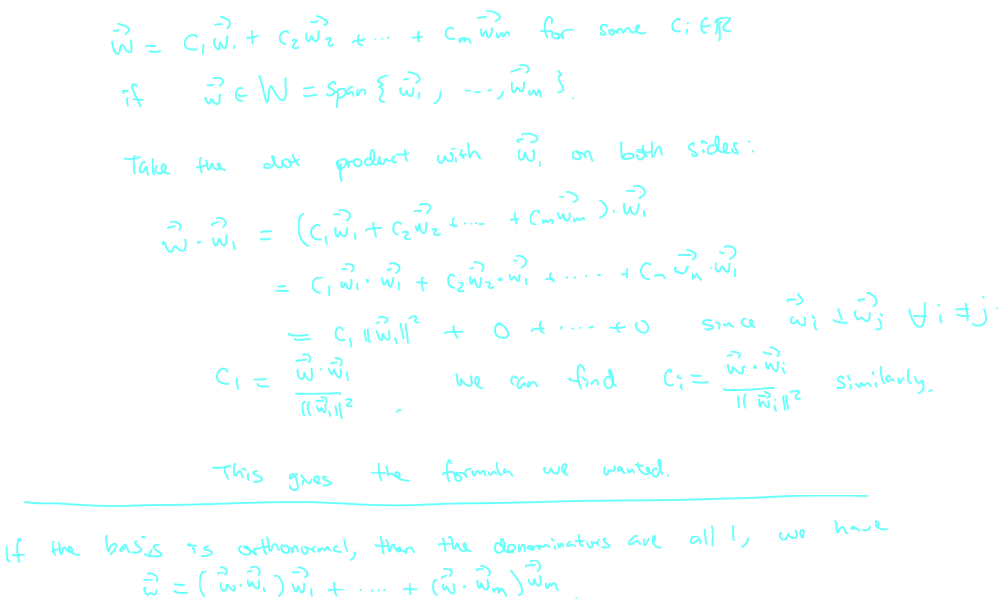
	- We have $\{(1,2,1),(1,0,-1),(1,-1,1)\}$ is an orthogonal set since
		- $(1,2,1) \cdot (1,0,-1) = (1,2,1) \cdot (1,-1,1) = (1,0,-1) \cdot (1,-1,1) = 0$
	- This is an orthogonal basis of $\mathbb{R^3}$, since an orthogonal set is LI and the $\text{dim}(\mathbb{R^3}) = 3$
	- Given any element of $\mathbb{R^3}$, we can express it as a linear combintation of these 3 elements
		- $$\begin{bmatrix} 1 \\ 6\\7 \end{bmatrix} = \frac{10}{3}\begin{bmatrix} 1 \\ 2\\1 \end{bmatrix} - 3 \begin{bmatrix} 1 \\ 0\\-1 \end{bmatrix} + \frac{2}{3} \begin{bmatrix} 1 \\ -1\\1 \end{bmatrix}$$
		- 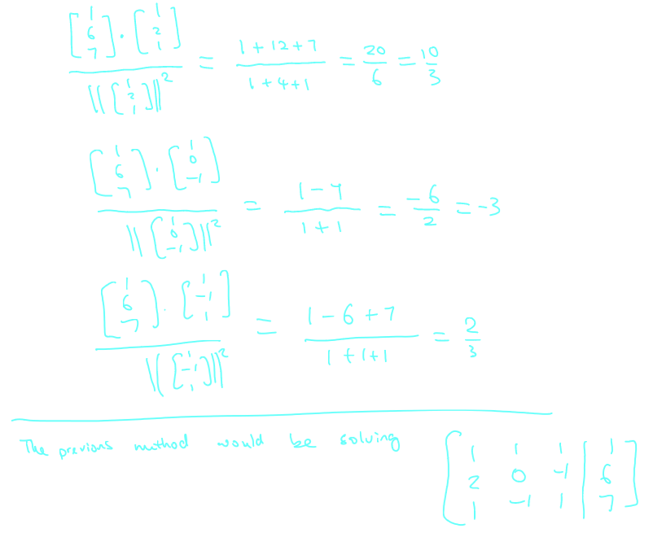