- #[[S1: Introduction to Statics]] #GNG1105
- ## [[Scalar and Vectors]]
  collapsed:: true
	-
	-
	- Parallelogram Law of Addition - Vector Sum: $V = v_1 + v_2$
		- Two vectors, $v_1$ and $v_2$, treated as free vectors, may be replaced by their equivalent vector $V$, which is the diagonal of the parallelogram formed by $v_1$ and $v_2$
		- Called a *vector sum*
			- 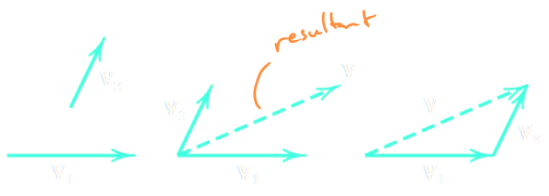{:height 171, :width 488}
	- Vector difference (adding a negative)
		- $V' = v_1 - v_2$
		- 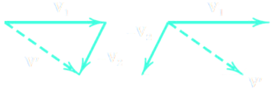{:height 114, :width 391}
	- Vector components
		- Vectors can be split in to vertical and horizontal components for making solutions easier
		- 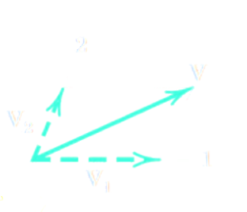{:height 230, :width 268}
		- $\vec{V} = \vec{v_1} + \vec{v_2}$
	- Rectangular Components:
		- 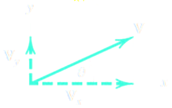{:height 176, :width 262}
	- Unit Vector Representation, $\vec{V} = vn$
		- A unit vector $n$ has a magnitude of one and points int he direction of a vector
			- $\hat{i}, \hat{j}, \hat{k}$ are unit vectors along $x, y, z$ axis
		- $v$ is the magnitude of said vector
		- 3-D Vectors $\rightarrow \vec{v} = V_xi + V_yj + V_zk$ (3-side vector sum)
			- $\vec{V_x} = cos \theta_x$
			- $\vec{V_y} = cos \theta_y$
			- $\vec{V_z} = cos \theta_z$
		- Direction Cosines
			- $cos \theta_x = V_x /v$
			- $cos \theta_y = V_y /v$
			- $cos \theta_z = V_z /v$
		- 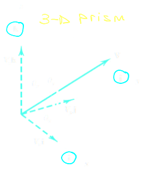
		- Pythagorean Theorem (Vector Magnitude)
			- $|v| = \sqrt{v_x^2 + v_y^2 + v_z^2}$
	-
- ## [[Newton's Laws]]
  collapsed:: true
	- First Law:
		- A particle remains at rest or continues to move with uniform velocity (in a straight line with constant speed) if there is no ^^unbalanced force^^ acting on it
			- $\therefore$ If an object is at rest (statics), then resultant force must be zero
				- Equilibrium of force $\sum \vec{F} = 0$
	- Second Law:
		- The acceleration of a particle is proportional to the vector sum of forces acting on it and is in the direction of this vector sum
		- Later you will see that this law can be stated as follows:
			- $\sum \vec{F} = \sum m \vec{a}$
			- Seen in kinematics
	- Third law:
		- The forces of ^^action^^ and ^^reaction^^ between interacting bodies are equal in magnitude, opposite in direction, and collinear (they lie on the same line)
		- 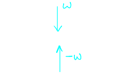{:height 157, :width 260}
- ## [[Units]]
	- ^^Kinetic units^^ are used to quantify each of the four fundamental concepts introduced earlier
	- Units for length, time, and mass can be defined arbitrarily and are referred to as ^^base units^^
	- A unit for force must be chosen in accordance with the equation $F=ma$ and is referred to as a ^^derived unit^^
	- Kinetic units selected in this way are said to form a ^^consistent system of units^^
	- International System of Units (SI Units)
		- In this system, the base units are the units of length, mass, and time
		- Length $\rightarrow$ metres(**m**)
		- Mass $\rightarrow$ kilograms (**kg**)
		- Time $\rightarrow$ seconds (**s**)
	- The unit of force is a derived unit and is called the ^^Newton (**N**)^^
		- A Newton is defined as a force which gives an acceleration of 1 $m/s^2$ to the mass of 1 kg
		- From $F=ma$:
			- $1N = (1kg)(\frac{1m}{s^2}) = 1kg \cdot m/s^2$
- #[[S2: Force Systems]]
- ## [[Force]]
	- A force is defined as an ^^action^^ of one body on another
		- Object has tendency to want movement
			- Known as translation movement
	- A force is a ^^vector^^ - its effect depends on the **direction** and **magnitude** of the action
		- Therefore, forces may be combined according to the parallelogram law
	- In general. we also need to define the ^^point of application^^ of the force
	- Direction is always in respect to an indicator
	- #### Real System:
		- 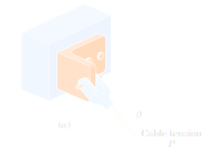
	- #### Idealized System:
		- 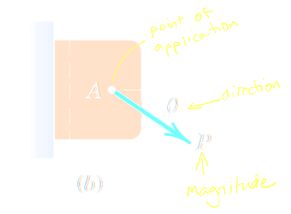
	- #### Principle of Transmissibility ("sliding vector")
		- For ^^rigid bodies^^, a force can slide anywhere along its ^^line of action^^ without changing the net effects on the body
			- 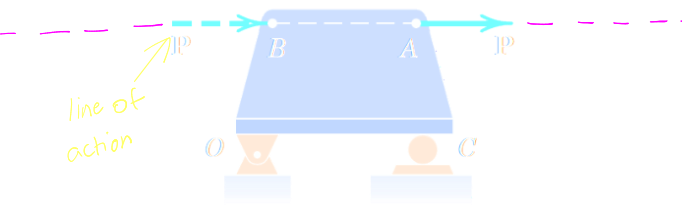{:height 197, :width 510}
	- ^^Concurrent forces^^ have lines of actions that intersect at a point
	- When dealing with concurrent forces, we can treat the objects as a ^^particle^^
		- 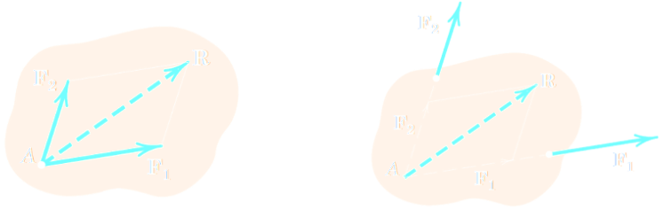{:height 195, :width 576}
	-
- ## [[Rectangular Components]]
	- Vector Components
		- $F = F_x + F_y$
	- Scalar Components
		- $F = F_xi + F_yj$
	- 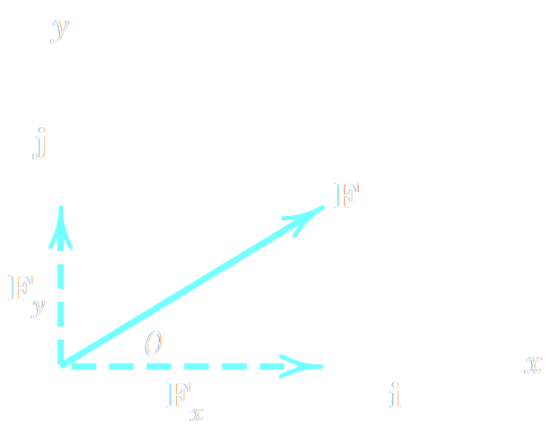{:height 281, :width 281}
	- $F_x = F cos \theta$
	- $F_y = F sin \theta$
	- $F= \sqrt{F_x^2 + F_y^2}$
	- $\theta = tan^{-1} \frac{F_y}{F_x}$
	- **Note:** $x$ and $y$ do not necessarily have to be horizontal and vertical
		- 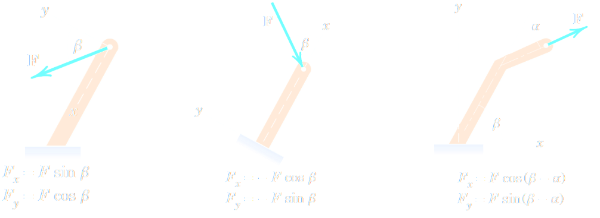{:height 236, :width 608}
	- Rectangular components can be used instead of the parallelogram law to find the resultants of 2 or more forces:
		- 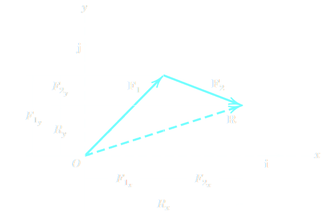{:height 257, :width 328}
			- $R = F_1 + F_2 = (F_{1_x}\hat{i} + F_{1_x}\hat{j}) + (F_{2_x}\hat{i} + F_{2_x}\hat{j})$
			- $R_xi + R_yj = (F_{1_x} + F_{1_x})\hat{i} + (F_{2_x} + F_{2_x})\hat{j}$
			- $R_x = F_{1_x} + F_{2_x} = \sum F_x$
			- $R_y = F_{1_y} + F_{2_y} = \sum F_y$
	- Example:
		- The forces **$F_1$**, **$F_2$** and **$F_3$**, all act on point *A* of the bracket. Determine the $x$ and $y$ scalar components of each of the three forces, and their resultant force
			- 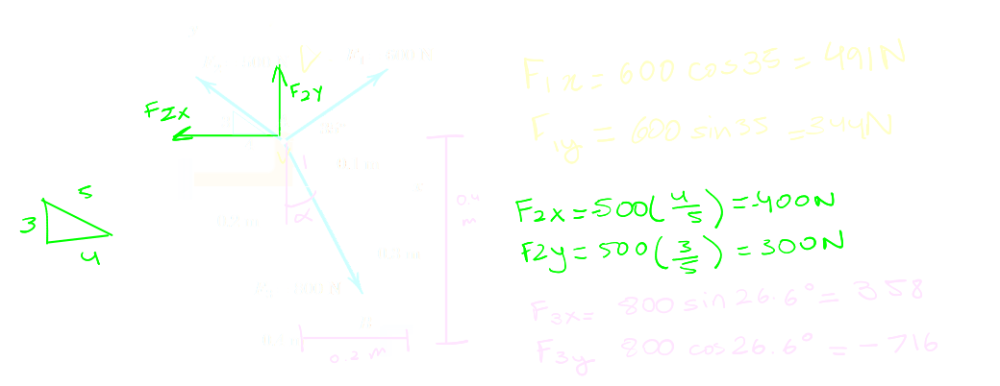{:height 253, :width 647}
			- 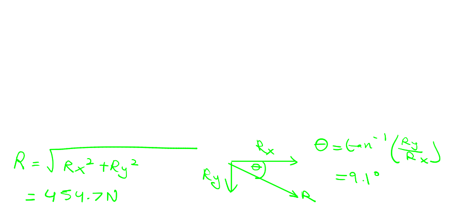{:height 274, :width 409}
			-
-