- #[[S3: Equlibrium]] #GNG1105
- Equilibrium conditions:
	- $\sum \vec{F} = 0$
	- $\sum M =0$
- ## [[System Isolation and Free-Body Diagrams]]
	-
	- ### ^^Type of Contact and Force Origin^^
		- ### Flexible cable, belt chain or rope
			- Weight of cable can be both negligible and not negligible
				- 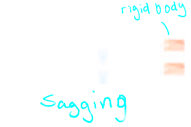
			- Force exerted by a flexible cable is always a ^^tension away from^^ the body in the direction of the cable
				- 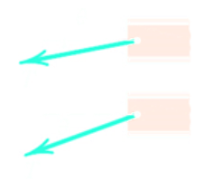
		- ### Smooth Surfaces
			- 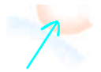{:height 99, :width 128}
			- Contact force is compressive and is normal(perpendicular) to the surface
				- 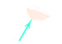
		- ### Rough Surfaces
			- 
			- Rough surfaces are capable of supporting a tangential component $F$ (frictional force) as well as a normal component $N$ of the resultant contact force $R$
				- 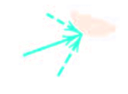
		- ### Roller Support
			- 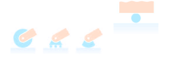
			- Roller, rocker, or ball support transmits a compressive force normal to supporting surface
				- 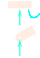
		- ### Free Sliding Guide
			- 
			- Collar or slider free to move along smooth guides; can support force normal to guide only
				- 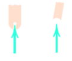
		- ### Pin Connection
			- 
			- A freely hinged pin connection is capable of supporting a force in any direction in the plane normal to the pin axis
			- We may either show two components $R_x$ and $R_y$ or a magnitude $R$ and direction $\theta$
			- A pin not free to turn also supports a couple $M$
				- 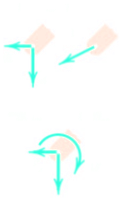
		- ### Built-in or fixed support
			- 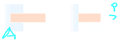
			- A built in or fixed support is capable of supporting an axial force $F$, a transverse force $V$ (shear force), and a couple $M$ (bending moment) to prevent rotation
				- 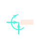{:height 82, :width 96}
		- ### Gravitiational attraction
			- 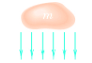
			- The resultant of gravitational attraction on all elements of a body mass $m$ is the weight $W = mg$ and acts toward the centre of gravity $G$
				- 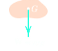
		- ### Spring action
			- 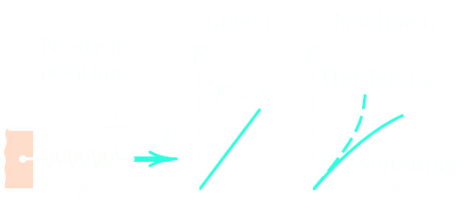{:height 109, :width 264}
			- Spring force is tensile if the spring ^^stretched^^ and ^^compressive^^ if ^^compressed^^
			- For a linearly elastic spring the stiffness $k$ is the force required to deform the spring a unit distance
				- 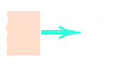{:height 97, :width 173}
		- ### Torsional spring action
			- 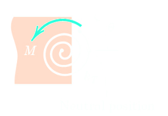{:height 141, :width 193}
			- For a linear torsional spring, the applied moment $M$ is proportional to the angular deflection $\theta$ from the neutral position
			- The stiffness $k_T$ is the moment required to deform the spring one radian
				- 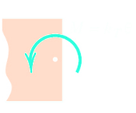{:height 127, :width 139}
	- Most important step in solving mechanics problems
	- Isolate the system including external boundaries
	- Identify **ALL** forces which act on the isolated system and represent them in the diagram
		- Known (weight or applied load)
		- Unknown (support reaction)
	- ### ^^Mechanical System^^
		- ### Plane truss
			- 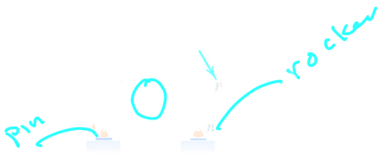
			- **Weight of truss assumed negligible** compared with P
				- 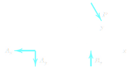
		- ### Cantilever beam
			- 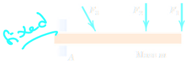
				- 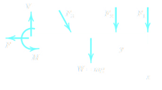
		- ### Beam
			- 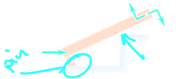
			- Smooth surface contact at $A$. Mass $m$
				- 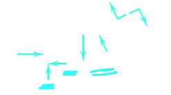
		- ### Rigid system
			- 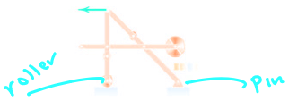
			- of interconnected bodies analyzed as a single unit of Weight of mechanism neglected
				- 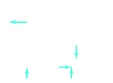
- ## [[Equilibrium Conditions]]
	- ### Scalar format:
		- $\sum F_x = 0$
		- $\sum F_y = 0$
		- $\sum M_O = 0$
		- No more than 3 unknowns
		- 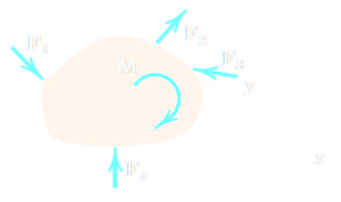
	- ### Alternative Equilibrium Conditions
		- $\sum F_x = 0$
		- $\sum M_A = 0$
		- $\sum M_B = 0$
		- $\sum M_C= 0$
	- Two force members occur whena  body is in equilibrium under the action only two forces
	- The forces must be ^^equal^^, ^^opposite^^, ^^collinear^^ (same line of action), and independent of the object shape
		- 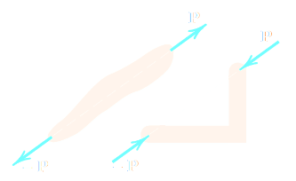
	- Three-force members occur when a body is in equilibrium under the action only three forces
	- These forces but be ^^concurrent^^, except in cases where all three forces are parallel
		- 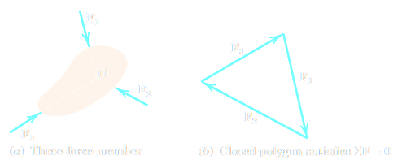
	- ### Statically determinant system
		- 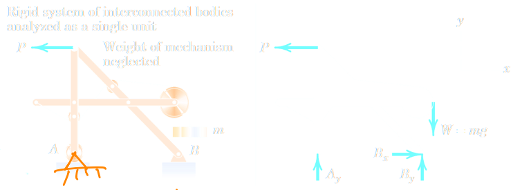
		- If we replace the roller at $A$ with a pin, the system becomes statiscally indeterminant
		- ^^**Statically determinate structure:**^^
			- A structure that is static and all unknown reactive forces can be determined by equilibrium equations
		- ^^**Statically indeterminate structure:**^^
			- A structure that is stable but contains more unknown forces available equation of equilibrium
	- ### Adequacy of Constraints
		- 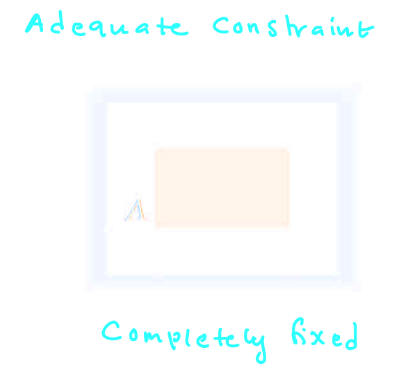{:height 288, :width 283}
		- 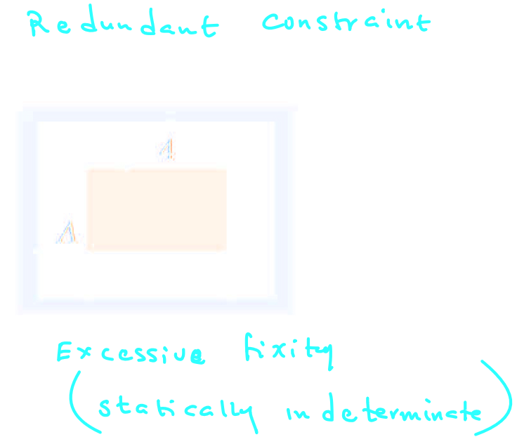{:height 549, :width 376}
		  id:: 65222ed6-1160-4984-82a1-f85ed096d106
		- 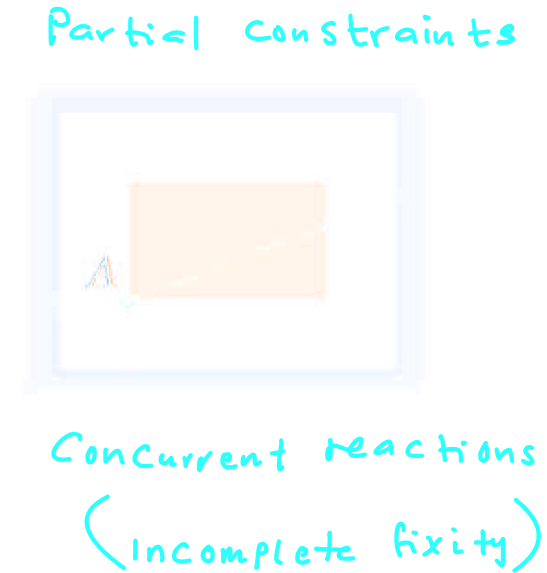{:height 369, :width 274}
		- 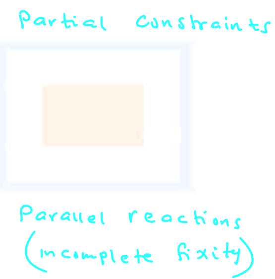{:height 543, :width 253}
	- Example:
		- Determine the magnitude of forces $C$ and $T$ which, along with the other three forces shown, act on the bridge-truss joint
		- 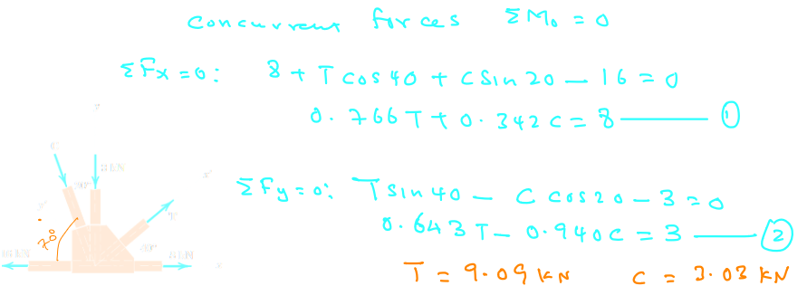
		-