- #[[S4: Structures]] #GNG1105
- ## [[Plane Trusses]]
	- A ^^simple truss^^ is a built from basic triangles to make a rigid structure
		- 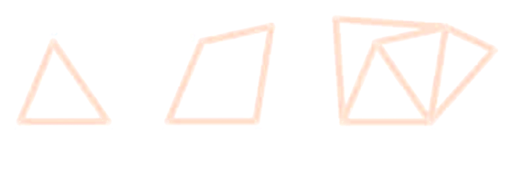{:height 211, :width 608}
	- Truss members are assumed to be pin connected
		- Therefore, all truss members must be ^^two-force members^^
		- 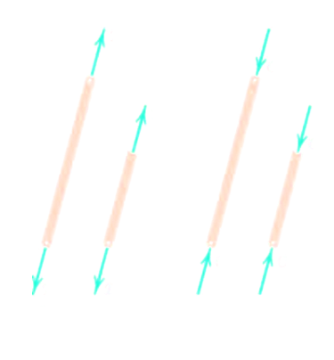{:height 288, :width 252}
- ## [[Method of Joints]]
	- Since the overall structure is in equilibrium, each member and joint must also be in equilibrium
	- Each individual joint is analysed as a set of concurrent forces
		- 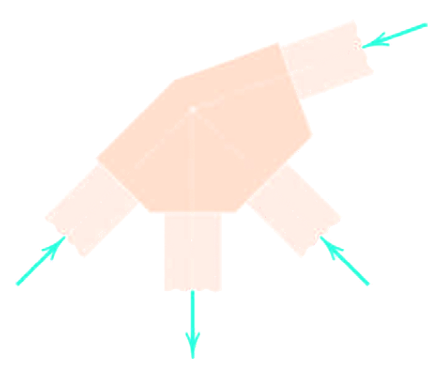{:height 376, :width 438}
	- For each joint, two equations of equilibrium may be used to solve for up to two unknown forces
		- 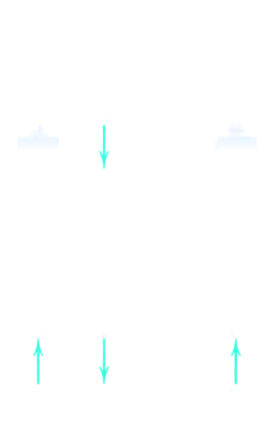{:height 430, :width 246} 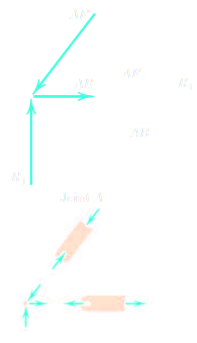{:height 180, :width 221}
		- 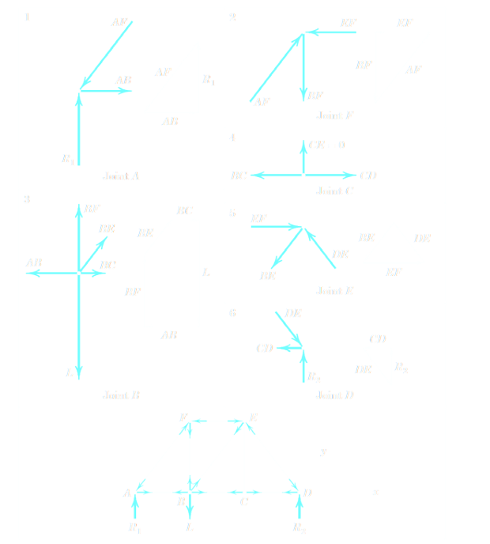
	- Special Cases: ^^Zero force members^^
		- 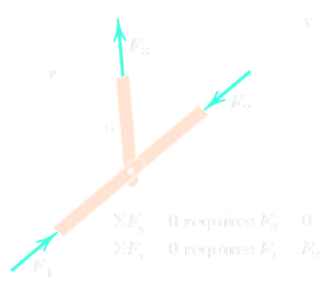{:height 509, :width 325} 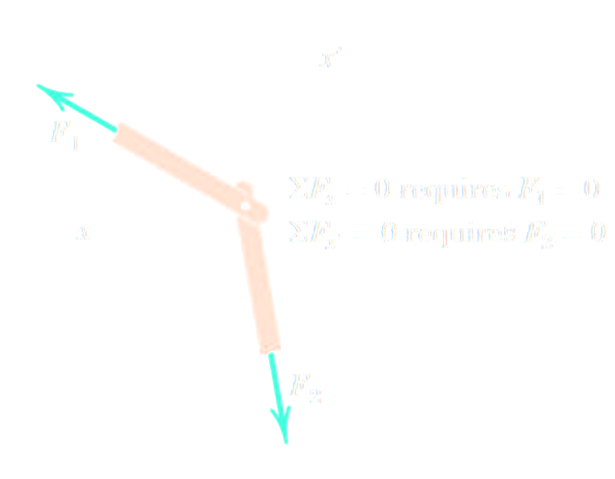{:height 794, :width 290}
	- Special Cases: ^^Collinear Members^^
		- 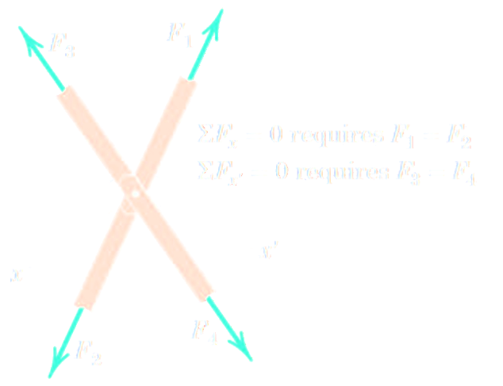{:height 257, :width 317}
		-
	- Example:
	  background-color:: blue
		- Compute the force in each member of the loaded cantilever truss by the method of joints
			- 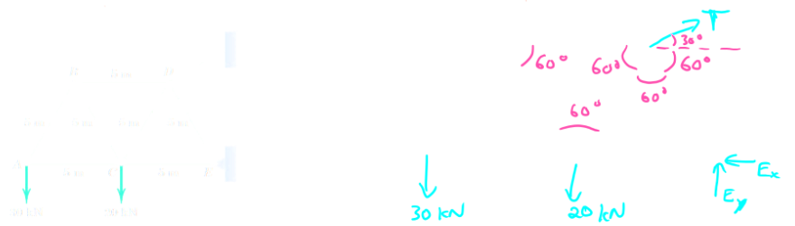
			- 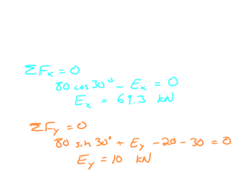
			- 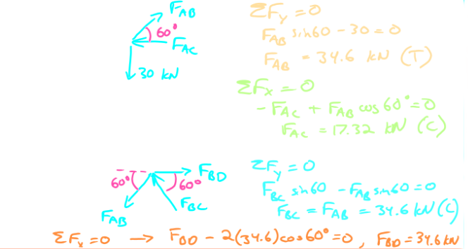 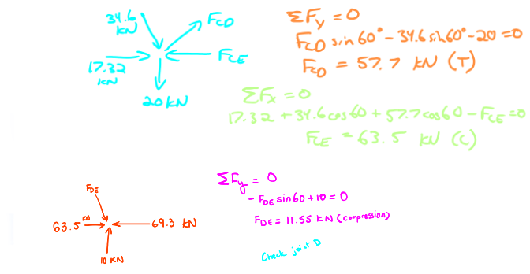
		- The simple truss shown supports the two loads, each of magnitude L. Determine the forces in members *DE*, *DF*, *DG* and *CD*
			- 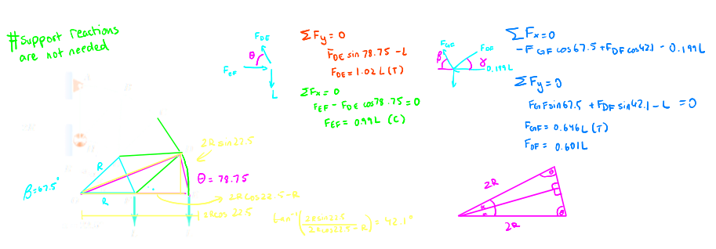
			- 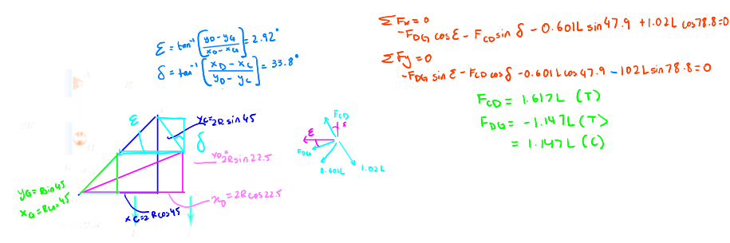
- ## [[Method of Sections]]
	- Used to determine the force in almost any member of the truss directly without going joint by joint
		- 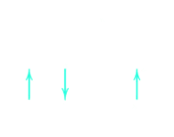
	- An entire section of a truss is analyzed as a rigid body in equilibrium
	- Usually limited to cutting at most three members at one time (some exceptions)
		- 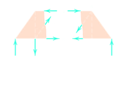
	- In general, start by solving for external reaction forces
	- Pass a section through the member of interest and up to 2 other members to isolate a portion of the truss
	- Choose either side of the truss and apply equations of equilibrium to solve for unknown internal forces
	- Example:
	  background-color:: blue
		- Calculate the forces induced in members *KL*,*CL*, *CB* by the 20-ton load on the cantilever truss
			- 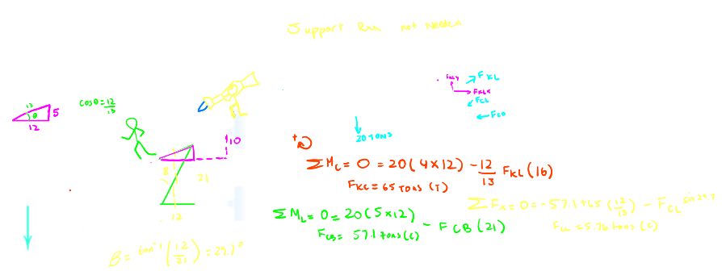
		- Calculate the force in the member *DJ* of the Howe roof truss illustrated. Neglect any horizontal component of force at the supports
			- 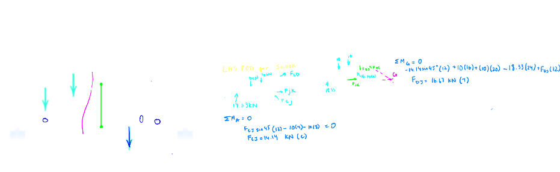
- ## [[Frames and Machines]]
	- In this course, a frame or machine refers to a structure with at least one ^^multi-force member^^
	- A multi-force member has three or more forces acting on it, or two or more forces and one or more couples
	- 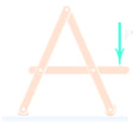
	- 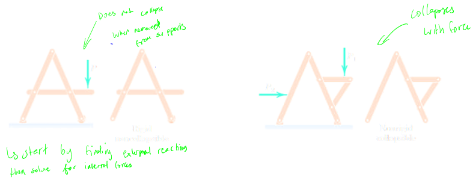
	- Example
		- The frame supports the 400-kg load in the manner shown. Neglect the weights of the members compared with the forces induced by the load and compute the horizontal and vertical components of all forces acting on each of the members
			- 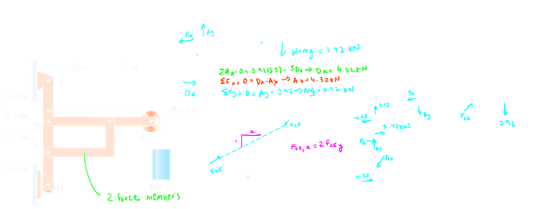
	-
-