- #[[D2: Kinematics of Particles]] #GNG1105
- ## [[Dynamics]]
	- Dynamics is the branch of mechanics which deals with the motion of bodies under the action of forces
	- Dynamics has two distinct parts:
		- **Kinematics** deals with the study of motion without reference to the forces which cause the motion
		- **Kinetics** relates the action of forces on bodies to their resulting motions
		- $F = ma$
	- Kinematics is the "geometry of motion"
		- Particle motion $(x,y,z)$
		- Choice of Coordinates $(r, \theta, z)$
		- Reference frame, (absolute or relative) $(n,t)$
		- 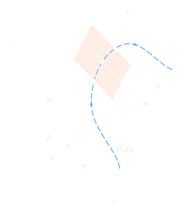
- ## [[Rectilinear Forces]]
	- 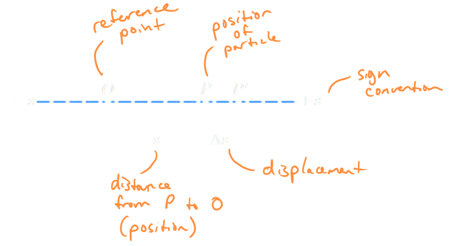
	- Displacement
		- $$\Delta S = S_2 - S_1$$
	- Velocity
		- $$V_{avg} = \frac{\Delta s}{\Delta t}$$
			- $$\rightarrow V = \frac{ds}{dt} = s'$$
			-
			-
	- Acceleration
		- $$a_{avg} = \frac{\Delta v}{\Delta t}$$
			- $$\rightarrow a = \frac{dv}{dt} = v' = s''$$
	- Other relationships
		- $$a = v \frac{dv}{ds} = \frac{dv}{dt}$$
		- $$s'' = s' \frac{ds'}{ds}$$
	- Functions of time
		- Velocity at time $t$ is the slope of the position curve at time $t$
			- 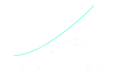
		- Acceleration at time $t$ is the slope of the velocity curve at time $t$
			- 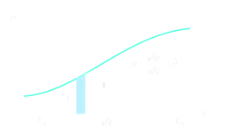
		- The area under the $v-t$ curve during the interval $t_1$ to $t_2$ is the net displacement of the particle during the time interval
			- 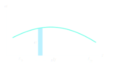
		- $$\int_{s_1}^{s_2} \ ds = \int_{t_1}^{t_2} v \ dt$$
		- or $\Delta s = s_2 - s_1 =$ (area under $v-t$ curve)
		  id:: 65663436-7487-438e-889f-63d83129b509
	- The area under the $a - t$ curve during the interval $t_1$ to $t_2$ is the net change in velocity of the particle during the time interval
		- $$\int_{v_1}^{v_2} \ dv = \int_{t_1}^{t_2} a \ dt$$
		- or $\Delta v = v_2 - v_1 =$ (area under $a-t$ curve)
	- Functions of position
		- $$a = f(s) = v \frac{dv}{ds}$$
		- The area under the $a-s$ curve between the positions $s_1$ and $s_2$ is one-half the difference of the squared velocities of the particle at the two positions
			- 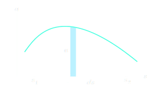
			- $$\int_{v_1}^{v_2} \ v \ dv = \int_{t_1}^{t_2} a \ ds$$
			- or $\frac{1}{2}(v^2_2 - v^2_1) =$ (area under $a-s$ curve)
	- If position is given as a function of time $s(t)$, then...
		- Differentiate once to obtain velocity as a function of time, $v(t)$
		- Differentiate a second time to obtain acceleration as a function of time $q(t)$
		- The functions for position, velocity, and acceleration are easily plotted and evaluated at times of interest to obtain desired information
		- If position is not given as a function of time, it must be determined by successive integrations of the acceleration, which is determined by the forces which act on the particle
	- ^^**Case 1: Constant Acceleration**^^
		- $$\int_{v_0}^{v} \ dv = a \int_{t}^{0} a \ dt \text{ or } v = v_0 + at$$
		- $$\int_{s_0}^{s} \ ds = \int_{t}^{0} (v_0 + at)\ dt \text{ or } s = s_0 + v_0t + frac{1}{2}at^2$$
		- $$\int_{v_0}^{v}  v \ dv = a \int_{t}^{0} a \ ds \text{ or } v^2 = v_0^2 + 2a(s - s_0)$$
		- For $a = 0$: $v = v_0$
			- $$s = s_0 + vt$$
	- ^^**Case 2: Acceleration as a function of time**^^
		- $$\int_{v_0}^{v} \ dv = a \int_{t}^{0} f(t) \ dt \text{ or } v = v_0 + a\int_0^t f(t) \ dt$$
		- $$v = \frac{ds}{dt} \rightarrow \int_{s_0}^{s} \ ds =  \int_{t}^{0} v \ dt \text{ or } s = s_0 + \int_0^t v \ dt$$
	- ^^**Case 3: Acceleration as a function of velocity**^^
		- $$a = f(v) = \frac{dv}{dt} = v \frac{dv}{ds}$$
		- $$t = \int_0^t \ dt = \int_{v_0}^v \frac{dv}{f(v)}$$
		- $$\int_{v_0}^v \frac{v \ dv}{f(v)} = \int_{s_0}^s \ ds \text{ or } s = s_0 + \int_{v_0}^v \frac{v \ dv}{f(v)}$$
	- ^^**Case 4: Acceleration as a function of position**^^
		- $$a = f(s) = v \frac{dv}{ds}$$
		- $$\int_{v_0}^v v \ dv = \int_{s_0}^s f(s) \ ds \text{ or } v^2 = v_0^2 + 2\int_{s_0}^s f(s) \ ds$$
	- Example:
	  background-color:: blue
		- The position coordinate of a particle which is confined to move along a straight line is given by $s = 2t^3 - 24t _6$, where $s$ is measured in meters from a convenient origin and $t$ is in seconds. Determine the time required for the particle to reach a velocity of 72 m/s from its initial condition at $t$ =0  the acceleration $v$ = 30 m/s and the net displacement of the particle during the interval $t$ = 1s to $t$ = 4s
			- 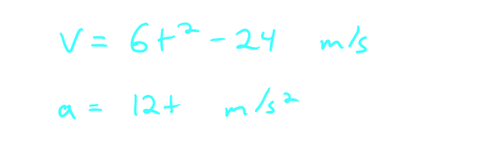
			- 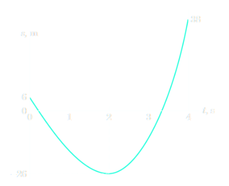
			- 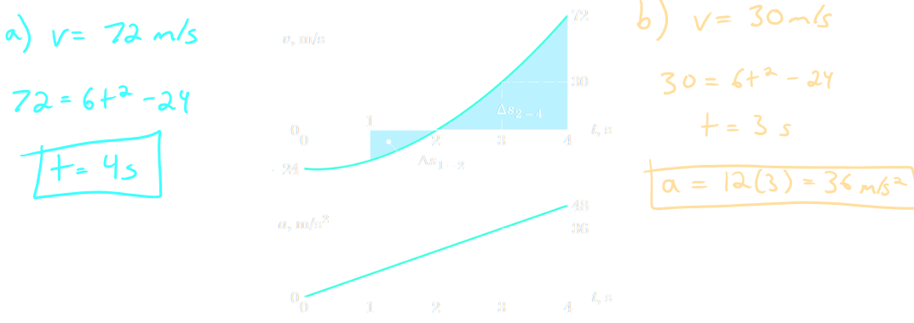
			- 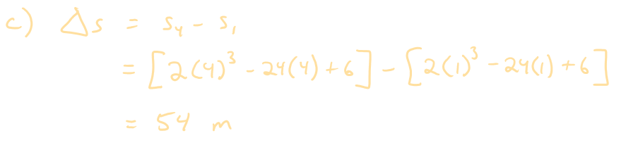
		- A particle moves along the $x$-axis with an initial velocity $v_x$ = 50 ft/s at the origin when $t$ = 0.  For the first 4 seconds it has no acceleration, and thereafter it is acted on by a retarding force which gives it a constant acceleration $a_x$ - 10 ft/$s^2$. Calculate the velocity and the $x$-coordinate of the particle for the conditions of $t$ = 8s and $t$= 12s and find the maximum positive $x$-coordinate reached by the particle
			- 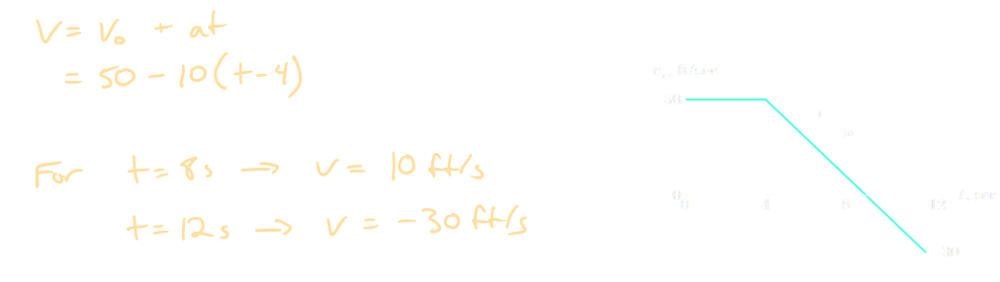
			- 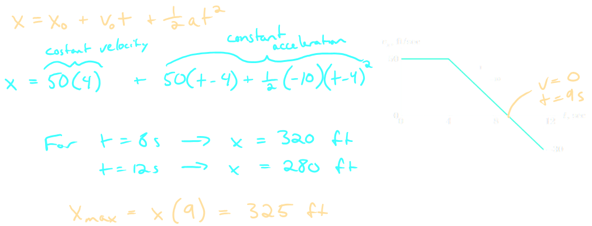
- ## [[Plane Curvilinear Motion]]
	- 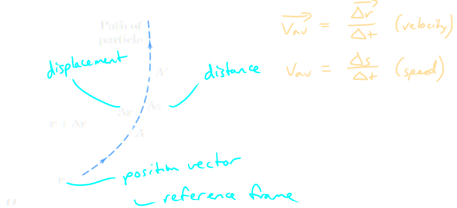
	- 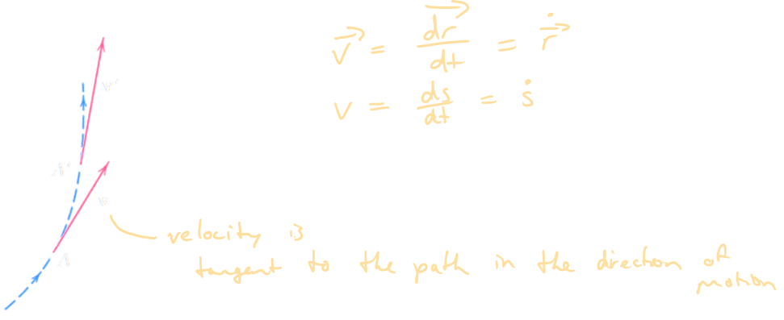
	- 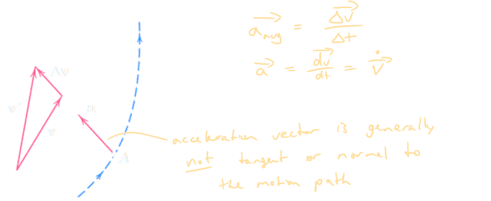
- ## [[Rectangular Coordinates]]
	- $$\vec{r} = x \hat{i} + y\hat{j}$$
	- $$v = r' = x'\hat{i} + y'\hat{j}$$
	- $$a = v' = r'' = x'' \hat{i} + y''\hat{j}$$
	- $$v^2 + v_x^2 + v_y^2$$
	- $$v = \sqrt{v_x^2 + v_y^2}$$
	- $$\tan \theta = \frac{v_y}{v_x}$$
	- $$a^2 = a_x^2 + a_y^2$$
	- $$a = \sqrt{a_x^2 + a_y^2}$$
		- 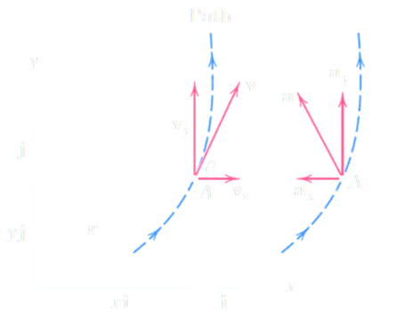
	- ^^**Projectile Motion**^^
		- Ignoring drag:
			- **Constant Velocity**$(x)$
				- $V_x = (V_x)_0t$
				- $x = x_0 + (v_x)_0t$
			- **Constant Acceleration**$(x)$
				- $V_y = (V_y)_0 - gt$
				- $y = y_0 + (V_y)_0t - \frac{1}{2}gt^2$
				- $v_y^2 = (v_y)_0^2 - 2g(y - y_0)$
	- Example:
		- A team of engineering students designs a medium-size catapult which launches 8-lb steel spheres. The launch speed is $v_0$ = 80 ft/sec, the launch angle is $\theta = 35 \deg$ above the horizontal, and the launch position is 6ft above ground level. The students use an athletic field with an adjoining slope topped by an 8-ft fence as shown. Determine:
			- a. the time duration $t_f$ of the flight
			- the $x-y$ coordinate of the point of first impact
			- the maximum height $h$ above the horizontal field attained by the ball
			- the velocity (expressed as a vector) with which the projectile strikes the ground (or the fence)
				- 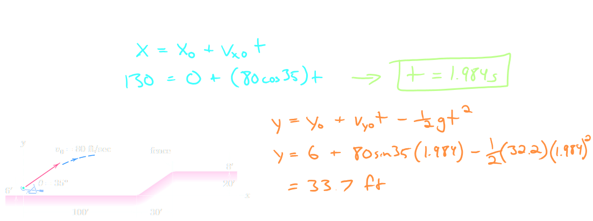
				- 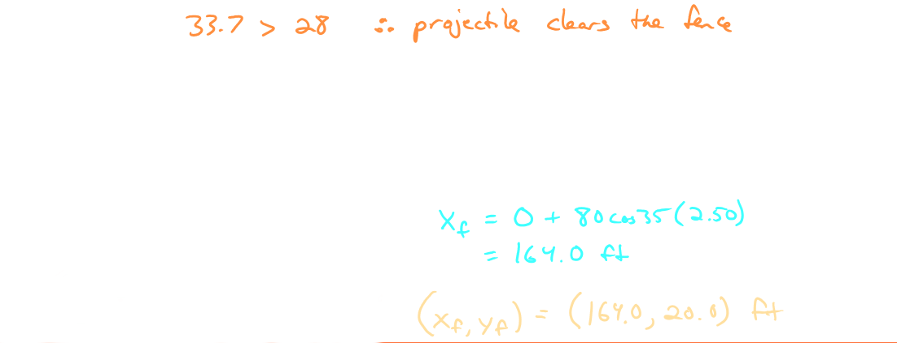
				- 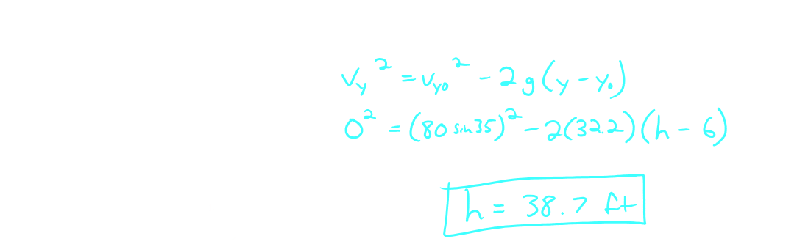
				- 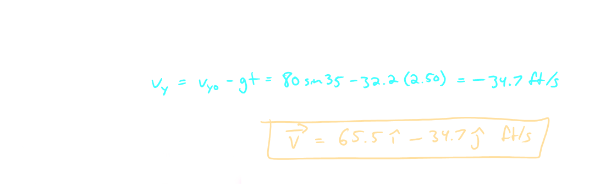
- ## [[Normal and Tangential Coordinates]]
	- 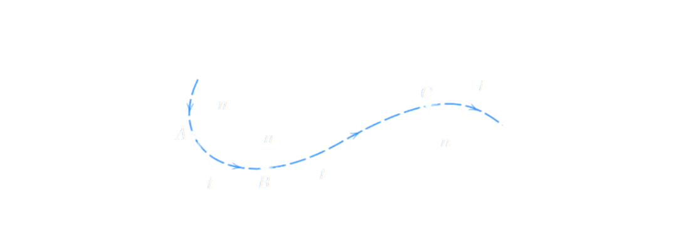
	- $$v = \frac{ds}{dt} = \rho \frac{d \beta}{dt} = \rho \beta'$$
	- $$\vec{v} = v \hat{e}_t = \rho \beta' \hat{e}_t$$
	- $$\vec{a} = \frac{\vec{dv}}{dt} = \frac{v^2}{\rho} \hat{e}_n + v' \vec{e}_t$$
	- $$a_n = \frac{v^2}{\rho}$$
	- $$a_+ =v'$$ (rate of change of speed)
	- $$a = \sqrt{a_n^2 + a_t^2}$$
	- Example:
		- To anticipate the dip and hump in the road, the driver of a car applies her brakes to produce a uniform deceleration. Her speed is 100km/h at the bottom $A$ of the dip and 50km/h at the top $C$ of the hump, which is 120 m along the road from $A$. If the passengers experience a total acceleration of 3 $m/s^2$ at $A$ and if the radius of curvature of the hump at $C$ is 150 m, calculate the radius of curvature $\rho$ at A, the acceleration at the inflection point $B$, and the total acceleration at $C$
			- 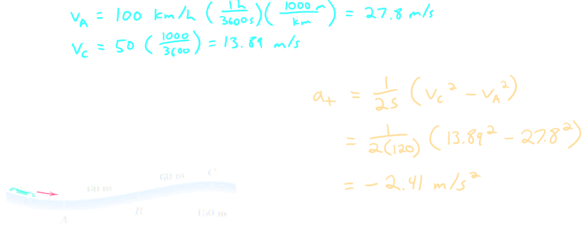
			- 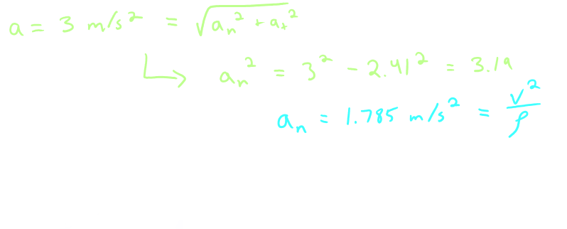
			- 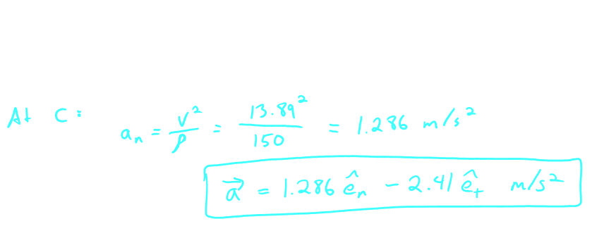
	-
-