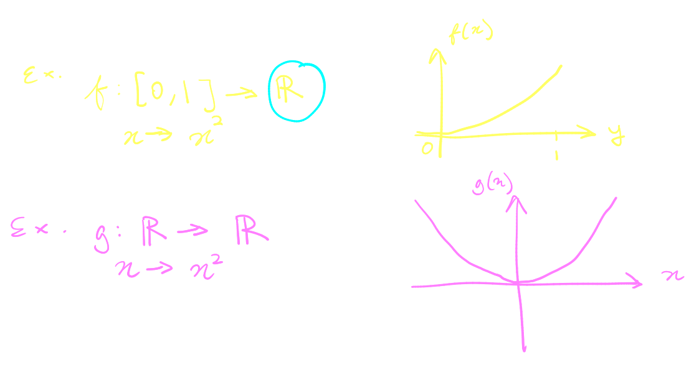
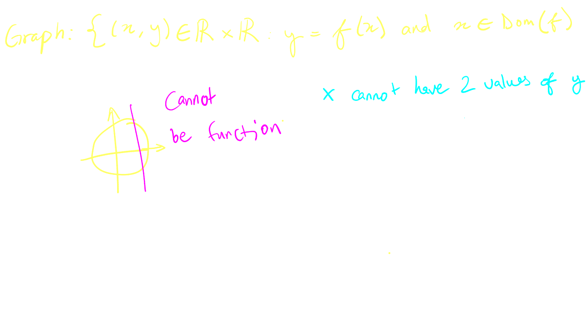
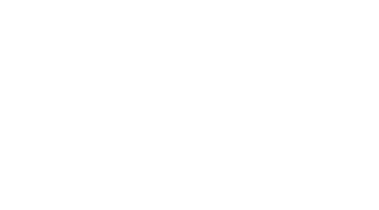
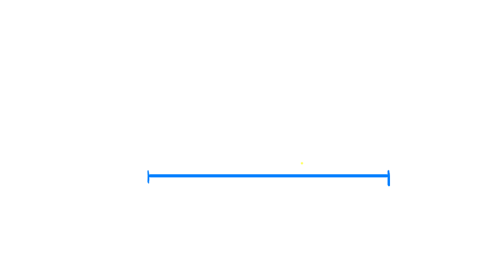
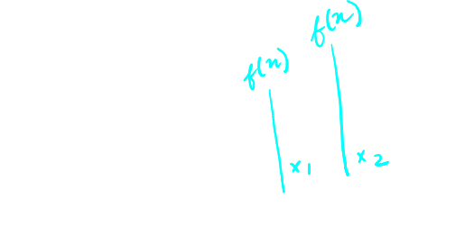
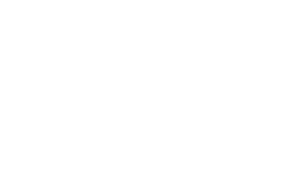
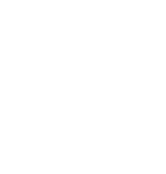
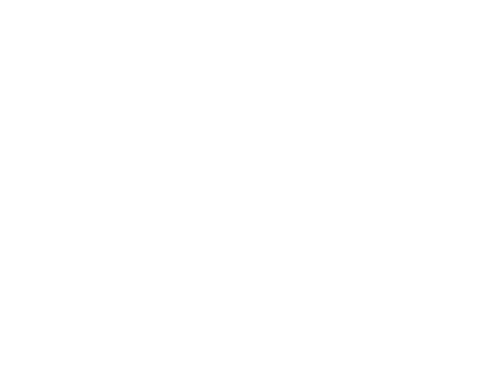
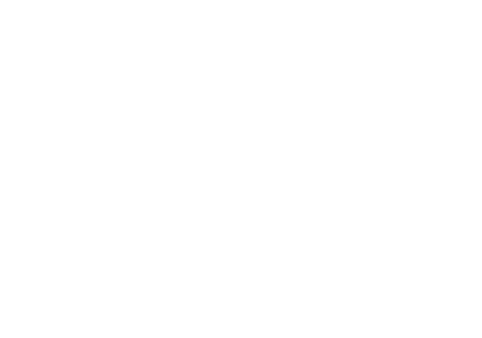

## [[Introduction and Review of Functions]] #MAT1320
	- ### Functions and Concepts
		- A ^^function^^ $f$ is a rule between two sets, called the ^^domain^^ and the ^^range^^, that assigns to each element $x$ in the domain **exactly one** element, called $f(x)$, in the range
		- Traditionally,
			- $y=f(x)$
				- $f$ is a function of variable $x$
			- There are three parts of the function
				- The Law: $y=f(x)$
				- Domain of function
				- Range of function
					- $x \rightarrow f(x)$
				- {:height 278, :width 473}
			- Example:
			  background-color:: blue
				- Area of circle depends on its radius
					- $A(r) = \pi r^2$
		- Graph
			- The ^^graph^^ of $y=f(x)$ consists of all ordered pairs (coordinates) ($x$, $f(x)$) such that $x$ belongs to the domain of $f$
		- Vertical Line Test
			- Actually any equation in 2 variables can be represented by some curve in the $xy$-plane, but not every 2-dimensional curve corresponds to the graph of a **function!**
			- Graph of a function must pass the Vertical Line Test
			  collapsed:: true
				- {:height 344, :width 527}
				-
	- ### Symmetry and Periodicity of Functions
		- ^^**Even Functions**^^
			- If $f(-x) = f(x)$ for every $x$ in the domain of $f$. then $f$ is ^^even^^ function
				- Ex. $f(x) = \frac{1}{x}$
					- D: $\{x \in \mathbb{R}|x\neq 0\}$
					- $f(-x) = \frac{1}{-x^2} = \frac{1}{x^2} = f(x)$
						- $y$-symmetry
					- {:height 148, :width 237}
		- ^^**Odd Functions**^^
			- If $f(-x)=-f(x)$ for every $x$ in the domain of $f$, then $f$ is called ^^odd^^ function
				- Ex. $f(x)=x^3$
					- D:$\{x\in \mathbb{R}\}$
					- R: $\{y \in \mathbb{R}\}$
					- $f(-x) = (-x)^3 \\=-x^3 \\=-f(x)$
						- $y=x$ symmetry
					- {:height 202, :width 265}
		- ^^**Periodic Functions**^^
			- If there exists a positive constant $p$ such that $f(x+p) = f(x)$ for every $x$ in the domain of $f$, then $f$ is called a ^^periodic^^ function
			- The smallest such constant $p$ is called the period
			- D: $\{x \in \mathbb{R}\}$
			- R: $\{y\in\mathbb{R}|y\in [-1,1]\}$
			- {:height 247, :width 417}
	- ### Increasing/Decreasing
		- Let $I$ be some interval of the real number line
		- A function $y=f(x)$ is called:
			- ^^**Increasing**^^ on the interval $I$ if
				- $f(x_1) < f(x_2)$
					- $x_1 < x_2$ & $(x_1, x_2 \in I)$
					- {:height 219, :width 372}
			- ^^**Decreasing**^^ on the interval $I$ if
				- $f(x_1) > f(x_2)$ whenever $x_1< x_2$ & $(x_1. x_2 \in I)$ dec $(0, \infty)$
				- {:height 187, :width 261}
	- ### Catalogue of Important Functions: Linear Function
		- Linear Functions
			- $y = mx +b$ where
				- $m$ is slope
				- $b$ is intersection of axis
				- {:height 227, :width 196}
		- {:height 280, :width 351}
		- {:height 250, :width 353}
		-
-