## [[Introduction and Review of Functions]] #MAT1320
	- ### Composition
		- Let $f$ and $g$ be functions
			- If all numbers in the range of $g$ are in the domain of $f$, the the ^^composition^^ $f \circ g$ is a function defined by:
				- $(f \circ g)(x) = f(g(x))$
		- Example:
		  background-color:: blue
			- Find the composition $f \circ g$, where $f(x) = \frac{x-1}{x+1}$ and $g(x) = \frac{1}{\sqrt{x}}$
				- 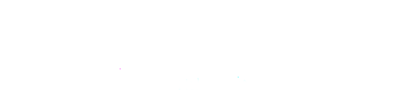
				- D: $\{x \in \mathbb{R}|x > 0 \}$
				- R:$\{y \in \mathbb{R}| -1 < y < 1 \}$
	- ### Inverse
		- **^^Horizontal Line Test^^**
			- Let $f(x)$ be a function
			- If every horizontal line crosses the graph of $f$ at most once, then $f(x)$ is a ^^one to one (injective)^^ function
				- Each element of the domain points to its own distinct element
			- 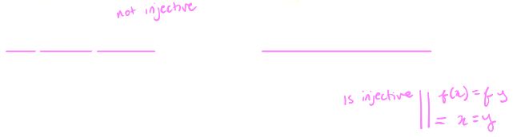
		- ^^**Inverse**^^
			- Let $y=f(x)$ be a function
			- If $f$ passes the Horizontal Line Test, then the map $f^-{1}$ defined by the rule
				- $f_{-1} = x \Longleftrightarrow f(x) =y$
				- Is called the ^^inverse^^ of $f$
			- Example:
			  background-color:: blue
				- Find the inverse of $g(x) =\frac{2x-1}{3x+2}$ and verify that $(g \circ g^{-1})(x) = x = (g^{-1} \circ g )(x)$
					- 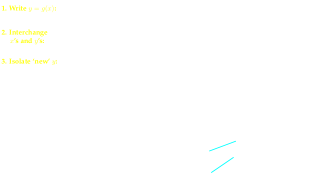
			- Example:
			  background-color:: blue
				- Find the inverse of $f(x) = \sqrt{x-2}$ and sketch the graph of $f$ and $f^{-1}$
					- 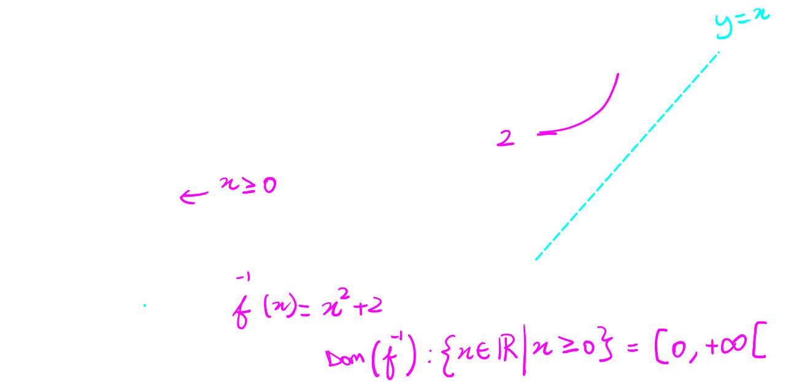
	- ### Catalogue of Important Functions: Exponential and Logarithmic
		- ^^**Exponential Functions**^^
			- $f(x) = a^x$
				- Where $a > 0$ and constant, $a \neq 1$
				- $a$ is called the base
		- ^^**Natural Base**^^
			- $f(x) = e^x$
				- 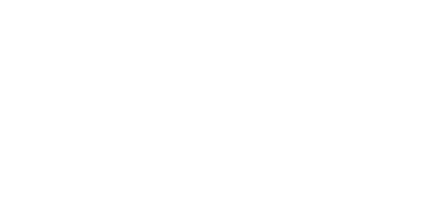{:height 200, :width 354}
				- D: \]-\infty, +\infty\[
				- R: \]0, \infty\[
		- ^^**Laws of Exponents**^^
			- $a^x a^y = a^{x+y}$
			- $(a^x)^y = a^{xy}$
			- $a^{-x} = \frac{1}{a^x}$
			- $a^1 = a$
			- $a^0 = 1$
			- $\frac{a^x}{a^y} = a^{x-y}$
			- $(ab)^x = a^x b^x$
			- $(\frac{a}{b})^x= \frac{a^x}{b^x}$
			- Example:
			  background-color:: blue
		- ^^**Logarithmic Functions**^^
			- $f(x) = \log_a(x)$
				- Where base $a > 0$ and constant, $a \neq 1$
				- Domain: \]0, +\infty\[
				  id:: 6501f2f6-913b-48ae-a246-e1cf0cca69ef
		- ^^**Natural Logarithm**^^
			- 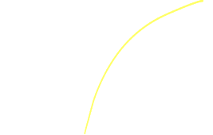
			- $f(x) = \log_e(x) = \ln(x)$
		- **^^Law of Logs^^**
			- $\ln(xy) = \ln(x) = \ln(y)$
			- $\ln(x^p) = p\ln(x)$
			- $\ln(\frac{x}{y})= \ln(x) - \ln(y)$
			- $\ln(e) = 1$
			- $\ln(1) = 0$
			- Change of base:
				- $$\log_b(x) = \frac{\log_a(x)}{\log_a(b)}$$
		- ^^**Inverse Relationship** between $a^x$ and $\log_a(x)$^^
			- $\log_a(x) = y \Longleftrightarrow x = a^y$
				- $(a\log_a(x) = a^y)$
				- $\log_a(a^y) = y$
				- $a\log_a(x) =x$
				- 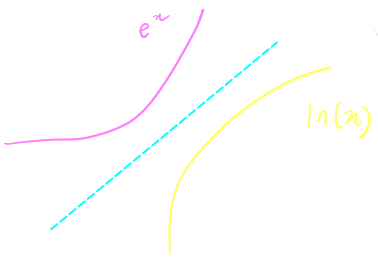{:height 213, :width 309}
				-
			- Example
			  background-color:: blue
	- ### Catalogue of Important Functions: Trigonometric and Inverse Trig
		- ^^**Trigonometric Ratios**^^
			- 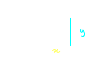
			- $sin(\theta) = \frac{y}{r}$
			- $cos(\theta) = \frac{x}{r}$
			- $tan(\theta) = \frac{y}{x}$
			- $csc(\theta) = \frac{1}{sin\theta} =\frac{r}{y}$
			- $sec(\theta) = \frac{1}{cos\theta} =\frac{r}{x}$
			- $cot(\theta) = \frac{1}{tan\theta} =\frac{x}{y}$
		- ^^**Sine**^^
			- 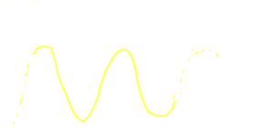
			- D: \]-\infty, +\infty\[
			- R: [-1, 1]
			- Period: 2\pi
			- Roots: $ax = k \pi, k \in \mathbb{Z}$
		- ^^**Cosine**^^
			- 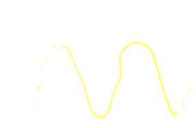
			- D: \]-\infty, +\infty\[
			- R: [-1, 1]
			- Period: 2\pi
			- Roots: $ax = (2k+1) \frac{\pi}{2}, k \in \mathbb{Z}$
		- ^^**Tangent**^^
			- 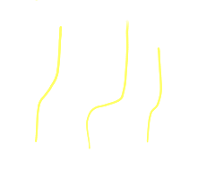
			- D: $\{x \in \mathbb{R}| x \neq (2k+1)\frac{\pi}{2}, k \in \mathbb{z}\}$
		- ^^**Useful Trig Identities**^^
			- $sin^2\theta + cos^2 \theta =1$
			- $tan\theta = \frac{sin\theta}{cos\theta}$
			- $tan^2\theta + 1 = sec^2\theta$
			- $1+ cot^2(\theta) = csc^2 \theta$
			- $sin(x+y) = sin(x)cos(y) + cos(x)sin(y)$
			- $cos(x+y) = cos(x)cos(y) - sin(x)sin(y)$
			- $sin(2x) = 2sinxcosx$
			- $cos2x = cos^2(x) - sin^2(x)$
		-