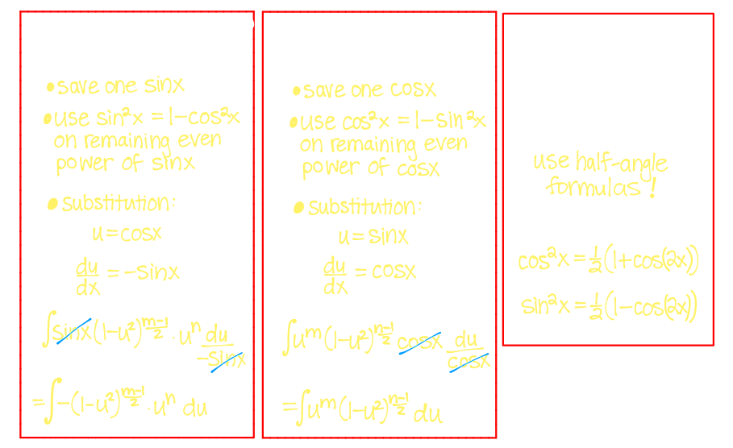
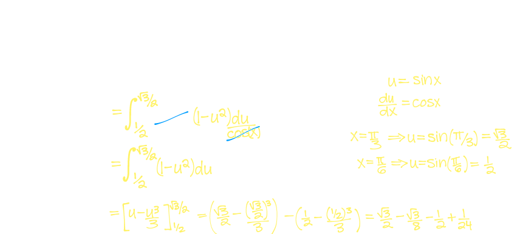
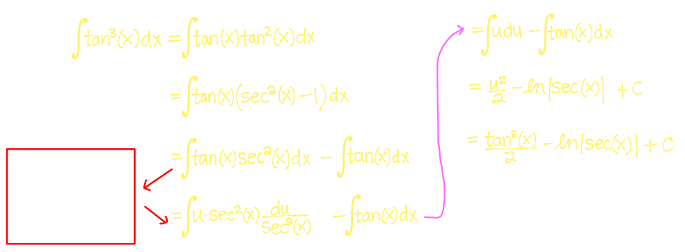
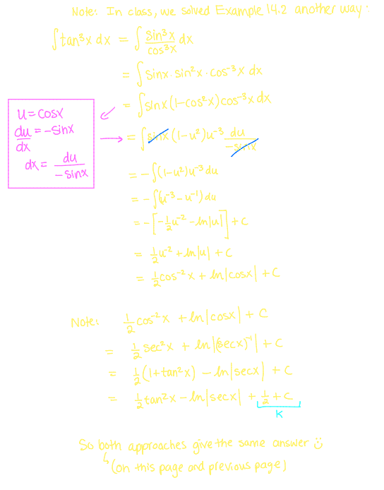
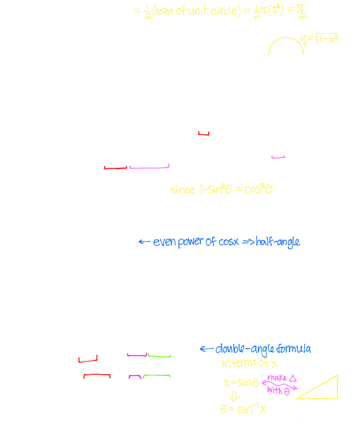
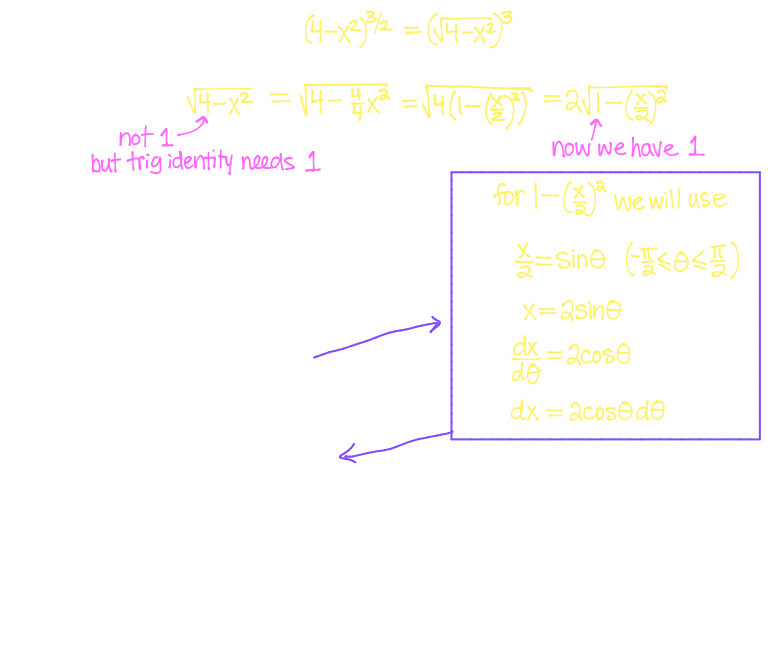
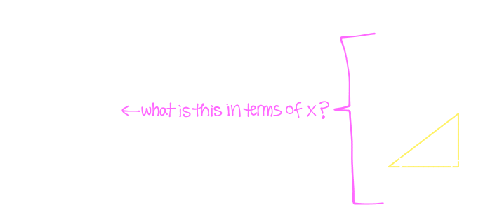
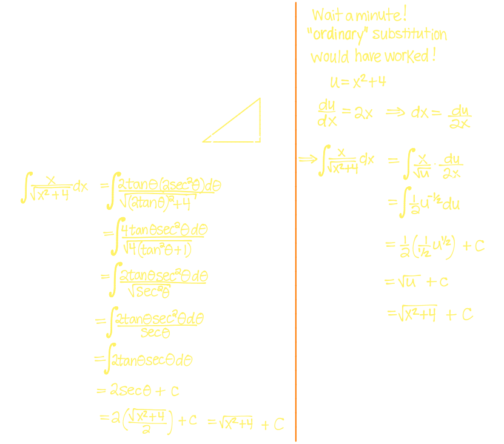
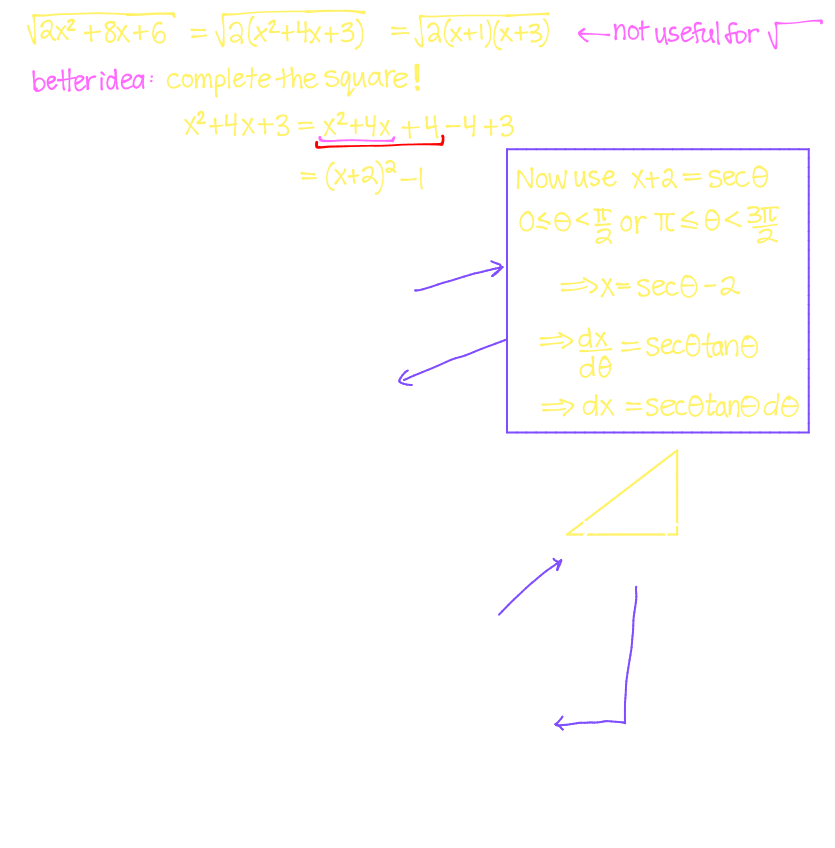

## [[Trig Integrals and Trig Substitution]]
	- ### Common Strategies for Trig Integrals
		- $\int \sin^m(x)\cos^ndx$
			- 
		- Example
		  background-color:: blue
			- $$\int_{\pi/6}^{\pi/3} \cos^3(x) dx$$
			- 
	- $$\ln(x) \ dx = x \ln x -x + C$$
	- $$\tan x \ dx = \ln |\sec x| +C$$
	- $$\int \sec x \ dx = \ln |\sec x + \tan x| + C$$
		- Example
			- $$\int \tan^3(x) \ dx$$
			- 
			- 
	- ### Trig Substitution
		- $$\int_{-1}^{1} \sqrt{1-x^2} \ dx$$
			- 
		- **General Strategy for Trig Substitution**
			- ^^Expression^^ $\implies$  **Identity**  $\implies$ Subsitution
			  id:: 6553032e-7841-4bed-b05b-1a838d89d3aa
				- $\sqrt{1-x^2}  \implies 1- \sin^2\theta = \cos^2\theta  \implies x = \sin\theta$
				  id:: 65530357-1acd-4298-b0f2-9c45298aaba0
				- $\sqrt{1+x^2}  \implies 1 + \tan^2\theta = \sec^2\theta  \implies x = \tan \theta$
				  id:: 655303c1-a35a-47a5-995a-482fd9f934b6
				- $\sqrt{x^2-1}  \implies  \sec^2\theta -1 = \tan^2\theta  \implies x = \sec\theta$
				  id:: 65530405-a476-47bf-9825-e5e074ef8649
			- Example:
				- $$\int \frac{1}{(4-x^2)^{3/2}} \ dx$$
					- 
					- 
				- $$\int \frac{x}{x^2+4} \ dx$$
					- 
				- $$\int \frac{1}{2x^2 +8x +6} \ dx$$
					- 
					-