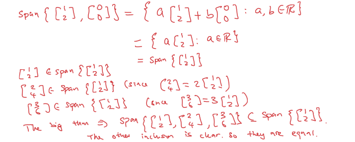
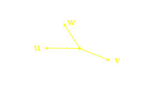
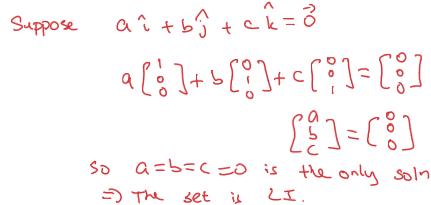
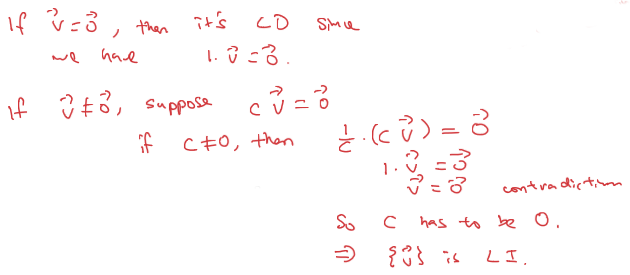
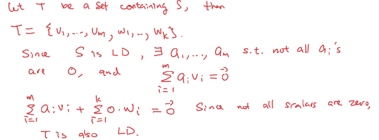
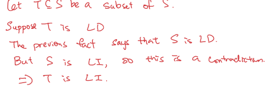

## [[Chapter 7: Linear Dependence and Independence]] #MAT1341
	- Show that $\text{span} = \begin{Bmatrix}\begin{bmatrix} 1 \\2\end{bmatrix}\end{Bmatrix} = \text{span} = \begin{Bmatrix}\begin{bmatrix} 1 \\2\end{bmatrix} ,  \begin{bmatrix} 0 \\0\end{bmatrix}\end{Bmatrix} = \text{span} = \begin{Bmatrix}\begin{bmatrix} 1 \\2\end{bmatrix} , \begin{bmatrix} 2\\4\end{bmatrix} , \begin{bmatrix} 3 \\6\end{bmatrix}\end{Bmatrix}$
		- 
			- All the vectors span a line in $\mathbb{R}^2$
	- Geometrically, we that the problem is that all the vectors are collinear (meaning parallel, or all lying on one line)
	- Similar problems would occur in $\mathbb{R}^3$ if we have three *coplanar* vectors, that is all lying in a plane
		- 
	- $\text{span}\{\vec{u}, \vec{v}\} = \text{span}\{\vec{u}, \vec{w}\} = \text{span}\{\vec{v}, \vec{w}\} = \text{span}\{\vec{u}, \vec{v},\vec{w}\}$
	- $\vec{u}, \vec{v}, \vec{w}$ are coplanar (lying on the same plane)
	- ^^**Definition (7.5.1)**^^
		- Let $V$ be a vector space and $\vec{v}_1, \vec{v}_2, ... \vec{v}_m \in V$, then the set {$\vec_{v}_1 , \vec{v}_2, ..., \vec{v}_m \in V} is ^^linear dependent^^ if and only if there are scalars $a_1, a_2, ... a_m \in \mathbb{R}$, not all zero such that
		- $$a_1\vec{v}_1 + ... + a_m\vec{v}_m = \vec{0}$$
		- Example:
		  background-color:: blue
			- Show that $\begin{Bmatrix} \begin{bmatrix} 1 \\ 2 \end{bmatrix} , \begin{bmatrix} 2 \\ 4 \end{bmatrix} \end{Bmatrix}$ is LD
				- 
				  id:: 6521d1ff-f66b-414f-9ba4-b89e5ec1c8dd
		- If the zero vector is in a set of vectors, then this set is always linearly dependent since $1 \cdot \vec{0} = \vec{0}$
		- Example:
		  background-color:: blue
			- Show that $\begin{Bmatrix} \begin{bmatrix} 0 \\ 0 \end{bmatrix} , \begin{bmatrix} 1 \\ 2 \end{bmatrix} \end{Bmatrix}$ is LD
				- 
			- Show that {$sin^2x, 1, cos^2x$} is LD
				- 
	- ^^**Definition (7.6.1)**^^
		- Let $V$ be a vector space and $\vec{v}_1, \vec{v}_2,... \vec{v}_m \in V$, then the set {$\vec{v}_1, \vec{v}_2,... \vec{v}_m \in V$} is ^^linearly independent^^ if and only if the *only solution* to
			- $$a_1\vec{v}_1 + ... + a_m\vec{v}_m = \vec{0}$$
		- To show a set is linearly independent, we need to find a non-trivial linear combination of the elements that gives 0
		- To show linear independence, we have to show that the only linear combination that gives 0 is when all scalars are 0
		- Example:
		  background-color:: blue
			- Show that {$\hat{i}, \hat{j}, \hat{k}$} is LI
				- 
			- Show that {$1 + X, 1-X$} is LI
		- ^^**Fact:**^^ If $\vec{v} \in V$, then {$\vec{v}$} is LI if and only if $\vec{v} \ne \vec{0}$
			- 
		- ^^**Fact:**^^ If $S = \{\vec{v}_1, ..., \vec{v}_m\}$ is LD, then any set containing $S$ is also LD
			- 
		- ^^**Fact:**^^ If $S = \{\vec{v}_1, ..., \vec{v}_m\}$ is LI, then any subset of $S$ is also LI
			- 
		- ^^**Fact:**^^ A set with three or more vectors can be LD *even though* no two vectors are multiples of one another