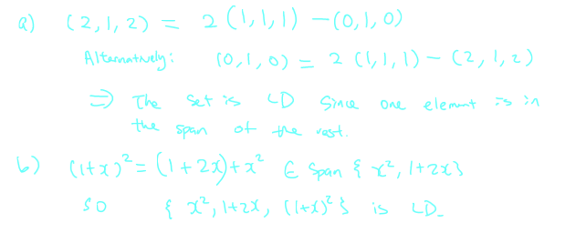
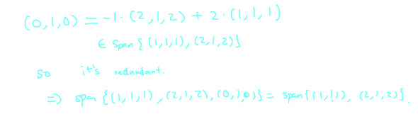
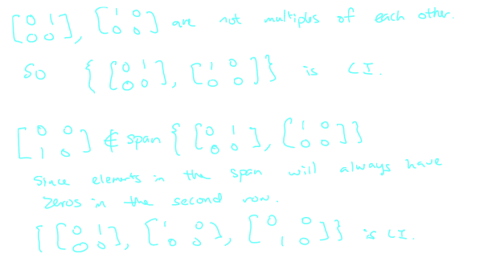
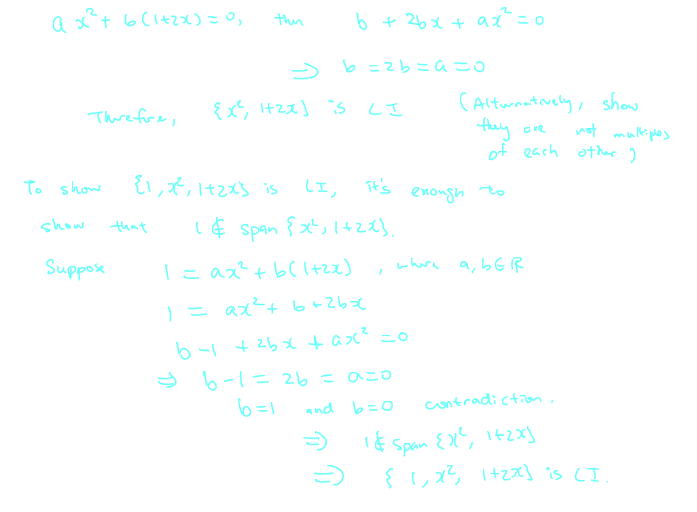

## [[Chapter 8: Linear Independence and Spanning Sets]]
	- ^^**Theorem 8.1.1:**^^
		- Relation between linear dependence and spanning
			- A set {$\vec{v}_1, ...\vec{v}_m$} is LD if and only if there is at least one vector $\vec{v}_k$ which is the span of the rest
			- Which tells us that in a LD set, there is an element that "redundant"
				- Suppose {$u_1,... u_m$} is LD, then
					- $a_1\vec{v}_1 + ... + a_m\vec{v}_m  = 0$ where $a_i \in \mathbb{R}$ and not all are 0
				- Suppose $a_k \ne 0$, then  $a_k\vec{v}_k = - a_1\vec{v}_1  a_2\vec{v}_2 - ... - a_{k-1}\vec{v}_{k-1} - a_{k+1}\vec{v}_{k+1} - ... - a_{m}\vec{v}_{m}$
				- $$\vec{v}_k = -\frac{a_1}{a_k}\vec{v}_1 - \frac{a_2}{a_k}\vec{v}_2 - \frac{a_{k-1}}{a_k}\vec{v}_{k-1} - \frac{a_{k+1}}{a_k}\vec{v}_{k+1} - ... - \frac{a_{m}}{a_k}\vec{v}_{m}$$
					- $\in$ span {$\vec{v}_1,..., \vec{v}_{k-1}, \vec{v}_{k+1}, ... \vec{v}_m$}
				- We can now consider the opposite implication
					- $\vec{v}_k \in$ span {$\vec{u}_1,..., \vec{u}_{k-1}, \vec{u}_{k+1}, ... \vec{u}_m$}
					- $\vec{v}_k = b_1\vec{v}_1 + ... + b_{k-1}\vec{v}_{k-1} + b_{k+1}\vec{v}_{k+1} +b_m\vec{v}+m$
					- $b_1\vec{v}_1 + ... + b_{k-1}\vec{v}_{k-1} - \vec{v}_k + b_{k+1}\vec{v}_{k+1} +b_m\vec{v}_m = 0$
						- {$v_1, ..., v_m$} is CD
			- Example:
			  background-color:: blue
				- Show that the following sets are LD
					- a) {$(1,1,1), (2,1,2), (0,1,0)$}
					- b) {$x^2, 1 + 2x, (1+x)^2$} $\subset \mathbb{P}_2$
						- 
	- ^^**Theorem 8.2.2**^^
		- Reducing spanning sets
			- Suppose $W =$ span ${\vec{v}_1, ... \vec{v}_m}$ If $\vec{v}_1 \in$ span {$\vec{v_2}, ... \vec{v}_m$}, then
				- $W =$ span{$\vec{v}_2, ... \vec{v}_m$}
			- $\vec{v}_2, ..., \vec{v}_m \in W$
				- ($v_2 = 0\vec{v}_1 + 1 \cdot \vec{v}_2 + 0\vec{v}_3 + ... + 0\vec{v}_m$)
			- The big theorem $\rightarrow$ span {$\vec{v}_2,... \vec{v}_m$} $\subseteq W$
				- $\vec{v}_1 \in$ span {$\vec{v}_2,... \vec{v}_m$} by assumption
				- $\vec{v}_2, ..., \vec{v}_m \in$ span{$\vec{v}_2, ... , \vec{v}_m$} ($\vec{v}_2 = 1 \cdot \vec{v}_2 + 0 \vec{v}_3  + ... + 0\vec{v}_m$)
			- span {$\vec{v}_1, \vec{v}_2,... \vec{v}_m$} $\subseteq$ span {$\vec{v}_2,... \vec{v}_m$} by the big theorem
				- $W \subseteq$ span {$\vec{v}_2, ..., \vec{v}_m$}
			- So the two inclusions together imply $W =$ span{$\vec{v}_2, ... \vec{v}_m$}
			- Example:
			  background-color:: blue
				- Show that span{$(1,1,1), (2,1,2), (0,1,0)$} $=$ span{$(1,1,1), (2,1,2)$}
					- 
	- ^^**Theorem 8.3.1**^^
		- Enlarging linearly independent sets
			- Suppose {$\vec{v}_1, ..., \vec{v}_m$} is a LI subset of subspace $W$
			- For any $\vec{v} \in W$, we have
				- $\{\vec{v}, \vec{v}_1, ... \vec{v}_m\}$ is LI $\longleftrightarrow$ $\vec{v} \notin\text{span}\{\vec{v}_1, ..., \vec{v}_m\}$
			- Suppose $\{\vec{v}, \vec{v}_1, ... \vec{v}_m\}$ is LI
				- If $\vec{v} \in \{\vec{v}_1, ..., \vec{v}_m\}$,
					- Then $\{\vec{v}, \vec{v}_1, ... \vec{v}_m\}$ is LD by theorem 8.1.1
				- This is a contradiction
					- So, $\vec{v} \notin\text{span}\{\vec{v}_1, ..., \vec{v}_m\}$
			- Suppose $\vec{v} \notin\text{span}\{\vec{v}_1, ..., \vec{v}_m\}$
				- We want to show $\{\vec{v}, \vec{v}_1, ... \vec{v}_m\}$ is LI
					- Let $c_0, c_1, ..., c_n \in \mathbb{R}$ such that
						- $c_0\vec{v} + c_1\vec{v}_1 + ... + c_m\vec{v}_m$
					- If $c_0 \ne 0$, then $v = - \frac{c_1}{c_0}\vec{v}_1 - ... - \frac{c_m}{c_0}\vec{v}_m \in\text{span}\{\vec{v}_1, ..., \vec{v}_m\}$
						- is a contradiction
					- So $c_0 = 0
					- Then $c_1\vec{v}_1 + ... + c_m\vec{v}_m = 0$
					- But $\{ \vec{v}_1, ... \vec{v}_m\}$ is LI, so $c_1 = c_2 = ... = c_m = 0$
				- Therefore $c_0\vec{v} + c_1\vec{v}_1 + ... + c_m\vec{v}_m \rightarrow  c_0 = c_1 = ... = c_m = 0$
				- In particular $\{\vec{v}, \vec{v}_1, \vec{v}_2, ... \vec{v}_m\}$ is LI
		- Example:
		  background-color:: blue
			- The set $\begin{Bmatrix} \begin{bmatrix} 0 & 1 \\ 0 & 0\end{bmatrix},  \begin{bmatrix} 1 & 0 \\ 0 & 0\end{bmatrix} \end{Bmatrix}$ is LI. Enlarge it to a LI set with 3 elements
				- 
			- The set $\{x^2, 1+2x\} \subset \mathbb{P}_3$ is LI, show that $\{1, x^2, 1+2x\} is also LI
				- 
				-
-