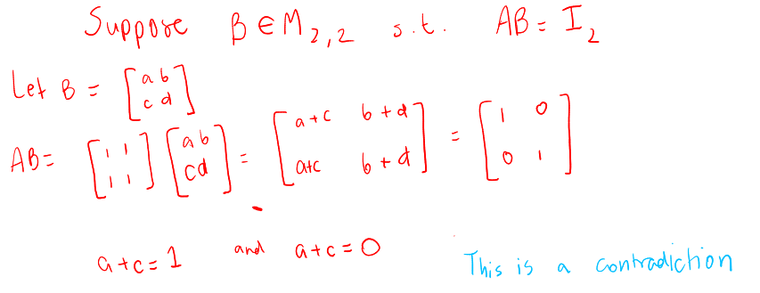
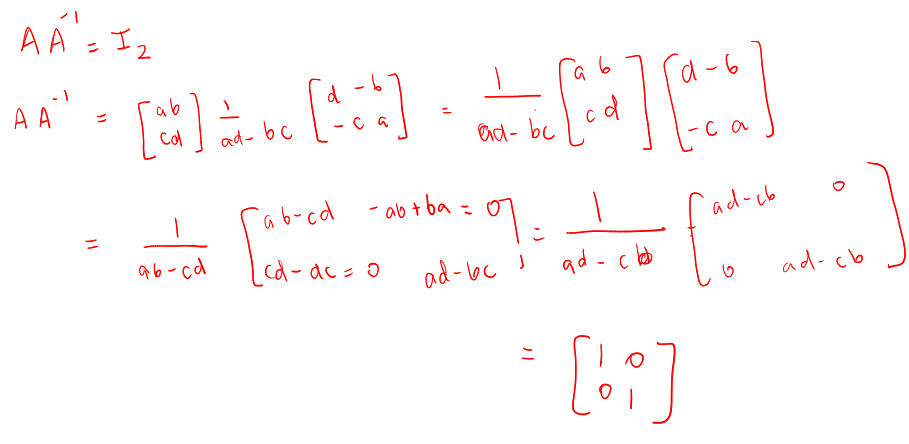
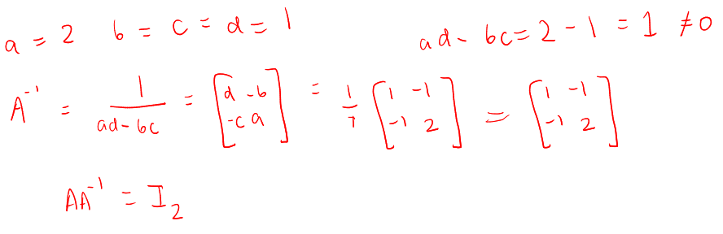
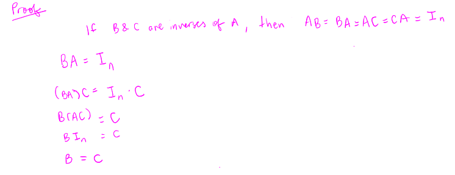
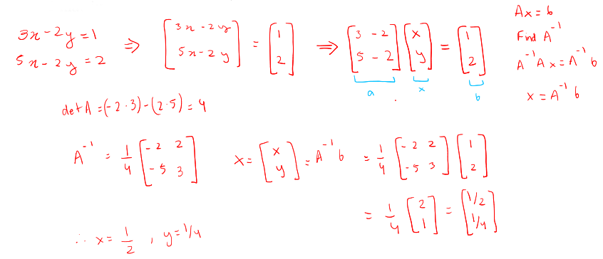
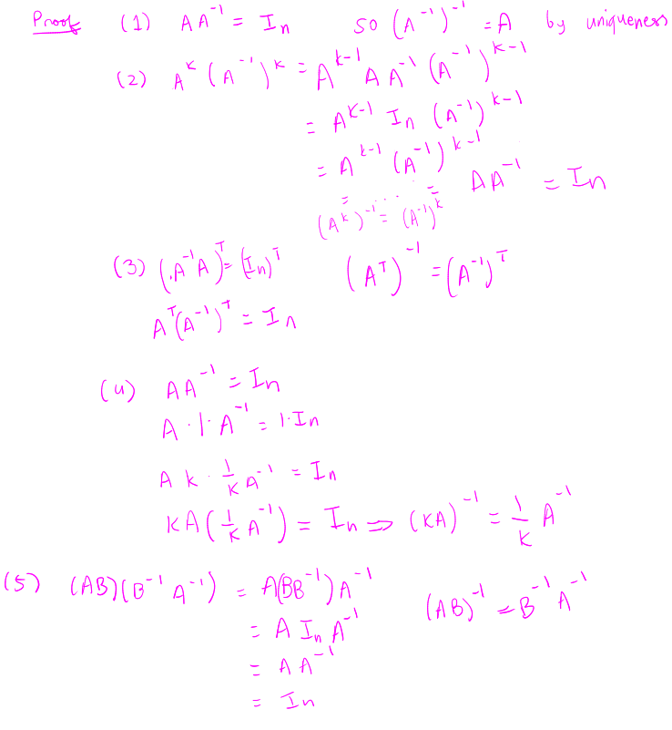
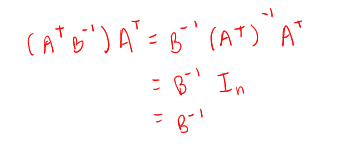
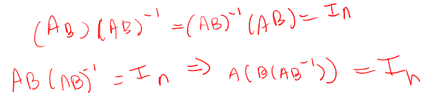

## [[Chapter 18: Matrix Inverses]]
	- We have seen previously that is helpful to consider an equation of the form $A\vec{x}=\vec{b}$ in several different ways. We about looking at it in a purely algebraic way?
	- Consider:
		- $ax = b, a \in \mathbb{R}, b \in \mathbb{R}$
	- If $a \ne 0$, we have $x=b/a$, or $x=a^{-1}b$. We would like to do something with matrices
	- We can solve $A\vec{x}=\vec{b}$ via $x = A^{-1}\vec{b}$
	- ^^**Definition 18.1.1**^^
		- If $A$ is an $n \times n$ matrix and $B$ is an $n \times n$ matrix such that
			- $AB = BA = I_n$
		- then $B$ is called an *inverse* of $A$ and we write $B = A^{-1}$
		- In this case $A$ is called *invertible*
	- Recall that given an $n \times n$ matrix $M$, we have
		- $M \cdot I_n = I_n \cdot M = M$
	- Unlike real numbers, a nonzero matrix is not necessarily invertible
	- Example:
	  background-color:: blue
		- The matrix $A = \begin{bmatrix} 1 & 1 \\ 1& 1 \end{bmatrix}$ is not invertible
			- {:height 273, :width 688}{:height 273, :width 688}
	- ^^**Lemma 18.2.1**^^
		- Let $A = \begin{bmatrix} a & b \\ c& d \end{bmatrix}$. Then $A$ is ^^invertible if and only if^^ $ad - bc \ne 0$. When $ad - bc \ne 0$ $(det(A)\ne0)$
			- $$A^{-1}=\frac{1}{ad-bc} \begin{bmatrix} d & -b \\ -c & a \end{bmatrix}$$
		- If $ad - bc = 0$ then $A$ is not invertible
		- $ad-bc$ is called the **determinant** of $A$
		- 
		- Example:
		  background-color:: blue
			- Find the inverse matrix of $A = \begin{bmatrix} 2 & 1 \\ 1& 1 \end{bmatrix}$
				- 
	- ^^**Theorem**^^ (Uniqueness of Inverse Matrix)
		- If $B$ and $C$ are both inverses of an $n \times n$ matrix $A$, then $B=C$
			- 
		- Example:
		  background-color:: blue
			- Solve the linear system $\begin{cases} 3x - 2y = 1  \\ 5x - 2y = 2\end{cases}$ by finding the inverse of a $2 \times 2$ matrix
				- 
				-
	- ^^**Proposition 18.3.1 - Algebraic properties of the inverse**^^
		- Suppose $A$ is an ^^invertible square matrix^^
			- A^{-1} is invertible with $(A^{-1})^{-1} = A$
			  logseq.order-list-type:: number
			- If $k \ge 1$ is an integer, then $A^k$ is invertible with $(A^k)^{-1} = (A^{-1})^{k}$
			  logseq.order-list-type:: number
			- $A^T$ is invertible, $(A^T)^{-1} = (A^{-1})^T$
			  logseq.order-list-type:: number
			- If $k \in \mathbb{R}$, with $k \ne 0$, the $kA$ is invertible with $(kA)^{-1} = \frac{1}{k}A^{-1}$
			  logseq.order-list-type:: number
			- If $A$ and $B$ are invertible, then $AB$ is also invertible, with $(AB)^{-1} = B^{-1}A^{-1}$
			  logseq.order-list-type:: number
			- $(AB)^{-1}=B^{-1}A^{-1}$
		- 
		- Example:
		  background-color:: blue
			- Simplify $(A^T B)^{-1}A^T$
				- 
				-
	- If $A$ and $B$ are $n \times n$ matrices such that $AB$ is ^^invertible^^, the $A$ and $B$ are both invertible
		- 
	- How to find $A^{-1}$ if it is larger than $2 \times 2$?
	- Find $B$ such that $AB = I_n$. We can separate $B$ into $n$ columns
		- $B = [\vec{v}_1 \ \vec{v}_2 \ ... \ \vec{v}_m]$
	- So we want
		- $$A\vec{v}_1 = \begin{bmatrix}1 \\ 0\\ 0 \\ ... \\ 0 \end{bmatrix}, A\vec{v}_2 = \begin{bmatrix}0 \\ 1\\ 0 \\ ... \\ 0 \end{bmatrix}, ..., A\vec{v}_n = \begin{bmatrix}0\\ 0 \\ ... \\ 0 \\ 1 \end{bmatrix}$$
		- We can solve these equations simultaneously apply Gaussian elimination $[A|I_n]$
	- Example:
	  background-color:: blue
		- Use this method to find the inverse of $A = \begin{bmatrix}2 & 1 \\ 1&1 \end{bmatrix}$ and $B = \begin{bmatrix}1 & 2 & 3 \\ 2&5&6 \\3 & 6 & 5  \end{bmatrix}$
			-