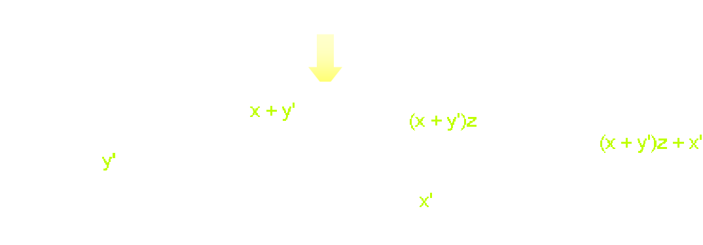
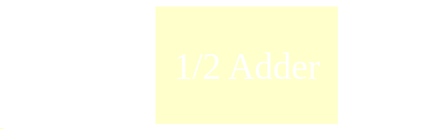
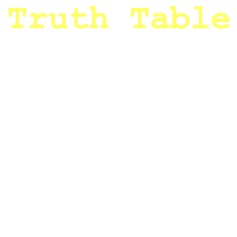
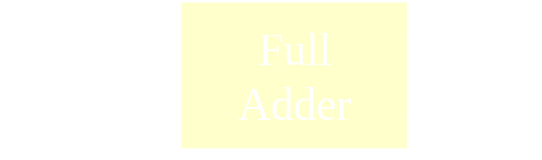
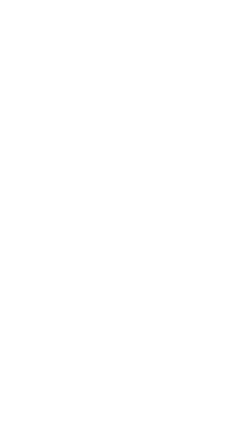
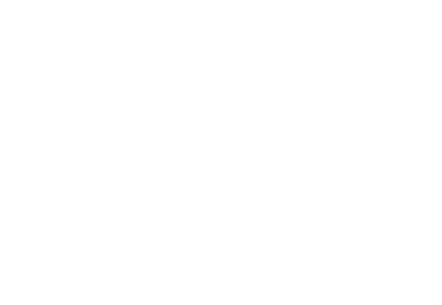
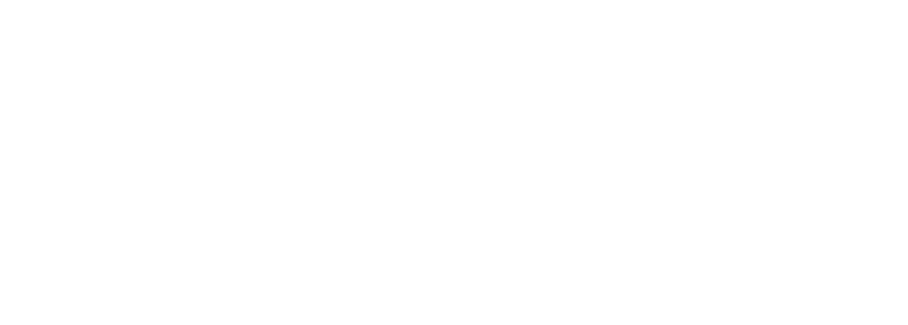

- Boolean Algebra and Logic Gates
	- Basic Theorems and Properties of Boolean Algebra
	- Boolean Functions
	- Canonical and Standard Forms
	- Logic Operations
	- Digital Logic Gates
- ## Boolean Algebra and Logic Gates
	- ### Boolean Expressions (Functions)
		- We can use the basic operations to form more complex operations
			- $$f(x,y,z) = x y' + z x'$$
		- Some terminology and notation:
			- $f$ is the name of the function
			- **Term** is an implementation with a gate:
				- If this example $f$ has two terms $xy'$ and $zx$
			- $(x,y,z)$ are the **input variables**, each representing $1$ or $0$
			- A **literal** is any occurrence of an input variable or its complement
			- The function has four literals $x, y',z,x'$
	- ### Precedence for Evaluation of Boolean Expression
		- Precedence are important
		- Parentheses first (if any) then
			- NOT has the highest precedence, followed by AND, then OR
				- $$\rightarrow f(x,y.z) = (x+y')z+x'$$
			- Fully parenthesized, the function above would be kind of messy:
				- $$f(x,y,z) = (((x+(y'))z)+x')$$
	- ### Truth Tables
		- A truth table shows all possible inputs and outputs of a function
		- Each input variable represents either $1$ or $0$
			- A function with $n$ variables has $2$ power $n$ possible combinations of inputs
	- ### Boolean Expression and Logic Circuits
		- A Boolean expression (function) can be converted into a circuit by *combining* basic gates
		- Example:
		  background-color:: blue
			- The diagram below shows the input and outputs of each gate
			- 
	- ### Boolean Identities
		- Boolean algebra is used in digital design to ^^reduce any logical function (expression) to its simplest form^^
			- The minimization of the numbers of literals and number of terms
		- **Identities:**
			- $x + 0 = x$
			  logseq.order-list-type:: number
			- $x \cdot 1 = x$
			  logseq.order-list-type:: number
			- $x + x =1$
			  logseq.order-list-type:: number
			- $x \cdot x = 0$
			  logseq.order-list-type:: number
			- $x + x = x$
			  logseq.order-list-type:: number
			- $x \cdot x = x$
			  logseq.order-list-type:: number
			- $x + 1 = 1$
			  logseq.order-list-type:: number
			- $x \cdot 0 = 0$
			  logseq.order-list-type:: number
			- $(x) = x$
			  logseq.order-list-type:: number
			- $x+y = y+x$  (Commutative)
			  logseq.order-list-type:: number
			- $xy = yx$  (Commutative)
			  logseq.order-list-type:: number
			- $x + (y + z) = (x+y) +z$ (Associative)
			  logseq.order-list-type:: number
			- $x(yz) = (xy)z$ (Associative)
			  logseq.order-list-type:: number
			- $x(y+z) = xy + xz$ (Distributive)
			  logseq.order-list-type:: number
			- $x + yz = (x+y)(x+z)$ (Associative)
			  logseq.order-list-type:: number
			- $(x+y) = x y'$ (DeMorgan)
			  logseq.order-list-type:: number
			- $(xy) = x + y$ (DeMorgan)
			  logseq.order-list-type:: number
			- $x + xy = x$ (Absorption)
			  logseq.order-list-type:: number
			- $x(x+y) = x$ (Absorption)
			  logseq.order-list-type:: number
	- ### Logic Gates
		- **Fundamental Logic Gates** (Or **Basic Operations**) are those that all other gates and circuits are created from
			- AND
			- OR
			- NOT
		- **Universal Logic Gates** are those that digital circuit can be designed circuit can be designed by just using these gates
			- NAND
				- Combinaton of an AND Gate and an inverter
				- Use NAND gate to implement all three of the *basic operations*
				- A NAND gate with both of its inputs driven by the same signal is equivalent to a NOT gate
				- A NAND gate whose output is complemented is equivalent to an AND gate
				- A NAND gate with complemented inputs acts as OR Gate
			- NOR
				- It is a combination of OR gate followed by an inverter
			- XOR
				- XOR gates assert their output when exactly one of the inputs is asserted, hence the name
				- Operation symbols $\oplus$, $1 \oplus 1 = 0$ and $1 \oplus 0 =1$
			- XNOR
				- Functions as an exclusive-NOR gate, or the complement of XOR gate
				- Operation symbol $\odot$
		- **Functional completeness** means every possible logic gate can be realized as a network of gates of the types prescribed by the set such as NAND gates and NOR gates
	- ### Standard Forms
		- **Minterm**
			- A minterm is one in which all variables appear only once
			- Each minterm represents only one combination in truth table
			- $n$ variables give $2^n$ minterms
			- **Maxterms** are \not Minterns
		- **Standard Sum of Products (SOP)**
			- SOP are expressions of the form
				- $F(A,B,C,...) = (...) + (...) + (...) +...$
				- Brackets single or multiple variables
					- ANDs inside, ORs outside
		- **Standard Product of Sums (POS)**
			- POS are expressions of the form
				- $F(A,B,C,...) = (...+...)(...+...)...$
				- Brackets has multiple variables
				- ORs inside, ANDs inside
		- **Obtain Standard from a given expression**
			- Given an arbitrary Boolean expression
			- Work on number of terms ($2^n$) for $n$ inputs\
			- For SOP
				- Generate truth table and identify all true values using Minterms
					- Write function as
						- $$F = \sum_{i =0}^{n-1} m_i$$
			- For POS
				- Generate truth table and identify all true values with Maxterms
					- Write function as
						- $$F = \prod_{j=0}^{n-1} M_j , j \ne 0$$
						-
	- ### Circuits
		- #### Half Adder
			- A digital logic circuit that performs binary addition of two single-bit binary numbers
			- Has two inputs $A$ and $B$, and two outputs $\text{SUM}$ and $\text{CARRY}$
			- 
			- ^^Logic Function^^
				- $S = A \oplus B$
				- $C = A \cdot B$
				- {:height 258, :width 165}
		- #### Full Adder
			- A digital logic circuit that adds three inputs and  produces two outputs
			- Two inputs $A$ and $B$ and input carry $C_{in}$
			- 
			- ^^Logic Function^^
				- $C_O= C_{in} (A \oplus B) + AB$
				- $S = A \oplus B \oplus C$
				- {:height 201, :width 172}
		- #### Parallel Adders
			- A Parallel Adder is a digital circuit capable of finding the arithmetic **sum** of two binary numbers **greater than on bit in length** by operating on corresponding pairs of bits in parallel
			- Consists of **full adders connected in a chain** where the output carry from each full adder is connected to the carry input of the next higher order full adder in the chain
			- $n-$bit parallel adder requires $n$ full adders to perform the operation
		- #### Two-Bit Parallel Adder
			- 
		- #### Four-Bit Parallel Adder
			- 