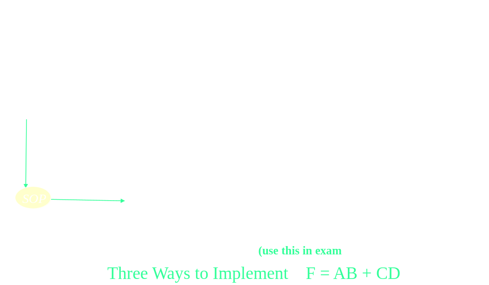

- Gate Level Minimization
	- Map Method
	- Four Variable Map
	- Product of Sums Simplification
	- Don't Care, NAND, NOR Implementation
	- Two Level Implementation
	- XOR Functions
- ## Gate-Level Minimization
	- ### Karnaugh Map
		- Alternative approach to represent Boolean function used to **minimize** Boolean functions
		- Easier conversion from truth table to K-map and obtain **SOP** function
		- K-Map is suited for four or less varaibles
		- Each square represents a minterm
		- Map is arranged that two neighbours differ in only one variable
			- *Two terms must be "adjacent" in the map*
		- K-Map of $n$ variables will have $2^n$ squares
		- For a boolean expression, product terms are denoted by 1's and sum terms are denoted by 0's
		- **Grouping Squares**
			- Groups of Squares are formed in considering the following rules
				- Every square containing 1 must be considered at least once
				- Square containing can be included in as many groups as desired, and a group must be as large as possible
	- ### Prime Implicants
		- A groups of squares or rectangles made up a bunch of adjacent minterms in a K-Map
		- **Essential Prime Implicant**
			- The groups that cover at least one minter that cant be covered by any other prime implicant
		- **Optional Prime Implicant**
			- Redundant prime implicants are those already covered by essential prime implicants
	- ### Implementations Using NAND & NOR Gates
		- Digital circuits are frequently constructed with NAND or NOR gates rather that AND and OR gates
		- Both are valuable and any designed can be built using either one
		- Easier, faster and cheaper to build NAND and NOR gate circuits
		- 
		- 
		- 
		- 
		- 