- Combinational Logic
	- Combinational Circuits
	- Analysis Procedure
	- Design Procedure
	- Binary Adder Subractor
	- Magnitude Comparator
	- Decoders
	- Encoders
	- Multiplexers
- ## Combinational Logic #[[ITI 1100]]
	- ### Combinational Logic Circuits
		- Outputs logical functions of inputs
		- New outputs appear shortly after changed inputs (propagation delay)
		- No feedback loops
		- No clock
	- ### Decoder
		- A decoder is a combinational circuit that converts binary information $n$ input lines to maximum of $2^n$ unique output lines $\rightarrow n$-to-$2^n$ decoder
		- If the $n-$bit coded information has unused combinations $\rightarrow$ less than $2^n$ outputs
		- Example:
		  background-color:: blue
			- $n-$to$-m$ decoder, $m \le 2^n$
			- BCD-to-7-segment decoder, where $n = 4$ and $m=7$
				- 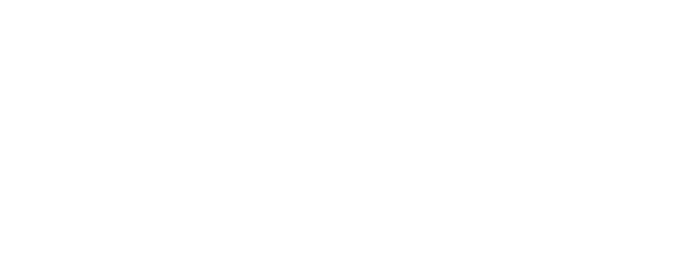
		- #### 2-to-4 Decoder
			- A 2-to-4 decoder operates according to the following logic:
				- 2-bit input is called $S1$ and $S0$, and the four outputs are $Q0-Q3$
				- If input is binary number $i$, then output $Q_i$ is uniquely true
					- 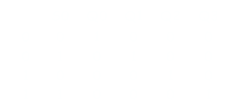
	- ### Enable Inputs
		- Many devices have ^^enable input^^, which is used to "activate" or "deactivate" the device
			- For a decoder
				- EN=1 activating the decoder, therefore exactly one of the outputs will be 1
				- EN=0 "deactivates" the decoder, so all outputs will be zero
			- 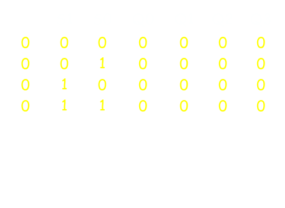
	- ### Minterm Generator
		- Decoders are sometimes called ^^minterm generators^^
			- For each input combination, exactly one output is true
			- Each output equation holds all input variables
	- ### Implementing Boolean Functions Using Decoders
		- Any combinational circuit can be constructed using **decoders and OR gates**
		- Take a full adder circuit with a decoder and two OR gates
		- Let $X,Y$ and $Z$ be the inputs
			- $S(X,Y,Z) = \sum (1,2,4,7)$
			- $C(X,Y,Z) = \sum (3,5,6,7)$
		- Since 3 inputs, and total of 8 minterms, we require a 3-to-8 decoder
			- 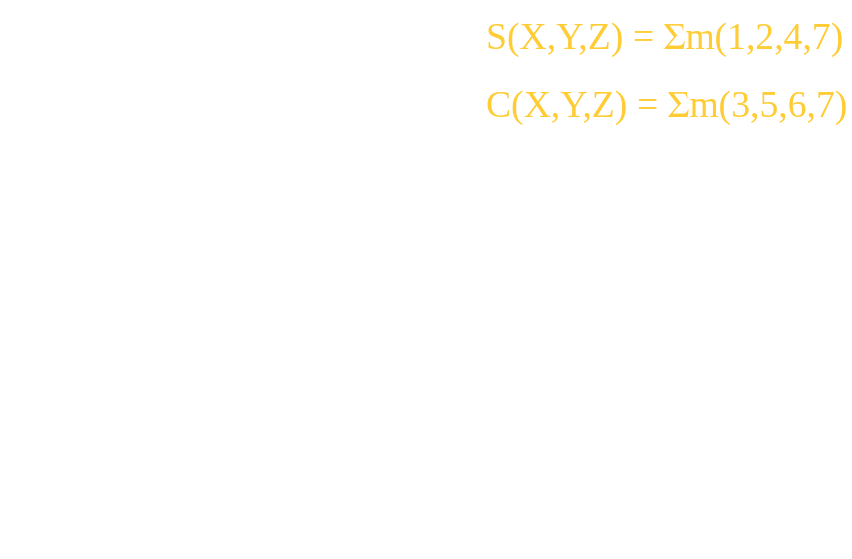
	- ### Encoder
		- An encoder has a number of input lines, only one of which is activated at a given time, opposite of the decoding process
			- 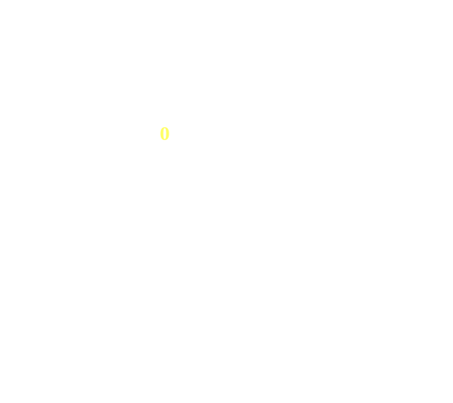
	- ### Multiplexer
		- A multiplexer selects one of several input signals and passes it on to the output
		- Routing of selected data input to the output is controlled by SELECT inputs
			- 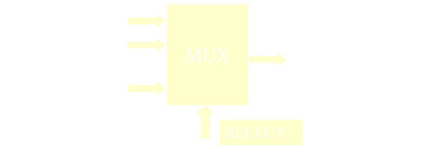
		- A Combinational circuit with $2^n$ *data inputs*, $1$ data output and a number of bit *control input* that select one of the data
			- 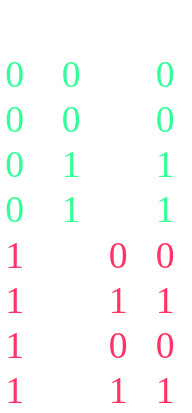 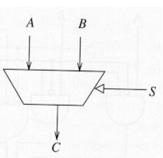
			- ### 2-to-1 Multiplexer
				- 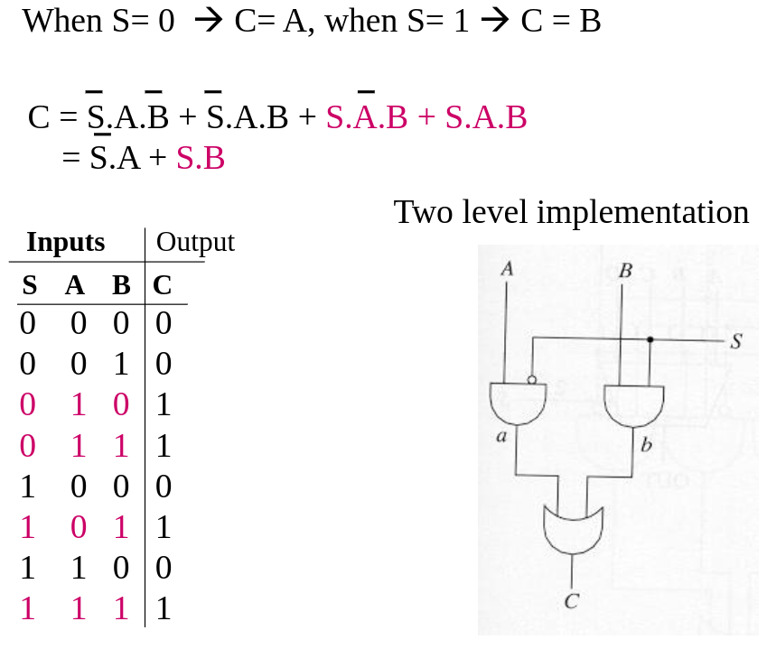
			- ### 4-to-1 Multiplexer
				- 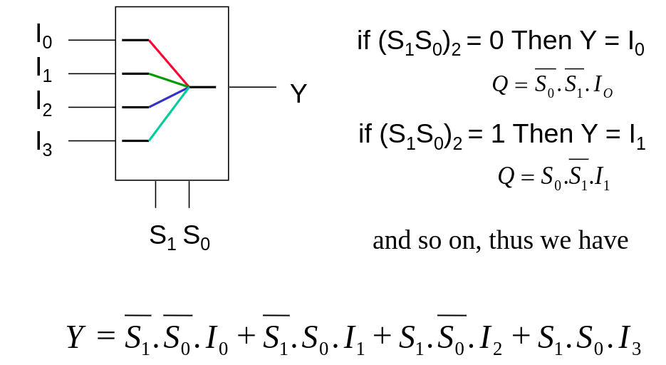
	- ### Implementing Functions with Multiplexers
		- Multiplexers can be used to implement arbitrary functions
		- One way to implement a function of $n$ variables is to use an $n$-to-1 multiplexer
			- For each minterm $m_i$ of the function, connect 1 data input $D_i$
			- Connect the function's input variables to select inputs, which indicate a particular in-put combination
	- ### Parallel Adder
		- Recall that to add two $n$-bit numbers, $n$ full-adders should be cascaded
		- Each full adder represents a column in the long addition
		- The carry signals "ripple" through the adder from left to right
			- 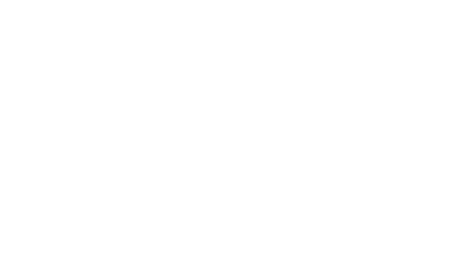
	- ### Propogation Delay
		- All logic gates take a non-zero time delay to respond to a change in input
		- This is the *propagation delay* of the gate, typically measured in tens of nanoseconds
			- 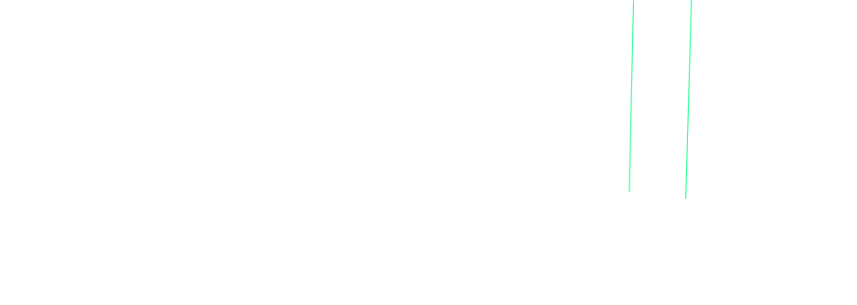
	- ### Carry Ripple
		- $A$ and $B$ inputs change, corresponding changes to $C_{IN}$ inputs "ripple" through the circuit
			- 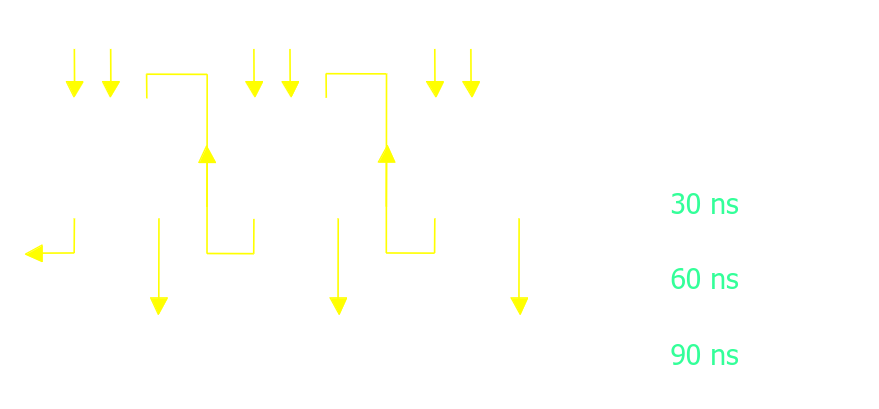
	- ### Carry-Look-Ahead
		- The accumulated delay in large parallel adders can be very large
			- 16 bits using 30 ns full adders
				- $16 \times 30ns = 480 ns$
				- 
	- ### Binary Multiplier Circuit
		- 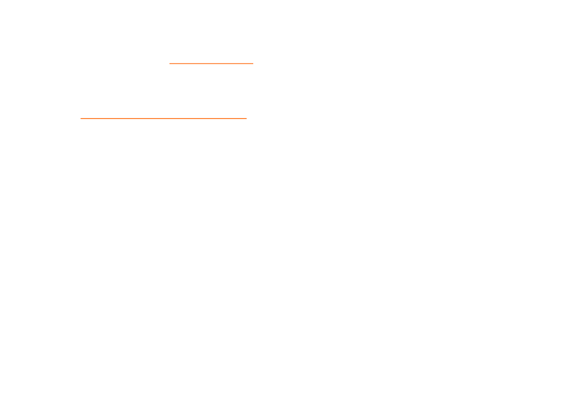