- Synchronous Sequential Logic
	- Sequential Circuits
	- Latches
	- Flip Flops
	- Analysis of Clocked Sequential Circuits
	- Design Procedure
- ## Synchronous Sequential Logic #[[ITI 1100]]
	- ### Binary Storage and Register (Recap)
		- A digital system is composed of:
			- Registers
			- Data Processing usints
		- Binary information is transferred from one set of registers into another
		  id:: 6605a054-273a-4244-970b-1e20d07b5a97
	- ### Registers
		- A register is a group of ^^Binary cells^^
		- A register with $n$ cells can $n$ bits
		- Example:
		  background-color:: blue
			- Register with 8 cells can store 8 bits and can be in one of $2^8$ possible states
				- {:height 127, :width 565}
			- The content is function of the interpretation given to the inforation stored into it, displayed as +3 above
		-  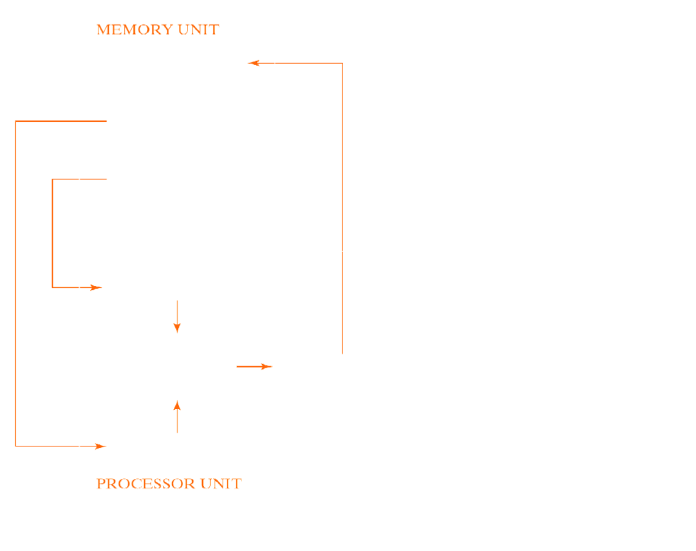
	- ### Sequential Circuits
		- Outputs logical functions of inputs and ^^previous history of circuit (memory)^^
		- After changed inputs, new outputs appear in the next clock cycle
		- Feedback loop
		- 
		- #### Elevator Control
			- The buttons are the input variables of the system
			- The position is also an input variable which represents the current state of the elevator
			- In the figure and command control 'C' depends on the button selection AND position of the elevator (the previous state of the system)
			- 
				- This example represents a ^^Sequential Logic System^^, as the output C depends on combination of
					- The input variables
					- AND the previous states (internal states)
		- ### Time and Memory
			- In contrast to **combinations circuits**, two new parameters are to be considered
			- ^^**Time**^^
				- One must consider the propagation delay of the circuits
			- ^^**Memory Element**^^
				- One must consider the previous results and impose a predetermined order
					- The function performed by memory elemnt is to store information in binary form
		- ### Flip-Flop
			- The memory cell that stores one "bit" of information is termed flip-flop
			- A set of flip-flop can be used to store several bits in a **REGISTER**
			- Two different modes:
				- Asynchronous
					- Output reacts "immeadiately to the changes of input variables
						- Propogation delay oof the gates are to be considered: $t_p$
					- {:height 136, :width 435}
				- Synchronous
					- In this mode of operation, changes of the input variables will become **EFFECTIVE** when the clock input is active
					- 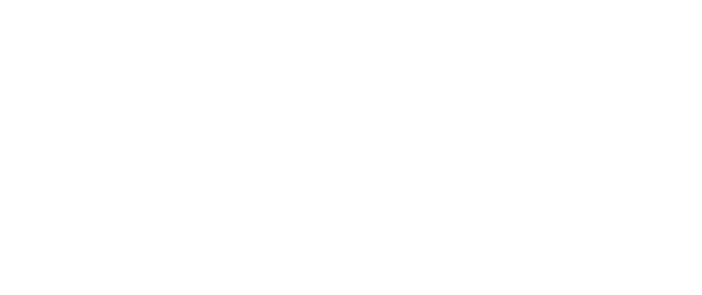{:height 277, :width 441}
			- 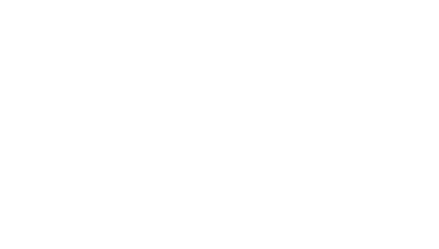
	- ### Clock Signal
		- Clock is used in synchronous logic circuits to trigger the circuit (Flip-flop) allowing it to switch its state
		- Clock signal can trigger a flip-flop in three ways:
			- {:height 574, :width 688}
			- During Positive level
				- The flip flop is triggered while the clock pulse is at logic '1'
				- The logic '0' is therefore inactive state where changes to the flip-flop (state) are not allowed
				- {:height 130, :width 470}
			- During Positive transition (or positive edge)
				- The flip flop is triggered only during the signal transition from 0 to 1 , this transition is defined as a *positive edge*
				- 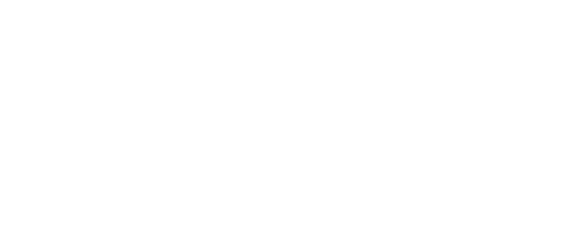{:height 269, :width 480}
			- During Negative transition (or negative edge)
				- The flip flop is triggered only during the signal transition from 1 to 0, this transition is defined as *negative edge*
				- {:height 181, :width 453}
	- ### Memory Element (Latch)
		- A ^^flip-flop^^ can maintain a binary state indefinitely until directed by an input signal to switch states
		- The most basic types of flip-flops operate with signal levels and referred to as **latches**
		- **Latches** are basic circuits from which all flip flops are constructed
		- ^^**Flip-flop**^^ (Latch) $SR$ has two input variables. $S$ and $R$
			- $S$ for SET
			- $R$ for RESET
			- It also has two outputs $Q$ (*normal state*) and $Q'$ (*complement state*)
			- 
			- **NOR** Implementation
				- {:height 306, :width 485}
				- Function Table
					- 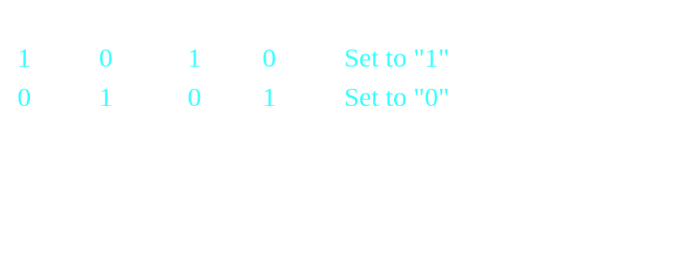{:height 236, :width 596}
			- **NAND** Implementation
				- {:height 325, :width 520}
				- Function Table
					- {:height 210, :width 494}
		- If we add to the memory element a **synchronization signal** (clock impulse or control input) we would obtain a synchronous $SR$ latch (a flip-flop)
	- ### SR Latch with Control Input
		- The time when a latch is allowed to change state is regulated
		- Change of state is regulated by a control signal called enable
		- Circuit is a NAND latch controlled by steering gates
		- Used in two principle ways
			- as an ON/OFF signal or synchronizing signal
		- 
		- Sometimes useful to avoid latch changes
			- When $C = 0 \rightarrow$ disables all latch state changes
		- Control signal *enables* state change when $C =1$
		- Right side of circuit same as ordinary $SR$ latch with NAND
	- ### D Latch with Control Input
		- $D$ for data, which is transferred to the latch
			- 
		- When $C$ is high, $D$ passes from input to output ($Q$)
			- 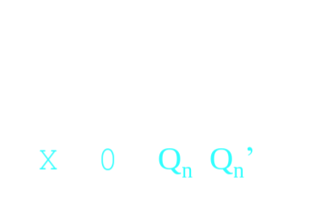
	- ### Edge Sensitive Flip-Flop
		- Latches respond to trigger levels on control inputs
			- Ex. If $C = 1$, input is reflected at output
		- Flip flops store data on a positive or negative edge
			- Ex. Control input transitions from 0 to 1, data input available at output
		- Data remains stable in the flip flop until next positive/negative edge
		- Different types of flip-flops are used for specific functions
		- ^^Latch with a clock input^^
		- The sequential circuit output changes when its CLOCK input detects an edge
			- Edge-sensitive instead of level-sensitive
		- Symbol is a triangle on the CLK input of the flip-flop
		- Flip-lfop can be triggered on *positive* or *negative* side
		- Bubble from CLK input indicates negative edge trigger
		- 
		- **Edge Sensitive SR**
			- 
		- **JK Flip Flop**
			-  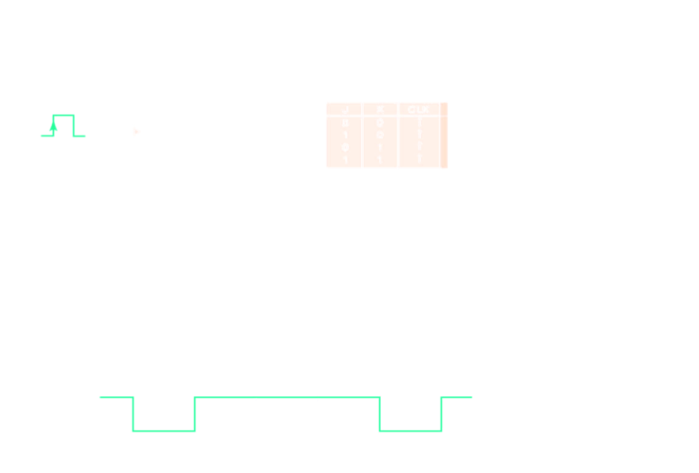
		- **D Flip Flop**
			-  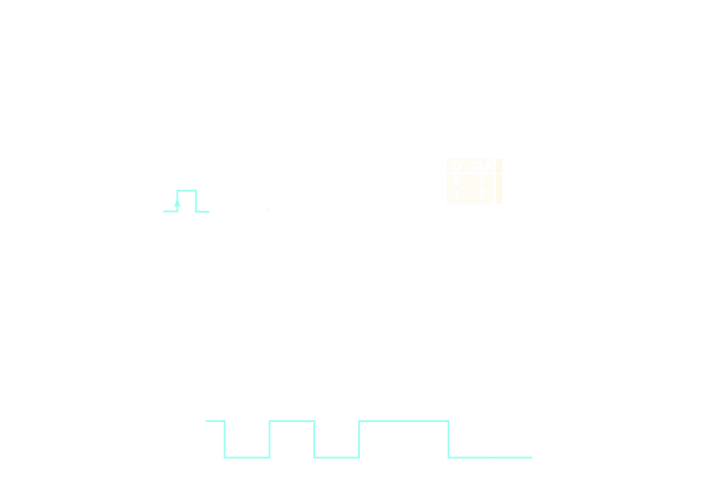
		- **T Flip Flop**
			- 
	- ### Asynchronous Outputs
		- **Flip flops have asynchronous inputs**
			- They operate independently of the synchronous inputs and clock
				- used to Set the flip flop to 1 or 0 state at *any time*
				-  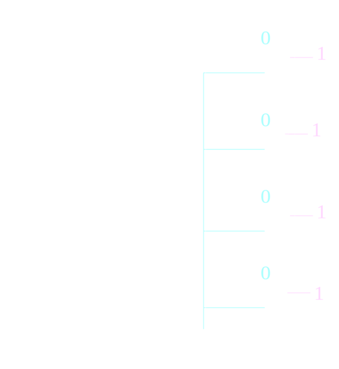 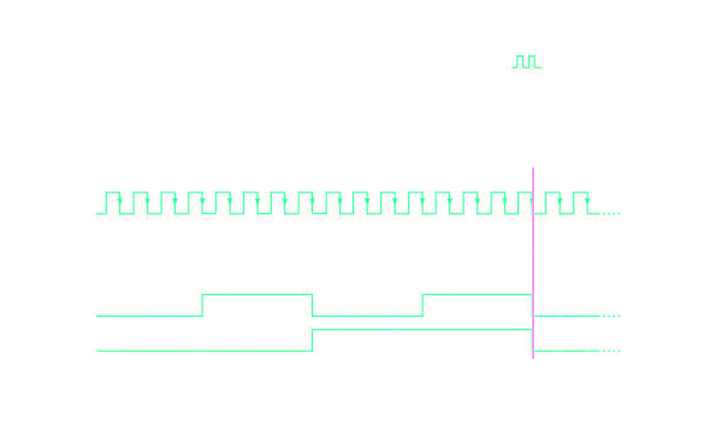
		- Analysis describes what a given circuit will do under certain conditions
		- Behaviour of synchronous sequential circuit can be determined from
			- Its inputs, outputs and flip flop state
	- ### Flip Flop State
		- Behaviour of synchronous sequential circuit can be determined from inputs, outputs, and Flip Flop state
			- 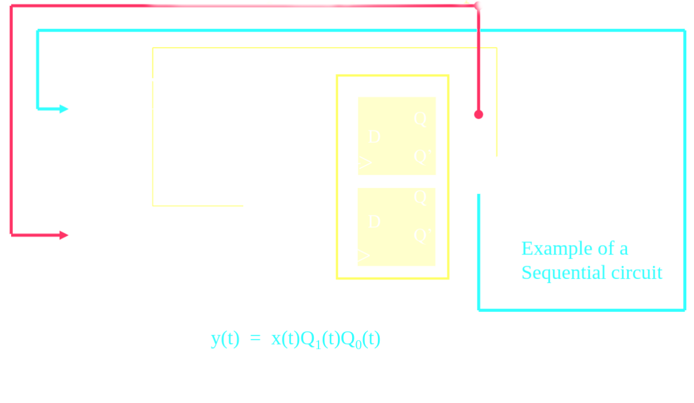 
	- ### State Table
		- Sequence of outputs, inputs and flip flop states are listed in a table called a state table
			- **Present state** indicates current value of flip flops
			- **Next state** indicates state after next clock edge
			- **Output** is output value on ^^current clock edge^^
		- All possible input and state combinations are listed
		- 
	- ### State Diagram
		- Circles indicate current state
		- Arrows point to **next state**
		- 
	- ### Flip Flop
		-  
	- ### Mealy and Moore Models
		- A general Sequential Circuit has *inputs, outputs and interal states*
		- There are two "standard models"
			- **Mealy Model**, aka Mealy Finite State Machine
				- Output based on state and present input
					- 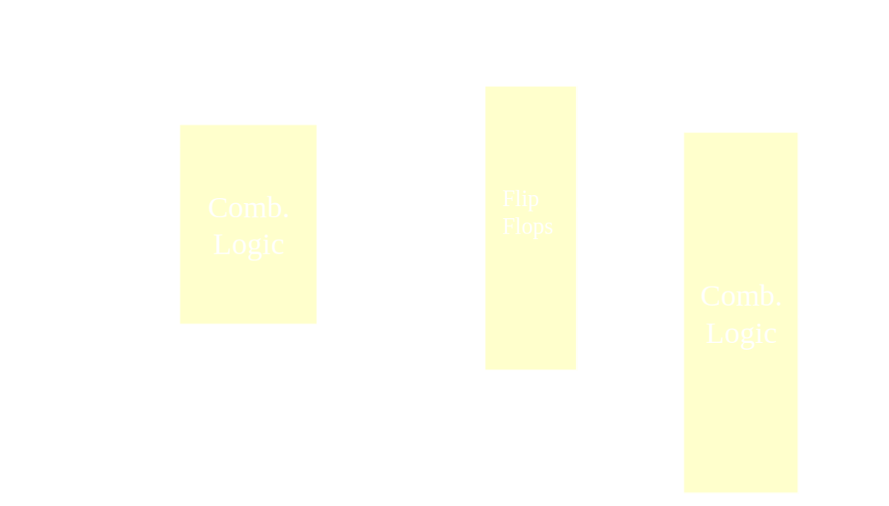
				- Example:
				  background-color:: blue
					- 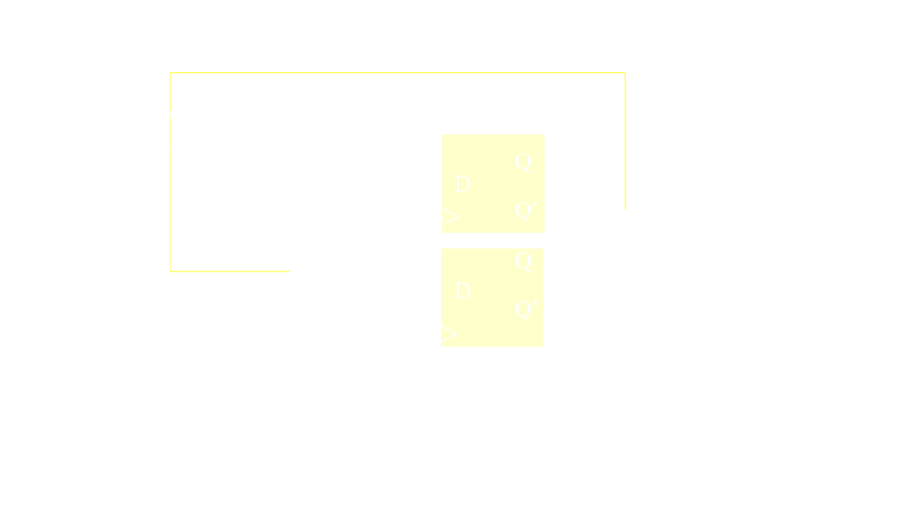
			- **Moore Model**, aka Moore Finite State Machine
				- Output based on state only
					- 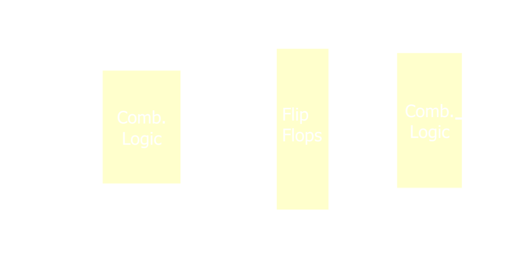
				- Example:
				  background-color:: blue
					- 
	- ### State Reduction
		- Consider a sequential circuit with the following diagram
			-  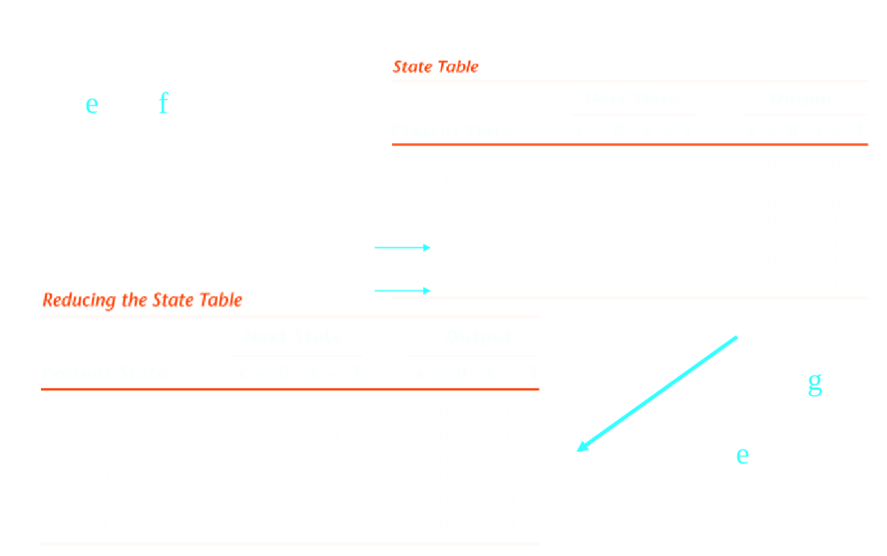 