- Registers and Counters
	- Registers
	- Shift Registers
	- Ripple Counters
	- Synchronous Counters
	- Other Counters.
- ## Registers and Counters #[[ITI 1100]]
	- ### Registers
		- Multiple flip flops can be combined to form a ^^data register^^
		- **Shift registers** allow data to be transported one bit at a time
		- ^^Registers^^ also allow for parallel transfer
			- Many bits transferred at the same time
		- Basic component of most computers
	- ### Parallel vs Serial
		- **Serial communications**
			- Transfers a binary number as a sequence of binary digits, one after another through one data line
			- One circuit is necessary to represent any binary number
			- 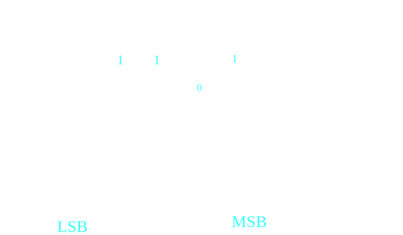
		- **Parallel Communication**
			- Transfers a binary number through multiple data lines at the same time
				- 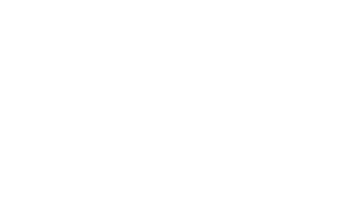{:height 176, :width 318} 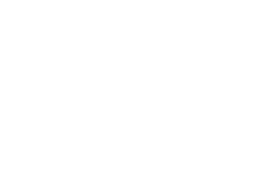{:height 237, :width 314}
	- ### Parallel Data Transfer
		- In this example, Flip Flops D store outputs from combinational logic that has 3 outputs (3 flip flops are required)
		- Multiple flops can store a collection of binary data
		- 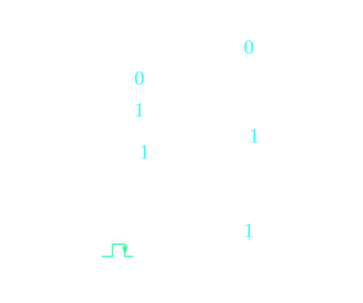{:height 424, :width 502}
	- ### Register with Parallel Load
		- Register: Group of Flip-Flops
		- Ex: D Flip-Flops
			- Holds 4 bits of Data
			- Loads in Parallel on Clock Transition
			- Asynchronous Clear (Reset)
		- 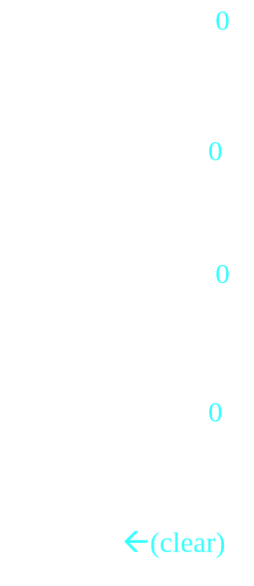{:height 496, :width 333} 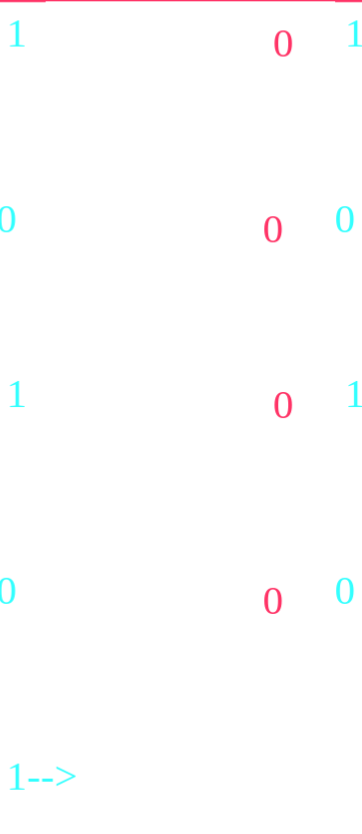{:height 795, :width 333}
		- **Data Transfer**
			- All data is transferred on one positive edge
			- Data stored into register Y
			- 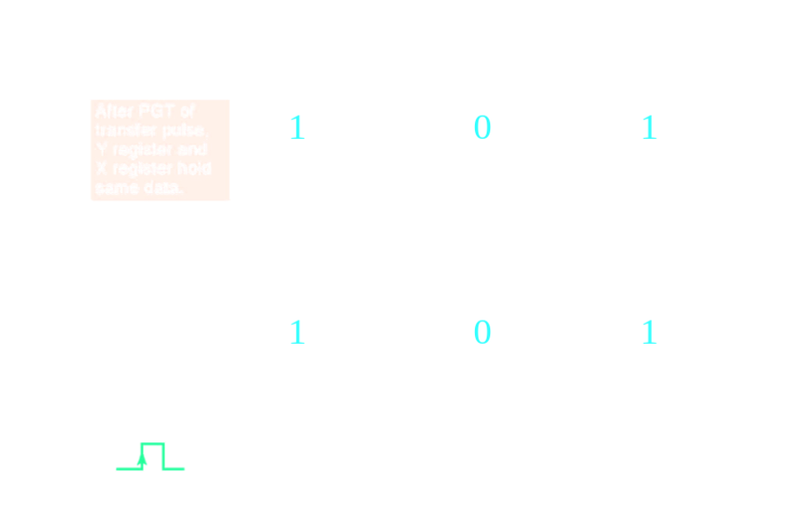
		- **Serial Transfer**
			- 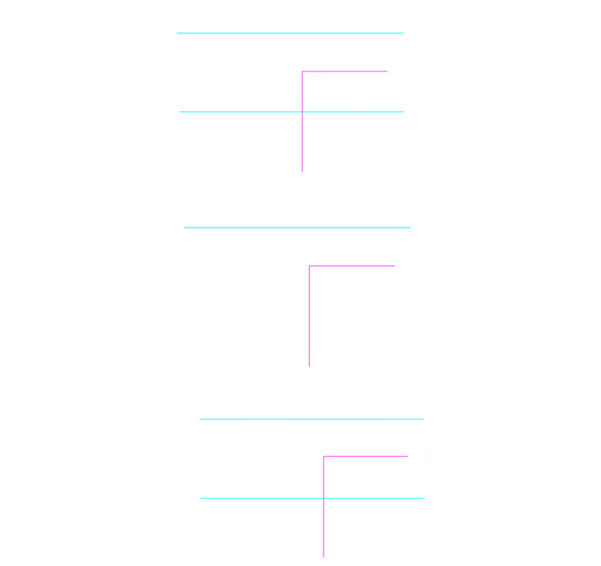{:height 466, :width 470}
			- Data is transferrred one bit at a time
			- Note the data loop back for Register A
			- 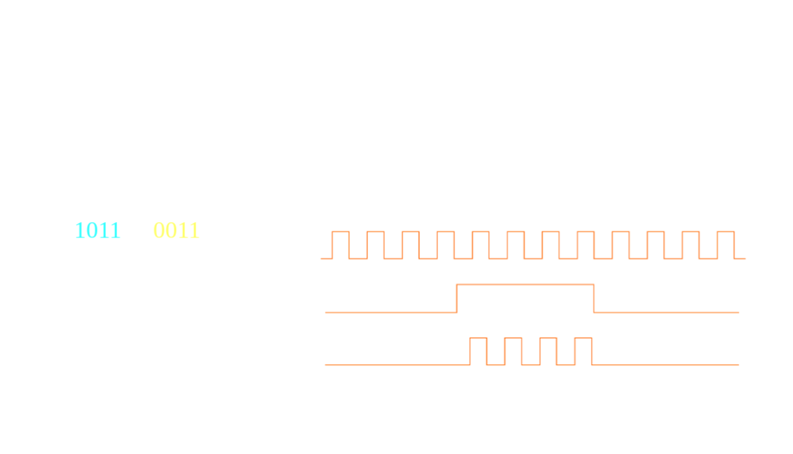 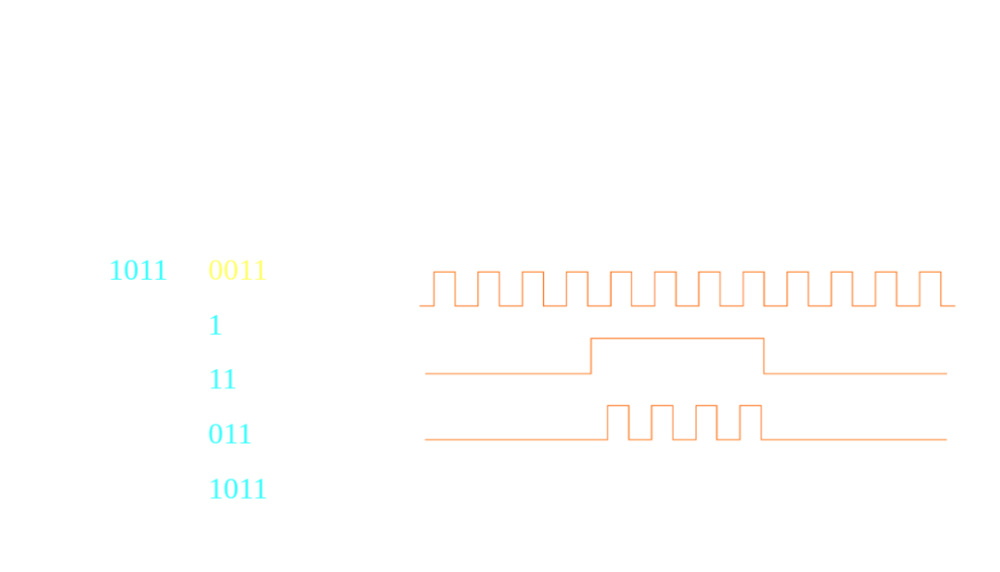
	- ### Shift Registers
		- Cascade chain of flip flpos
		- Bits travel on positive edges
		- Serial in (SI) $\rightarrow$ Serial out (SO)
		- 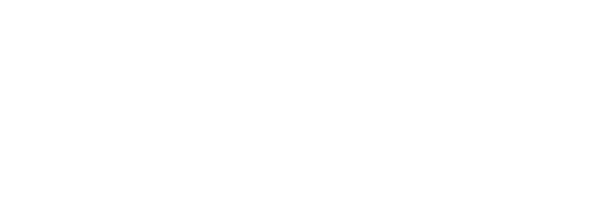
	- ### Serial Transfer of Data
		- Transfer from Register X to Register Y
			- 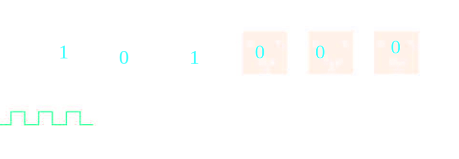 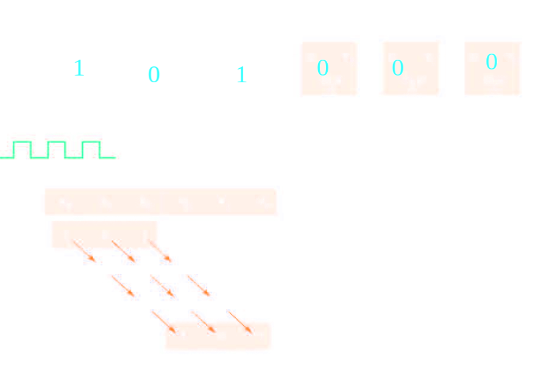
		- **Serial Additon**