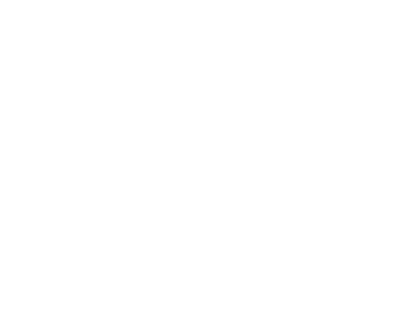
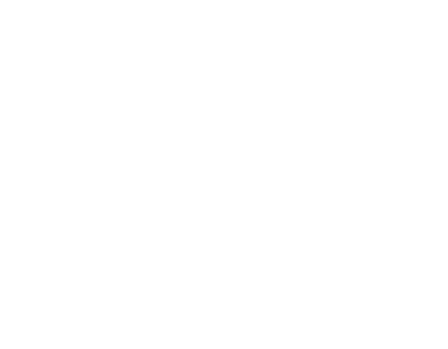
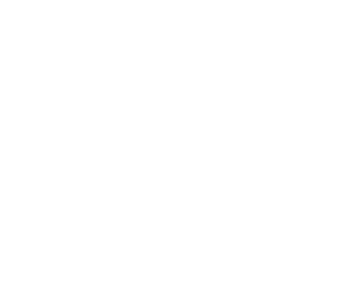
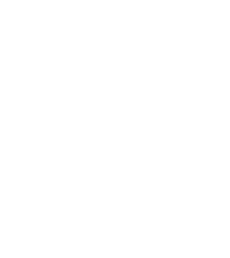
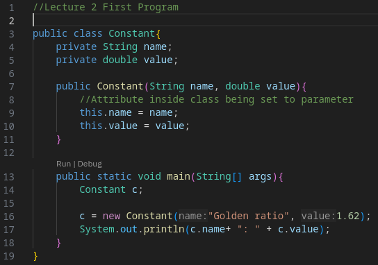
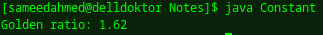
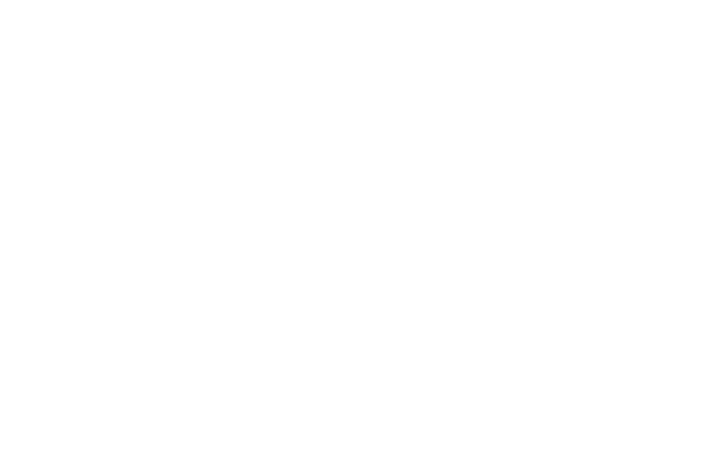
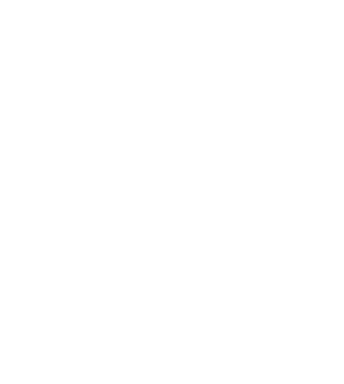
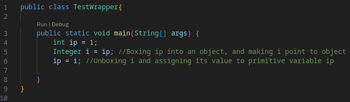
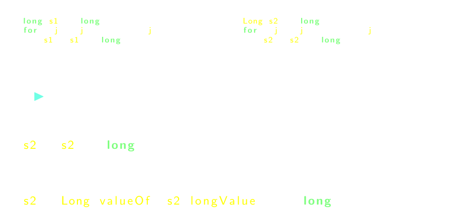

# [[Primitive and Reference Data Types]] #[[ITI 1121]]
	- ## Data Types
		- ### Variables
			- A variable is a place in memory to hold a **value**, which we refer to with the help of a **label**
			- `byte i = 33;`
				- {:height 317, :width 378}
		- ### Data Types in Java
			- Java is a **strongly typed** programming language
				- Each variable has a size, known at compile time
				- Type of variable **must** be declared
				- ```
				  int i; 
				  i = 33;
				  ```
			- Data types tell the compiler how much memory to allocate
			- ```
			  double formula;  //8 bytes
			  char c;          //2 bytes
			  ```
			- It also gives information about the data, and **which operations are allowed**
			- The following statement `c = flag * formula ;` would yield an error
			- Java has **Primitive** and **Reference** data types
				- **Primitive**
					- Numbers, characters (not Strings) and booleans
					- The value is stored at the **memory location** **designated** by **label of the variable**
					- | **Primitive** 	| **Range** 	| **Size** 	|
					  | `byte` 	| $-128...127$ 	| 8 	|
					  | `short` 	| $-32,768...32,767$ 	| 16 	|
					  | `int` 	| $-2^{31}... 2^{31}-1$ 	| 32 	|
					  | `long` 	| $-2^{63}...2^{63}-1$ 	| 64 	|
					  | `float` 	| roughly $\pm 10^{-38} ... \pm 10^{38}$ 	| 32 	|
					  | `double` 	| roughly $\pm 10^{-308} ... \pm 10^{308}$ 	| 64 	|
					  | `boolean` 	| `true` and `false` 	| 1(8?) 	|
					  | `char` 	| Unicode Character Set 	| 16 	|
				- **References**
					- Predefined, such as **Arrays**, **Strings** and **Wrappers** (for primitive types)
					- User defined, reference to an instance of a class
					- The value of a reference variable is a**memory location**, which **points/references** the **location of an object**
						- It is a **pointer** or link
					- The declaration of a reference variable **does not create an object, does not allocate for an object**, it only allocates memory to store the address of an object
		- ### Memory Representation
			- The declaration of a reference variable only allocates memory to a reference (sometimes called a **pointer** or **address**) `null` is a special value (**literal**) which does not reference an object
				- ```
				  int[] a; //Defining the space to make the variable
				  a = new int[5];
				  ```
				- {:height 169, :width 310} {:height 279, :width 305}
				- The create of a new instance `new int[5]`, allocates the memory to hold 5 integer values
				- Each cell of the array is initialized with default `int` value, which is `0`
				- The reference of the newly created object is assigned to the location designated by label `a`
					- {:height 231, :width 268}
			- **Memory Diagrams**
				- A memory diagram should include:
					- A box for every reference variable with an arrow pointing at the designated box
					- Box for every primitive variable with the value inside the box
					- A box for every object
				- Example:
				  background-color:: blue
					- Given the following class declaration
						- 
						- 
					- Draw a memory diagram for the following statements
						- {:height 372, :width 564}
		- ### Primitive vs Reference Types
			- Variables have types
			- Objects have classes
			- Example:
			  background-color:: blue
				- Creating a class `MyInteger`:
					- ```
					  class MyInteger{
					  	int value;
					  }
					  ```
				- Usage:
					- ```
					  MyInteger a;
					  a = new MyInteger();
					  a.value = 33;
					  ```
					- We use dot notation to access the value of an instance variable
				- Adding a constructor
					- ```
					  class MyInteger{
					  	int value;
					      MyInteger(int v){
					      	value = v;
					      }
					  }
					  ```
				- Usage:
					- ```
					  MyInteger a;
					  a = new MyInteger(33);
					  ```
			- **Primitive vs Reference Variables**
				- ```
				  int i = 33;
				  ```
					- 
				- ```
				  MyInteger i, alias;
				  i = new MyInteger(33);
				  alias = i;
				  ```
					- {:height 197, :width 248}
					- `i` and`alias` are both designating the same object
		- ### Wrappers
			- For every **primitive class** there is an associated **wrapper class**
			- An `Integer` is the wrapper class for the primitive type `int`
			- A wrapper stores a value of a primitive type inside an object
			- This will be paramount for stacks, queues, list and trees
			- Besides holding a value, the wrapper class possess several class methods, mainly to convert values from/to other types
				- Ex. `Integer.parseInt(33)`
			- |**Primitive**  | **Reference**|
			  |`byte`|`Byte`|
			  |`short`|`Short`|
			  |`int`|`Integer`|
			  |`long`|`Long`|
			  |`float`|`Float`|
			  |`double`|`Double`|
			  |`boolean`|`Boolean`|
			  |`char`|`Character`|
		- ### Autoboxing
			- 
				- `1` is a value of a primitive type, `int`, but `i` is a reference variable, of type `Integer`
				- In Java 1.4 or older, this would cause a **compile-time** error
				- In Java 5 and up this is valid
					- **Automagically** transforms the following statement from
					- ```
					  Integer i = 1;
					  ```
					- to
					- ```
					  Integer i = Integer.valueOf(1);
					  ```
					- Known as **autoboxing**
						- Decremented to `Integer i = new Integer(1)` since Java 9
			- Similarly, consider the statement `i = i + 5`
				- ```
				  Integer i = 1
				  i = i + 5
				  ```
				- This statement is transformed into
					- ```
					  i = Integer.valueOf(i.intValue() + 5);
					  ```
				- Where the value of the wrapper object `i` is extracted, **unboxed**, with the method call `i.intValue()`
			- All 8 primitive types have a corresponding **wrapper** class
			- The automatic conversion from primitive to reference type is called **boxing**, and the conversion from reference to primitive type is called **unboxing**
		- ### Compilation/Execution Speed:
			- 
		- ### Benchmarking Code
		  background-color:: red
		- ### Comparison Operators - Primitive Data Types
			- Variables of primitive data types can be compared directly
				- ```
				  int a = 5;
				  int b = 10;
				  
				  if (a < b){
				  	System.out.println("a < b");
				  } else if (a == b) {
				  	System.out.println("a == b");
				  } else {
				  	System.out.println("a > b");
				  }
				  ```
				- #### Image
				  background-color:: red
		- ### Comparison Operators - Primitive and Reference Data Types
			- #### Image
			  background-color:: red
			- #### Solution
				- ```
				  int a = 5
				  MyInteger b = new MyInteger(5);
				  
				  if (a < b.value){
				  	System.out.println("a is less than b");
				  } else if (a == b.value) {
				  	System.out.println("a equals b");
				  } else {
				  	System.out.println("a is greater than b");
				  }
				  ```
					- Outputs `a equals b`
		- ### Comparison Operators - Reference Data Types
			- ```
			  MyInteger a = newInteger(5);
			  My integer b = newInteger(10);
			  
			  if (a < b.value){
			  	System.out.println("a is less than b");
			  } else {
			  	System.out.println("a is not less than b");
			  }
			  ```
				- #### Image
				  background-color:: red
			- #### Solution
				- ```
				  MyInteger a = newInteger(5);
				  My integer b = newInteger(5);
				  
				  if (a == b){
				  	System.out.println("a equals b");
				  } else {
				  	System.out.println("a does not equal b");
				  }
				  ```
					- The result is `a does not equal b`
					- #### Image
					  background-color:: red
				- ```
				  public boolean equals(MyInteger other){
				  	returns this.value == other.value;
				  }
				  
				  MyInteger a = newInteger(5);
				  My integer b = newInteger(5);
				  
				  if (a.equals(b)){
				  	System.out.println("a equals b");
				  } else {
				  	System.out.println("a does not equal b");
				  }
				  ```
					- Prints `a equals b`
				- ```
				  MyInteger a = newInteger(5);
				  My integer b = a;
				  
				  if (a == b){
				  	System.out.println("a == b");
				  } else {
				  	System.out.println("a != b");
				  }
				  ```
					- Prints `a == b`
					- `a` and `b` reference the same object (instance), as the two memory locations are the same
						- `b` is considered an **alias** for `a`
				- ```
				  MyInteger a = newInteger(5);
				  My integer b = a;
				  
				  if (a.equals(b)){
				  	System.out.println("a equals b");
				  } else {
				  	System.out.println("a does not equal b");
				  }
				  ```
					- Prints `a equals b` because the two values are equal
					- #### Image
					  background-color:: red
			- Two reference variables designate objects that are "**logically equivalent**" if these objects have the same "content
	- ## Call-By-Value
		- ### Formal Parameter
			- A **formal parameter** is a variable which is part of the definition of the method
				- Can be seen as a local variable of the body of the method
			- ```
			  int sum(int a, int b){
			  	return a + b;
			  }
			  ```
				- `a` and `b` are formal parameters of `sum`
		- ### Actual Parameter
			- An **actual parameter** is the variable used when the method is called to supply the value for the formal parameter
			- ```
			  int sum(int a, int b){
			  	return a + b;
			  }
			  ...
			  int midTerm, finalExam, total;
			  total = sum(midTerm, finalExam);
			  ```
			- `midTerm` and `finalExam` are actual parameter`sum`, when the method is called the values of the actual parameters is copied to the location of the formal parameters
		- ### Call-By-Value
			- In Java, when a method is called, the **values** of the actual parameters are **copied** to the location of the formal parameters
			- **When a method is called:**
				- The execution of the calling method is stopped
				- An activation frame (activation block or record) is created
					- Contains the formal parameters as well as local variables
				- The value of the actual parameters are copied to the location of the formal parameters
				- The body of the method is executed
				- A return value or (void) is saved and activation frame is destroyed
				- Execution of the calling method restarts with next instruction
		- ### Primitive and Method Calls
			- ```
			  public class Test{
			  	
			      public static void increment(int a){
			      	a = a + 1;
			      }
			      
			      public static void main(String[] args){
			      	int a = 5;
			          System.out.println("before: " + a);
			          increment(a);
			          System.out.println("after: " + a);
			      }
			  }
			  ```
			- Returns:
				- `before: 5`
				  `after: 5`
			- #### Images
			  background-color:: red
			- Each **method call** has its own **activation frame**, which holds the parameters and local variables (in this case, `args` and `a`)
			- When `increment` is called, a new activation frame is created
			- The value of the **actual parameter** is copied to location of **formal parameter**
			- Execution of `a = a + 1` changes the content of formal parameter `a`, which is a distinct memory location the local variable `a` of the `main` method
			- Control  returns to the main method, the activation frame for `increment` is destroyed
		- ### Reference and Method Calls
			- ```
			  class MyInteger{
			  	int value;
			      MyInteger(int v){
			      	value = v;
			      }
			  }
			  
			  public class Test{
			  	
			      public static void increment(MyInteger a){
			      	a.value++;
			      }
			      
			      public static void main(String[] args){
			      	MyInteger a = new MyInteger(5);
			          System.out.println("before: " + a.value);
			          increment(a);
			          System.out.println("after: " + a.value);
			      }
			  }
			  ```
				- #### Images
				  background-color:: red
				- Calling `increment`, creating a new activation frame
				- Copying **value** of **actual parameter** into the **formal parameter** of **increment**
				- Executing `a.value++`
				- Returning the control to the `main` method
	- ## Scope
		- The **scope** of declaration is the region of the program within which the entity declared by the declaration can be referred to using a simple name
		- The **scope of a local variable declaration** in a block is the rest of the block in which the declaration appears, starting with its own initializer and including any further declarators to the right in the local variable declaration statement
		- The **scope of a parameter** of a method or constructor is the entire body of the method or constructor
		- ### Memory Managment
			- What happens to objects that are not referenced?
				- ```
				  MyInteger a = new MyInteger(7);
				  MyInteger b = new MyInteger(99);
				  b = a;
				  ```
				- The object containing the value `99` is never referenced
				- The JVM recuperates the memory space, in a process called **garbage collection**
	- ## Summary of Chapter
		- Strong typing helps detect certain kinds of errors early
		- Comparison operators always compare the value of the expressions
		- When comparing references, we check that **two references designate the same object or not**
		- The method `equals` should be used to **compare the content of objects**
		- In Java, call-by-value is the mechanism used for method calls
		- The scope of variables and parameter names is static in Java
- collapsed:: true
	-