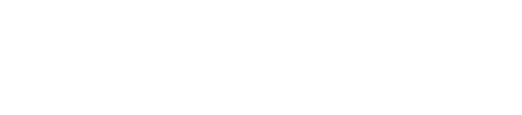

## [[Interfaces]] #[[ITI 1121]]
	- ### Polymorphism
		- *Ad hoc* polymorphism (overloading):
			- A method name is associated with different blocks or loads
		- Inclusion(subtyping, data) polymorphism:
			- A identifier (a reference variable) is associated with data of different types with use of a subtype relation
		- **In Java, a variable or a method is polymorphic if it refers to objects of more than one '"class/type"**
	- ### Method Overloading
		- **Method overloading** means that two methods can have the same name but different signatures
			- The signature consists of the name and formal parameters of a method but not the return value
	- ### Types
		- A variables is a storage location and has a associated type that is either a primitive or reference type
		- A variable always contains a value that  is assignment compatible
		- "Assignment of value of compile-time reference type S (source) to a variable of compile-time reference type T (target) is checked as follows:
			- If S is a class type:
				- If T is a class type, then S must either be the same class as T or S must be subclass of T or compile-time error occurs
	- ### Abstract Classes
		- A class that contains an **abstract method** (declared in class or inherited) **must ** declared abstract
		- An abstract class cannot be used to create objects
		- A class that contains no abstract methods **can** be also declared abstract to prevent creation of objects of this class
	- ### Interfaces
		- Even if not defined, interfaces are implicitly public and abstract
		- An interface definition resembles an abstract class definition
		- It consists of the keyword **interface**, instead of **class**
		- An interface contains
			- Constants
			- Abstract method definitions
		- Like an abstract class, it is not possible to create an instance of an interface
		- Unlike an abstract class the interface cannot contain concrete methods
		- An interface is useful when there are several possible implementations for a given problem/data structure
		- An abstract data type defines the valid operations without providing an implementation
	- ### Interfaces vs Abstract Classes
		- Interfaces and abstract classes are two ways to define a data type with an abstract contract (without implementation)
			- An abstract class that only contains abstract methods should be an  interface
			- If the problem needs multiple-inheritence, use interfaces
			- To mix concrete and abstract methods you need to use an abstract class
			- An interface defines the relationship “can be seen as”
			- Inheritance defines the relationship “is a”
		- 
	- ### Data Types
		- A **data type** is characterized by
			- A set of values
			- A set of operations
			- A data representation
		- These characters are necessary for compilier to validate program
		- These characteristics are also necessary for the compiler to create a representation for data in memory
	- ### Abstract Data Type
		- An **abstract data type** (ADT) is characterized by :
			- A set of values
			- A set of operations
		- Data representation is not part of specification
		- A concrete data type must have a representation, but the ADT makes a distinction between how it is used and how it is implemented