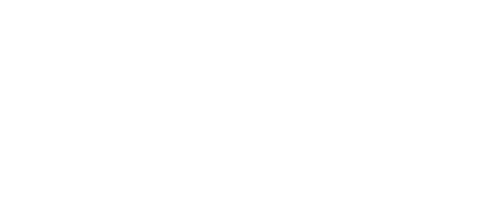

## [[ADT Stacks]] #[[ITI 1100]]
	- ### Definition
		- A **stack** is a *linear* data strcture that is always accessed from the same extremity,o on element at a time, at that element is called the **top** of the stack
		- Stacks are LIFO data: *last-in first-out*
	- ### Applications
		- In compilers, and formal language analysis
		- Implement *backtracking* algorithms
		- Memory management during program execution
	- ### Basic Operations
		- **Push:** Add an element onto the top of the stack
		- **Pop:** Removes and returns the top element
		- **Empty:** Tests if stack is empty
	- ### Properties of Arrays
		- Arrays are accessed by index position
			- Access to position is very fast
		- Indexing is a *random access* operation for arrays, the access to any element take takes a constant number of steps
		- Indexing necessitates **constant time**, the time to access is independent of
			- The size of the array
			- The number of elements in the array
			- Position of the element
		- Access to an element is fast because all elements are stored contiguously in memory
		- All elements occupy the same amount of spcae, and the address of an element  is
			- $$\text{base address + offset}$$
			- where offset is $\text{index * size of an element}$
	- 
	- ### Method Call
		- The JVM must
			- Create a new activation record/block (contains space for local variables and parameters)
			- Save current value of `basePtr`in activation record and set `bastPtr` to address of current record
			- Save value of program counter in the designed sapce of the activation record, set the program counter to the first instruction of the current method
			- Copy values of parameters into designated area of currect activation record
			- Initialize the local variables
			- Start executing the instruction designated by program counter
			- $\Rightarrow$ activation block = *stack frame, call frame* or *activation record*
	- ### Method End
		- The JVM must
			- Save the return value at the designated space
			- Return the control to the calling method, set program counter and `basePtr`to previous value
			- Remove current block
			- Execute instruction designated by current value of program counter
	- ### Linked Structures
		- The data structure that uses exact amount of memory required by application
			- Grows one element at a time **without** copying elements
		- Accessing elements will necessitate traversing the data struction
		- Just like arrays, each element has a single predecessor and successor, being a **linear** structure
		- **Unlike arrays,** this data structure is not implemented with ^^contiguous memory cells^^
		- Linked structures allow to:
			- Represent lienar data structures such as lists, stacks and queues
			- Use only necessary memory
		- Each element is stored in its own "container", called `Elem`
			- Each container is linked to its successor with help of reference
			-