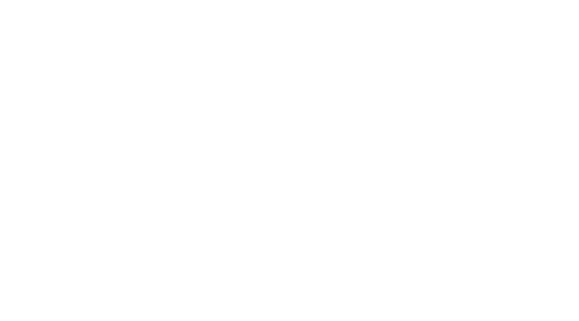
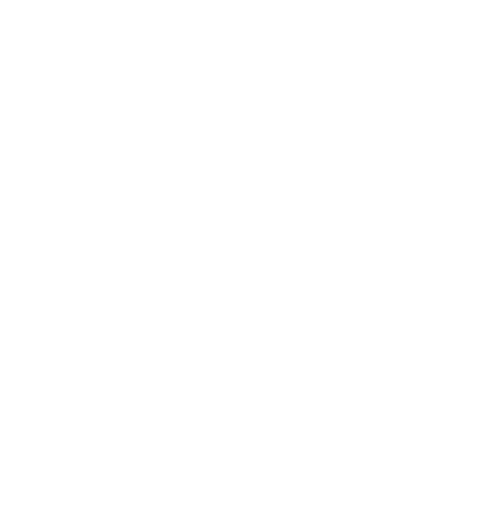

# #[[ITI 1121]]
	- ### Important Topics Covered
		- Fundamentals
			- Java arrays
			- Polymorphism
			- Java class hierarchy and the Object class
			- Generics
		- Stacks
		- Memory-diagram representations, particularly of linked structures
		- Exceptions, including percolation of exceptions and try/catch/finally blocks
		- Queues and Queue algorithms, including circular queues
		- Singly / doubly linked lists, including the concepts of dummy node and circular lists
		- Manipulation of linked structures
		- Iterators
		- Recursion, including familiarity with the head-tail strategy for recursive processing of lists
		- Binary Search Trees (BSTs)
- # Primitive and Reference Data Types
- # Intro to OOP
- # Inheritence
- # Interfaces
- # Polymorphism
- # Exceptions
- # ADT Stacks
- # ADT Queues
- # ADT Lists
- # Iterators
- # Recursions
- # Binary Search Trees
	- A **binary tree** is a tree like data structure such that each **node** stores a `value` and has at most 2 children, `left` and `right`
		- All nodes except the top have exactly one parent
			- The **root**
		- Each node has 0,1,2 children
		- Nodes that have no children are called **leaves**
		- Links between nodes are called **branches**
	- A node and its descendants is called a **subtree**
	- The **depth of a node** is the number of links starting from the root that must be
	  followed to reach that node
		- The root is the most accessible node
	- The **depth of a tree** is the depth of the deepest node
	- {:height 347, :width 611} {:height 354, :width 427}
	- A **binary search tree** is a **binary tree** such that each node verifies:
		- All the nodes in its left sub-tree have values less thant he value of this node or the left sub-tree is empty
		- All nodes in the right sub-tree have values that are greater than the value of this node or the right sub-tree is empty
	- ### Traversing a Tree
		- **Pre-Order**: Node, Left, Right
		- **In-Order**: Left, Node, Right
		- **Post-Order:** Left, Right, Node
	- A binary tree of depth $d$ is **balanced** if all nodes at deph less than $d-1$ have exactly two children
	-