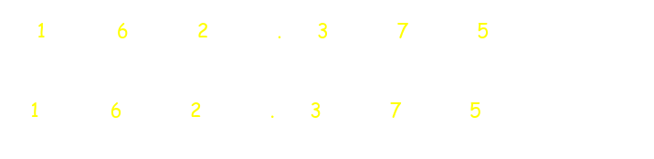

## Binary Systems #[[ITI 1100]]
	- ### Digital Systems
		- Early Computers were designed to perform numeric computations
		- Use **discrete** elements of information named digits (finite sets)
		- ^^Digital Systems:^^ manuplate **discrete** elements of information
	- ### Different Numbering Systems
		- ^^**Decimal(Arabic):**^^ $(0,1,2,3,4,5,6,7,8,9)$
			- **Example:** $(452968)_{10}$
		- ^^**Octal:**^^ $(0,1,2,3,4,5,6,7)$
			- **Example:** $(4073)_8$
		- ^^**Hexadecimal:**^^$(0,1,2,3,4,5,6,7,8,9,A,B,C,D,E,F)$
			- **Example:** $(2BF3)_{16}$
		- ^^**Binary:**^^ $(0,1)$
			- **Example:** $(1001110001011)_2$
	- ### Base in Numbering Systems (10)
		- The decimal numbering system uses **base 10**
		- The values of the positions are calculated by taking 10 to some power
			- {:height 170, :width 667}
	- ### Base in Numbering Systems (2)
		- The binary numbering system is named as such because it uses **base 2**
		- Values of positions are calculated by taking 2 to some power
	- ### Representation of Numbers
		- There are two possible ways of writing a number in a given system:
			- ### Positional Notation
			- ### Polynomial Representation