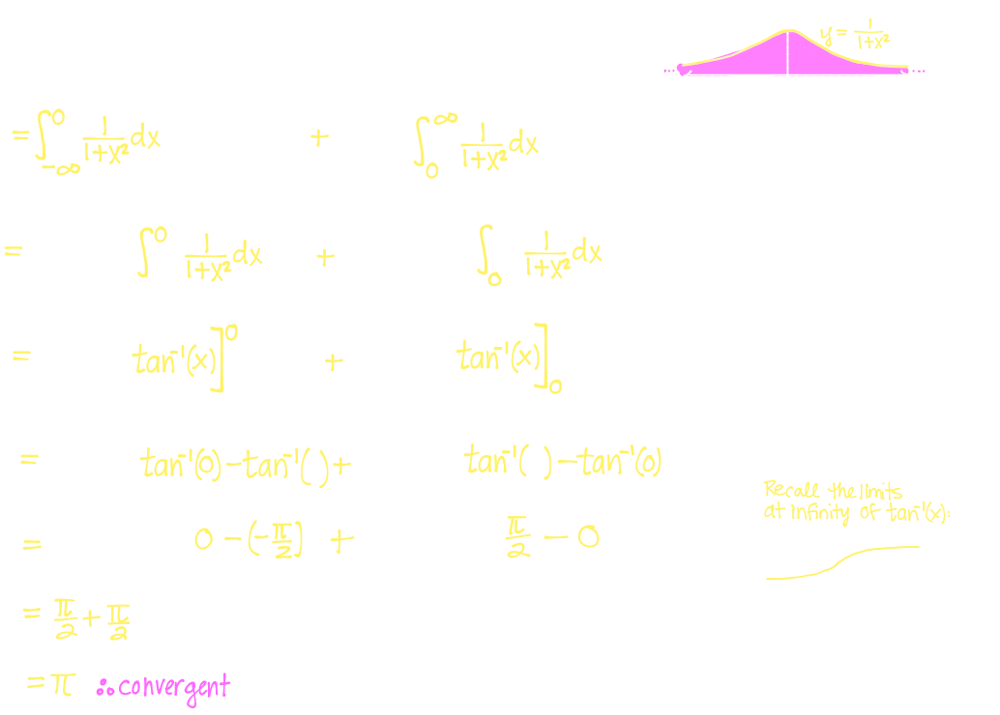
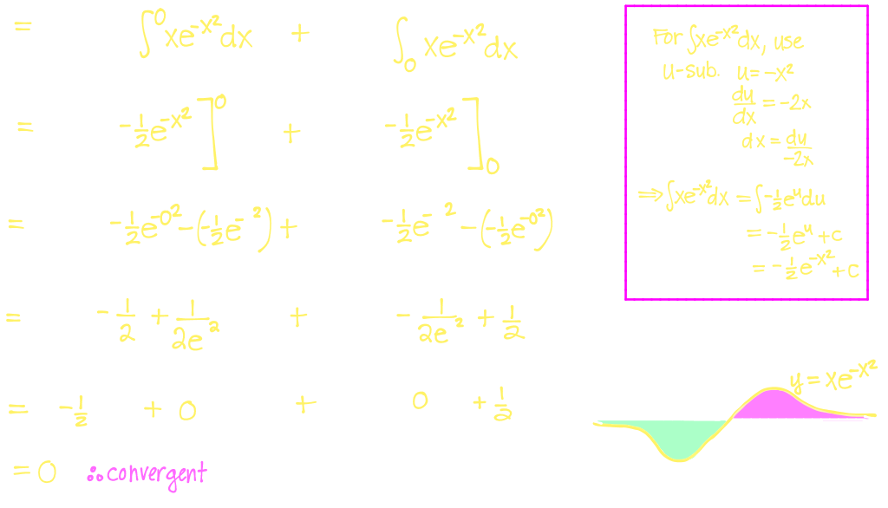
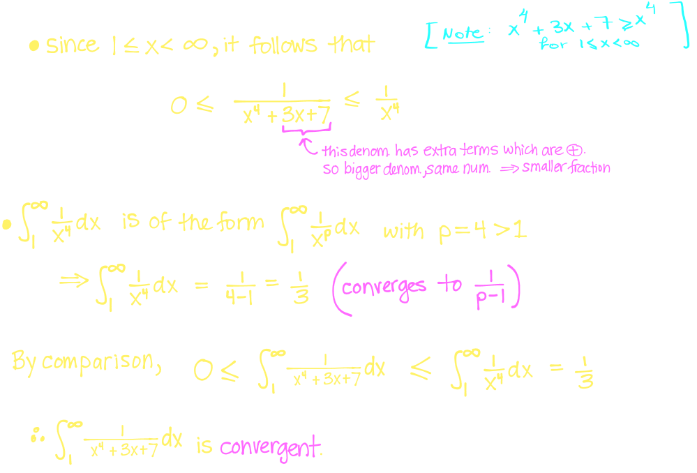
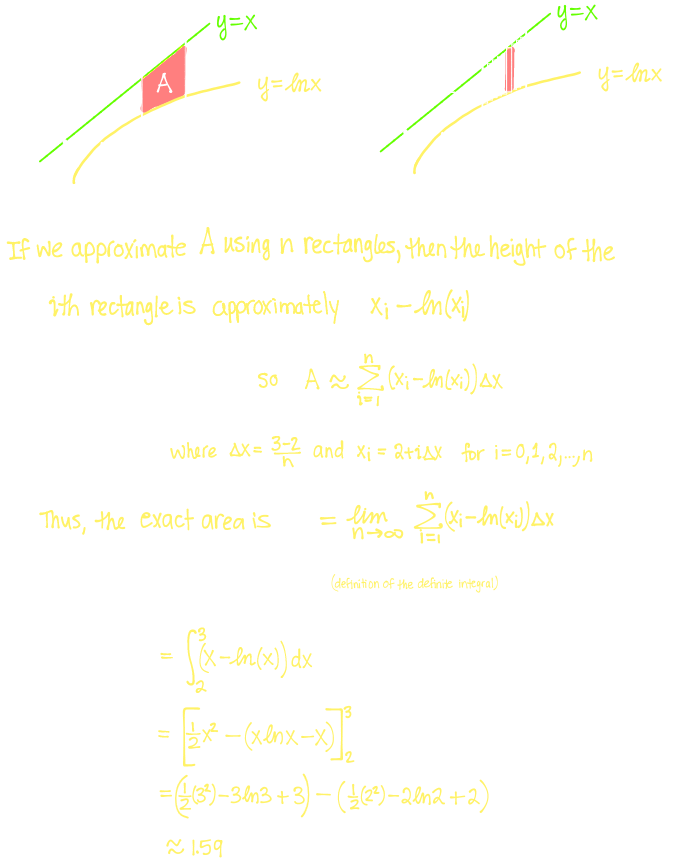
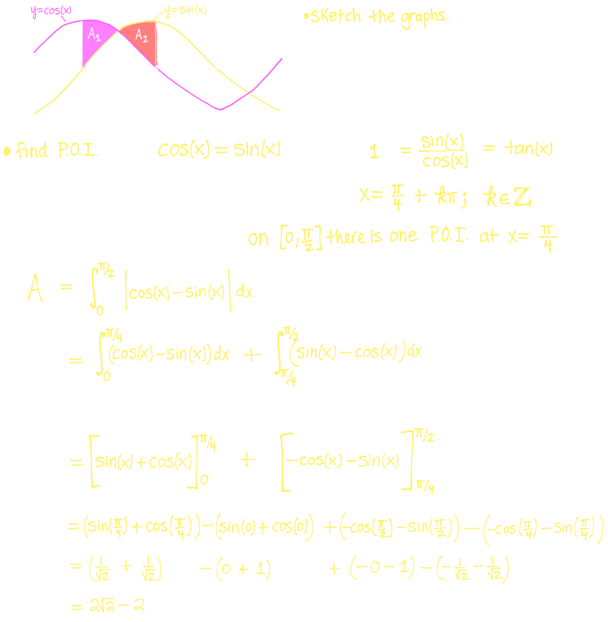
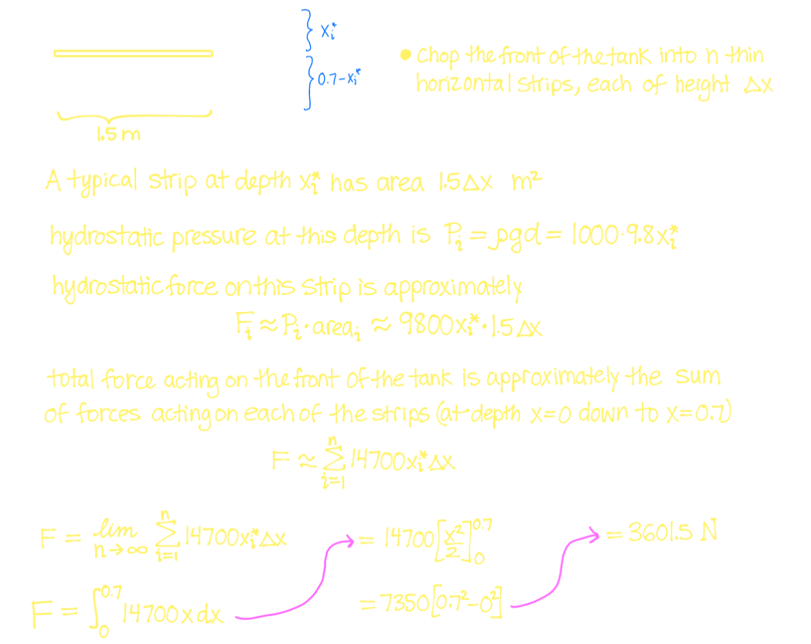

## #[[MAT 1322]]
	- [[Improper Integrals]]
	- [[Areas]]
	- [[Volumes]]
	- [[Work]]
	- [[Applications: Average Value, Arc Length]]
	- [[Applications: Hydrostatic Force, Centre of Mass]]
	- [[Differential Equations]]
	- [[Euler's Method and Applications of DEs]]
	- [[Sequences]]
	- [[Series]]
	- [[The Integral & The Comparison Test]]
	- [[Remainder Estimate Error Bounds & Limit Comparision Test]]
	- [[Alternating Series & Absolute/Conditional Convergence]]
	- [[Ratio & Root Tests & General Strategies for Testing Series]]
	- [[Power Series]]
	- [[Representation of a Function as Power Series]]
	- [[Taylor & Maclaurin Series]]
	- [[Functions of Several Variables]]
	- [[Partial Derivatives]]
	- [[Tangent Planes]]
- ## Topics Covered:
	- ### Improper Integrals
	  background-color:: green
	  collapsed:: true
		- **Improper Integrals Type I - Infinite Intervals**
			- An integral of the form $\int_a^b f(x) \ dx$ is called an **improper intergral of type I** if:
				- $a = -\infin$ and/or $b = \infin$
			- $$\int_a^{\infin} f(x) \ dx = \lim_{t \rightarrow \infin} \int_a^t f(x) \ dx$$
				- if the limit exists, $\int_a^{\infin} f(x) \ dx$ is **convergent**,  if it is DNE,  it's **divergent**
			- $$\int_{-\infin}^b f(x) \ dx = \lim_{t \rightarrow - \infin} \int_t^b f(x) \ dx$$
				- if the limit exists, $\int_{- \infin}^b f(x) \ dx$ is **convergent** if it is  DNE, it's **divergent**
			- $$\int_{- \infin}^{\infin} f(x)  \ dx = \int_{- \infin}^a f(x)  \ dx + \int_a^{\infin} f(x)  \ dx$$
				- where we split the integral at any real number $a$
				- If one(or both) of $\int_{- \infin}^a f(x)  \ dx$ and $\int_{a}^{\infin} f(x)  \ dx$ is divergent, then $\int_{- \infin}^{\infin} f(x)  \ dx$ is also divergent
			- Example:
			  background-color:: blue
				- $$\int_{-\infin}^{\infin} \frac{1}{1+x^2} \ dx$$
				- 
				- $$\int_{-\infin}^{\infin} xe^{-x^2} \ dx$$
				- 
		- **Improper Integrals Type II - Discontinuous Integrals**
			- $$\int_a^b f(x) \ dx = \lim_{t \rightarrow b^-} \int_a^t f(x) \ dx$$
			- $$\int_a^b f(x) \ dx = \lim_{t \rightarrow a^+} \int_t^b f(x) \ dx$$
			- In each case, the improper integral is **convergent** is convergent if the corresponding limit exists and **divergent** otherwise
			- If $f$ has a discontinuity at $c$ where $a < c < b$, then we define
				- $$\int_a^b f(x)  \ dx = \int_{a}^c f(x)  \ dx + \int_c^b f(x)  \ dx \\ \qquad \qquad \qquad  \qquad \quad = \lim_{t \rightarrow c^-} \int_a^t f(x) \ dx + \lim_{s \rightarrow c^+} \int_s^b f(x) \ dx$$
			- Example:
			  background-color:: blue
				- $$\int_0^1 \ln(x) \ dx$$
					- 
				- $$\int_1^2 \frac{1}{(x-2)^4} \ dx$$
					- 
		- **Comparision Test for Improper Integrals**:
			- Suppose $f$ and $g$ are continuous functions with
				- $$f(x) \ge g(x) \ge 0 \text{ for all } x\ge a$$
			- If $\int_a^{\infin} f(x) \ dx$ converges, then so does  $\int_a^{\infin} g(x) \ dx$
				- Essentially if "bigger" area converges $\rightarrow$ "smaller" area converges
			- If $\int_a^{\infin} g(x) \ dx$ diverges, then so does  $\int_a^{\infin} f(x) \ dx$
				- Essentially if "smaller" area diverges $\rightarrow$ "bigger" area diverges
			- Example:
			  background-color:: blue
				- $$\int_1^{\infin} \frac{1}{x^4+3x+7} \ dx$$
					- converge or diverge?
						- 
			- $$\int_1^{\infin} \frac{2 - \cos(x)}{\sqrt{3x^2 -1}} \ dx$$
				- {:height 646, :width 657}
	- ### Areas
	  background-color:: green
	  collapsed:: true
		- The area between two curves on some interval $[a,b]$ can be defined as
			- $$A = \int_a^b f(x) \ dx - \int_a^b g(x) \ dx = \int_a^b (f(x) - g(x)) \ dx$$
		- Example:
		  background-color:: blue
			- Find the area of the region bounded by the curves $y = \ln(x), y = x$ and the lines $x=2$ and $x=3$
				- 
			- Find the area of the region bounded by the curves $g(x) = 3x^2$ and $h(x) = 1-x^2$
				- 
			- Find the area of the region bounded by the curves $y = cos(x)$ and $y= sin(x)$ and lines $x=0$ and $x = \frac{\pi}{2}$
				- 
	- ### Volumes
	  background-color:: yellow
	  collapsed:: true
		- **Volume by Slices**
			- $$V= \lim_{n \rightarrow \infin} \sum_{i =1}^n A(x_i) \Delta x = \int_a^b A(x) \ dx$$
			- Example:
			  background-color:: blue
				- Find the volume of the solid by rotating about the $x-$axis the region under the curve $y = \sqrt{x}$ from $0$ to $1$
					- 
				- Find the volume of the solid obtained by rotating the region bounded by the curves $y=x$ and $y=x^2$ around the line $y=3$
					- What would the volume be if we took the same region, and rotated around the line $x=0$
						- 
		- **Volume by Cylindrical Shells**
			- $$V = \lim_{n \rightarrow \infin}^n \sum_{i=1}^n 2 \pi R(x_i)H(x_i) \Delta x = \int_a^b 2\pi R(x)H(x) \ dx$$
			- Example:
			  background-color:: blue
				- Determine the volume of a solid obtained by rotating about the line $x =3$ the region bounded by $y=2-x^2$ and $y=x^2$
					- 
	- ### Work
	  background-color:: yellow
	  collapsed:: true
		- $$W_i \approx f(x_i) \Delta x$$
		- $$f(x)=kx$$
		- Example:
		  background-color:: blue
			- A tank filled with water has the shape of an isosceles trapezoid (at the ends). The tank is $1$m wide and $1.5$m tall. The top of the tank measures $2$m and the bottom of the tank measures $1$m (water density $p = 1000 kg/m^3$). How much work is required to pump all the water out of the tank?
				- 
				- 
			- If instead we wanted to pump the water to a height $2$m above the top of the tank, how would the problem change?
				- 
			- If the tank was only filled to a height of $1$m, and we wanted to pump the water to the top of the tank, how would the problem change?
				- 
			- A $200$-lb cable is $100$ft long and hangs vertically from the top of a tall building. How much work is required to lift the cable to the top of the building
				- 
			- A force of 40 $N$ is required to hold a spring that has been stretched from it's natural length of 10 cm to a length of 15 cm. How much work is done in stretching the spring 15cm to 18cm?
				- 
				-
	- ### Average Value
	  background-color:: green
	  collapsed:: true
		- The **average value of** $f$ **on** $[a,b]$ to be:
			- $$f_{avg} = \frac{1}{b-a} \int_a^b f(x) \ dx$$
		- Example:
		  background-color:: blue
			- Find the average value of $f(x) = \sin (x)$ on $[0, \pi]$
				- 
	- ### Arc Length
	  background-color:: green
	  collapsed:: true
		- $$L = \int_a^b \sqrt{1+[f'(x)]^2} $$
		- Example:
		  background-color:: blue
			- Calculate the length of $y = 4x^{3/2}$ from $x=1$ to $x=4$
				- 
	- ### Hydrostatic Force
	  background-color:: yellow
	  collapsed:: true
		- $$F = mg = \rho g A d$$
		- Example
		  background-color:: blue
			- A fish take is $1.5 \text{m}$ long by $1 \text{m}$ wide by $0.7 \text{m}$ deep
				- Find hydrostatic force on the botton of the tank
					- 
				- Find the hydrostatic force on each of the four sides of the tank
					- 
					- 
			- Suppose a vertical plate is submerged $1 \text{m}$ under water, where the plate has dimensions as given in the following diagram:
				- 
				- What is the hydrostatic force acting on the plane
					- {:height 244, :width 626}
	- ### Centre of Mass
	  background-color:: green
	  collapsed:: true
		- Moment around $x$-axis
			- $$M_x = \int_a^b  \frac{1}{2} \rho \{[f(x)]^2 - [g(x)]^2\} \Delta x\ dx$$
		- Moment around $y$-axis
			- $$M_y = \int_a^b \rho \cdot x(f(x) - g(x)) \ dx$$
		- $m$ is defined as $m = \rho A(x)$
		- Suppose ($\overline{x},\overline{y}$) are coordinates of $R$'s centre of mass (or **centroid**)
			- $$\overline{x} = \frac{M_y}{m} \qquad \overline{y} = \frac{M_x}{m}$$
	- ### Differential Equations
	  background-color:: green
	  collapsed:: true
		- **Initial Value Problem**
		- **Model for Population Growth**
			- $$\frac{dP}{dt} = kP$$(the differential equation) where
				- $k$ is the proportionality constant
				- $t$ is time (independent variable)
				- $P$ is population size (dependent variable)
				- $P(t)$ is the unknown function (solution)
			- Example:
			  background-color:: blue
				- Verify that $P(t) = Ce^{kt}$ is a solution the differential equation $\frac{dP}{dt} = kP$. What does the constant $C$ represent in terms of this population?
					- 
		- **Seperable Differential Equations**
			- Example:
			  background-color:: blue
				- Our guess for the exponential solution to our model seems like dumb luck; however, now we notice that $\frac{dP}{dt} = kP$ is a separable differential equation
					- 
				- Solve the **initial value problem** given by $\frac{dy}{dx} = xy^2 \cos(x^2) \quad y(0) =1$
					- 
				- Find the **general solution** to the differential equation $\frac{dy}{dx} = x^2y$
					- 
		- **Direction Fields**
			- Example:
			  background-color:: blue
				- Draw a slope/direction field for the differential equation $y' = x+y$. Trace a rough graph of the particular solution with initial condition $y(0) = 2$
					- 
				-
	- ### Euler Method's
	  background-color:: green
	  collapsed:: true
		- **Euler's method** is a method of solving differential equations with the general formula
			- $$x_{n+1} = x_n  + \Delta x$$
			- $$y_{n+1} = y_n  + f(x_n,y_n) \Delta x$$
			- 
	- ### Applications of DEs
	  background-color:: green
	  collapsed:: true
		- Newton's Laws of Heating and Cooling
			- $$T(t) = T_s + (T_o - T_s)e^{-kt}$$
				- $T_s$ surrounding temperature
				- $T(t)$ target temperature
				- $T_o$ initial temperature
	- ### Sequences
	  background-color:: green
	  collapsed:: true
		- A **sequence** is an ordered list of numbers
			- 
		- A sequence is considered **convergent** of its $\lim_{n \rightarrow \infin}$ is a unique real number
		- #### Limit Laws for Sequences:
			- $$\lim_{n \rightarrow \infin} (a_n + b_n) = \lim_{n \rightarrow \infin} a_n + \lim_{n \rightarrow \infin} b_n$$
			- $$\lim_{n \rightarrow \infin} (a_n - b_n) = \lim_{n \rightarrow \infin} a_n - \lim_{n \rightarrow \infin}$$
			- $$\lim_{n \rightarrow \infin} ca_n = c( \lim_{n \rightarrow \infin} a_n)$$
			- $$\lim_{n \rightarrow \infin} (a_n b_n) = (\lim_{n \rightarrow \infin} a_n) ( \lim_{n \rightarrow \infin} b_n)$$
			- $$\lim_{n \rightarrow \infin}(\frac{a_n}{b_n}) = \frac{\lim_{n \rightarrow \infin} a_n}{\lim_{n \rightarrow \infin} b_n} \text{ provided } \lim_{n \rightarrow \infin} b_n \ne 0$$
			- $$\lim_{n \rightarrow \infin} (a_n)^p = (\lim_{n \rightarrow \infin} a_n)^p \text{ if } p > 0 \text{ and } a_n >0$$
		- #### Squeeze Theorem
			- $$\lim_{n \rightarrow \infin} a_n = L \le \lim_{n \rightarrow \infin} b_n \le L = \lim_{n \rightarrow \infin} c_n \\ \therefore \lim_{n \rightarrow \infin} b_n =L$$
	- ### Series
	  background-color:: green
	  collapsed:: true
		- #### Infinite Series
			- A sum is:
				- $$\sum_{n = 1}^\infin a_n = a_1 + a_2 + a_3 + ... + a_i = ?$$
			- Finite sums to term $S_n$ are **partial sums**
			- If a sequence of partial sums converges to a fininite number $L$, then a series is said to **converge** to $L$, written $\sum_{n=1}^\infin a_n = L$
			- If sequence diverges, series diverges
			- 
		- #### Geometric Series
			- A **geometric series** has a first term $a$ and **common ratio** $r$ in the form
				- $$a + ar + ar^2 + ar^3 + ...$$
			- In equation form, it typically needs to be simplified to some:
				- $$\sum x (\frac{a}{b})^n$$
			- $$S_n = \frac{a(1-r^n)}{1-r} \qquad \lim_{n \rightarrow \infin}S = \frac{a}{1-r}$$
			- If $|r| < 1$, then the geometric series $\sum_{n=1}^\infin ar^{n-1}$ is convergent and it converges to $\frac{a}{1-r}$, else if $|r| > 1$. the geometric series is divergent
	- ### Integral and Comparision Tests
	  background-color:: green
	  collapsed:: true
		- #### Integral Test
			- $\sum_{n=1}^\infin a_n$ is convergent if and only if $\sum_1^\infin f(x)$ is convergent
			- In $p$ series, $\sum_{n=1}^\infin \frac{1}{n^p} \ dx$,
				- Convergent if $p > 1$
				- Divergent if $p \le 1$
		- #### Comparision Test
			- If $\sum b_n$ is convergent and $a_n \le b_n$ for all $n$, then $\sum a_n$ is convergent
			- If $\sum b_n$ is divergent and $a_n \ge b_n$ for all $n$, then $\sum a_n$ is divergent
	- ### Remainder Estimate Error Bounds
	  background-color:: yellow
	  collapsed:: true
		- To determine error in estimating the function we use:
			- $$S_n + \int_{n+1}^\infin  f(x) \le S \le S_n + \int_n^\infin f(x) \ dx$$
		- #### Examples:
			-  
			- 
	- ### Limit Comparision Test
	  background-color:: green
	  collapsed:: true
		- If,
			- $$\lim_{n \rightarrow \infin} \frac{a_n}{b_n} = c$$
			- where $c$ is finite number and $c > 0$ then $\sum a_n$ and $\sum b_n$ either both **converge** or **diverge**
		- Examples:
			- 
			- 
	- ### Alternating series and absolute convergence
	  background-color:: green
	  collapsed:: true
		- An **alternating** series is a series is which consecutive temrs have alternating terms:
			- 
		- If the alternating series $\sum_{n=1}^\infin (-1)^{n-1} b_n = b_1 - b_2 + b_3 - b_4 + b_5 - b_6 + ...$ (where $b_n > 0$ for all $n$) satisfies
			- $b+{n+1} \le b$ for all $n$
			- $\lim_{n \rightarrow \infin} b_n = 0$
		- then the series is convergent
		- #### Estimation Theorem for ALternating Series
			- If all of the conditions above are met, $|R_n| = |S-S_n| \le b_{n+1}$
			- 
		- An alternative series is **absolutely convergent** if the series $\sum |a_n|$ converges
		- An alternating series is **conditonally convergent** if $\sum|a_n|$ is divergent but $\sum a_n$ is convergent
	- ### Ratio and Root tests
	  background-color:: green
	  collapsed:: true
		- #### The Ratio Test
			- If $\lim_{n \rightarrow \infin} | \frac{a_{n+1}}{a_n}| = L$ and $L < 1$, then $\sum_{n=1}^\infin a_n$ is ^^absolutely convergent^^
			- If $\lim_{n \rightarrow \infin} | \frac{a_{n+1}}{a_n}| = L$ and $L > 1$, then $\sum_{n=1}^\infin a_n$ is ^^divergent^^
			- If $\lim_{n \rightarrow \infin} | \frac{a_{n+1}}{a_n}| = L$ and $L = 1$, then Ratio Test is ^^inconclusive^^
			- 
		- #### The Root Test
			- If $\lim_{n \rightarrow \infin}  \sqrt[n]{|a_n|}= L < 1$, then $\sum_{n=1}^\infin a_n$ is ^^absolutely convergent^^
			- If $\lim_{n \rightarrow \infin}  \sqrt[n]{|a_n|}=L > 1$, then $\sum_{n=1}^\infin a_n$ is ^^divergent^^
			- If $\lim_{n \rightarrow \infin}  \sqrt[n]{|a_n|}=L = 1$, then Root Test is ^^inconclusive^^
			- 
	- ### Strategies for Testing Series
	  background-color:: red
	  collapsed:: true
		- $$\sum_{m=1}^\infin \frac{m!}{m^m}$$
			- 
		- $$\sum^\infin (\frac{n}{n+1})^{n^2}$$
			- 
		- $$\sum^\infin ke^{-k^2}$$
			- 
		- $$\sum_{n=1}^\infin \frac{(-1)^{n-1} \sin^2(n)}{n^2}$$
			- 
		-
	- ### Power Series
	  background-color:: green
	  collapsed:: true
		- A **power series centred** at $x = n$
			- $$\sum_{n=0}^\infin c_n (x-a)^n = c_0 + c_1(x-a) + c_2(x-a)^2 + c_3(x-a)^3 +....$$
		- If the series is centred then, $x= a$
			- $$\sum_{n=0}^\infin c_n (a-a)^n = c_0 + c_1(0) + c_2(0)^2 +.... = c_0$$
		- If the series is centered at $a = 0$, then
			- $$\sum_{n=0}^\infin c_n (x-0)^n = \sum_{n=0}^\infin c_n x^n  c_0 + c_1x + c_2x^2 + c_3x^3 +....$$
			- 
		- #### Radius and Interval of Convergence
			- There are only 3 possiblities for a power series
			- The series converges only when $x = a$
			  logseq.order-list-type:: number
			- The series converges for all $x \in \mathbb{R}$
			  logseq.order-list-type:: number
			- There is a positive number $R$ such that (Radius of convergence)
			  logseq.order-list-type:: number
				- The series converges if $|x-a| < R$
				  logseq.order-list-type:: number
				- The series diverges if $|x-a| > R$
				  logseq.order-list-type:: number
			- {:height 495, :width 688}
	- ### Taylor and Maclaurin Series
	  background-color:: red
	  collapsed:: true
		- ### List of Series You need to know
			- # $\frac{1}{1-x}$
				- $$\sum_{n=0}^\infin x^n = 1 + x + x^2 + x^3 \ (R=1)$$
			- ## $e^x$
				- $$\sum_{n=0}^\infin \frac{x^n}{n!} = 1 + x + \frac{x^2}{2!} + \frac{x^3}{3!} + \frac{x^4}{4!} + ... (R = \infin)$$
			- ## $\sin(x)$
				- $$\sum_{n=0}^\infin \frac{(-1)^n x^{2n+1}}{(2n+1)!} = x - \frac{x^3}{3!} + \frac{x^5}{5!} - \frac{x^7}{7!} + ... (R = \infin)$$
			- ## $\cos(x)$
				- $$\sum_{n=0}^\infin \frac{(-1)^n x^{2n}}{(2n)!} = 1 - \frac{x^2}{2!} + \frac{x^4}{4!} -\frac{x^6}{6!}+... (R = \infin)$$
			- ## $\arctan(x)$
				- $$\sum_{n=0}^\infin \frac{(-1)^n x^{2n+1}}{(2n)!} = x - \frac{x^3}{3!} + \frac{x^5}{5!} - \frac{x^7}{7!} + ...(R=1)$$
			- ## $\ln(x+1)$
				- $$\sum_{n=0}^\infin \frac{(-1)^n x^{n+1}}{n+1} = x - \frac{x^2}{2} + \frac{x^3}{3} - \frac{x^4}{4}+ ... (R=1)$$
			- ## $(1+x)^k$
				- $$\sum_{n=0}^\infin  \begin{pmatrix} k \\n \end{pmatrix} x^n = 1 + kx + \frac{k(k-1)}{2!}x^2 + \frac{k(k-1)(k-2)}{3!}x^3 + ... (R=1)$$
	- ### Partial Derivatives
	  background-color:: green
	  collapsed:: true
		- Say $z = f(x,y)$, then:
			- $$f_x(x,y) = z_x (x,y) = \frac{\partial z}{\partial x} = \frac{\partial f}{\partial x} \text{ and } f_x(a,b) = z_x (a,b) =  \frac{\partial z}{\partial x} \Big|_{(a,b)} = \frac{\partial f}{\partial x}\Big|_{(a,b)}$$
			- $$f_y(x,y) = z_y (x,y) = \frac{\partial z}{\partial y} = \frac{\partial f}{\partial y} \text{ and } f_y(a,b) = z_y (a,b) =  \frac{\partial z}{\partial y} \Big|_{(a,b)} = \frac{\partial f}{\partial y}\Big|_{(a,b)}$$
		- In partial derivatives, all other terms are considered **constants**
		- Example:
		  background-color:: blue
			- $f(x,y) = x^2y + 3 \ln(xy) - \cos(2x+5y)$
				- 
	- ### Tangent Planes
	  background-color:: green
	  collapsed:: true
		- The **tangent plane** to the surface $z = f(x,y)$ at the point $(a,b)$ is
			- $$z = f(a,b) + f_x(a,b) (x-a) + f_y(a,b) (y-b)$$
		- The **linearization** of $f(x,y)$ near $(a,b)$ is
			- $$L(x,y) = f(a,b) + f_x(a,b)(x-a) + f_y(a,b)(y-b)$$
		- Example:
		  background-color:: blue
			- Find the tangent plane to the surface $z = x^2y^2 + yx - 3x$ at the point $(-1,1,3)$
				- 
		- The **linear approximation** for a function of 3 variables can be given by:
			- $$f(x,y,z) \approx f(a,b,c) + f_x(a,b,c)(x-a) + f_y(a,b,c)(y-b) + f_z(a,b,c)(z-c)$$
			- Example:
			  background-color:: blue
				- Find the linear approximation of $f(x,y,z) = ze^x + xy^2 +1$ at the point $(0,-1,3)$
					- 
	- ### Directional Derivatives & Gradient Vectors
	  background-color:: green
	  collapsed:: true
		- The **directional derivative** of $f$ at $(x_0, y_0)$ in the direction of the unit vector $\vec{u} = \langle a,b \rangle = a \hat{i} + b\hat{j}$
			- $$D_{\hat{u}} f(x_0, y_0) = \lim_{h \rightarrow 0} \frac{f(x_0 + ah, y_0 + bj) - f(x_0, y_0)}{h}$$
		- It can also be written as:
			- $$D_{\hat{u}} f(x,y) = \langle f_x(x,y), f_y(x,y) \rangle \cdot \langle a, b \rangle$$
				- where $\langle f_x , f_y \rangle$ is the **gradient vector**, $\nabla f$
		- Example:
		  background-color:: blue
			- Find the directional derivative of $f(x,y) = x \sin(y)$ in the direction of $\langle 2, 1 \rangle = 2 \hat{i} + \hat{j}$ at the point $(1, \pi)$
				- 
			- Find the directional derivative of $f(x,y,z) = xyz^2$ at $(1,2,-1)$ in the direction of $\vec{v} = 2\hat{i}+\hat{j} - 3\hat{k} = \langle 2, 1, -3 \rangle$
				- 
	- ### Chain Rule
	  background-color:: green
	- ### Implicit Differentiation
	  background-color:: green