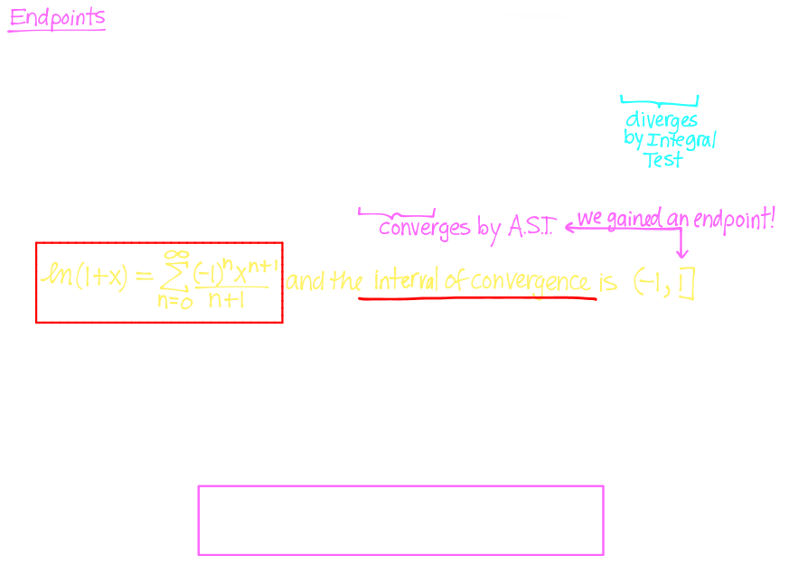
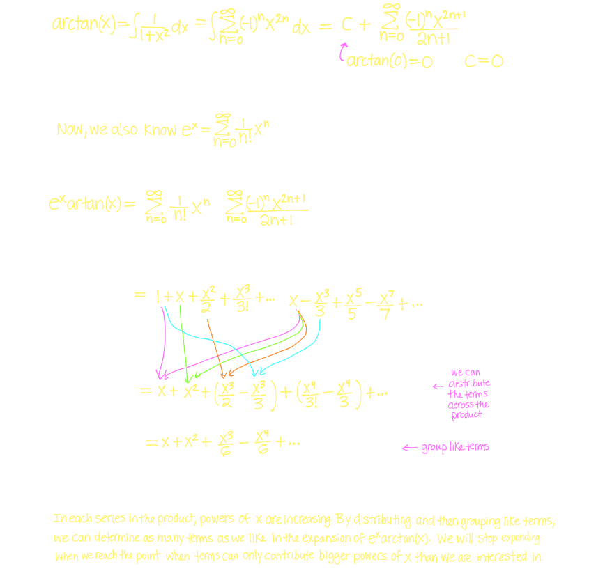
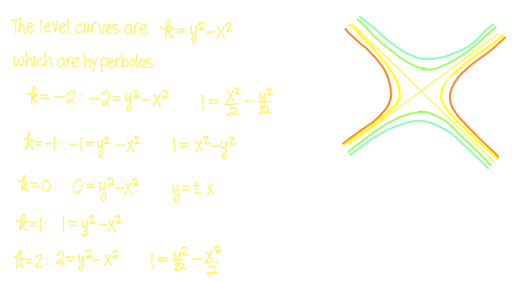

## 16. [[Representation of a Function as Power Series]] #[[MAT 1322]]
	- ### Examples of Representations of Functions as Power Series
	  id:: 6600ceea-a0ce-4659-b9a3-15dcf46ea709
		- #### Examples
		  background-color:: blue
			- $$f(x) = \frac{1}{1-x}$$
				- 
			- $$g(x) = \frac{1}{1+x}$$
				- 
			- $$h(x) = \frac{1}{x+3}$$
				- 
			- $$p(x) = \frac{x^4}{x+3}$$
				- 
	- ### Differentiation and Integration of Power Series
	  id:: 6600ceea-c6f9-4538-9202-76f45c4e58cb
		- ^^**Theorem 16.5**^^
			- If the power series $\sum_{n=0}^\infin c_n (x-a)^n$ has radius of convergence $R > 0$ and we can represent the function $f(x)$ as
				- $$f(x) = \sum_{n=0}^\infin c_n (x-a)^n = c_0 + c_1(x-a) + c_2(x-a)^2 + ...$$ then
					- $$f'(x) = c_1 + 2c_2(x-a) + ... = \sum_{n=1}^\infin c_n (x-a)^{n-1}$$
				- and
					- $$\int f(x) \ dx = c + c_0(x-a) + c_1\frac{(x-a)^2}{2}+ c_2\frac{(x-a)^3}{3} = c+ \sum_{n=0}^\infin \frac{c_n (x-a)^{n+1}}{n+1}$$
				- and
					- The radii of convergence of the power series $f'(x)$ and $\int f(x)$ are both still $R$
				- but
					- The intervals of convergence may differ
			- #### Examples:
			  background-color:: blue
				- $$\ln(x+1)$$
					-  
				- $$\arctan(x)$$
					-  
				- $$\int \frac{1}{1+x^4} \ dx$$
					-  
				- $$q(x) = \frac{1}{(1+x)^2}$$
					- Determine the power series representation for $q(x)$ and its radius and interval of convergence
					- What are the coefficients of $x^4$ and $x^{55}$ in the power series
						-  
			- $$\ln(2-6x)$$
				- Determine the power series representation and its radius and interval of convergence
					-  
- ## 17. [[Taylor & Maclaurin Series]] #[[MAT 1322]]
	- ### Taylor and Maclaurin Series: A New Way to Consider Power Series
	  id:: 6600ceea-bd4a-49d6-8019-3f017184ac42
		- Suppose we have a power series representation for $f(x)$ on its interval of convergence centred at $a$:
			- $$f(x) = \sum_{n=0}^\infin c_n (x-a)^n = c_0 + c_1(x-a) + c_2(x-a)^2 +... $$
			- 
		- This the coefficients of the power series representation are determined by the function $f(x)$ and centre $a$, is
			- $$f(x) = \sum_{n=0}^\infin \frac{f^n(a)}{n!} (x-a)^n$$
			- Called a **Taylor series of** $f$ **centred at** $a$
		- When the centre is $a = 0$ it's called that **Maclaurin series of** $f$
			- $$f(x) = \sum_{n=0}^\infin \frac{f^{(n)(a)}}{n!} (x-a)^n$$
		- Examples:
		  background-color:: blue
			- What is the Maclaurin Series for $f(x) = \frac{1}{1-x}$?
				- {:height 430, :width 657}
			- Determine the Maclaurin Series for $f(x) = e^x$ (assume it exists)
				- 
			- Use a Maclaurin Series to estimate $\int_0^1 e^{-x^2}  \ dx$
				- 
			- Determine the Maclaurin Series for $f(x) = \sin(x)$
				- 
			- Differentiate to get Maclaurin series for $f(x) = \cos(x)$
				- 
			- How would we estimate $\int_0^1 \cos(x^2) \ dx$ to within an error of $10^{-7}$
				- 
	- ### The Binomial Series
	  id:: 6600ceea-31d9-4c6c-9655-4442fc5fc466
		- Working with $f(x) = (1+x)^k$,
			- 
			- The Maclaurin series is:
				- $$(1+x)^k = \sum_{n=0}^\infin \frac{k(k-1)...(k-n+1)}{n!} x^n$$
				- Known as binomial series
			- For $k \in \mathbb{R}$ and $n \in \mathbb{Z}$ such that $n \ge 3$ we denote by $\begin{pmatrix}k \\ n\end{pmatrix}$ the ^^binomial coefficient^^
			- The **Binomial Series** can be written as $(1+x)^k = \sum_{n=0}^\infin \begin{pmatrix} k \\n \end{pmatrix} x^n$
		- Example:
		  background-color:: blue
			- Find the Maclaurin series for $\sqrt{1+x}$
				- 
			- Find the Maclaurin series for $\frac{1}{(2+x)}$
				- 
			- Find the Maclaurin series for $e^x \arctan(x)$
				- 
	- ### List of Series You need to know
	  id:: 6600ceea-0c02-4c29-a466-c71cbf724413
		- # $\frac{1}{1-x}$
			- $$\sum_{n=0}^\infin x^n = 1 + x + x^2 + x^3 \ (R=1)$$
		- ## $e^x$
			- $$\sum_{n=0}^\infin \frac{x^n}{n!} = 1 + x + \frac{x^2}{2!} + \frac{x^3}{3!} + \frac{x^4}{4!} + ... (R = \infin)$$
		- ## $\sin(x)$
			- $$\sum_{n=0}^\infin \frac{(-1)^n x^{2n+1}}{(2n+1)!} = x - \frac{x^3}{3!} + \frac{x^5}{5!} - \frac{x^7}{7!} + ... (R = \infin)$$
		- ## $\cos(x)$
			- $$\sum_{n=0}^\infin \frac{(-1)^n x^{2n}}{(2n)!} = 1 - \frac{x^2}{2!} + \frac{x^4}{4!} -\frac{x^6}{6!}+... (R = \infin)$$
		- ## $\arctan(x)$
			- $$\sum_{n=0}^\infin \frac{(-1)^n x^{2n+1}}{(2n)!} = x - \frac{x^3}{3!} + \frac{x^5}{5!} - \frac{x^7}{7!} + ...(R=1)$$
		- ## $\ln(x+1)$
			- $$\sum_{n=0}^\infin \frac{(-1)^n x^{n+1}}{n+1} = x - \frac{x^2}{2} + \frac{x^3}{3} - \frac{x^4}{4}+ ... (R=1)$$
		- ## $(1+x)^k$
			- $$\sum_{n=0}^\infin  \begin{pmatrix} k \\n \end{pmatrix} x^n = 1 + kx + \frac{k(k-1)}{2!}x^2 + \frac{k(k-1)(k-2)}{3!}x^3 + ... (R=1)$$
- ## 18. [[Functions of Several Variables]] #[[MAT 1322]]
	- ### Functions
	  id:: 6600ceea-23f2-49ce-8265-5e38996157ed
		- A **function of two variables** is  rule that assigns each to each ordered pair of real numbers $(x,y)$ in a set $D$ a unique real number denoted by $f(x,y)$
			- 
		- The set $D$ is called the domain and it consists of all ordered pairs $(x,y) \in \mathbb{R}^2$ such that $f(x,y)$ is defined as a real number
		- Examples:
		  background-color:: blue
			- What is the domain of $f(x,y) = \frac{\sqrt{x+y+1}}{x-1}$?
				- Sketch the domain of $f$ in the $x$-$y$-plane
					- 
			- What is the domain of $g(x,y) = \ln(1-4x^2 - y^2)$
				- Sketch the domain of $g$ in the $x$-$y$-plane
					- 
	- ### Surfaces in 3-Space
	  id:: 6600ceea-d775-46f4-bc7a-b9bf69241d81
		- Suppose we have an equation in 3 variables, $x,y,z$
			- Its ^^graph^^ consists of all points $(x,y,z)$ in $\mathbb{R}^3$ satisfying the equation
		- If $z = f(x,y)$ is a function of 2 variables, then the ^^graph^^ of $f$ is the set of all points $(x,y,z)$ in $\mathbb{R}^3$ such that $z = f(x,y)$ and $(x,y)$ is the domain of $f$
		- To plot graphs involving 3 variables, one needs to understand Cartesian 3-space
			- Points are specified by ordered triplets $(x,y,z)$
			- Take the $x$- and $y$-axes and add a third perpendicular axis called $z$
			- The graph of $z = f(x,y)$ is a **surface** in 3-space
			- 
			- Easiest way to draw graphs of these surfaces is to draw **traces** or cross-sections in which one variable is fixed and other varies
			- A **trace** is the curve of intersection of the surface with planes parallel to the coordinate planes
		- Examples:
		  background-color:: blue
			- Sketch traces of the graph of $z = x^2 + y^2$
				- 
			- Sketch traces of the graph of $z = \sqrt{x^2 + y^2}$
				- 
				- What does the graph of $z^2 = x^2 + y^2$ look like
					- 
			- Sketch traces of the graph of $4x^2 + 9y^2 = 9$
				- 
			- Sketch traces of the graph $z = y^2 - x^2$
				- 
	- ### Level Curves
	  id:: 6600ceea-f39b-47e9-8229-b9076d712e1e
		- Another method for visualizing functions of 2 variables is by drawing a contour diagram on which points of constant elevation are joined to form **contour curves** or **level curves**
		- The **level curves** of a function $f$ of two variables are the curves with equations $f(x,y) = k$, where $k$ is a constant (in the range $f$)
		- The third varaible is variable is represented by $(x,y)$ pints that have the same $z$ values in $z = f(x,y)$ values
		- **Some general rules:**
			- Contour lines representing different levels cannot cross
			- Closer the contour lines are, the steeper the surface is
			- The level curves $f(x,y) = k$ are the **traces** of the graph of $f$ in the $z=k$ plane projected down to the $xy$-plane
		- Examples:
			- Draw the contour diagram for $f(x,y) = 6 - 3x -2y$ using level curves for the values $k = -6,0,6,12$
				- 
			- Draw the contour diagram for $f(x,y) = 2x^2 + y^2$ using level curves for several values of $k$
				- 
			- Draw a contour diagram for $z = y^2 - x^2$ using level curves for several values of $k$
				- 