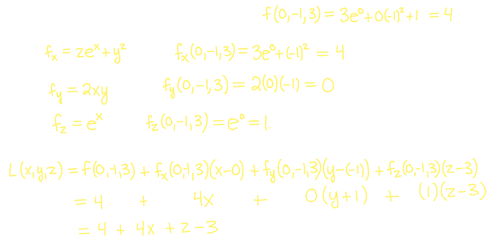

## 19. [[Partial Derivatives]] #[[MAT 1322]]
	- ### Notation for Partial Derivatives
	  id:: 660d9875-07ca-4297-9d10-030b698853e1
		- Say $z = f(x,y)$, then:
			- $$f_x(x,y) = z_x (x,y) = \frac{\partial z}{\partial x} = \frac{\partial f}{\partial x} \text{ and } f_x(a,b) = z_x (a,b) =  \frac{\partial z}{\partial x} \Big|_{(a,b)} = \frac{\partial f}{\partial x}\Big|_{(a,b)}$$
			- $$f_y(x,y) = z_y (x,y) = \frac{\partial z}{\partial y} = \frac{\partial f}{\partial y} \text{ and } f_y(a,b) = z_y (a,b) =  \frac{\partial z}{\partial y} \Big|_{(a,b)} = \frac{\partial f}{\partial y}\Big|_{(a,b)}$$
		- When the the surface $z = f(x,y)$ involves a constant, we get a **trace** resulting from the the intersection of the surface $z = f(x,y)$ with plane $y=c$
		- Examples:
			- $f(x,y) = x^2 + y^2$
			- $f(u,v) =   u^3 - v^2$
			- Compute $f_x (2,1)$ and $f_y (2,1)$ for the function $f(x,y) = x^2 + x^2y^3 - 2y^2$
			- What about the function of 3 or more variable?
			- $f(x,y,z) = 3xyz = x^2y^4 - 17yz^3$
			- $f(x,y,z) = ye^{xy}\ln(2x+3z)$
			- $f(x,y,z) = xyz \ln \Big( \frac{xy}{z} \Big)$
	- ### Higher-Order Parital Derivatives
	  id:: 660d9875-87de-42ab-a7bb-15fc5e0a4234
		- When looking at functions of a single variable, say $y = f(x)$, the derivative is defined the derivative $\frac{dy}{dx} = y'(x) = f'(x) = \frac{df}{dx}$ and we could defie the second derivative
			- $y'' = \frac{d}{dx} [\frac{dy}{dx}] = \frac{d^2y}{dx^2}$
		- We can also define **second partial derivatives**:
			-
		- Example:
		  background-color:: blue
			- $f(x,y) = x^2y + 3 \ln(xy) - \cos(2x+5y)$
				- 
		- ^^**Clairaut's Theorem**^^
			- Suppose $f$ is defined on a disk $D$ that contains the point $(a,b)$
			- If the mixed partials $f_{xy}$ and $f_{yx}$ are both continuous on $D$, then $f_{xy}(a,b) = f_{yx}(a,b)$
			- We can also define **higher-order parital derivatives**:
				- 
			- Example:
			  background-color:: blue
				- $f(x,y) = x^2 y^2 +xy^3$
					- 
- ## 20. [[Tangent Planes]]
	- ### Tangent Planes & Linearizations
	  id:: 660d9875-7871-437e-bb40-18f828b4699f
		- $\frac{\partial f}{\partial x}$ and $\frac{\partial f}{\partial x}$ give the slops in $x$ and $y$ directions, and the equation for a plane using those slopes has:
			- **The tangent plane** to the surface $z = f(x,y)$ at the point $(a,b)$ is
				- $$z = f(a,b) + f_x(a,b) (x-a) + f_y(a,b) (y-b)$$
			- Example:
			  background-color:: blue
				- Find the tangent plane to the surface $z = \frac{1}{2}x^2 + y^3$ at the point $(1,1)$
					- 
		- Just as tangent lines are used to approximate $y=f(x)$ near $x=a$, same can be done for $z = f(x,y)$ near $(a,b)$
			- The **linearization** of $f(x,y)$ near $(a,b)$ is
				- $$L(x,y) = f(a,b) + f_x(a,b)(x-a) + f_y(a,b)(y-b)$$
				- The ^^tangent plane approximation^^ of $z = f(x,y)$ near $(a,b)$ is $f(x,y) \approx L(x,y)$
			- Example:
			  background-color:: blue
				- Compare the tangent line approximation of $f(x,y) = \frac{1}{2}x^2 + y^3$ near $(1,1)$ at the point $(1.05,0.95)$
					- 
				- Find the tangent plane to the surface $z = x^2y^2 + yx - 3x$ at the point $(-1,1,3)$
					- 
	- ### Tangent Plane Approximations For Functions of 3 Variables
	  id:: 660da05f-4a98-4804-b8d3-6c693723cdfd
		- Analogous to the tangent line approximation and the tangent plane approximation, in three variables, the **linear approximation** of $u = f(x,y,z)$ near $(a,b,c)$ is given by
			- $$f(x,y,z) \approx f(a,b,c) + f_x(a,b,c)(x-a) + f_y(a,b,c)(y-b) + f_z(a,b,c)(z-c)$$
		- Example:
		  background-color:: blue
			- Find the linear approximation of $f(x,y,z) = ze^x + xy^2 +1$ at the point $(0,-1,3)$
				- 
		-
	-