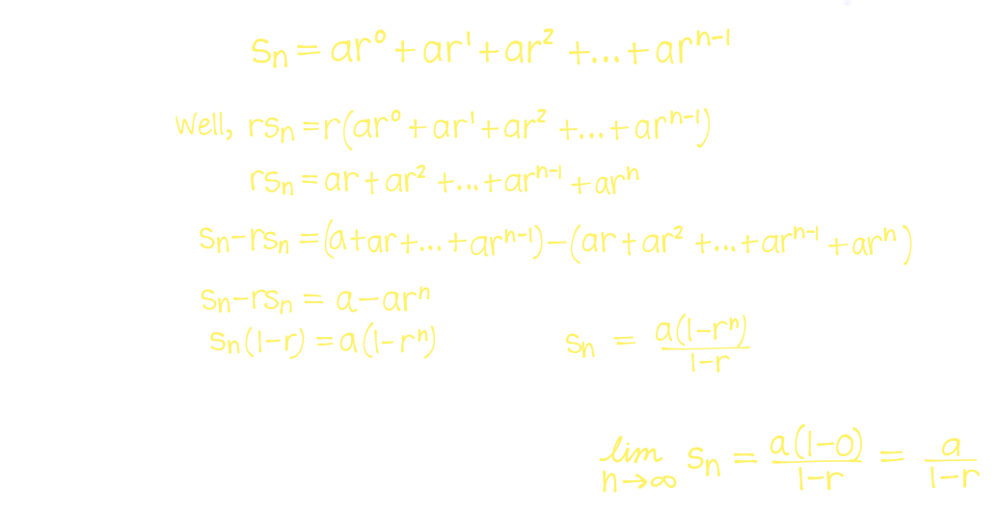
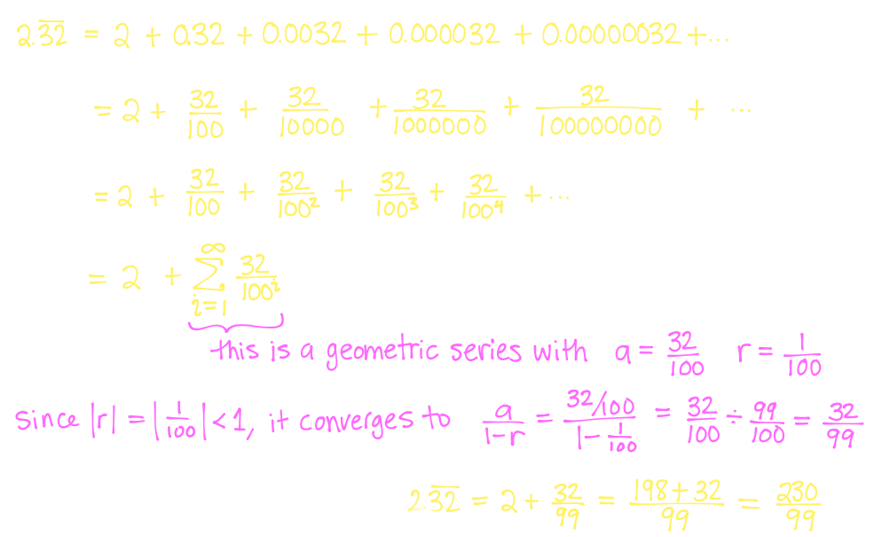
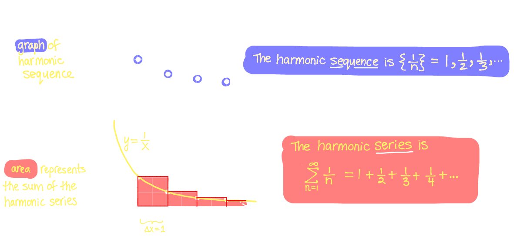
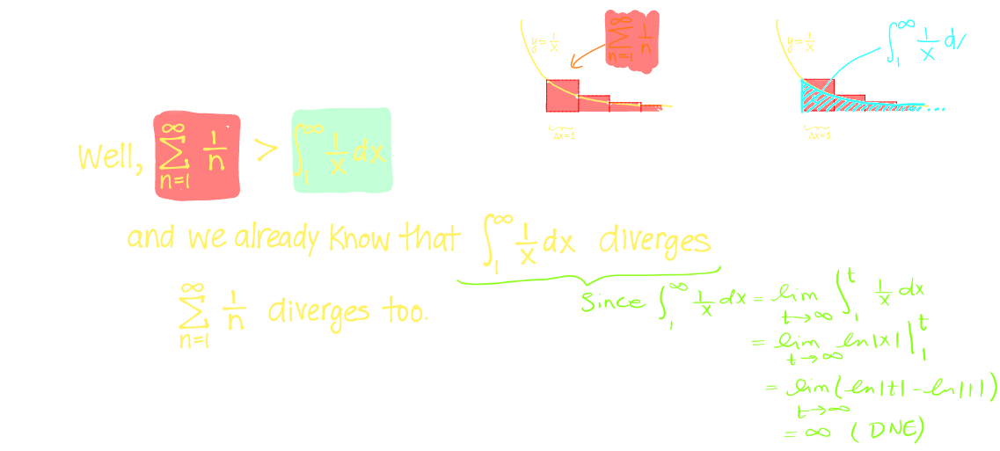
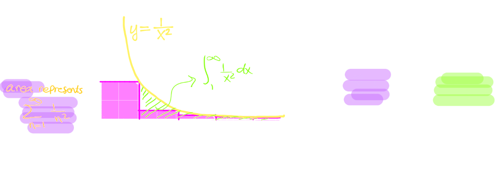
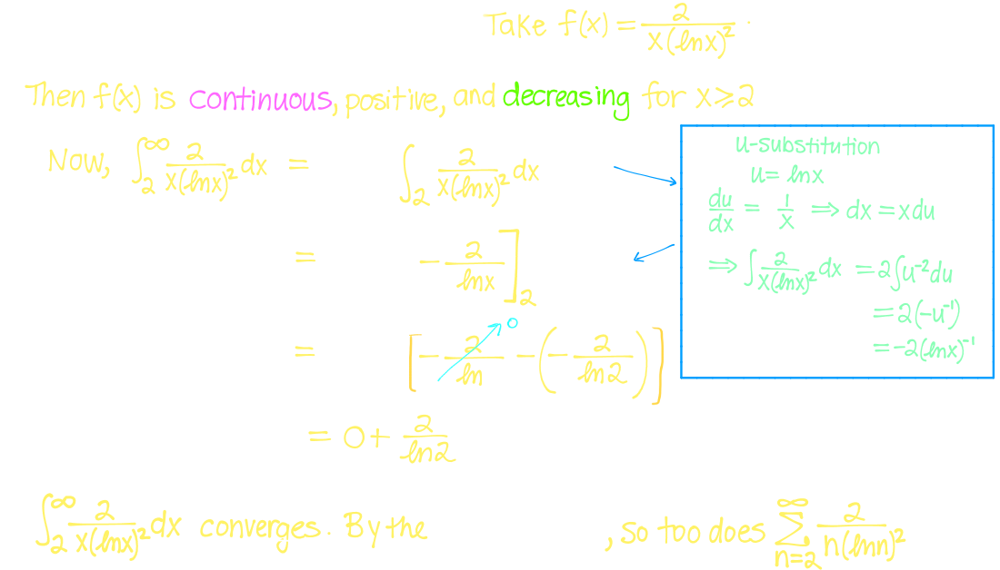
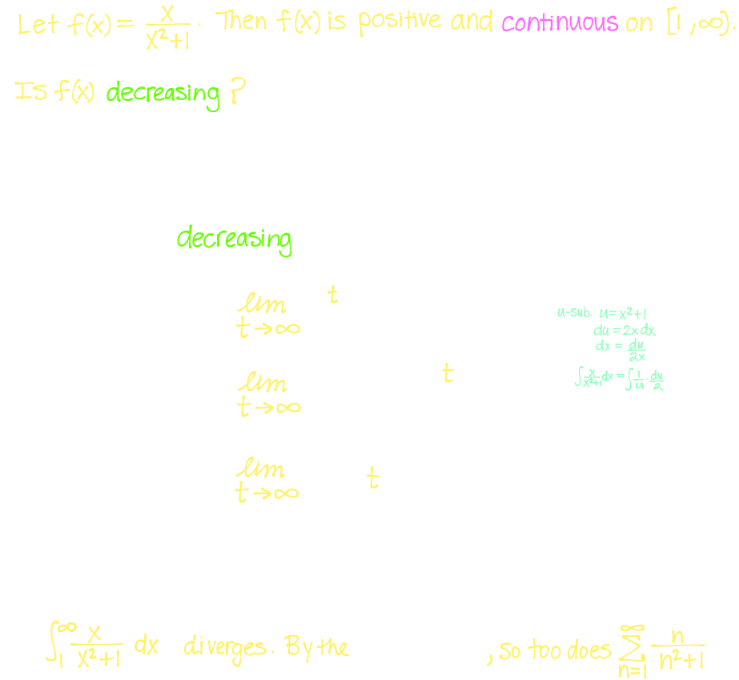
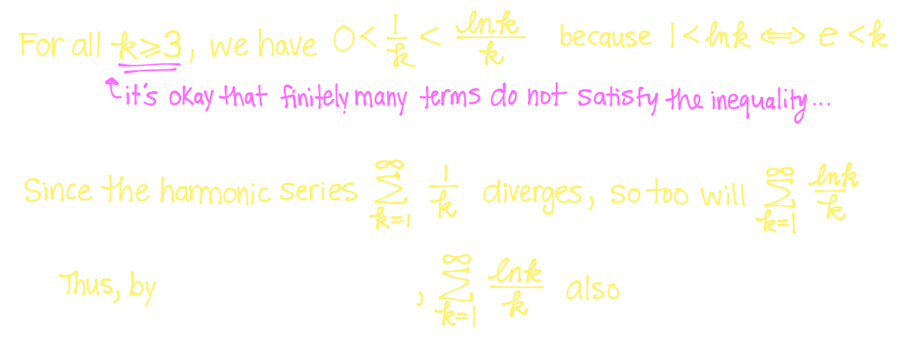

## 10. [[Series]] #[[MAT 1322]]
	- ### Infinite Series
	  id:: 65ca9cd7-5d18-4f78-8efd-2e67ff362d95
		- Given a sequence $\{a_n\}$, what is a sum?
			- $$\sum_{n = 1}^\infin a_n = a_1 + a_2 + a_3 + ... + a_i = ?$$
		- How can one find the sum of infinite number of numbers
			- #### Finite Sums:
				- 1st Partial Sum $s_1 = a_1$ ^^(sum of first term)^^
				- 2nd Partial Sum $s_2 = a_1 + a_2$ ^^(sum of first 2 terms)^^
				- 3rd Partial Sum $s_3 = a_1 + a_2 + a_3$ ^^(sum of first 3 terms)^^
				- $...$
				- $n$th Partial Sum $s_n = a_1 + a_2 + a_3 + ... + a_n = \sum_{k=1}^n a_k$ ^^(sum of first^^ $n$ ^^term)^^
			- The terms $S_n$ are called **partial sums**
		- The partial sums for a new sequence $\{S_n\}$
			- What does $\lim_{n\rightarrow \infin} S_n$
				- Well, $\lim_{n \rightarrow \infin} S_n = \lim_{n \rightarrow \infin} \sum_{k=1}^n a_k = \sum_{k = 1}^\infin a_k$
			- Thus the convergence of the infinite series is tied to the convergence of its sequence of partial sums
	- ### Convergence/Divergence of Infinite Sums
	  id:: 65ca9ec4-075e-4fce-9089-021693e6e52a
		- Given an infinite series $\sum_{k = 1}^\infin a_k$ let $S_n$ denote its $n$th partial sum
		- $$S_n = \sum_{k=1}^n a_k = a_1 + a_2 + ... + a_n$$ (sum of first $n$ terms)
		- If the sequence $\{S_n\}$ of partial sums converges to a finite number $L$, then the series $\sum_{n=1}^\infin a_n$ is said to **converge** to $L$, written $\sum_{n=1}^\infin a_n = L$
		- We call $L$ the **sum** of the series
		- IF the sequence $\{S_n\}$ of partial sums diverges, then the series $\sum_{n=1}^\infin a_n$ **diverges**
		- Example:
			- Does the infinite series $$\sum_{k=1}^\infin \frac{1}{k^2 + 3k +2}$$
				- {:height 413, :width 494}
			- Does the infinite series $\sum_{k=0}^\infin 3^k$ converge or diverge?
				- 
			- Does the infinite series $\sum_{k=0}^\infin (-1)^k$ converge or diverge?
				- 
	- ### Geometric Series
	  id:: 65caa09b-f59b-4ce9-8abc-30663bafbe97
		- Let $a, r \in \mathbb{R}, a \ne 0$
		- A **geometric series** with **first term** $a$ and **common ratio** $r$ is a series of the form:
			- $$a + ar + ar^2 + ar^3 + ...$$
		- Example:
		  background-color:: blue
			- $$\sum_{n=1}^\infin \frac{2}{3^{n-1}}$$
				- 
		- ^^Note on indices:^^ the index variable ($n,k,j$ or whatever) is a way for us to refer to the terms of the series. There are many ways to write the same series
			- Could be written as
				- $$\sum_{n = 0}^\infin ar^n \text{or} \sum_{j = 5}^\infin ar^{j-5}  $$
		- #### Partial Sums of a Geometric Series
			- Look at the $n$th partial sum of  a geometric series $\sum_{n=1}^\infin ar^{n-1}$
				- $$S_n = ar^0 + ar^1 + ar^2 + ... + ar^{n-1}$$
			- What is $S_n$?
				- 
				- 
		- #### Geometric Series Theorem
			- If $|r| < 1$, then the geometric series $\sum_{n=1}^\infin ar^{n-1}$ is convergent and it converges to $\frac{a}{1-r}$, that is, it converges to
				- $$\frac{\text{1st term}}{\text{1-common ratio}}$$
			- If $|r| \ge 1$, then the geometric series $\sum_{n=1}^\infin ar^{n-1}$ is divergent
		- Example:
		  background-color:: blue
			- If the series $\sum_{n=1}^\infin 2^{2i} 3^{1-i}$ convergent of divergent? If convergent, what does it converge to?
				- 
			- Write $2.\overline{32}$ as a fraction of integers by recognizing its expansion as the sum of a convergent geometric series
				- 
	- ### Test For Divergence and Other Useful Results
	  id:: 65caa432-9df2-45ab-a621-077784b77e20
		- **Sums & Constant Multiples of Convergent Series**
		  logseq.order-list-type:: number
			- If $\sum_{n=1}^\infin a_n = L$ (converges to $L$) and $\sum_{n=1}^\infin b_n = M$ (converges to $M$), thenb
				- $$\sum_{n=1}^\infin (a_n + a_b) = L + M$$
				- Moreover, for any constant $\alpha \in \mathbb{R}$,
					- $$\sum_{n=1}^\infin \alpha a_n = \alpha \sum_{n=1}^\infin a_n = \alpha L$$
		- **Limit of Terms of a Convergent Series must Approach Zero**
		  logseq.order-list-type:: number
			- If the series $\sum_{n=1}^\infin a_n$ is convergent, then $\lim_{n \rightarrow \infin} a_n = 0$
		- **Test for Divergence**
		  logseq.order-list-type:: number
			- If $\lim_{n \rightarrow \infin} a_n \ne$ then the series $\sum_{n=1}^\infin a_n$ is ^^divergent^^
- ## 11. [[The Integral & The Comparison Test]] #[[MAT 1322]]
	- ### The Integral Test
	  id:: 65cd3f2c-5bbc-417c-810b-b1c38777bb08
		- As some of you have mentioned, infinite series seem related to improper integrals
		- ^^**Note:**^^ $\sum_{n=1}^\infin \ne \int_1^\infin f(x) \ dx$ but they are related...
			- 
		- The series $\sum_{n=1}^\infin \frac{1}{n}$ resembles an improper Riemann sum approximation of $\int_1^\infin \frac{1}{x} \ dx$ using infinitely many rectangles of height $f(n) = \frac{1}{n}$ width $\Delta x = 1$ and left endpoints
		- How does $\sum_{n=1}^\infin \frac{1}{n}$ compare with $\int_1^\infin \frac{1}{x} \ dx$
			- 
		- Example:
		  background-color:: blue
			- Verify that
			- $$\sum_{n=1}^\infin \frac{1}{n^2} < 1 + \int_1^\infin \frac{1}{x^2} \ dx$$
				- 
			- We can also show that
				- $$\sum_{n=1}^\infin \frac{1}{n} < 1 + \int_1^\infin \frac{1}{x^2} \ dx$$ by using right endpoints
			- Why is this comparision unhelpful?
				- 
		- **The Integral Test**
			- Suppose $f$ is a continuous, positive, decreasing function on $[1, \infin)$, and let $a_n = f(n)$
				- Then, $\sum_{n=1}^\infin a_n$ is convergent if and only if $\int_1^\infin f(x) \ dx$ is convergent
			- Thus,
				- If $\int_1^\infin f(x) \ dx$ is convergent, then $\sum_{n=1}^\infin a_n$ is convergent
				- If $\int_1^\infin f(x) \ dx$ is divergent, then $\sum_{n=1}^\infin a_n$ is divergent
		- #### Consequences for $p$ series
			- The $p$ series $\sum_{n=1}^\infin \frac{1}{n^p} \ dx$ is
				- Convergent if $p > 1$
				- Divergent if $p \le 1$
		- Example:
			- Does
				- $$\sum_{n=2}^\infin \frac{2}{n (\ln n)^2}$$ converge?
				- 
			- Does
				- $$\sum_{n=1}^\infin \frac{n}{n^2 +1}$$ converge?
				- 
				- 
	- ### Comparison Test
	  id:: 65cd43e5-2f39-4e36-8a44-a010e57032a2
		- Suppose $\sum a_n$ and $\sum b_n$ are series with ^^positive^^ terms
			- If $\sum b_n$ is convergent and $a_n \le b_n$ for all $n$, then $\sum a_n$ is convergent
			- If $\sum b_n$ is divergent and $a_n \ge b_n$ for all $n$, then $\sum a_n$ is divergent
		- Example:
			- Does
				- $$\sum_{n=1}^\infin \frac{3}{n^2+7n +1}$$ converge?
				- 
			- Does
				- $$\sum_{k=1}^\infin \frac{\ln k}{k}$$ converge?
				- 
				-