# #[[MAT 1348]]
- ## [[Proposition Logic]]
	- A **proposition** is a declarative sentence that is either true or false, but not both
	- ### Logical Operatiors
		- **Negation**, $\neg$: Considered not $p$
		- **Conjunction**, $\wedge$: Considered $p$ and $q$
		- **Disjunction**, $\vee$: Considered $p$ or $q$
		- **Exclusive Or**, $\oplus$: Considered $p$ or $q$, but not both
		- **Implication**, $\rightarrow$: Considered If $p$, then $q$
		- **Biconditional Statement**, $\leftrightarrow$: Considered $p$ if and only if $q$
	- A **tautology** is a compound proposition that is always true
	- A **contradiction** is a compound proposition that is always false
	- A **contingency** is a compound proposition that neither a tautology or contradiction
	- Two propositions are **logically equivalent** if the biconditional property $p \rightarrow q$ is a tautology, written $P \equiv q$
	- ### Contrapostive and Converse
		- Assume implication $P \rightarrow Q$
			- Implication $\neg Q \rightarrow \neg P$ is **contrapositive** of $P \rightarrow Q$
			- Implication $Q \rightarrow P$ is the **converse** of $P \rightarrow Q$
	- A set of compound proposition is **consistent** if there exists an assignment of truth values that makes all the compound propositions **true**
	- ### Disjunctive Normal Form
		- A **conjunctive clause** is made of only $\wedge$ operators
			- A compound is in **disjunctive normal form** if it is the disjunction of conjuctive classes:
				- $Q_1 \vee Q_2 \vee ... \vee Q_n$ where each $Q_i$ is a conjuctive clause
	- ### Conjunctive Normal form
		- A **conjunctive clause** is a made of only $\wedge$ operators
			- A compound is in **conjunctive normal** if it is the conjunction of disjunctive classes
				- $Q_1 \wedge Q_2 \wedge ... \wedge Q_n$ where each $Q_i$ is a disjunctive clause
	- ### Truth Tree Branching Rules
		- {:height 207, :width 719}
		- A truth tree is **verified** if
			- The proposition is a literal (a variable or its negation) **or** the branching rule for the proposition has been applied to all paths starting at this proposition
		- A **leaf** of a truth tree is a proposition at the end of the path
		- A truth tree is **complete** when each path is either inactive or complete
	- ### Consistent Sets
		- A set of compound propositions is **consistent** if there is an an assignment of truth values that makes all compound propositions true
		- $\{P_1, ..., P_n\}$ is **inconsistent** if the conjuction $P_1 \wedge ... \wedge P_n$ is a contradiction
	- ### Arguments
		- Arguments are propositions in the form, $$(P_1 \wedge ... \wedge P_k) \rightarrow C$$ written vertically:
			- $$P_1 \\ ... \\ P_k \\ \rule{2cm}{0.4pt} \\ \therefore C$$
		- An argument $(P_1 \wedge ... \wedge P_k) \rightarrow C$ is **valid** if the conclusion $C$ is true whenever all the hypothesis $P_1,...,P_k$ are true
		- The argument $(P_1 \wedge ... \wedge P_k) \rightarrow C$ is valid ^^if and only if^^ $(P_1 \wedge ... \wedge P_k) \rightarrow C$  is a tautology
		- It is a tautology if and only if $\neg(P_1 \wedge ... \wedge P_k) \rightarrow C$  is a contradiction
		- We can use the truth tree with the following root to determine if an argument is valid
			- $$P_1 \\ ... \\ P_k \\ \neg C$$
		- If all paths are inactive, $(P_1 \wedge ... \wedge P_k) \rightarrow C$ is valid
	- ### Laws of Logic
		- $P \rightarrow Q \equiv \neg \vee Q$ (Implication law)
		  logseq.order-list-type:: number
		- $P \leftrightarrow Q \equiv (P \wedge Q) \vee (\neg P \wedge \neg Q)$ (Biconditional Law)
		  logseq.order-list-type:: number
		- $P \leftrightarrow Q \equiv (P \rightarrow Q) \wedge ( Q \rightarrow P)$ (Biconditional Law)
		  logseq.order-list-type:: number
		- $P \vee \neg P \equiv V$ (Negation Law)
		  logseq.order-list-type:: number
		- $P \vee \neg P \equiv F$ (Negation Law)
		  logseq.order-list-type:: number
		- $P \vee F \equiv P$ (Identity Law)
		  logseq.order-list-type:: number
		- $P \wedge V \equiv P$ (Identity Law)
		  logseq.order-list-type:: number
		- $P \vee V \equiv V$ (Dominion Law)
		  logseq.order-list-type:: number
		- $P \wedge F \equiv F$ (Dominion Law)
		  logseq.order-list-type:: number
		- $P \vee P \equiv P$ (Idempotent Law)
		  logseq.order-list-type:: number
		- $P \wedge P \equiv P$ (Idempotent Law)
		  logseq.order-list-type:: number
		- $\neg \neg P \equiv P$ (Double Negation Law)
		  logseq.order-list-type:: number
		- $P \vee Q \equiv Q \vee P$ (Commutativity)
		  logseq.order-list-type:: number
		- $P \wedge Q \equiv Q \wedge P$ (Commutativity)
		  logseq.order-list-type:: number
		- $(P \wedge Q) \vee R \equiv P \vee (Q \wedge R)$ (Assoociativity)
		  logseq.order-list-type:: number
		- $(P \vee Q) \wedge R \equiv P \wedge (Q \wedge R)$ (Assoociativity)
		  logseq.order-list-type:: number
		- $P \vee (Q \wedge R)  \equiv (P \vee Q) \wedge (P \vee R)$ (Distributivity)
		  logseq.order-list-type:: number
		- $P \wedge (Q \vee R)  \equiv (P \wedge Q) \vee (P \wedge R)$ (Distributivity)
		  logseq.order-list-type:: number
		- $\neg (P \wedge Q) \equiv \neg P \vee \neg Q$ (De Morgan's Law)
		  logseq.order-list-type:: number
		- $\neg (P \vee Q) \equiv \neg P \wedge \neg Q$ (De Morgan's Law)
		  logseq.order-list-type:: number
		- $P \vee (P \wedge Q) \equiv P$ (Absorption Law)
		  logseq.order-list-type:: number
		- $P \wedge (P \vee Q) \equiv P$ (Absorption Law)
		  logseq.order-list-type:: number
- ## [[Set Theory]]
	- A **set** is a well-defined unordered collection of objects called **elements**
		- Two sets are **equal** if they contain the same elements (regardless of order or multiplicity)
	- 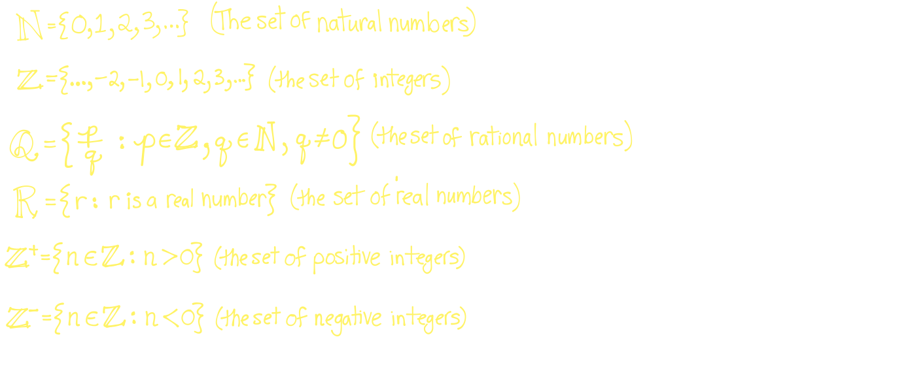
	- Empty set, $\emptyset$, is the set with no elements
	- $U$ is the universal set, which is what all elements fall under
	- $A$ is considered a **subset** of $B$, written ($A \subseteq B$) if every element of $A$ is also element of $B$
		- 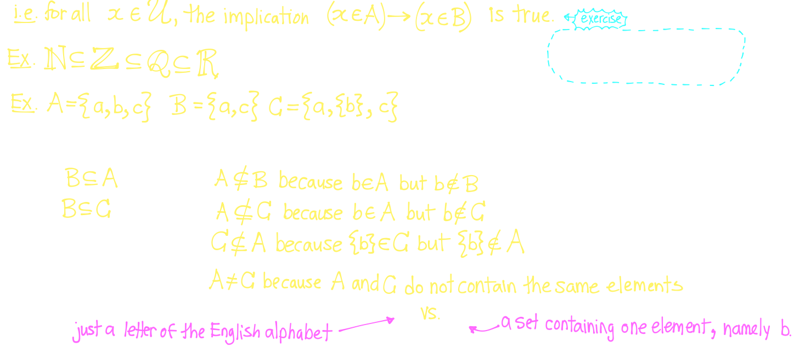{:height 304, :width 668}
	- $A$ as a **proper subset** of  $B$ ($A \subset B$) is if $A \subseteq B$ and $A \ne B$
	- **Cardinality** of a set is its size
	- The **power set** of $A$, $P(A)$ is the set of all subsets of $A$
	- The **Cartesian product**, $A \times B$ is the set of all ordered pairs $(a,b)$ where $a \in A$ and $b \in B$
		- 
		- 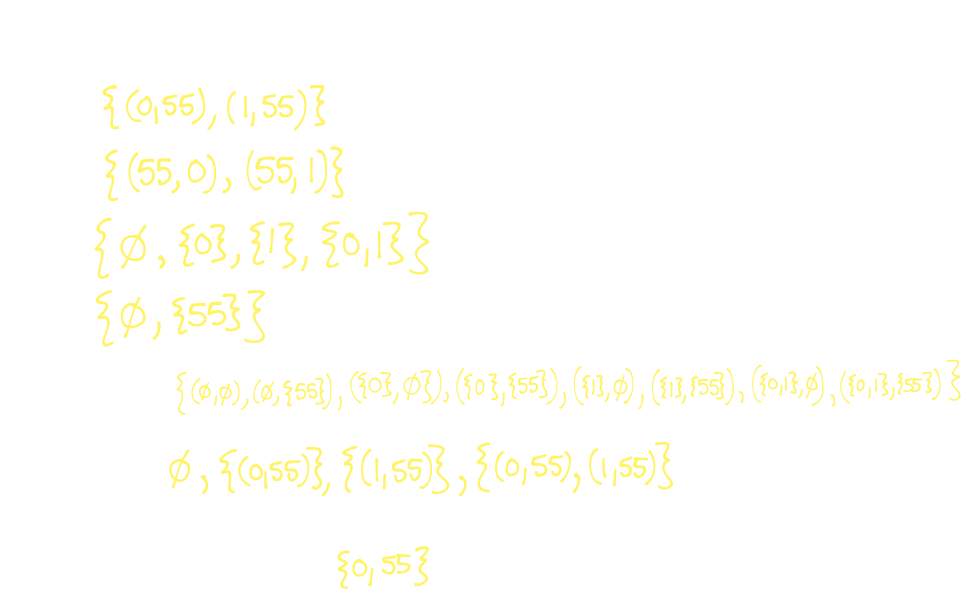
	- The **union** of sets $A$ and $B$, denoted $A\cup B$ is the set $A \cup B = \{x:(x \in A) \vee (x \in B)\}$
		- 
	- The **intersection** of sets $A$ and $B$, denoted $A \cap B$ is the set $A\cap B = \{x: (x \in A) \wedge (x \in B)\}$
		- 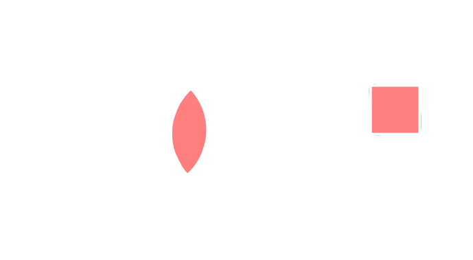
	- The **complement** of set $A$, denoted $\overline{A}$ is the set $\overline{A} = \{x: (x \in U) \wedge (x \notin A)\}$
		- 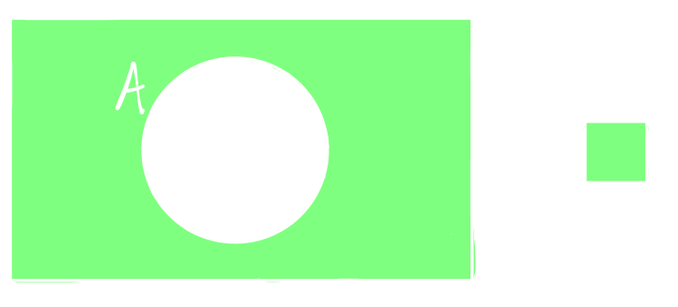
	- The **difference** of sets $A$ and $B$, denoted $A-B$, is the set $A-B = \{x: (x\in A) \wedge (x \notin B)\}$
		- 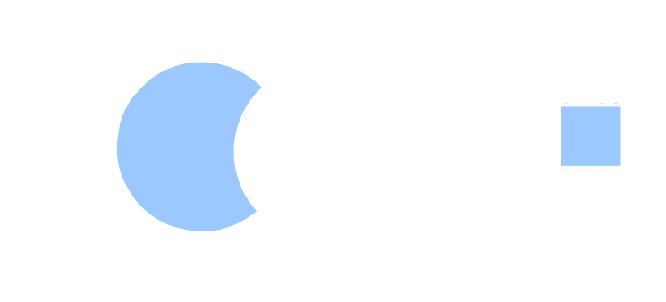
	- The **symmetric difference** of sets $A$ and $B$, denoted $A \oplus B$ is the set $A \oplus B = \{x: (x \in A) \oplus (x \in B)\}$
		- 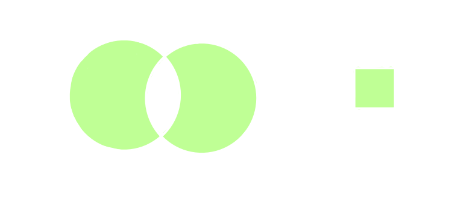
	- 
	- A **disjointed set** is if $A \cap B = \emptyset$
	- A **set identity** is an equation involving sets and set operations that is true *no matter what*
		- Ways to verify set identities
			- Verify set identity using **membership table**
			- Verify using **rigorous proof** (proof of equivalence of set equality)
				- Prove for all $x \in U,$ $(S \subseteq T)$ and $(T \subseteq S)$
				- 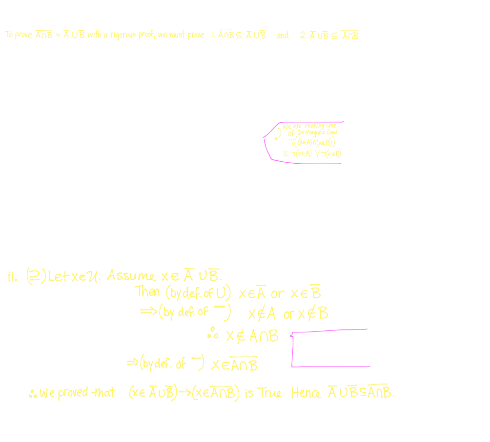{:height 573, :width 626}
- ## [[Relations]]
	- A **binary relation** from $A$ to $B$ is a relation between $A$ and $B$
	- A **binary relation** of a **set** $A$ is a relation from $A$ to itself
	- 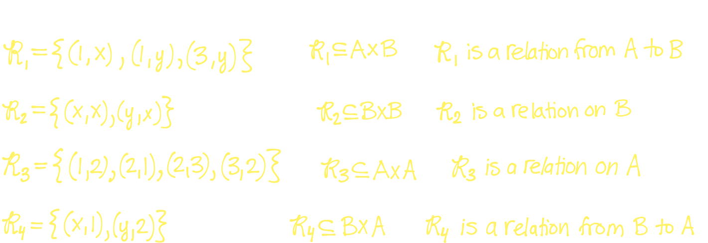
	- **Equality**
		- $=$ is a relation of $\mathbb{R}$
	- **Inequality**
		- $<$ is a relation of $\mathbb{R}$
		- $\le$ is a relation of $\mathbb{R}$
	- **Divides**
		- $|$ signifed divide
	- Logical Equivalence, $\equiv$ is a relation on the set of all compound propositions
	- A relation $R$ is **reflexive** if the implication $(x \in A) \rightarrow (x,x) \in R$ is considered true
		- ^^Element is related to itself^^
	- A relation $R$ is **symmetric** if the implication $((x,y) \in R \rightarrow (y,x) \in \mathbb{R})$ is true
		- ^^The relation works both ways^^
	- A relation is **antisymmetric** if for the implication $x,y \in A$, $((x,y) \in R \text{ and } (y,x) \in R) \rightarrow (x=y)$ is true
		- ^^The relation is not symmetrically related^^
		- The implication $(x\ne y) \rightarrow ((x,y) \notin R) \text{ and } ((y,x) \notin R)$
	- A relation is **transitive** if for all $x,y,z \in A$, the implication $((x,y) \in R \text{ and } (y,z) \in R) \rightarrow  ((x,z) \in R)$
	- We can determine the properties of $R$ based on **visual representation**
		- $R$ is **reflexive** if there is a loop at each vertex
		- $R$ is **symmetric** if and only if whenever there is an arrow from one vertex to another, there is an arrow in the opposite direction
		- $R$ is antisymmetric if there is no arrow in the opposite direction
		- $R$ is **transitive** if and only if any two-step path can be done in one step
	- 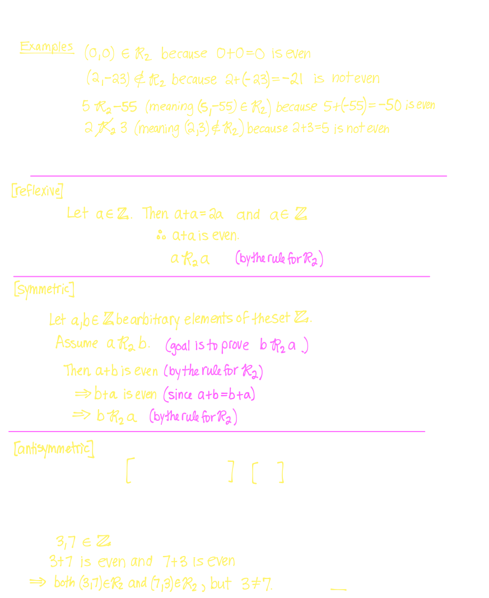
	- **Equivalence Relation:** Prove a relation is ^^reflexive^^, ^^symmetric^^ and ^^transitive^^
	- 
	- **Equivalence Class:** The set of all elements of $A$ that are in relation with $a$ ($[a]_R = \{x \in A| aRx\}$)
	- **Modulo**, $m$ is the multiplier to a function that has identical remainders, based on the function, $a = km + b$
		- Simplified to $a \equiv b$ (mod $m$)
		- 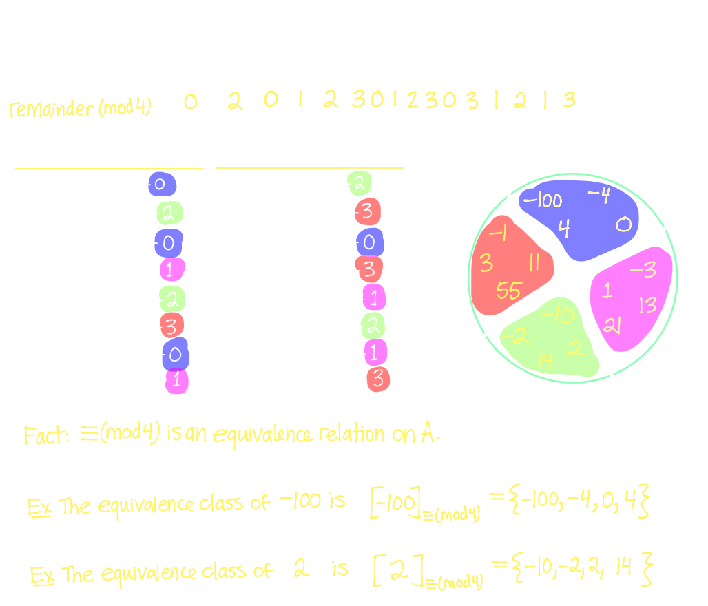
	- A **partition** of a set is a collection of subsets which are:
		- $P_i \ne \emptyset$ for all $i$ (non-empty subsets)
		- $A = P_1 \cup P_2 \cup...$ (union of all subsets)
		- $P_i \cap P_j = \emptyset$ if $i \ne j$ (no identical values inbetween subsets)
		- 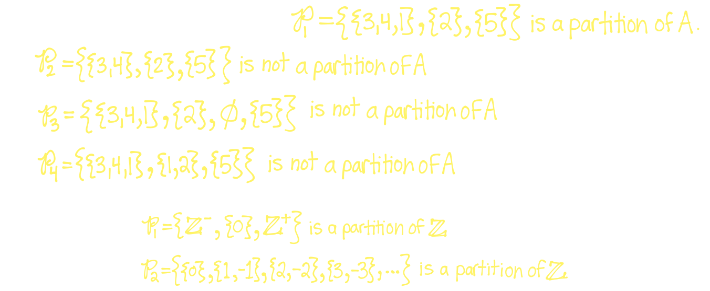
- ## [[Functions]]
	- A **function** is a an assignment of uniquely assigned element of $A$ to an element of $B$
		- $f:A \rightarrow B$ where
			- $A$ is domain and $B$ is codomain
		- **Image** of a domain is the "range" $\Rightarrow f(a) = \{f(a): a \in A\}$
	- 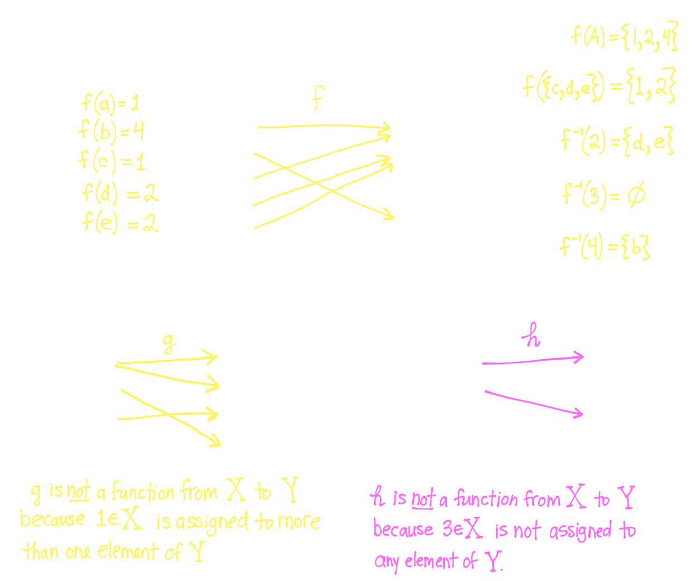
	- A function is **injective** for all $x,y \in A$ if the implication $(f(x) = f(y)) \rightarrow (x = y)$ is true
		- Each distinct element of $A$ is assigned to its own distinct unique element of $B$
		- 
	- A function is **surjective** for every element $b \in B$ there exists atleast one element $a \in A$ such that $f(a) = b$
		- Each element of the codomain B is the image of at least one element of $A$
		- 
	- A function is **bijective** if it is both ^^injective^^ and ^^surjective^^
	- **Composition of Functions**, denoted $g \circ f$, is the function $f: A \rightarrow C$, defined by $(g \circ f)(a) = g(f(a))$ for all $a \in A$
		- 
		- 
	- The **inverse** of a function exists such that $f^{-1} \circ f = id_A$ and $f \circ f^{-1} = id_B$
		- Or it can bee seen as $f^{-1}(b) = a$ if and only if $f(a) = b$
- ## [[Counting]]
	- A **permutation** is an ordered arrangement of some (or all) of the elements of a finite set
		- An ordering of $r$ elements from a set is called an $r$**-permutation**
	- ### Factorial
		- $n$ **factorial**, denoted $n!$ is defined for all integers $n \ge 0$ as $0! = 1$
			- If $n \ge 1$, then $n! = n(n-1)! = n(n-1)(n-2)...(2)(1)$
	- ### Combinations:
		- **Combinations** are the unorderd set of any numbers, where,
			- $$C(n,r) = \begin{pmatrix} n \\ r \end{pmatrix} = \frac{n!}{r!(n-r)!} =\frac{P(n,r)}{P(r,r)}$$, where $C(n,r)$ is the number of $r$ combinations of set $n$ elements
	- ### Sum Principle
		- If a task can be accomplished $n_1$ ways and another task can be done $n_2$ ways, and both tasks can't be done simulatenously, there are $n_1+n_2$ ways to accomplish either task
		- Examples:
		  background-color:: blue
			- How many binary strings of length 10 start with '000' and contain at least five 1's
				- 
			- A 9-member fellowship is formed by selecting its members from among a group of 15 people consisting of 1 wizard, 5 hobbits, 5 elves, 2 men and 2 dwarves
				- In how many ways can the fellowship be formed if it must contain at least 2 hobbits **or** at least 2 men?
					- 
	- ### Inclusion-Exclusion Principle
		- Let $A$ and $B$ be sets: Then,
			- $|A \cup B| = |A| + |B| - |A \cap B|$ and $|\overline{A \cup B}| = |U| - |A \cup B| = |U| - |A| -|B| + |A \cap B|$
		- Let $A$, $B$ and $C$ be sets
			- $|A \cup B \cup C| = |A| + |B| +|C| - |A \cap B| - |A \cap C| - |B \cap C| + |A \cap B \cap C|$
		- Examples:
		  background-color:: blue
			- Let $A = \{1,2,3,4,5,6,7\}$ and let $B = \{5,6,7,8,9,10\}$
				- 
			- How many 5-letter "words" (strings of length 5 consisting of lowercase letters of the English alphabet) start with the letter **a** or end with the letters **zz**
				- 
			- How many 5-letter "words" do not start with the letter **a** nor end with the letters **zz**?
				- 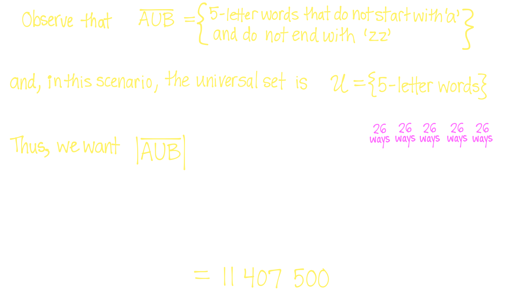
			- A photographer is taking group photos of 6 inhabitants of The Island of K&K namely A,B,C,D,E and F
				- In how many different ways can the photographer arrange 5 out of 6 of these inhabitants in a line so that
					- A and B are both in the photo **OR** B,C and E are all in the photo?
						- 
						  id:: 3d6b2257-df8d-4d33-bd94-9bd1888bf016
- ## [[Induction]]
	- Let $P(n)$ be a proposition involving the positive integers $n$. If
		- $P(n_0)$ is true (^^Base Case^^)
		  logseq.order-list-type:: number
		- $P(n) \rightarrow P(n+1)$ is true for all n $\ge n_0$ (^^Inductive Hypothesis^^)
		  logseq.order-list-type:: number
	- then, $P(n)$ is true for all $n \ge n_0$
- ## [[Binomial Theorem]]
	- The **Binomial Coefficent**$\begin{pmatrix} n \\ r \end{pmatrix}$ represents the number of subsets of size $r$ in a set of size $n$
	- ### Pascal's Triangle:
		- Let $n \ge k + 1$ and $k \ge 0$ be integers, then
			- $$\begin{pmatrix} n \\ k \end{pmatrix} + \begin{pmatrix} n \\ k+1 \end{pmatrix} = \begin{pmatrix} n+1 \\ k+1 \end{pmatrix} $$
			- 
		- For all integer $n \ge 0$
			- $$\sum_{i=0}^n \begin{pmatrix} n \\ i \end{pmatrix} = \begin{pmatrix} n \\ 0 \end{pmatrix}  + \begin{pmatrix} n \\ 1 \end{pmatrix} + ... + \begin{pmatrix} n \\ n \end{pmatrix} = 2^n$$
	- ### Binomial Theorem
		- Let $x$ and $y$ be variables, and let $n \ge 0$ be an integer, then
			- $$(x+y)^n = \sum_{i=0}^n \begin{pmatrix} n \\ i \end{pmatrix} x^{n-i}y^i = \begin{pmatrix} n \\ 0 \end{pmatrix} x^n y^0 + \begin{pmatrix} n \\ 1 \end{pmatrix} x^{n-1}y^1 + \begin{pmatrix} n \\ 2 \end{pmatrix} x^{n-2}y^2 + ... + \begin{pmatrix} n \\ n \end{pmatrix} x^0y^n$$
		- Find the coefficients of $x^{12}y^{17}$ and $x^{13}y^{16}$ in the expansion of $(3x^2-5y)^{23}$
			- 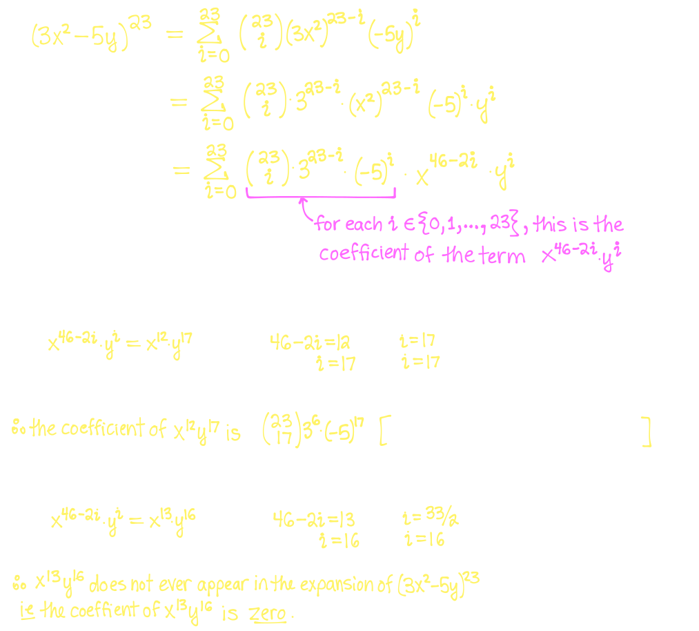
- ## [[Pigeonhole Principle]]
	- If $N$ are stored in $k$ boxes, then at least one box contains at least $[N/K]$ objects
	- $\lceil x \rceil$ is the ceiling function: $\lceil x \rceil= \text{min}\{n \in \mathbb{Z} | x \le n\}$
		- Ex. $\lceil 2 \rceil = 2 \qquad \lceil 2.3  \rceil = 3 \qquad \lceil -2.3 \rceil = -2$
	- Examples:
	  background-color:: blue
		- How many people need to be invited to a party to guarantee that at least three of the guests were born on the same month?
			- 
		- How many people do we need in order to guarantee that at least 2 have the same two initials (first letter of first name and first letter of family name?)
			- 
		-
- ## [[Graph Theory]]
	- A **graph** $G$ is an ordered pair $G = (V(G),E(G))$, where
		- $V(G)$ is a non empty set whose elements are called **vertices**
			- $V(G)$ is called the **vertex set** of $G$
		- $E(G)$ is a set whose elements are called **edges**
			- $E(G)$ is called the **edge set** of $G$
	- $\mathtt{G}: E(G) \rightarrow \Big \{ \{u,v\}: u, v \in V(G)\Big\}$, the **incidence function** of $G$
	- ### Degrees
	- ### Isomorphism
	- ### Bipartite Graphs
	- ### Planar Graphs
	- ### Chromatic Numbers
	-
	-