## #[[MAT 1348]] Midterm 2 Topics:
	- ### [[Set Theory]]
	  collapsed:: true
		- A **set** is a well-defined unordered collection of objects called **elements**
			- Two sets are **equal** if they contain the same elements (regardless of order or multiplicity)
		- 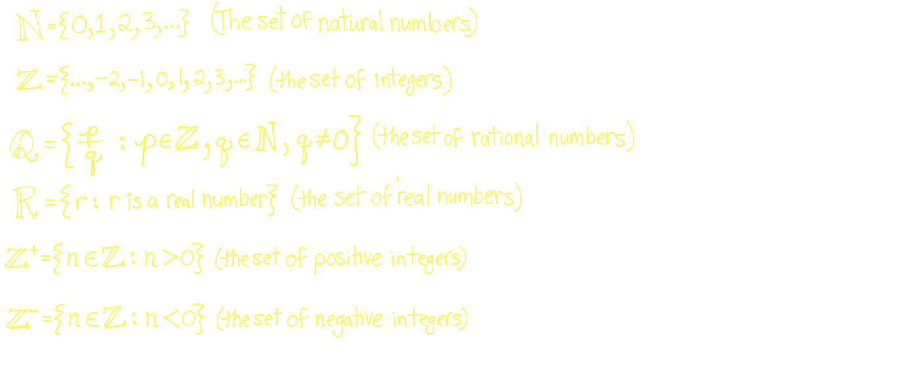
		- Empty set, $\emptyset$, is the set with no elements
		- $U$ is the universal set, which is what all elements fall under
		- $A$ is considered a **subset** of $B$, written ($A \subseteq B$) if every element of $A$ is also element of $B$
			- 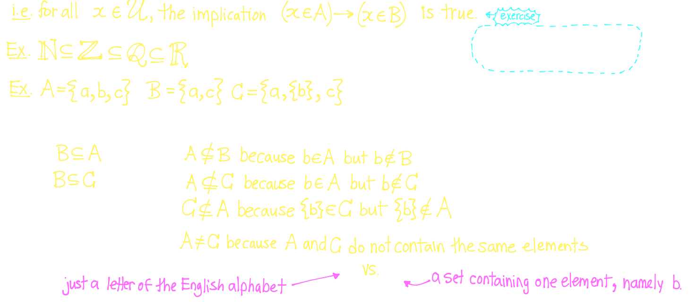{:height 304, :width 668}
		- $A$ as a **proper subset** of  $B$ ($A \subset B$) is if $A \subseteq B$ and $A \ne B$
		- **Cardinality** of a set is its size
		- The **power set** of $A$, $P(A)$ is the set of all subsets of $A$
		- The **Cartesian product**, $A \times B$ is the set of all ordered pairs $(a,b)$ where $a \in A$ and $b \in B$
			- 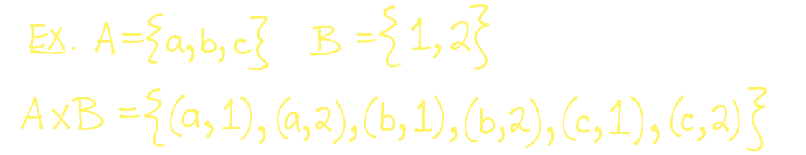
			- 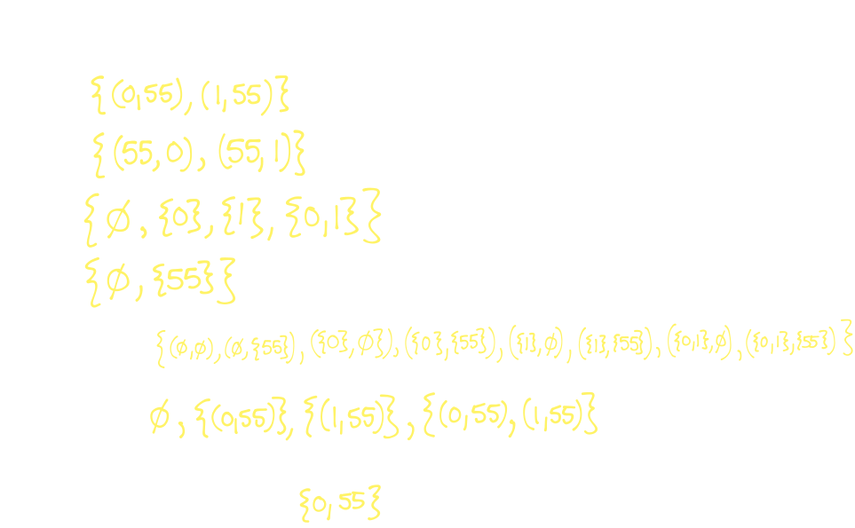
		- The **union** of sets $A$ and $B$, denoted $A\cup B$ is the set $A \cup B = \{x:(x \in A) \vee (x \in B)\}$
			- 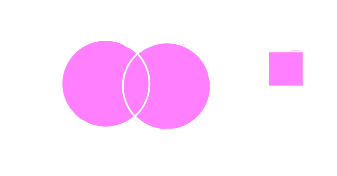
		- The **intersection** of sets $A$ and $B$, denoted $A \cap B$ is the set $A\cap B = \{x: (x \in A) \wedge (x \in B)\}$
			- 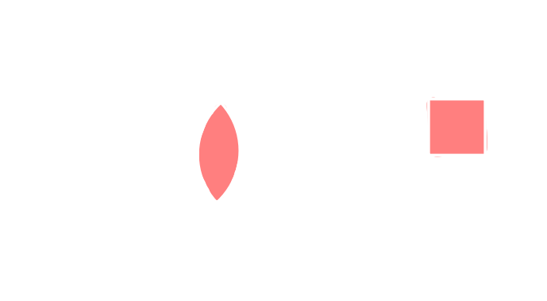
		- The **complement** of set $A$, denoted $\overline{A}$ is the set $\overline{A} = \{x: (x \in U) \wedge (x \notin A)\}$
			- 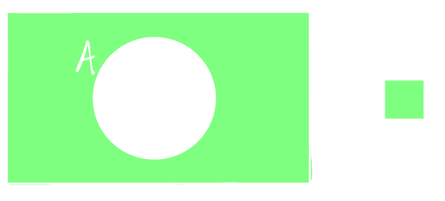
		- The **difference** of sets $A$ and $B$, denoted $A-B$, is the set $A-B = \{x: (x\in A) \wedge (x \notin B)\}$
			- 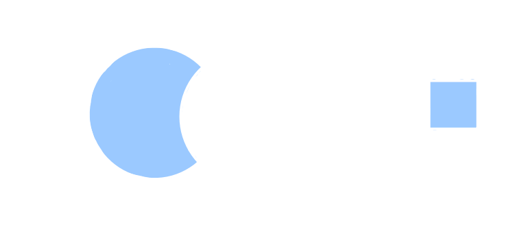
		- The **symmetric difference** of sets $A$ and $B$, denoted $A \oplus B$ is the set $A \oplus B = \{x: (x \in A) \oplus (x \in B)\}$
			- 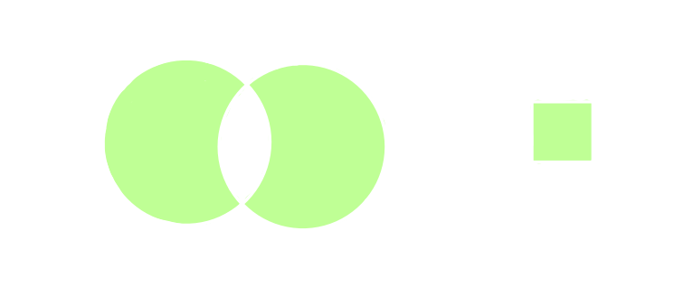
		- 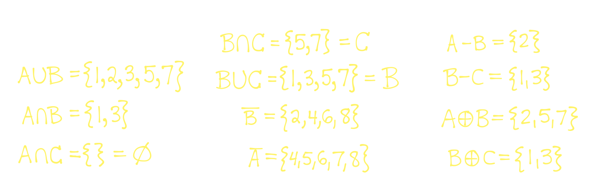
		- A **disjointed set** is if $A \cap B = \emptyset$
		- A **set identity** is an equation involving sets and set operations that is true *no matter what*
			- Ways to verify set identities
				- Verify set identity using **membership table**
				- Verify using **rigorous proof** (proof of equivalence of set equality)
					- Prove for all $x \in U,$ $(S \subseteq T)$ and $(T \subseteq S)$
					- 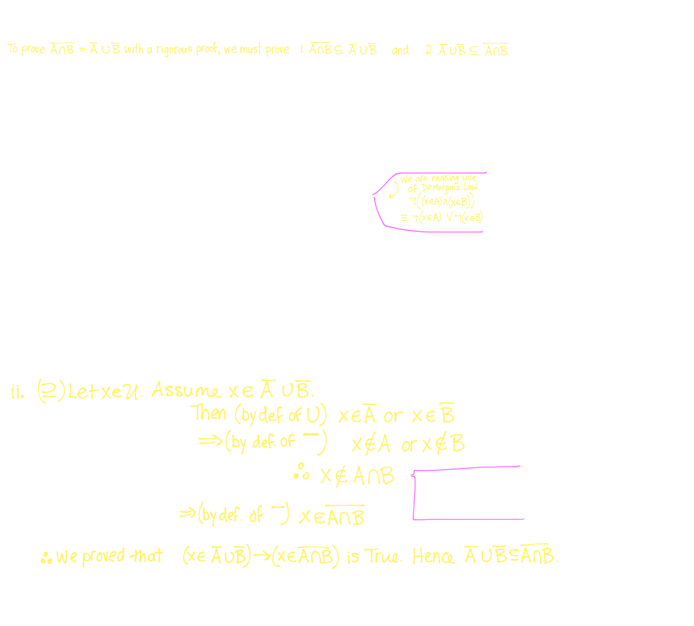{:height 573, :width 626}
	- ### [[Relations]]
	  collapsed:: true
		- A **binary relation** from $A$ to $B$ is a relation between $A$ and $B$
		- A **binary relation** of a **set** $A$ is a relation from $A$ to itself
		- 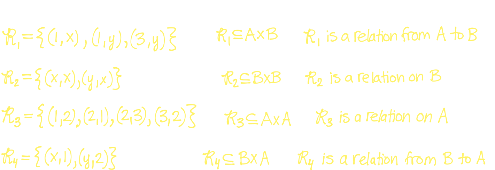
		- **Equality**
			- $=$ is a relation of $\mathbb{R}$
		- **Inequality**
			- $<$ is a relation of $\mathbb{R}$
			- $\le$ is a relation of $\mathbb{R}$
		- **Divides**
			- $|$ signifed divide
		- Logical Equivalence, $\equiv$ is a relation on the set of all compound propositions
		- A relation $R$ is **reflexive** if the implication $(x \in A) \rightarrow (x,x) \in R$ is considered true
			- ^^Element is related to itself^^
		- A relation $R$ is **symmetric** if the implication $((x,y) \in R \rightarrow (y,x) \in \mathbb{R})$ is true
			- ^^The relation works both ways^^
		- A relation is **antisymmetric** if for the implication $x,y \in A$, $((x,y) \in R \text{ and } (y,x) \in R) \rightarrow (x=y)$ is true
			- ^^The relation is not symmetrically related^^
			- The implication $(x\ne y) \rightarrow ((x,y) \notin R) \text{ and } ((y,x) \notin R)$
		- A relation is **transitive** if for all $x,y,z \in A$, the implication $((x,y) \in R \text{ and } (y,z) \in R) \rightarrow  ((x,z) \in R)$
		- We can determine the properties of $R$ based on **visual representation**
			- $R$ is **reflexive** if there is a loop at each vertex
			- $R$ is **symmetric** if and only if whenever there is an arrow from one vertex to another, there is an arrow in the opposite direction
			- $R$ is antisymmetric if there is no arrow in the opposite direction
			- $R$ is **transitive** if and only if any two-step path can be done in one step
		- 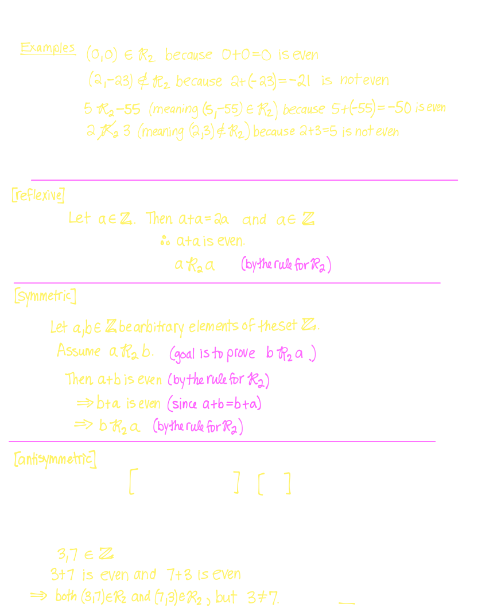
		- **Equivalence Relation:** Prove a relation is ^^reflexive^^, ^^symmetric^^ and ^^transitive^^
		- 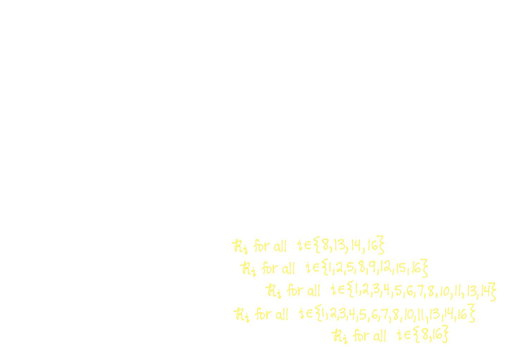
		- **Equivalence Class:** The set of all elements of $A$ that are in relation with $a$ ($[a]_R = \{x \in A| aRx\}$)
		- **Modulo**, $m$ is the multiplier to a function that has identical remainders, based on the function, $a = km + b$
			- Simplified to $a \equiv b$ (mod $m$)
			- 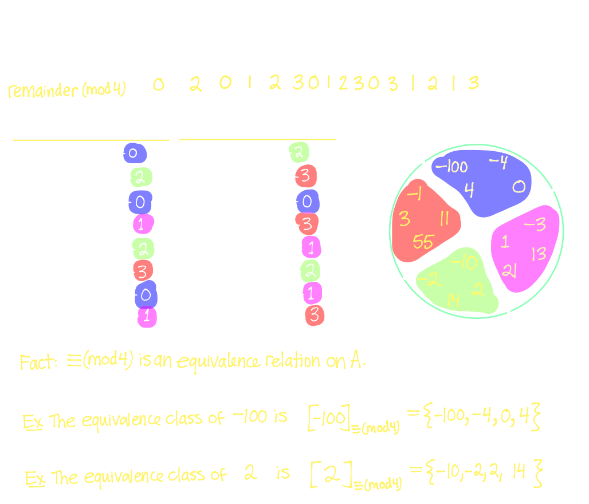
		- A **partition** of a set is a collection of subsets which are:
			- $P_i \ne \emptyset$ for all $i$ (non-empty subsets)
			- $A = P_1 \cup P_2 \cup...$ (union of all subsets)
			- $P_i \cap P_j = \emptyset$ if $i \ne j$ (no identical values inbetween subsets)
			- 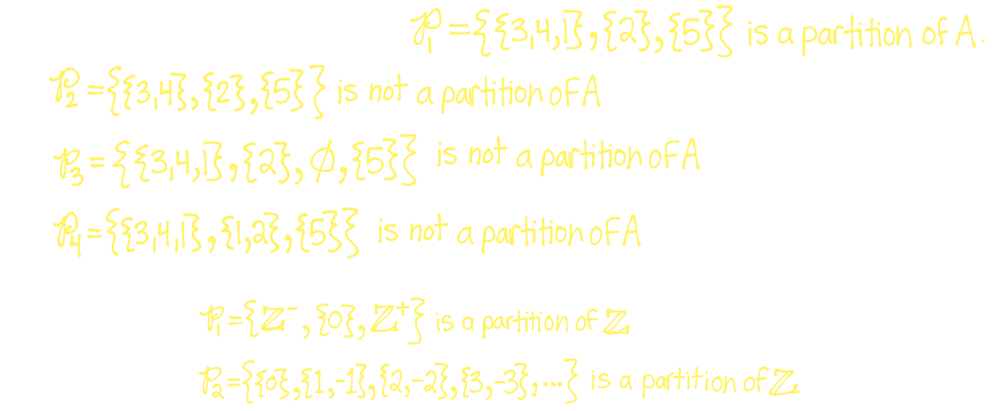
	- ### [[Functions]]
		- A **function** is a an assignment of uniquely assigned element of $A$ to an element of $B$
			- $f:A \rightarrow B$ where
				- $A$ is domain and $B$ is codomain
			- **Image** of a domain is the "range" $\Rightarrow f(a) = \{f(a): a \in A\}$
		- 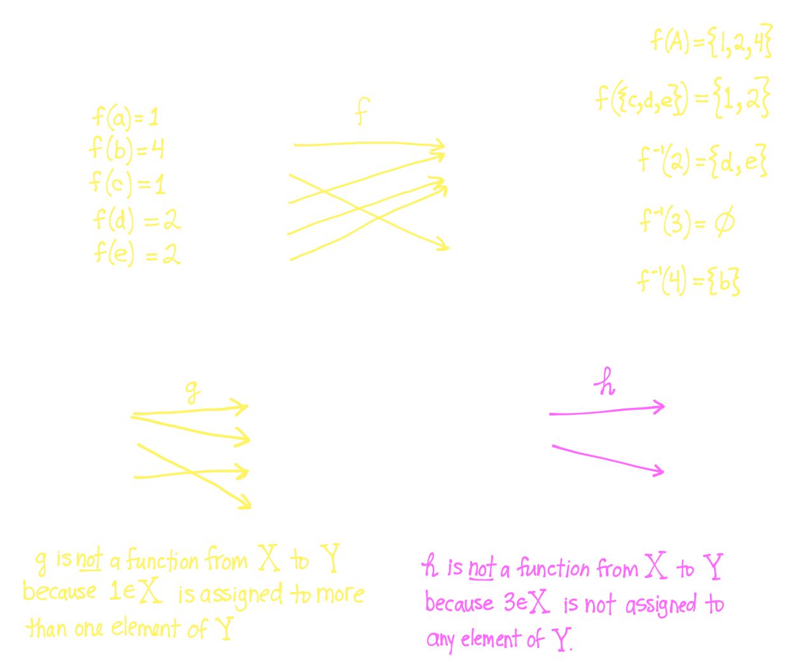
		- A function is **injective** for all $x,y \in A$ if the implication $(f(x) = f(y)) \rightarrow (x = y)$ is true
			- Each distinct element of $A$ is assigned to its own distinct unique element of $B$
			- 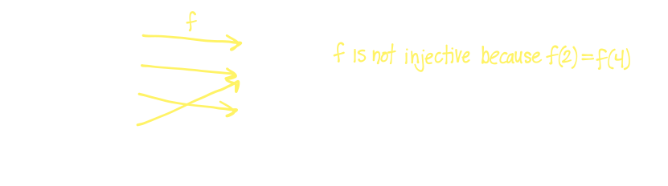
		- A function is **surjective** for every element $b \in B$ there exists atleast one element $a \in A$ such that $f(a) = b$
			- Each element of the codomain B is the image of at least one element of $A$
			- 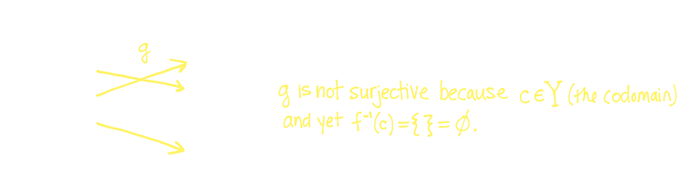
		- A function is **bijective** if it is both ^^injective^^ and ^^surjective^^
		- **Composition of Functions**, denoted $g \circ f$, is the function $f: A \rightarrow C$, defined by $(g \circ f)(a) = g(f(a))$ for all $a \in A$
			- 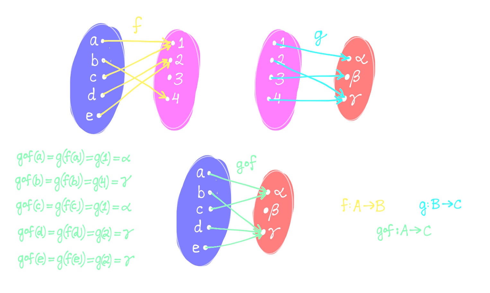
			- 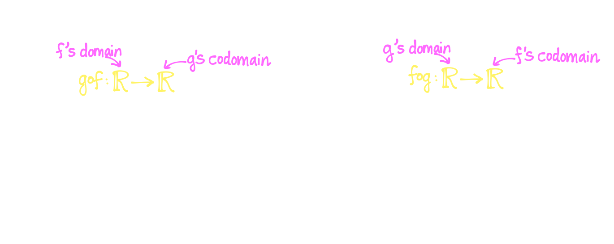
		- The **inverse** of a function exists such that $f^{-1} \circ f = id_A$ and $f \circ f^{-1} = id_B$
			- Or it can bee seen as $f^{-1}(b) = a$ if and only if $f(a) = b$
	-
-