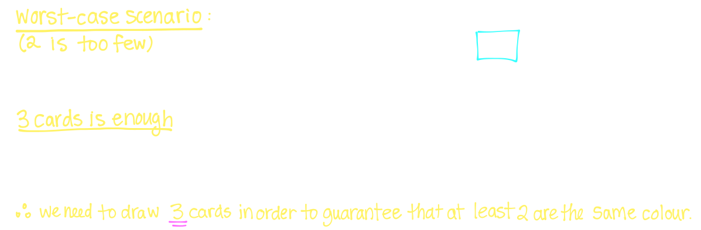
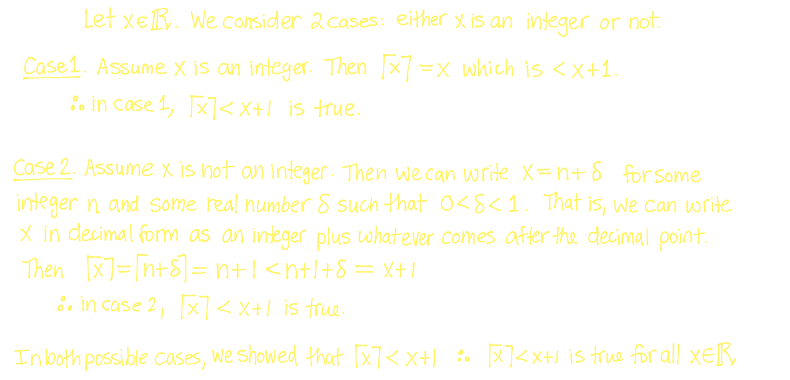

## [[Pigeonhole Principle]] #[[MAT 1348]]
	- Examples:
	  background-color:: blue
		- 
		- How many cards does one need to draw for a deck of cards inorder to guarantee that at least two cards are **black**?
			- 
		- How many cards does one need to draw from the deck in order to guarantee that at least two cards are the same colour?
			- 
		- How many cards does one need to draw from a standard deck of 52 playing cards in order to guarantee that at least **three** cards are the same suit
			- 
	- ^^**Definition:**^^
		- If $k+1$ objects or more are stored into $k$ boxes, then at least one box contains two or more objects
		- ^^**Proof**^^
			- #### Proof by Contradiction:
				- 
			- Let  $x \in \mathbb{R}$, then $\lceil x \rceil < x +1$
				- 
	- ### Generalized Pigeonhole Principle
		- If $N$ are stored in $k$ boxes, then at least one box contains at least $[N/K]$ objects
		- $\lceil x \rceil$ is the ceiling function: $\lceil x \rceil= \text{min}\{n \in \mathbb{Z} | x \le n\}$
			- Ex. $\lceil 2 \rceil = 2 \qquad \lceil 2.3 \qquad \rceil = 3 \lceil -2.3 \rceil = -2$
		- ^^**Proof**^^
			- 
	- ### Consequence of GPP
		- Let $k$ and $r$ be positive integers and suppose some objects are to be placed into $k$ boxes
		- What is the minimum number $N$ of objects that we need to place into $k$ boxes in order to guarantee that at least one box contains at least $r$ objects?
			- 
	- Examples:
	  background-color:: blue
		- How many people need to be invited to a party to guarantee that at least three of the guests were born on the same month?
			- 
		- How many people do we need in order to guarantee that at least 2 have the same two initials (first letter of first name and first letter of family name?)
			- 
		-