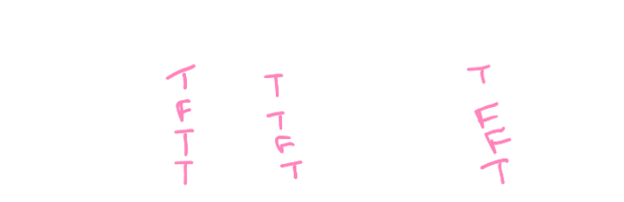

## [[Proposition Logic]] #[[MAT 1348]]
	- ## 1.6 Order of Operations
	  id:: 65a89521-1881-45fc-ada2-8cf00e5e49ce
		- Parentheses dictate order of operations
		- Without parentheses, the order of operations is, $\neg, \wedge, \vee, \rightarrow, \leftrightarrow . \oplus$
		- **Ex.,** $\neg p \vee q \rightarrow q \wedge r$ is understood as $((\neg p)\vee) \rightarrow (q\wedge r)$
	- ## 1.7 Logical Equivalence
	  id:: 65a89521-360e-46c4-bf54-57a99a978f2b
		- Two propositions are **logically equivalent** if the biconditional property $p \rightarrow q$ is a tautology
			- Written as $p \equiv q$
		- ^^**Note:**^^  $\equiv$ is not a logical operator: it is shorthand for "is logically equivalent to"
	- ## 1.8 Contrapositive and Converse
	  id:: 65a89521-5990-4e98-89c2-78d9820a4d25
		- Assume implication $P \rightarrow Q$
			- Implication $\neg Q \rightarrow \neg P$ is **contrapositive** dof $P \rightarrow Q$
			- Implication $Q \rightarrow P$ is the **converse** of $P \rightarrow Q$
		- Example:
		  background-color:: blue
			- $P =$ I do all the exercises
			- $Q =$ I pass the course
				- So, $P \rightarrow Q =$ If I do all the exercises, then I will pass the course
				- $\neg Q \rightarrow \neg P =$ If I don't pass the course, then I did not do all the exercises
			- The previous statements are equivalent
			- The implication $P \rightarrow Q$ is not logically equivalent to the converse $Q \rightarrow P$
				- Truth Table:
					- {:height 152, :width 455}
	- ## 1.9 From English to Logic
	  id:: 65a89521-4776-4a05-99d2-bc67eca0c62c
		- $f =$ "The bear eats the fruit"
		- $p=$ "The bear eats the fish"
		- $r =$ "The bear is near a river"
		- $v =$ "The bear sees a fish"
		- **Negation**
			- $\neg f =$ "It is not true that the bear eats the fruit"
			- $\neg f =$ The bear does not eat fruit
			- $\neg(\neg r)  =$ "It is not the case that the bear is not near the river"
		- **Conjunction:**
			- $v \wedge \neg p =$ "The bear sees a fish, but does not eat it"
			- $f \wedge p =$ "The bear eats the fruit and the fish"
		- **Disjunction:**
			- $f \vee p =$ "The bear eats the fruits or the fish"
			- $f \vee v$ = "The bear eats the fruit unless it see a fish"
	- ## 1.10 Consistent Set of Proposition
	  id:: 65a89521-fe18-4590-9e6c-8dc1bac0144d
		- A set of compound propositions is **consistent** if there exists an assignment of truth values to the propositional variables that makes all the compound propositions true
	- ## 1.11 Conjunctive and Disjunctive Normal Forms
	  id:: 65a89521-4116-4619-a1b5-9eba67c750ec
		- ### Disjunctive
			- Let $p_1, ..., p_m$ be propositional variables
			- A **literal** is a propositional variable or ^^negation^^
			- A **conjuctive clause** is a compound proposition made entirely of literals with the operator $\wedge$, no variable appears more that once
			- A compound is in **disjunctive normal form** if it is the disjunction of conjuctive classes:
				- $$Q_1 \vee Q_2 \vee ... \vee Q_n$$ where each $Q_i$ is a conjuctive clause
			- To find a disjunctive normal form for $X$, where the variables are $p_1,..., p_k$
				- Write the truth table for $X$
				  logseq.order-list-type:: number
				- For each row where $X$ is $T$, write a conjuctive clause using truth values $p_1,..., p_k$
				  logseq.order-list-type:: number
				- Write disjunction of all the conjuctive clauses
				  logseq.order-list-type:: number
			- Every proposition is equivalent to a proposition in disjunctive normal form
			- Disjunctive normal form of proposition $X$ is not unique, but all disjunctive forms of $X$ are logically equivalent
		- ### Conjunctive
			- Let $p_1, ..., p_m$ be propositional variables
			- A **disjunctive clause** is a compound proposition made entirely of literals with the operator $\vee$, no variable appears more that once
			- A compound is in **conjuctive normal form** if it is the disjunction of conjuctive classes:
				- $$Q_1 \wedge Q_2 \wedge ... \wedge Q_n$$ where each $Q_i$ is a disjunctive clause
			- To find a disjunctive normal form for $X$, where the variables are $p_1,..., p_k$
				- Write the truth table for $X$
				  logseq.order-list-type:: number
				- For each row where $X$ is $F$, write a disjunctive clause using **negation** of truth values $p_1,..., p_k$
				  logseq.order-list-type:: number
				- Write conjunction of all the disjunctive clauses
				  logseq.order-list-type:: number
			- Every proposition is equivalent to a proposition in conjunctive normal form
			- Conjunctive normal form of proposition $X$ is not unique, but all conjuctive forms of $X$ are logically equivalent