## [[Set Theory]]
	- ## 3.1 Set
id:: 65ca72fd-d57e-4fde-8c08-11041238e2d4
		- ^^**Definition:**^^
			- A set is a collection of objects called **elements**
		- Example:
		  background-color:: blue
			- $A = \{1,2,a\}$
				- We write $1 \in A$ to indicate $1$ is an element in set $A$
				- We write $3 \notin A$ to indicate $3$ is not an element of the set $A$
		- Two sets are **equal** if they contain the same element (no matter the ^^order^^ of multiplicity)
		- Example:
		  background-color:: blue
			- $\{a,b,c\} = \{b,c,a\} = \{a,a,b,c\}$
				- The relation "$\in$" is unaffected by the order of elements or their multiplicity
		- We can represent a set by a list of its elements or by a description of its elements
			- Example:
			  background-color:: blue
				- $A = \{a,e,i,o,u,y\} = \{l | l \text{ is a vowel}\}$
				- $B = \{3,6,9, ..., 36\} = \{3n| n \in \mathbb{Z}, 1\le n \le 12\}$
				- $C = \{3,4,5,6,...\} = \{n | n \in \mathbb{Z}, n \ge 3\}$
				- $D = \{x \in \mathbb{R}| x \in 5\} = ] - \infin, 5 [ \cup ] 5, \infin{[}$
		- Example
		  background-color:: blue
			- Common sets in mathematics
				- $\mathbb{N} = \{1,2,3,...\}$ (The set of natural numbers)
				- $\mathbb{Z} = \{..., -2, -1, 0, 1, 2, ...\}$ (The set of integers)
				- $\mathbb{Q} = \{\frac{p}{q} | p \in \mathbb{Z}, q \in \mathbb{N}\}$ (The set of rational numbers)
				- $\mathbb{R} = \{r| r \text{ is real}\}$ (The set of real numbers)
				- $\mathbb{Z}^+ = \{n \in \mathbb{Z} | n > 0\}$ (The set of positive integers)
				- $\mathbb{Z}^- = \{n \in \mathbb{Z} | n < 0\}$ (The set of positive integers)
		- ^^**Definition**:^^
			- The **empty set**, denoted $\emptyset$ is the set which contains no elements
				- We sometimes write $\emptyset = \{\}$ or "$  x \in \emptyset$" $\equiv F$ for all $x$
			- The **universal set**, denoted $\mathbb{U}$ is the set of all elements that are analyzed
	- ## 3.2 Subset
id:: 65ca77bb-96aa-42c8-99ea-405c5c1b62dc
		- ^^**Definition**:^^
			- Let $A$ and $B$ be two sets
			- We say $A$ is a **subset** of $B$ (A $\subseteq B$) if all the elements of $A$ are also elements of $B$
			- If $A \subseteq B$, then for all $x \in \mathbb{U}$, the implication $(x \in A) \rightarrow (x \in B)$ is true
				- Ex. $\mathbb{N} \subseteq \mathbb{Z} \subseteq \mathbb{Q} \subseteq \mathbb{R}$
			- Example:
			  background-color:: blue
				- Let $A = \{a,b,c\} , B = \{a,c\}, C = \{a,\{b\},c\}$. Determine if the following propositions are true
					- $B \subseteq A$
						- 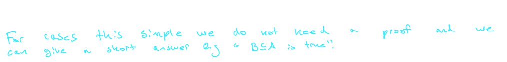
					- $B \subseteq C$
						- 
						-
					- $A \subseteq B$
						- 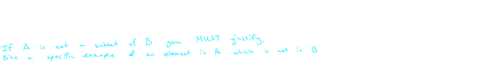
					- $C \subseteq A$
						- 
					- $A \subseteq A$
						- 
			- If $X$ is a set then
				- $X \subseteq X  \qquad ((x \in X) \rightarrow (x \in X)$ is a tautology$)$
				- $\emptyset \subseteq X \qquad (F \rightarrow (x \in X)$ is a tautology$)$
			- If $A$ and $B$ are sets, then $A = B$ if and only if $A \subseteq B$ and $B \subseteq A$
			- ^^**Definition**:^^
				- Let $A$ and $B$ be sets
				- We say $A$ is a **proper subset** of $B$ if $A \subseteq B$ and $A \ne B$
				- If so we write $A \subset B$
	- ## 3.3 Cardinality
id:: 65ca77ef-2011-4278-a318-fedcae38d8f0
		- ^^**Definition**:^^
			- If $A$ is a set containing exactly $n$ distinct elements (where $n \ge 0$ is an integer), then $A$ is a **finite** set and its **cardinality** is $n$
			- We done the cardinality of $A$ by $|A|$
			- Example:
			  background-color:: blue
				- What is the cardinality of the following sets?
					- $A = \{a,b,c\}$
						- 
					- $B= \{a,a,b\}$
						- 
					- $C = \{3n | n \in mathbb{Z}, 1 \le n \le 12\}$
						- 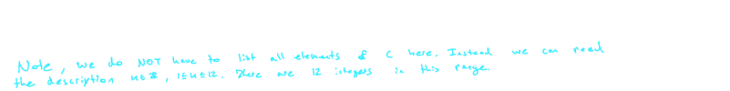
					- $D = \{a,\{a\},\{a, \{a\}\}\}$
						- 
					- $\emptyset$
						- 
					- $\{\emptyset\}$
						- 
	- ## 3.4 Power Sets
id:: 65ca7834-9dbe-476f-ad2c-7cec82d49d7a
		- ^^**Definition**:^^
			- Let $A$ be a set
			- The **power set** of $A$, denoted $P(A)$, is the set of all subsets of $A$
				- $$P(A) = \{X | X \subseteq A\}$$
			- Example:
			  background-color:: blue
				- What are all the subsets of $A = \{a,b,c\}$
				- $A = \{a,b,c\}$, $P(A) = \{\emptyset, \{a\}, \{b\}, \{c\}, \{a,b\}, \{a,c\}, \{b,c\}, \{a,b,c\}\}$
				- If $|A| = n$, then $|P(A)| = 2^n$
			- 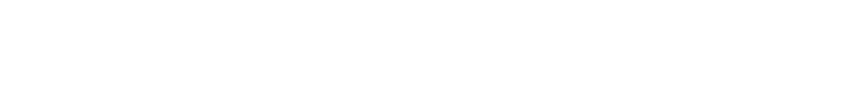
	- ## 3.5 Cartesian Product
id:: 65ca7840-4cbe-4363-8af5-39331b58c3b1
		- ^^**Definition**:^^
			- Let $A$ and $B$ bet sets
			- The **cartesian product** of $A$ and $B$ denoted by $A \times B$, is the set of all pairs, $(a,b)$ where $a \in A$ and $b \in B$
				- $$A \times B = \{(a,b)| a \in A , b \in B\}$$
			- The cardinality of $A \times B$ is equal to the product of the cardinalities of $A$ and $B$
				- $$|A \times B| = |A||B|$$
			- Example:
			  background-color:: blue
				- Let $A = \{a,b,c\}$ and $B = \{1,2\}$
					- $A \times B$
						- 
					- $B \times A$
						- 
					- $B \times B$
						- 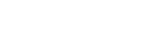
			- Cartesian product is not commutative:
				- In general, $A \times B \ne B \times A$
			- Cartesian product is not associative:
				- In general, $(A \times B) \times C \ne A \times (B \times C)$
		- ^^**Definition**:^^
			- Let $A_1, A_2, ..., A_n$ be sets
			- The **cartesian product** $A_1 \times A_2 \times ... \times A_n$ is the set
				- $$A_1 \times A_2 \times ... \times A_n = \{(a_1, a_2, ..., a_n)|a_i \in A_i, 1 \le i \le n\}$$
			- If we take the cartesian product of a set $A$ with itself $n$ times, we can write
				- $$A \times A \times ... \times A = A^n$$
			- Example:
			  background-color:: blue
				- $\mathbb{R}^3 = \{(x,y,z) | x,y,z \in \mathbb{R}\}$
	- ## 3.6 Union Intersection, Complement, Difference
id:: 65ca7849-d1f6-4558-bca9-ab159248e567
		- ^^**Definition**:^^
			- The **union** of two sets $A$ and $B$, denoted $A \cup B$ is the set
				- $$A \cup B = \{x | (x \in A) \vee (x \in B)\}$$
				- We can represent the union of two sets using a Venn Diagram
					- 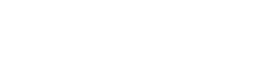
			- The **intersection** of two sets $A$ and $B$, denoted $A \cap B$ is the set
				- $$A \cap B = \{x | (x \in A) \wedge (x \in B)\}$$
				- When $A \cap B = \emptyset$, we say $A$ and B$ are **disjoint**
				- 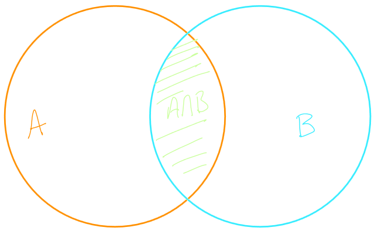
			- The **complement** of set $A$, denoted $\overline{A}$ is the set
				- $$\overline{A} = \{x | x \in \mathbb{U} \wedge (x \notin A)\}$$
				- 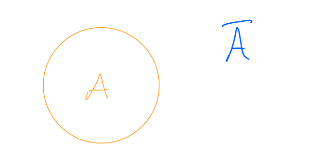
			- The **difference** of $A$ and $B$, denoted $A - B$ is the set
				- $$A - B = \{x| (x \in A) \wedge (x \notin B)\}$$
				- 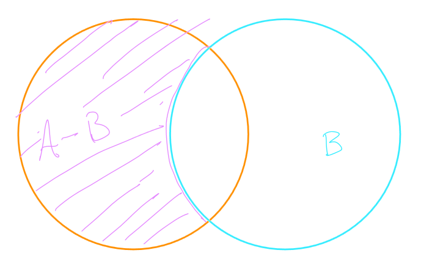
			- The **symmetric difference** of $A$ and $B$, denoted $A \oplus B$ is the set
				- $$A \oplus B = \{x | (x\in A) \oplus (x \in B)\}$$
				- 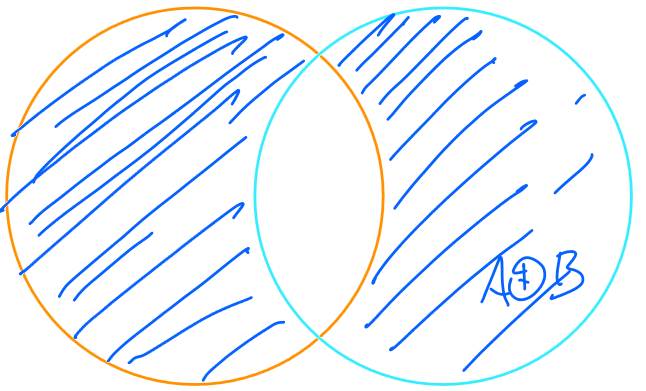
			- Example:
			  background-color:: blue
				- Let $A = \{1,2,3\}, B = \{1,3,5,7\}$ and $C = \{5,7\} be subsets of $\mathbb{U} = \{1,2,3,4,5,6,7,8\}$. Determine:
					- $A \cup B$
						- 
					- $A \cap B$
						- 
					- $A \cap C$
						- 
					- $\overline {B}$
						- 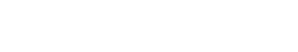
					- $A - B$
						- 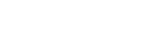
					- $B-A$
						- 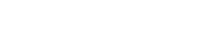
					- $A \oplus B$
						- 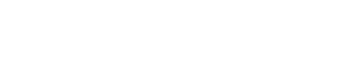
	- ## 3.7 Set Identities
id:: 65ca7703-cb84-487a-aca8-3a9c5864b419
		- A set identity is a set equation which is true no matter the sets that are considered
		- Let $A$, $B$ and $C$ be sets
		- The following equation is true, no matter the choice of $A,B$ and $C$
			- $$A \cap (B \cup C) = (A \cap B) \cup (A \cap C)$$
		- How is this equality is verified? Two sets $S$ and $T$ are equal if for all $x \in \mathbb{U}$, the following statement is true:
			- $$x \in S \leftrightarrow T$$
		- Example:
		  background-color:: blue
			- Showing $A \cap (B \cup C) = (A\cap B )\cup(A \cap C)$ comes down to showing that for all $x \in \mathbb{U}$, the following statement is true:
				- $$x \in A \cap (B \cup C) \leftrightarrow (A \cap B) \cup (A \cap C)$$
			- Using the definitions of unions and intersections, the previous logical statement becomes:
				- $$(x\in A) \wedge (x \in B \cup C) \leftrightarrow (x \in A \cap B) \vee (x \in A \cap C)$$
				- $$(x \in A) \wedge ((x \in B) \vee (x \in C)) \leftrightarrow ((x \in A) \wedge (x \in B)) \vee ((x \in A) \wedge (x \in C))$$
			- Let $a = "x \in A"$, $b= "x \in B"$ and $c = "x \in C"$, and the statement above becomes:
				- $$a \wedge (b \vee c) \leftrightarrow (a \wedge b) \vee (a \wedge c)$$
			- The proposition is a tautology that can be verified using a truth table
		- A **membership table** is very similar to a truth table, with the purpose of verifying set identities
			- If $n$ sets are involved in the set identity, then the membership table will contain $2^n$ rows
			- The "variables" are sets contained in the identity
			- Each row corresponds to a different possibility for all $x \in \mathbb{U}$
			- A $"1"$ in the table indicates $x$ belongs to the set and $"0"$ indicates $x$ does not belong to the set
		- Example:
		  background-color:: blue
			- Verify that $\overline{A \cup B} = \overline{A} \cap \overline{B}$
				- 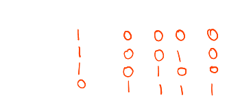
		- #### List of Common Set Identities
			- $A \cup \emptyset = A$ (Identity Law)
			  logseq.order-list-type:: number
			- $A \cap \mathbb{U} = A$ (Identity Law)
			  logseq.order-list-type:: number
			- $A \cup \mathbb{U} = \mathbb{U}$ (Domination Law)
			  logseq.order-list-type:: number
			- $A \cap \emptyset = \emptyset$ (Domination Law)
			  logseq.order-list-type:: number
			- $A \cup A = A$(Idempotent Law)
			  logseq.order-list-type:: number
			- $A \cap A = A$(Idempotent Law)
			  logseq.order-list-type:: number
			- $\overline{(\overline{A})} = A$ (Double Complement Law)
			  logseq.order-list-type:: number
			- $A \cup B = B \cup A$ (Commutativity)
			  logseq.order-list-type:: number
			- $A \cap B = B \cap A$ (Commutativity)
			  logseq.order-list-type:: number
			- $A \cup (B \cup C) = (A \cup B) \cup C$ (Associativity)
			  logseq.order-list-type:: number
			- $A \cap (B \cap C) = (A \cap B) \cap C$ (Associativity)
			  logseq.order-list-type:: number
			- $A \cap (B \cup C) = (A \cap B) \cup (A \cap C)$ (Distributivity)
			  logseq.order-list-type:: number
			- $A \cup (B \cap C) = (A \cup B) \cap (A \cup C)$ (Distributivity)
			  logseq.order-list-type:: number
			- $\overline{A \cup B} = \overline{A} \cap \overline{B}$ (De Morgan's Law)
			  logseq.order-list-type:: number
			- $\overline{A \cap B} = \overline{A} \cup \overline{B}$ (De Morgan's Law)
			  logseq.order-list-type:: number
			- $A \cup (A \cap B) = A$ (Absorption Law)
			  logseq.order-list-type:: number
			- $A \cap (A \cup B) = A$ (Absorption Law)
			  logseq.order-list-type:: number
			- $A \cup \overline{A} = \mathbb{U}$ (Complement Law)
			  logseq.order-list-type:: number
			- $A \cap \overline{A} = \emptyset$ (Complement Law)
			  logseq.order-list-type:: number
			- $A - B = A \cap \overline{B}$ (Difference Law)
			  logseq.order-list-type:: number
			- $A \oplus B = (A-B) \cup (B-A)$ (Symmetric Difference Law)
			  logseq.order-list-type:: number
			- $A \oplus B = (A \cup B) - (A \cap B )$ (Symmetric Difference Law)
			  logseq.order-list-type:: number
- ## [[Relations]]
	- ## 4.1 Definition
		- ^^**Definition:**^^
			- Let $A$ and $B$ be two sets
			- A **relation** from $A$ to $B$ is a subset of $A \times B$
		- Example:
		  background-color:: blue
			- Let $A = \{1,2,3\}$ and $B = \{x,y\}$
				- $$R_1 = \{(1,x) , (1,y), (3,y)\}$$
				- $$R_2 = \{(x,x),(y,x)\}$$
				- $$R_3 = \{(1,2), (2,1), (2,3), (3,2)\}$$
				- $$R_4 = \{(x,1), (y,2)\}$$
				- $R_1$ is a relation from $A$ to $B$
				- $R_2$ is a relation from $B$ to $B$ (or call be called a relation in $B$)
				- $R_3$ is a relation in $A$
				- $R_4$ is a relation from $B$ to $A$
		- Let $A = \{1,2,3\}$ and $B = \{x,y\}$
			- $$R_1 = \{(1,x), (1,y), (3,y)\}$$
			- Since $(1,x) \in R_1$, we say that $1$ is in relation with $x$ (via $R_1$)
				- To indicate $(1,x) \in R_1$, we often use $1R_1x$
			- Since $(2,x) \notin R_1$ we say $2$ is not in relation with $x$ (via $R_1$)
		- We can also present relation using a rule
			- $$R_3 = \{(1,2),(2,1), (2,3), (3,2)\}$$
			- The previous relation $A = \{1,2,3\}$ may be represented as follows:
				- For all $a,b \in A$, we have $aR_3b$ if and only if $a + b$ is odd
					- $$R_3 = \{(a,b)|a,b \in A, a+b \text{ is odd}\}$$